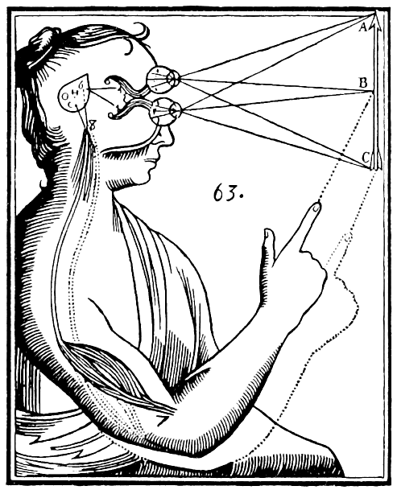

# Chapter 1: Science and Subjectivity --- The Fundamental Challenge of Psychology

Psychology is the science that attempts to understand the human mind.  The human mind is the most fascinating and amazing "thing" in the known universe, and the idea that you can actually attempt to study it using the basic reductionistic approach of science may seem a bit of a stretch.  And indeed it has been --- but at this point in the development of the field, many practicing scientists are likely to feel at least somewhat confident that significant progress has been made, without fundamental, obvious limitations to how far we can go.

Despite all this progress and optimism, we see in this chapter that there are hard boundaries to what science can penetrate, arising from the all-encompassing consequences of the inevitably *subjective* basis of our knowledge, which have shaped the field from its inception.  Thus, understanding these limitations helps put the field of psychology and neuroscience into perspective in multiple ways, and in fact many of the limitations we discuss apply broadly to any kind of science.  After we spend perhaps too much time thoroughly investigating the nature and implications of subjectivity, we briefly review the history of the field, followed by a discussion of the *scientific method* that provides a recipe for overcoming the limitations of subjectivity.  Then, we then summarize the specific methods used to understand the brain, behavior, and cognition, including how statistics are used to formally establish whether the results of experiments constitute *significant* evidence.

## Subjectivity

The central issue we must confront head-on is the inescapable problem of *subjectivity*: all of human knowledge and experience comes from individual people's direct first-person perspective on the world.  By subjectivity we mean not just the fact that different people have different opinions or perspectives on things, though that is a big part of it.  Instead, we need to step back a bit to look at the *really big picture* (i.e., Philosophy), starting with the basic nature of subjectivity as expressed by **Rene Descartes** (way back in 1637), in his famous statement:

> *Cogito Ergo Sum --- I think therefore I am.*

There are two major implications of this statement --- we'll explore the first one in depth before turning to the second.  The first implication is that *subjective experience is primary* --- the only thing I know for certain is that I'm here thinking.  If you put yourself into the mindset of a very skeptical, doubting philosopher, you might find yourself questioning just about everything (e.g., is reality real, am I a brain in a vat, that kind of thing), *except* this one, primary fact: you are *here* (wherever you are), *thinking*.  I guess if you're not a philosopher, it might be more like "Chillito Ergo Sum -- I am just sitting here chillin' -- that's all I know for sure".

If you really think about this with a doubting mindset, you might see that you can't really be sure that the world itself exists outside of your own mind!  This very challenging train of thought is well-captured in several modern movies, perhaps most notably in the *Matrix* series, where, in fact (in the movies at least), there turns out to be every reason to have such doubts.  In philosophical circles, this line of thinking is known as *solipsism*, and lest you think that this is just an irrelevant and obscure way of thinking, one of the great innovators of our time, Elon Musk, is apparently convinced that we're all living in a giant simulation.  He also apparently smokes entirely too much dope, but anyway...

This "question objective reality" kind of thing is the type of all-encompassing subjectivity that we want to more fully understand and appreciate.  What does this line of thinking mean for the study of psychology, or science more generally?

{ width=50% }

This is where we can usefully bring in Descartes' second major implication from *Cogito Ergo Sum*: *dualism*.  **Dualism** is the idea that there are two fundamentally different "substances" in the universe: the regular physical stuff of the everyday world, including the stuff that the brain is made of, and this entirely separate, magical transcendent thing called *mind*, which lives apart from that other, regular stuff (Figure 1.1).  The opposing view is called **materialism**, where the mind is seen as just a product of the material world like everything else, and in particular a product of the physical processes taking place within the brain, as widely embraced in modern neuroscientific approaches to psychology.  Materialists tend to scoff at substance dualists because it seems pretty hard to understand how there could be this entirely separate substance embedded within, and seemingly interacting with, the physical world --- how could that actually work?

But you might be somewhat surprised to hear that many modern-day philosophers still embrace dualism, and one of the most outspoken advocates is David Chalmers, who argues that understanding the nature of subjective experience, or +qualia (what it "feels like" to experience something), is the **hard problem** of consciousness and simply cannot be explained in objective, materialistic, scientific terms [@Chalmers95].  Specifically, his argument is that even after you have explained in objective terms all the different things that a brain does, and how signals move through the neurons in the brain, etc., *none of that really explains why it feels like it feels, subjectively, to experience all of that stuff happening in the brain, and even why it feels like anything at all in the first place!*  Thus, it seems that there is something *extra* or *separate* about the mind that isn't explained by understanding its material basis: i.e., dualism.

You might also be surprised to hear that, despite being one of those modern materialistic neuroscientists, I actually agree with Chalmers, and Descartes (in spirit at least, so to speak)!  I think that there are two fundamentally different "somethings" in the universe, but, unlike Descartes and Chalmers, I don't think the dividing line is between *mind* and *matter*, but rather, between subjective and objective *perspectives*, similar to arguments made by [@Nagel74].  Simply stated, the argument is that the subjective first-person perspective can *never* be captured from the objective third-person viewpoint, so there is an irreconcilable difference between these two perspectives, creating the essential dualism that has otherwise been explained in terms of substance dualism.

Just like in literature, the first-person perspective provides direct access to internal thoughts and feelings, while the third-person perspective does not.  However, you may note that as readers, we actually access this first-person perspective from the third-person viewpoint, by reading words on a page.  This inevitable separation between the author and the reader is the subject of much discussion and some consternation, which reflects the fundamental inaccessibility of the *true* first-person, subjective perspective that is the unique province of each individual.  Each of us must interpret the words of others through our own subjective lens --- because we all share the same basic brain structure and live on the same planet, we are able to relate to the expressed subjective experiences of others, but if you really think about it, words are just meaningless symbols that depend entirely on the brain of the reader to recreate some internal, subjective understanding of what the author was trying to convey.  As you will inevitably experience in reading this book, this transfer of my subjective thoughts to yours has no guarantee of being successful --- indeed, it is somewhat of miracle that it is as successful as it often is.

To explore this a bit more, we can go back to Descartes, and take subjective experience as primary --- it is the only thing I am fully certain of.  But it is also primary in another, essential way: it is uniquely, completely, definitionally, *mine*.  It is literally impossible for *you* to experience *my* subjective experience, because, by definition, *my* subjective experience is exactly the sum-total of what it "feels like" to be me.  If we somehow were to add *you* into my brain, my subjective experience would be irreparably altered.  If you are somehow sharing in my subjective experience as it is happening, you would have to have direct access to every level of my brain, and not just "objective" access as you might get from a super-hi-tech future brain scanner, but *direct*, *internal*, *subjective* access, "from the inside out".

In other words, you would have to literally be inside my brain.  And you can't be inside my brain because I'm already here.  From the materialist perspective, we can identify my subjective experience as emerging directly from my brain --- it is what it feels like to be my brain.  If you truly appreciate this equivalence, then it should be readily apparent than there can be only one "mind" for every brain (we'll look into the fascinating phenomenon of multiple personality disorder later, but it doesn't change this conclusion --- all those personalities are just as irrevocably trapped inside one brain --- and in fact we all have some degree of multiple personalities). 

Another way of thinking about this is in terms of identical twins.  Let's imagine we have the most identical of identical twins ever to exist.  Their brains are *completely identical* in every way possible.  Would those twins have the same subjective experience?  No.  They might have a great deal in common, but they would not, and could not, directly experience exactly what the other is experiencing.  Why not?

It all boils down to *perspective*.  Each physical thing in the universe has its own unique perspective, if we take this term to mean a particular spatial location, and a particular trajectory through space and time in the past (and going onward into the future), that is *unique* to that thing.  This is why the twins cannot share their subjective experiences: they are two separate, distinct things, and, inevitably, they "see the world" from two different vantage points.  The only way they could share experiences is if they could somehow superimpose themselves into exactly the same point in space, and do so over a sufficiently long time period to synchronize their history of experience, which plays such a critical role in our subjective life, in addition to the immediate sensations coming in from the outside world.

Anyway, the key point of all this is that *if* you allow that subjective experience can never be shared among different brains, *then* it follows that there is a fundamental divide between this inner subjective world, and the "regular" outside *objective* world.  I believe this divide captures the essence of what Chalmers is talking about in terms of the irreducible nature of the qualia of consciousness --- the impossibility of trying to explain in objective terms "what it feels like" to experience things in our subjective, inner world.  Only I can experience my own subjective feeling of being my brain, and only you can do the same for your brain, and if I were to try to explain to you why you feel what you feel in terms of objective facts about your brain, you would be like: yeah but tell me why it *feels like this* when see the color red!?

All I can do is write some poetry about what it feels like to me when *I* see the color red, and maybe, if I'm a particularly good poet, that will resonate with your own subjective experience.  And upon googling for such poems, I can report that most of the famous ones don't really do much for me, but maybe I'm not trying hard enough.  But there is nothing I can tell you about how the brain is constructed that will evoke in you a direct understanding of what it actually feels like.  Not surprisingly, exactly none of the poems I found contained any information about the nature of the retina, the different cones, and how those signals are processed in the visual cortex.

In conclusion, the subjective and objective perspectives are forever, necessarily separate, and this is a kind of dualism (**perspective dualism**), which provides a different way to understand the nature of the "hard problem".  Critically, this form of dualism doesn't require introducing anything particularly magical or fundamentally at odds with materialism: subjective experience is not separate from the physical world in terms of some kind of magical "substance" that it is made from --- it is just separate in terms of this notion of *perspective* --- the unique point of view (literally, where they are standing / sitting / looking) that each subjective being has all to themselves.

## Subjectivity in Psychology: A Brief History

Stepping back from the philosophical abyss, what does it all mean for the attempt to study psychology as a science?  The primary, obvious problem is that psychology is the study of *what it is like to be a human being*, and if this is fundamentally a subjective thing that can never be directly shared with any other human being, how can we possibly hope to arrive at some kind of objective, scientific understanding?  Well, the first step is to follow Chalmers and attempt to *partition the problems* --- we can carefully attempt to set aside the *hard problem* associated with the nature of subjective experience, and focus instead on the so-called *easy problems* that are left over.  *If* there is enough interesting stuff left over in this space of easy problems, then it probably makes pragmatic sense to just see how far we can get in trying to understand that stuff, and then, once we seem to have exhausted that space, perhaps we could circle back and start reconsidering the hard problem.

This approach provides a reasonable narrative for the history of psychology as a scientific discipline.  The story begins with ancient religious and philosophical traditions in every distinct culture across the globe, which provide a framework for people to understand the basic facts of existence (origins, life, death, all that good stuff).  In almost all of these traditions, people are recognized as having some kind of *soul* as independent from the physical body.  In many cases, the ephemeral, spirit-like nature of the soul is all-encompassing, extending to everything in the world, mirroring the primacy of the subjective perspective in the first place.  For example, in various African traditions of thought, the presumption of a duality between the soul and the physical world is absent because *everything* is seen as animated by dynamic vital forces [@Mbaegbu16].  Likewise, Japanese Shinto and many other *pantheistic* religions around the world have many different Gods animating all manner of things (as in Miyazaki's *Spirited Away* movie), while *monotheistic* religions provide for a single all-powerful God animating everything in the world.

The critical next step in the development of a science of psychology was the development of *science* in the first place, and the gradual process of formulating an independent *physical* understanding of the world, separate from the spirit-driven one.  The development of science occurred over many steps spread out over thousands of years and in many places around the world, but its modern form really began to take shape in the 1600's in the context of the Renaissance period in Europe.  In this context, despite the fact that everyone already believed in a type of dualism in one way or another, Descartes is so strongly associated with dualism because he firmly established the idea that the *brain* is the physical substrate where, somehow, the soul / mind "resides" (specifically in the pineal gland; Figure 1.1).  Prior to Descartes, the physical locus of the soul had been debated in various earlier recorded Western historical writings, for example Aristotle thought it was the heart, while the Roman doctor Galen had remarkably well-developed evidence that it was the brain, based on the tracing of nerve fibers.  Once it was widely accepted that the brain is where the mind is happening, and various other scientific advances were taking place in understanding complex physical systems including other parts of the human body, the prospect of a science of the mind / brain starts to make more sense.

Prior to the gradual recognition of the need for a unified science of the mind, the Western classical traditions of philosophy with roots in ancient Greece focused on a number of separate questions that were not recognized as having a common scientific basis, including elaborate theories about how we come to know what we know (+epistemology), the nature of "truth" and its basis in logic and reason, and the relationship between thought and emotion.  Likewise, every other culture across time has had various traditions of thought, many of which are strongly tied to systems of religious belief, which advanced different ways of understanding the nature of the soul and other ideas that we would now recognize to be within the field of psychology.  For example, one of the earliest of these major psychological theories can be attributed to the **Buddha** (Siddhartha Gautama), who lived in what is now India in the 5th -- 4th century BCE.  He recognized that human suffering is often due to psychological *attachments*, and that releasing oneself from these attachments provides a release from suffering.  In the terminology of this book, attachments reflect the strong force of *control*, and the importance of recognizing that things are often beyond our control, and that becoming obsessed over controlling everything is a recipe for unhappiness.

It was not until the late 1800's, amid further development of the broader institutions of science in Universities, that psychology as scientific discipline finally emerged.  **Willhelm Wundt** at the University of Leipzig, Germany is credited as being the first true psychologist, and he made many groundbreaking contributions over a number of years.  However, his main legacy, at least at the level of introductory psychology texts, is as a founder of the **introspectionist** school of psychology, which attempted to systematically categorize and organize the +introspection reports of subjective experience across individuals.  Although he employed rigorous scientific methods in collecting these reports, the subjective nature of the introspections was at odds with the objective goals of scientific knowledge, and caused this approach to be rather short-lived.  Another important early figure in the field was **William James** at Harvard University, whose contributions were primarily philosophical rather than scientific, but his prolific and insightful writing and teaching has had a lasting impact on the field (his characterizations of various psychological phenomena such as +attention are still widely cited).

When the next major +paradigm shift took place in the early 1900's, it emerged as a strong rejection of the introspectionist approach, in the form of **behaviorism** which focused exclusively on objectively measurable behavioral responses.  The main figures in this era (e.g., **John B. Watson, B. F. Skinner, and Ivan Pavlov**) focused on how external, objective factors such as reward and punishment affected subsequent behavior through *conditioning*, which we will cover in detail in Chapter 5.  Thus, these first two epochs of scientific psychology reflect the difficult struggle between the subjective and objective worlds.

The next paradigm shift took place in the 1950's and 60's with the rise of **cognitivism**, riding the wave of advances in digital computers, which made it fashionable to start talking about internal mental operations in terms of the *information processing model* of the mind --- i.e., the mind as a computational device.  Scientists leading this new field, such as **Herbert Simon** and **Alan Newell**, started thinking about how the mind could perform complex mental operations such as scientific proofs, chess, and other challenging tasks [@NewellSimon72].  People created running computer models of how these internal thought processes might work, which provided a compelling way to render the formerly "loosey-goosey" internal world in a more rigorous, objectively-characterizable way.

However, as parallel work in the field of neuroscience continued to advance, it gradually became clear that the brain really doesn't work anything like a standard digital computer.  Instead, it is a *massively parallel* system with billions of computing elements (neurons) that combine the functions of computation and memory, instead of having these functions strongly separated as is the case in standard digital computers.  Psychologists **David Rumelhart** and **James McClelland** published a ground-breaking pair of books in the mid 1980's that popularized this new understanding of how information processing might work in the brain [@RumelhartMcClelland86; @McClellandRumelhart86].  These [neural network](#neural-network) models, trained using the +backpropagation technique that Rumelhart and colleagues invented, are now powering the current wave of +AI (artificial intelligence) models, which are benefitting from major advances in computing power, and are what allow you to finally talk to a device and have it mostly understand what you are saying.

Subsequent advances in the ability to take high-resolution, dynamic pictures of the activity inside the human brain (+neuroimaging) have led to the currently-dominant paradigm that integrates neuroscience and cognitive psychology (i.e., **cognitive neuroscience**) to come up with a coherent understanding of how exactly the brain gives rise to the phenomena of the mind.  One of the most important and widely used such neuroimaging technique uses MRI machines, which are widely available in medical facilities around the world.  We will discuss more about how these neuroimaging techniques work in Chapter 2.

This book is grounded squarely in this new paradigm of cognitive neuroscience (I got my PhD with James McClelland at Carnegie Mellon University in Pittsburgh, PA), and it attempts to provide a coherent set of core principles that connect directly from the basic processing carried out by individual neurons, all the way up to the highest levels of mental life.  We are still largely avoiding significant consideration of the vast inner world of subjective life, and the "hard problem" of qualia, but there is a robust field studying the *neural correlates of consciousness* (NCC) that we discuss in depth in Chapter 3.

Slowly but surely, we are building bridges between the objectively-identifiable properties of the human brain, and the subjective experiences that tend to co-occur with particular such brain states.  Thus, we are developing a richer objective understanding about the kinds of neural mechanisms that give rise to our subjective mental life.  But even with all of these advances, I don't think we could ever explain to a non-human-brain lifeform what it *feels like* subjectively to be a human brain.  Thus, the subjective world remains our own private dominion, and literature, art, and movies provide the richest vehicles for sharing those experiences across the inevitable subjective gap between us all.

## Subjectivity and Science: Working with the Method

The challenges imposed by the primacy of subjectivity have far-reaching implications beyond the field of psychology.  First, given that some people can't even agree that there *is* an objective, external world outside the mind, how can we possibly even begin to start talking about *objective knowledge* and *facts*?  This appreciation for the primary nature of subjective experience forces us to recognize that objective knowledge itself is entirely dependent on the subjective motivation of individuals to entertain a strong enough belief in this notion of objective reality, to put up with all the effort it takes to make any progress in understanding and advancing objective knowledge.  

Those individuals are called *scientists*, and they follow a particular method, the **scientific method**, which has the following basic steps:

1. Come up with a general question or problem, e.g., based on an informal **observation** about something of interest (e.g., Clarissa observes that people with Alzheimer's disease tend to remember events from their early adulthood more than recent events, which gets her thinking..)

2. Form a specific **hypothesis** about how that something might work, which makes testable **predictions** (e.g., earlier memories have had more time to spread out and integrate with other memories, thereby making them more resistant to brain damage).

3. **Collect data** that could actually test the predictions of the hypothesis, in comparison to other possible hypotheses (e.g., measure using +neuroimaging how widespread the neural patterns of activity are when age-matched healthy participants recall earlier vs. more recent memories).  It is essential that the data be collected using a well-specified procedure that could be **replicated** by other scientists. 

4. **Analyze the data** to determine whether any effects observed are strong enough to be clearly distinguishable from random chance and noise.

5. **Draw conclusions** --- how compelling are the data, what holes are there in the data that would allow other hypotheses to explain the observed effects, etc?

6. Iterate!  Plug the holes, think of other alternative explanations, test those, etc.  For example, in Clarissa's hypothetical experiment, maybe the earlier memories were also more emotionally salient, because more emotionally salient events tend to occur earlier in life when you are young and everything is new.  Thus, she first anticipated this issue and ensured that participants recalled memories that they subjectively rated as equally emotionally salient, and then also ran an additional experiment where she systematically varied the emotional salience of equally older or more recent memories.

These steps can incrementally pull us out of our individual subjective fortresses through the critical lever of **consistency**.  If you articulate a clear sequence of steps to perform in an experiment, and tell me exactly what you observe as results, and I do the same thing to the best of my ability, and get *consistent* results, then it seems like there might be something *real* and *objective* going on, or at least the world isn't completely random.  As more and more people do the same thing, and continue to get consistent results, the odds that each one of us is just being individually tricked by some kind of subjective illusion would seem to go down.

As this scientific process continues, ever broader networks of interconnected hypotheses and associated empirical data accumulate, and if all of these remain somehow consistent with each other, it really starts to seem like there might be some kind of broader *laws* governing the behavior of the outside world.  Furthermore, all of this scientific knowledge often makes its way into new kinds of technology, which depends on those same laws, further bolstering the network of consistency across people.  Fast forward to the modern world, and we now have the *standard model* of physics that provides a single consistent framework for understanding virtually all physical phenomena that have been subject to experiment, and drives incredible technology that would have been considered pure magic in times past.  

Despite all this amazing progress made through the iterative application of the scientific method, you still have people like Elon Musk, one of the great *users* of physical laws, nevertheless concluding that it is all a giant simulation.  And still plenty of people who believe that the Earth is flat, etc.  And there is *nothing* you can do to convince these people otherwise.  Such is the ultimate primacy of the subjective perspective on the world: the *only* porthole we have onto that supposed objective reality out there is through our very own, individual, subjective lenses.  Because our subjective worlds are uniquely our own, this also means that nobody can force anyone to believe anything that they aren't otherwise prepared to believe.  Objective reality is secondary to the subjective "ruler" inside our brains, just as scientists are still to this day dependent on the hard work and wealth of others to have the luxury of time and resources to create this huge network of consistent hypotheses and data.

Even within the scope of the scientific method, subjectivity abounds.  Where, exactly are these hypotheses, or conclusions, supposed to come from?  How many scientists looking at the exact same empirical data draw the same conclusions?  You'd be surprised how subjective and inconsistent cutting-edge science really is.  History is full of examples where a visionary pioneer was ridiculed by their colleagues, until enough evidence accumulated, and enough old people in power died, to allow the new ideas to flourish ("science advances one funeral at a time", according to Max Planck).  The widely-accepted description of how science actually works that was developed by Thomas Khun [@Kuhn62], emphasizes this sociological, psychological reality of science, with one major consequence being the strong suppression of ideas that are inconsistent with the current +paradigm.  

We can understand this real-world nature of science in terms of the three C's principles.  Compression says that people crave simplicity, and the current paradigm embodies that: it is something that a large number of people already know and agree about.  Overturning the current paradigm requires confronting a high level of uncertainty and complexity.  Control is also central here: a challenge to a paradigm to which you have become attached, and to which you have devoted considerable investments in time, effort, and emotion, is experienced as a direct, personal challenge to your entire mental fortress.  Psychologically, it is similar to challenging someone's lifelong belief in a particular religion.   Furthermore, the uncertainty directly undermines the feeling of control as well.  And control interacts with contrast --- the "paradigm believers" constitute a social in-group, and anyone challenging the paradigm is immediately a strongly-contrasting out-group member, with all the deep tribal motivations aroused in this case, causing the challenger to be treated like a real outcast and pariah.

In other words, science is just people being people.  However, despite all our limitations and inevitable subjectivity, there is some indication that following some approximation of the scientific method really does seem to work, at least over the longer arc of history.

Before we get more into the nuts and bolts of actual experiments and statistical analysis techniques in psychology and neuroscience, there is one further perspective on the problem of subjectivity in science that bears mentioning.   This comes from Robert Pirsig, who wrote the famous book, *Zen and the Art of Motorcycle Maintenance*, which is actually more about philosophy of science and personal autobiography, rather than Zen per se.  Pirsig literally went insane (as in, institutionalized, electroconvulsive shock therapy, etc) in the course of struggling with the question of where hypotheses come from --- he realized that there was no rational explanation for how to come up with a good hypothesis, and it seems like there could easily be an infinite number of plausible hypotheses, so this throws a massive monkey wrench into the entire rational foundation of science.

Thus, subjectivity, creativity, and individual genius truly lie at the heart of science --- most scientists are reasonably capable of evaluating hypotheses in terms of their consistency with data and with the larger network of other validated hypotheses, but relatively few scientists are responsible for coming up with the major hypotheses in the first place.  Oh, and by the way, Pirsig suffered from Schizophrenia so that probably had more to do with his mental breakdown than the problem with hypotheses, but anyway it makes for a good story.

## Research Methods in Psychology and Neuroscience

The one thing that everyone in science can agree upon is that *data* are essential!  You can come up with cool-sounding new hypotheses all day long, but ultimately the data has the final say (despite the grumbling of many a theoretician).  Nobel prizes strongly favor those who generate data, and even Einstein never got one for his general relativity theory!  In this section, we'll discuss the specific types of data that psychologists and neuroscientists tend to collect, and what kinds of analyses are typically done with that data.  We will cover this succinctly because it all *sounds* perfectly logical, but actually applying it requires a good deal of practice and experience, which is beyond the scope of an introductory course.

In psychology, there are three major ways in which data is collected, each with complementary trade-offs:

* **Descriptive Methods** --- these include observation, case studies, and surveys, and tend to be the least *disruptive* techniques, to capture what is happening more naturalistically in human behavior.  A modern version employs cell phones with apps that ping people at random times during the day and ask them what they're doing, or thinking about, etc.  The disadvantage of these techniques is in their relative inability to inform you about *why* people might be behaving the way they are --- the other two techniques improve on that aspect of things, but, particularly with the experimental method, tend to require more artificial, less naturalistic kinds of experiments.

* **Correlational Studies** involve measuring multiple different **variables** (something that can be measured which varies across people, such as weight, IQ, vocabulary, diet, etc) and determining the extent to which these variables **correlate** or vary systematically in relationship to each other.  For example, people's weight and height tend to be positively correlated, because as one goes up, the other does too.  Critically, as with most real-world data, this is not a *perfect* correlation --- there are many exceptions in either direction --- but on average, there is a relationship.  The single most important limitation of correlational studies, is that **correlation does not imply causation** --- variables can often exhibit various systematic relationships without them being directly causally connected.  Typically, however, it does work the other way around: causation *does* tend to produce correlations of some sort.  Interestingly, psychologists have shown that we're particularly bad at distinguishing between these two different directions of relationships (causation -> correlation vs. correlation -> causation) [@Wason68], and thus we tend to falsely conclude that correlation does imply causation just because it works the other way around.

    In short, the human brain often relies on correlation as a kind of "quick and dirty" shortcut for finding causal relationships in the world, and we find it remarkably difficult to recognize that the two are not equivalent.  For example, most studies on the effects of diet on health are correlational, and yet the media and even scientific papers regularly interpret these as showing a causal link.  "Drink more coffee because you'll live longer!"  Well, what if in fact the observed correlation between coffee and longevity is due to the fact that more wealthy people drink more coffee, and it is really the wealth and all its associated benefits that is driving the longevity?  Coffee is just "along for the ride".  This is the **third variable problem** (in this case, the third variable is wealth), and it is the bane of correlational studies, because *there is always a third variable* (and a fourth, and a fifth, etc).
    It is typically very difficult to rule out the possibility that the measured correlation is being caused by one of these "third variables", even when various steps are taken to try to *control* for other possible variables.  For example, even if you measure wealth and try to factor that out of the relationship between coffee and longevity, it may well be that the real third variable is some combination of wealth and other factors, so just factoring out wealth alone is not sufficient.

{ width=100% }

* **Experimental Studies** are the only way to truly establish a causal relationship, by using *randomness* and careful designs to attempt to systematically eliminate all possible "third variables".  A huge source of third variables is each individual person participating in the study.  Like all the bacteria on your skin, you are crawling with third variables.  Your genes, your upbringing, your neighborhood, your schools, your friends, your... everything, is a teaming cesspool of third variables!  The key trick in an experimental study is to use the cleansing power of randomness to wash away all those third variables, by **randomly assigning people to different conditions**.  No third variable can withstand the incredible power of such random assignment --- if we find a systematic difference between two completely random samples of the population, it cannot be due to their pre-existing conditions!  There are also other important ways of eliminating further possible third variables (typically called **confounds** in this context) from experiments, but random assignment is the most important.

    As shown in Figure 1.2, an experiment typically involves random assignment into two groups: the *experimental group* experiences the *manipulated* *independent variable* that is hypothesized to cause some kind of significant effect on the measured *dependent variable*.  Meanwhile, the *control group* gets the regular baseline level of the independent variable, and thus their levels of the dependent variable provide a baseline level against which the experimental group is compared.
    
    This type of experimental design is typically used in medical studies as well, where the experimental group receives a drug, and the control group receives a *placebo* (e.g., a sugar pill).  Why do they give the control group a placebo?  Because if you gave them nothing at all, that would be too big of a *confound* in comparison to the experimental group: what if just the very fact of receiving a pill, even one that does nothing, has some kind of effect on the people in the experimental group?  That would be another third variable.  Interestingly, these placebo effects can be rather strong in many cases, revealing the importance of positive expectations and a feeling of increased *control* over a situation that is achieved by taking some kind of positive action like taking a pill!  Can you think of other possible confounds?  What if the people in the control group *know* they are receiving a placebo --- would that make a difference?  Almost certainly --- they would no longer have such a strong basis for thinking they are gaining positive control.  Thus, it is also critical that the participants remain *blind* to which condition they are in.  Furthermore, the expectations of the people running the study also matter, so they must be kept blind as well, leading to the widely-used *randomized, double-blind, placebo-control (RDBPC)* study, which is the "gold standard" in clinical trials of new drugs or other treatments.

    Despite all the unique advantages of true experimental studies for determining causal effects, random assignment is also the achilles heel of these studies, because it is often impossible to use random assignment for many questions of interest.  Can you really look at the effects of parenting style on subsequent emotional development, by randomly assigning kids to parents!?  Same goes with any long-term study on things like diet and lifestyle --- you can sometimes sorta force people to eat some particular diet over a period of a few months or so, but that just isn't going to work for the decades it likely takes for most diet effects to really impact overall health outcomes.  

In summary, each of these different techniques is most appropriate for different kinds of questions, given the different strengths and weaknesses of each.  Thus, it is critical as a student and a citizen to understand the limitations of any given study, so you can make an informed decision about what it really means.  And don't expect the media to do this for you.  Seriously, look at *any* correlational study on health / diet / etc and see how clearly the story, or the original article, discusses the limitations on any kind of causal implications from the study.

### Neuroscience methods

Methods in neuroscience (and cognitive neuroscience) tend to be either correlational or experimental.  The vast majority of **neuroimaging** studies are purely correlational, measuring the neural correlates of various different tasks or other manipulations performed while participants are in the brain scanner (we'll learn more about these scanners in the next chapter).  By now, the neural correlates of just about every possible human activity (yes, including sex) have been measured in a scanner.  But because of the correlational nature of these results, it is difficult to know whether the recorded brain activity is just *epiphenomenal* (i.e., just along for the ride), or whether it is really causal and somehow *responsible* for the behavior in question.

To attempt to address this causality question, scientists have used various forms of electrical and magnetic stimulation, which can disrupt or enhance neural firing in a relatively localized region of the brain.  For example, **transcranial magnetic stimulation (TMS)** applied over the primary motor cortex can cause your muscles to flinch.  However, as is often the case with experimental studies, the resulting brain states after TMS are not very "naturalistic", and it becomes difficult to interpret whether any changes in observed behavior are due to the disruption of the "normal" functioning of that brain area, or whether they just reflect the weird stuff that happens when you tweak that brain area in a completely unnatural way.

In animal neuroscience, much more precise causal inferences can be made by employing "invasive" techniques, such as directly cutting out different parts of the brain, or using modern **optogenetic** techniques to instantly and reversibly activate or deactivate a given population of neurons.  These optogenetic techniques allow very specific populations of neurons to be targeted, and have produced a powerful new wave of causal empirical data, showing that  precise manipulations to specific neural populations can sometimes have impressive overall effects.  However, often even these results are over-interpreted and one must look carefully for confounds in the resulting activity of other neural populations.  Virtually every neuron in the brain is within a few synapses of every other neuron (i.e., the "6 degrees of separation" (from Kevin Bacon) phenomenon), so it remains very difficult to isolate what each specific subset of neurons is uniquely contributing.  Indeed, as we'll see in the next chapter, the very premise of isolating specific functions may be entirely misguided.

Finally, animal neuroscience also affords much higher-resolution neuroimaging techniques which can resolve the activity of individual neurons, while also recording many such neurons at the same time.  Such techniques provide the most powerful descriptive methods for characterizing what neurons actually do, and historically have been some of the most important data for fueling our theorizing and understanding of how the brain works.

Thus, truly each different type of technique plays a critical role in the arsenal of science.

## Statistics

Finally, it is useful to be aware of the most widely used statistical techniques in psychology and neuroscience.  Here is a brief overview:

* **Descriptive Statistics** --- like descriptive methods, descriptive statistics are used to describe data, and differ from **inferential** statistics which are used to *infer* causality or correlation, as described below.  The primary descriptive statistics are probably familiar to you: *mean*, *median*, *mode*, *range* and *standard deviation*.  For a *normal* (bell-shaped, *gaussian*) distribution, the mean, median, and mode are all the same, and they tell you where the *middle* of the distribution is (i.e., the "average" person, etc).  It is only when the distribution is *skewed* that they differ, with the mode and median being less "pulled" by the long-tailed side of the distribution.  You may have heard of income being reported in terms of medians --- this is because income is a skewed distribution, with progressively fewer people making a *lot* more money than the mass of the "middle class" and below.  The median and the mode more accurately capture this "middle class" salary because they don't get pulled upwards as much by all the rich people (Figure 1.3).  

{ width=75% }

* **Correlation Coefficient and Scatterplots** --- these are the primary tools for correlational studies.  The correlation coefficient is a number, typically labeled $r$, which goes between -1 and 1, where -1 represents a perfect negative correlation, 0 is the complete absence of a correlation, and 1 is a perfect positive correlation.  Importantly, both a strong negative and a strong positive correlation are equally important statistically, and indeed you can almost always just flip one of your variables around and turn one into the other (e.g., height vs. weight is positive, but "shortness" vs. weight is negative).  A scatterplot simply plots the value along each variable (one on the X or horizontal axis, and the other on the Y or vertical axis), with each dot representing a different person (or whatever else is being measured).  Thus, you can usually directly see the strength of the correlation in the shape of the "cloud" of such points (Figure 1.4).

    One critical "pro tip" for looking at such scatter plots is finding "outlier" points that might be carrying a huge amount of weight. Just as a person sitting further out on a see-saw has more impact than one sitting further in, data points that are far away from the center of the cloud carry much stronger weight, and if they happen to lie along one of the positive or negative diagonals, they can produce a strong apparent correlation, even when all the rest of the points in the middle are clearly just milling about and going nowhere in relation to each other.

![**Figure 1.4:** Scatterplot showing the positive correlation between length of gestation in the womb and overall lifespan, for different species of animals.  The Elephant in the figure is the outlier, carrying undue amount of weight on the correlation coefficient.  In this case, it is actually consistent with the rest of the data, but sometimes it is not, and yet the correlation still looks positive according to the $r$ value.  Thus, it is *essential* to *always* plot your raw data and ensure that the summary statistics are reflective of real aggregate effects!](../figures/fig_scatterplot_outlier.png){ width=50% }

* **t-test, F-test (ANOVA) and the GLM** The "Student's" t-test is the most basic of the *inferential* statistics used in experimental studies.  It is *not* so-named because it is only for use by students, but rather it was the pen-name of the guy who invented it (William Gosset), to improve the quality of beer brewed by Guiness brewery in Ireland, no less!  Too bad it isn't called the "Stout" t-test.  Anyway, it basically tells you if the difference between your experimental group and your control group is big enough to *not* be due to random chance.  Thus, in applying this test, we "reject the null hypothesis" that our data is just random noise, but, critically, we're not actually *proving* that our favored hypothesis is correct.  We're just saying it is relatively unlikely to be pure noise.

    There are more "advanced" versions of this test, specifically the F-test used in the ANOVA (analysis of variance) procedure, and the full *generalized linear model (GLM)*, which can tell you about the importance of multiple different factors and their potential interactions.  You will learn about these in more advanced courses, but it is good to have at least heard of them.

    You may have heard about the *replicability crisis* in various fields of science, including psychology, where many results that were thought to be "true" have "failed to replicate" --- meaning that the original paper(s) reported a *significant* t-test result, and the subsequent ones did not (they instead found results consistent with pure noise).  This is actually to be expected about 5% of the time, given the standard for publication is set at this 5% level.  However, when you take into account how science is *actually* done, there are major systematic biases that enter into the process, which are not taken into account by these statistical tests, such that the actual effective probability of publishing garbage is closer to 50%!

  There are now important changes afoot to combat the worst of these biases, and help ensure that this garbage probability goes back down to closer to 5%.  But 5% itself is still a rather large number --- in physics the standard is one in 3.5 million!  And, amazingly, results that end up going into the "garbage" pile appear significant at levels below this standard, so randomness can sometimes be a challenging foe.

## Conclusions

All of science, but especially psychology, is challenged by the fact that we only access the objective outside world through our uniquely individual subjective experience.  We are each sovereign nations unto ourselves, and science is somewhat like policy making at the UN: it relies on slowly building up concensus among a large number of capricious, independent-minded actors.  The scientific method provides a recipe for attempting to find *consistency* across people and across time, which builds the foundation for establishing an ever-growing objective understanding of our world.  In practice, if you don't worry too much about all these philosophical issues, progress is being made.  In the next chapter, we dive into the wealth of relatively new knowledge we have gained about how the brain works, building up a significant objective portrait to pair with the one painted by our own subjective worlds.

## Summary of Key Terms

This is a checklist of key terms / concepts that you should know about from this chapter.  As we'll learn in the memory chapter, it is a great idea to test yourself on what was said about each of these terms, and then go back and double-check --- that provides both beneficial repetition and also the *testing effect*: the very process of having to actively generate an answer has significant memory benefits.

* Subjective vs. Objective perspectives and the history of psychology
    + Rene Descartes, Cogito ergo sum, subjective is primary
    + Mind-body dualism
    + Materialism, objective reality
    + Perspective dualism
    + Wundt, James and *introspectionism*
    + Watson, Skinner, Pavlov and *behaviorism*
    + Newell & Simon and *cognitive, information processing* approach
    + Rumelhart & McClelland and the *cognitive neuroscience* approach

* Scientific Method
    + Observation, hypothesis, data, replication, analysis, conclusions
    + Consistency over time, across people
    + Paradigms, social, psychological forces in science
	
* Methods:
    + Descriptive, Correlational, Experimental: pros and cons
    + Third variable problem
    + Power of random assignment

* Statistics:
    + Descriptive: mean, median, mode, range, standard deviation.
    + Correlational: $r$, scatterplot
    + Inferential: t-test, F-test (ANOVA)
	

