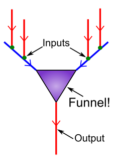
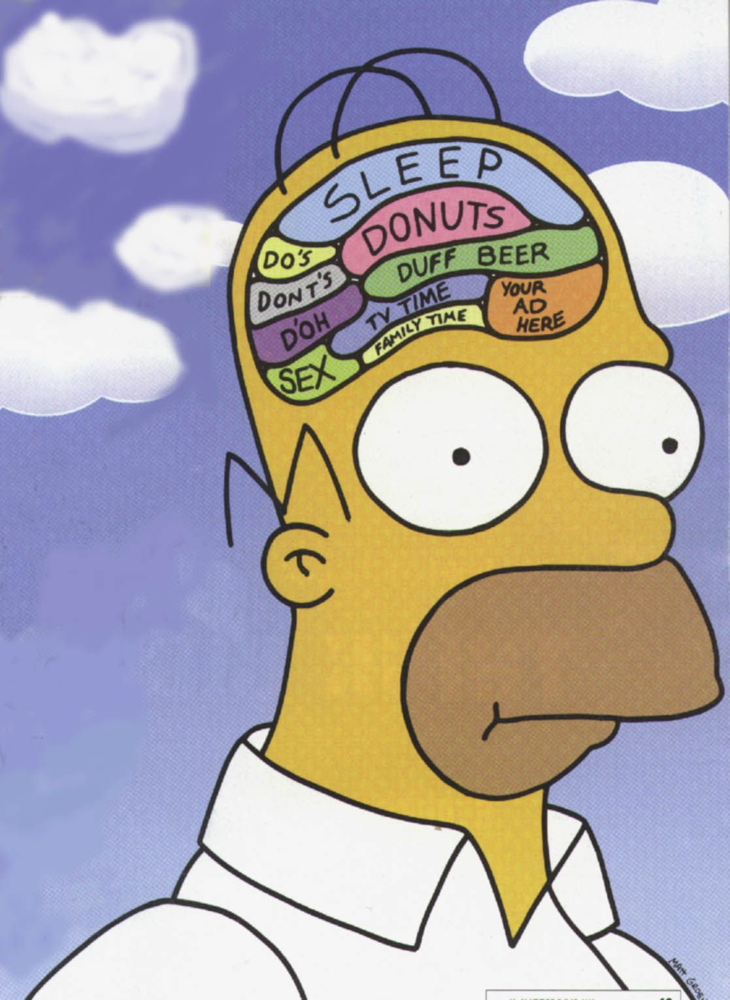
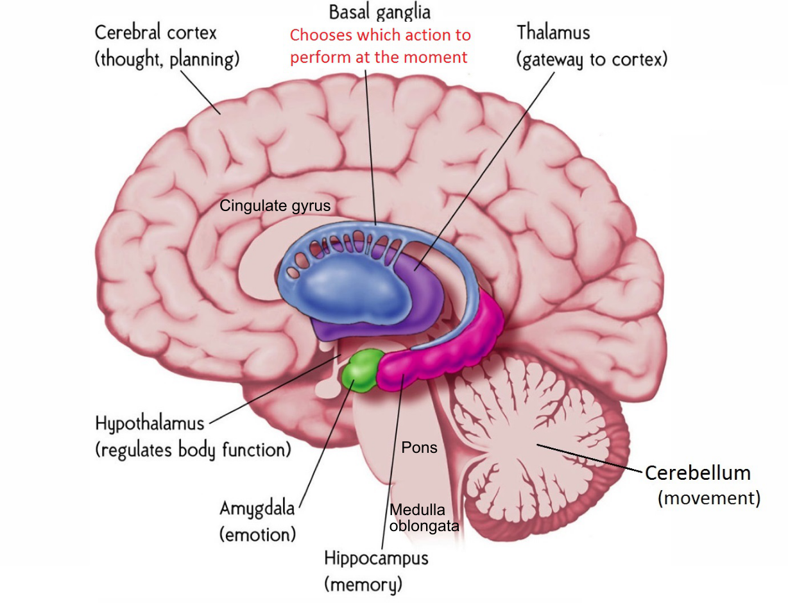
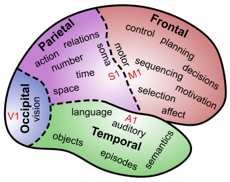
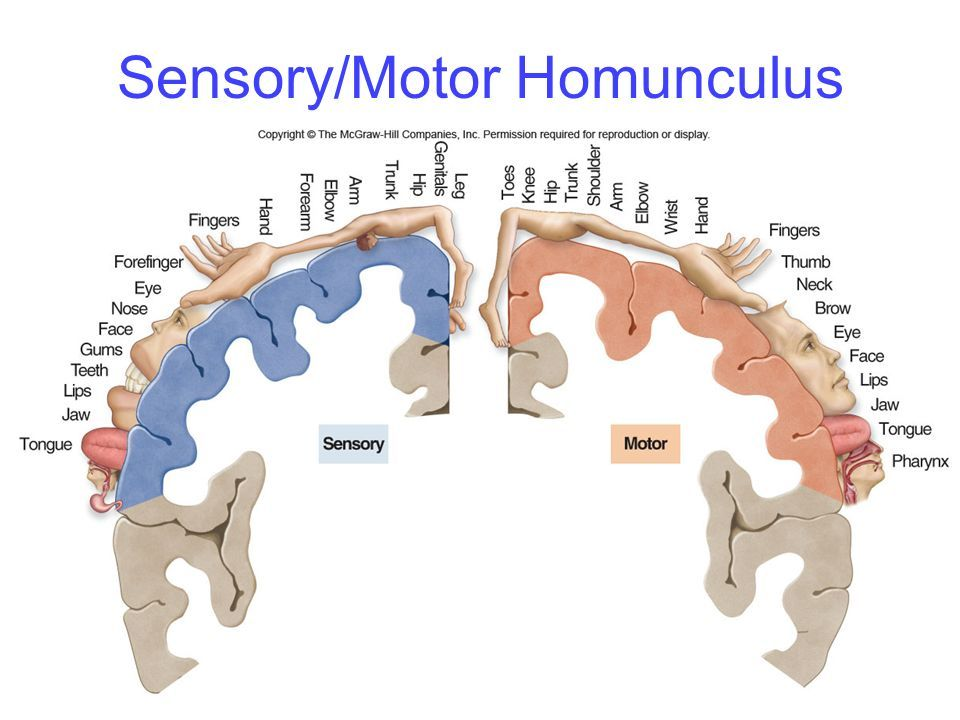

# Neuroscience {#sec:ch-neuro}

From a materialist, neuroscientific perspective, *everything* that happens in your mind is due to underlying physical processes taking place in your brain.  As we discussed in the last chapter, this does *not* mean that we can *reduce* your mind to the brain, but it does mean that there is a really huge mystery here (arguably the greatest mystery of all): how is it even remotely possible for a physical system to produce the amazing subjective delights (and terrors and everything in between) that we all experience?

We start with a time-honored scientific approach: reduce the problem to the simplest possible system that exhibits the relevant behavior to see if that makes it easier to understand.  Consider the two gears as shown in [@fig:fig-gears].  As elaborated in the figure caption, there is something kind of "magical" that emerges out of the interaction between the two gears, which cannot be reduced directly to either gear separately.  These **emergent** properties depend critically on the relationship and interaction between the two different parts --- their relative sizes, rotational speeds, etc.  If the larger gear interacted with a different, even larger gear, the overall system of interacting gears would exhibit very different emergent properties.  Thus, you really can't isolate these emergent properties to either gear in isolation: they are **irreducible**.  Furthermore, the actual material that the gears are made of is largely irrelevant, as long as it is reasonably solid.  Thus, there truly is some kind of seemingly mysterious new *something* being created out of this interaction, which can **transcend** its material basis.  And yet, it nevertheless depends entirely and directly on having an actual material basis --- e.g., the *picture* of those gears doesn't work at all like two actual gears! 

![The principle of *emergence*, simply illustrated.  The gears on the left do not interact, and nothing interesting happens.  However, on the right, the interaction between the gears produces interesting, useful phenomena that *cannot* be reduced to the individual gears *separately*.  For example, the little gear will spin faster, but the larger one will have higher torque at its axel --- these properties would be entirely different if either gear interacted with a different sized gear.  Furthermore, the material that the gear is made from really doesn't matter very much --- the same basic behavior would be produced by plastic, metal, wood, etc.  Thus, even in this extremely simple case, there is something just slightly magical and irreducible going on --- when two gears get together, something emerges that is more than the sum of the parts, and exists in a way independent of the parts, even while being entirely dependent on actually *having* those parts to make it happen.  This seems like a good analogy for the relationship between the mind and the brain (but where the complexity and number of interactions are magnified billions of times over).](../figures/fig_gears.png){#fig:fig-gears width=75% }

This simple two-interacting-gears scenario captures the strange relationship between mind and brain, where the mind depends entirely on the brain, and yet it fully [transcends](#transcend) it.  As we'll see in a moment, the brain has billions of tiny, interacting parts (*neurons*), which, like the gears, interact in ways that produce emergent properties transcending their material substance.  Moreover, there are so many neurons in the brain, and each one interacts with so many *other* neurons (receiving roughly 10,000 inputs and sending a similar number of outputs), that there is a vastly greater degree of emergent interactions taking place in the brain compared to our simple gear example.  Thus, although it is essentially impossible for us to wrap our own minds around it, it should be possible to at least imagine in a vague way how something as fantastic and complex as the mind could indeed emerge out of all those billions and billions of interactions taking place every nanosecond, right inside your very own brain.

To try out another metaphor, you can also think about the brain as a massive LEGO set, with parts that *learn* to interconnect with each other in myriad ways.  As you might have experienced in your youth, the number of different ways even a small pile of LEGOs can be combined to make different things quickly exhausts the imagination.  This **combinatorial explosion** of possibilities is an essential feature of the brain --- our neurons can be interconnected in so unimaginably many different ways, that the possibilities are effectively infinite.  Due to the explosive nature of combinations, even small numbers of elements can be combined in more different ways than there are atoms in the universe.  To see this for yourself, type in `69!` (factorial) on your calculator (or just google it), and you'll get a number that is 1.7... with 98 zeros!  This factorial function lies at the heart of combinatorial explosion and gives a rough sense of the number of different combinations of 69 parts.  You can't even begin to conceive of (or even calculate) the value of 100,000,000,000! (i.e., the factorial of the 100 billion neurons in your brain).

Thus, your brain is one of the most complex systems in the universe --- it doesn't have the most atoms, molecules, or cells of course, but the key difference between your brain and an equivalent lump of gray jello is that the exact configurations of all those molecules and cells in your brain mean something *special* in terms of your unique memories, knowledge, etc.  So all those different combinations and connections of neurons are *meaningfully distinct*, whereas you can rearrange the goo in the jello brain any which way and nobody would notice the difference.

In the remainder of this chapter, we will see how individual neurons work, at both a biological level and in terms of the way they process information, hopefully giving you a deeper understanding of how *compression* and *contrast* emerge directly from the biological features of the neuron.  Then, we'll look at the large-scale organization of the brain, followed by a zoom-in focus on the most important part of the brain, the *neocortex*, which is where most of your thoughts, feelings, and memories are encoded.  Finally, we'll conclude with a consideration of the different ways in which we can peer into the brain as it is working, which are the methods that have provided our initial understanding of this amazing organ.

## Simple Neurons Make Complex Work

The magic of LEGO is that all the different parts interconnect using a single, simple principle (the stud fits tightly in a corresponding hole), so that you really can make all those different combinations work.  The same is true of the brain: each neuron operates according to surprisingly simple, easily-understood principles, and the power emerges through all the interactions and combinations of these simple parts.

![The neuron as a detector.  Inputs come in via *synapses* connecting the *axons* of other neurons to the *dendrites* of a given neuron.  This neuron *integrates* these inputs, resulting in an *electrical potential* (called the *membrane potential*, because it is the electrical difference between the inside and outside of the neuron's cell membrane), in the cell body.  At the start of the axon (the axon *hillock*), a critical *go / nogo* "decision" is made --- if the membrane potential is sufficiently elevated, then the neuron triggers an *action potential* (aka a *spike*), which races up the axon and delivers its signal to the many thousands of other neurons that are "listening" to this signal, via their own synaptic connections.  Thus, the essence of neural function is *communication* --- neurons are highly social little things, and our brain is really a huge social network of chattering naybobs.](../figures/fig_neuron_as_detect.png){#fig:fig-detector width=75% }

The easiest way to understand what neurons are doing is in terms of **detection** ([@fig:fig-detector]).  A neuron acts much like a smoke detector, constantly sampling its local environment (i.e., its inputs from other neurons), and looking for some set of incoming signals that indicate that something *important* might be going on (e.g., a fire in the case of the smoke detector).  When it detects whatever it is looking for, it sends a signal out to other neurons, alerting them to the news, so they can incorporate this as one of many other pieces of information that they are themselves sampling in their own detection process.  And so on, and so on... Examples of the kinds of things different neurons have been shown to detect include: faces in general vs. other kinds of things, specific people's faces (e.g., a famous case of a neuron tuned to Halle Barry, and another for Bill Clinton; [@QuirogaReddyKreimanEtAl05]), eyes, letters, numbers, houses, different levels of visual depth, specific sounds, etc.  Basically, anything that you can be aware of when looking out at the world is the result of neurons detecting those things from among all the possible configurations of visual features, including the words you're reading now, or your laptop, or your phone, or that pizza slice... everything!

Each of the major biological parts of the neuron take on a clear functional role within this detector model:

![Details of the communication process across the synapse between a sending axon and a receiving dendrite, specifically for an excitatory synapse.  Neurotransmitter (glutamate) is released from the *terminal button* (pronounced French-style by those in the know), and binds to corresponding *receptors* (AMPA) on the dendrites, causing them to un-twist and thus open up small *channels* that allow electrically-charged *ions* to flow into the receiving neuron (Na+ = sodium).  Once neurotransmitter is released, it is taken back into the axon (*reuptake*) and is also broken down by enzymes, so that it tracks the rate of spiking by the sending neuron, and doesn't just hang out indefinitely (not shown).  Inhibitory synapses release *GABA* and allow *Cl-* ions to enter.  Glutamate also binds to NMDA receptors that are involved in learning. ](../figures/fig_synapse_send.png){#fig:fig-synapse width=40% }

* **Synapses**: are the tiny gaps between neurons, where the output signals from one neuron cross over and become the input signals to the next ([@fig:fig-synapse]).  Most synapses are *chemical*, involving the release of a chemical **neurotransmitter** from the sending +presynaptic axons, which then bind to **receptors** on the receiving +postsynaptic dendrites.  These receptors twist open as a result of neurotransmitter binding, and allow **ions** (atoms carrying electrical charge) to flow into the dendrites through the open channels.  The most common neurotransmitter in the neocortex is **glutamate**, and it opens up **AMPA** receptors, that allow sodium (Na+) ions to flow into the dendrites, thus creating a *positive* electrical potential in the receiving neuron.  After release, neurotransmitters are taken back into the terminal button (**reuptake**) and broken down for re-use by enzymes --- this ensures that the amount of neurotransmitter binding accurately reflects the spiking rate of the sending neuron.

    All of this complex-sounding machinery and terminology is actually very simple: Neurons like to excite other neurons by sending them exciting signals!  The basic machinery is chemical and electrical, but the bottom line is: how strongly do the input signals to a given neuron excite it?  This is determined by the detailed properties of each of the roughly 10,000 synapses coming into a given neuron.  This point bears emphasis, as we will return to it repeatedly: **the pattern of its synaptic connections determines what a given neuron detects, and thus, ultimately, what the brain knows**.

{#fig:fig-funnel width=30% }

* **Dendrites**: provide a broad tree-like (dendrite literally means tree-like) *arbor* for all the synaptic inputs into a neuron, and they funnel the resulting electrical charges up into the cell body.  This funnel-like property, illustrated in [@fig:fig-funnel], is the origin of the **compression** principle of brain function, one of our three C's.  As we noted in the introduction, each neuron is compressing its 10,000 different inputs into a single output signal, producing a roughly 10,000-to-1 compression factor.  As an aside, one of the big debates in neuroscience is the extent to which these dendrites perform various kinds of more complex processing of their synaptic inputs, or simply convey the integrated signal.  There is evidence on both sides, and, as usual, the truth is likely somewhere in between (and likely to differ across neuron types).

* **Cell Body**: The neuron is a cell, and, despite its long tendrils, it has a cell body like other more compact kinds of cells, where the nucleus and other cellular machinery reside.  It is here that all the dendritic signals converge, to produce the final compressed electrical potential that somehow summarizes everything coming into the cell at that moment.  This electrical potential is called the **membrane potential** because the electrical signal is measured as a difference in electrical charge across the cell's membrane (that fatty lipid bilayer wall of the cell that you might recall reading about in high school science).  If this membrane potential is sufficiently excited (i.e., above a critical **threshold**), then special channels at the start of the axon (the axon *hillock*) will get *extra* excited and essentially flip a switch, causing the initiation of the **action potential** or **spike**.  The details of this process were worked out by Hodgkin and Huxley in the 1950's [@HodgkinHuxley52], and have stood the test of time, forming the basis of modern detailed mathematical models of neuron firing.

* **Axon**: The spike propagates down the axon, effectively broadcasting this one signal out to the roughly 10,000 other neurons that it sends input to, continuing the great chain of communication among neurons.  Note that the fact that the output is sent to roughly 10,000 other neurons doesn't alter the *compression* property of neurons: it is just broadcasting the same signal, so there isn't any new information there.  Axons can have varying amounts of **myelin**, provided by helpful **glia** cells called *oligodendrocytes* (no you won't be tested on those!), which serve to insulate the electrical "wire" that is the axon.  Myelinated axons convey information more quickly, and **multiple sclerosis** is one of various disorders that involves the degeneration of this myelin, resulting in slowed signal conduction.  There are many other forms of glia cells, but all of them are generally thought to play various supporting roles in the overall function of the brain, whereas the neurons are the "stars" of the show.  These supporting roles are essential for keeping the brain functioning and may affect various processes such as learning, but we'll nevertheless generally ignore them in this introductory textbook.

To summarize, each neuron is receiving a huge amount of input through its roughly 10,000 synapses, and it then compresses this all down into a single discrete spiking signal that it then broadcasts back out to the roughly 10,000 other neurons listening to its little story.  Only when a neuron detects something "interesting" does it get excited enough to send this spiky signal out, and this *thresholding* is really the defining characteristic of a detector, making it respond *selectively*.  Thresholding is just as important in neurons as it is in people: it can quickly get tiresome listening to someone with a *low threshold* who is always blabbering on about the most uninteresting things.  The advent of Facebook and other forms of social media has greatly magnified this problem. 

We'll explore more about the kinds of interesting conversations neurons might be having in a bit, but first we'll examine how this electrical magic operates within the neuron in more detail.  This level of depth goes beyond most introductory texts, but understanding how this works helps us understand the effects of many different drugs, including alcohol and valium (as we discuss in the next chapter).  Furthermore, a really simple analogy helps make it accessible, and this machinery ends up producing many of the **contrast** effects that are so central to our overall framework, so we're motivated to take this brief detour.

## The Tug-of-War in Your Brain

There are two major classes of synaptic inputs converging on each neuron: the excitatory ones described above (via the +neurotransmitter +glutamate opening +AMPA receptors), and separate +inhibitory synaptic inputs that are driven by a neurotransmitter called **GABA** that activates... *GABA* receptors, which allow negatively-charged *Cl-* (chloride) ions to enter the cell.  Thus, your brain runs primarily on table salt: *Na Cl*, dissolved in water --- we carry the ancient ocean around in our heads!

Interestingly, each type of neuron only sends one type of neurotransmitter (in the neocortex at least), meaning that all of the excitatory input is coming from one type of neuron, which are the **pyramidal** neurons (which constitute roughly 85% of neurons in the neocortex).  These neurons broadcast their exciting messages over long distances to far-flung regions of the brain, and are regarded as the primary *information processing* neurons (i.e., they are primarily responsible for all the chatter and compression going on).  The GABA inhibitory inputs come from an entirely separate set of specialized neurons known as **inhibitory interneurons**, that connect relatively locally, and serve to *regulate* the level of electrical excitation surging through the brain, through extensive negative feedback connections onto the excitatory pyramidal neurons.  Thus, even though each neuron *receives* both excitation *and* inhibition (yep, inhibitory interneurons also get some of their own inhibition too), they only send *either* inhibition *or* excitation, not both.

![The Tug-of-War between excitation and inhibition, producing a beneficial balancing act, and a major source of **contrast** coding in the brain.  Inhibition pulls the *membrane potential* (written as Vm, where V=voltage and m=membrane) down toward the *resting potential* of roughly -75 mV via the influx of negative Cl- ions.  Excitation pulls up toward roughly 0 mV via the influx of positive Na+ ions.  Thus, the components of ordinary table salt ($NaCl$) are driving this perpetual battle inside every one of your neurons.  The size of each "person" pulling reflects their respective strength --- technically, this strength is the total *conductance* $g$ of each type of channel, with $i$ = inhibition and $e$ = excitation.  Theta $\Theta$ represents the *threshold* electrical potential, above which the neuron will fire a spike.  The value of Vm, and thus whether spiking happens, depends on the *relative* balance between excitation and inhibition, not the absolute levels, and that is what makes us so sensitive to relative contrasts, as shown in the last two cases, where the Vm is the same (because the relative strengths are the same) but the absolute strengths of inhibition and excitation are very different.](../figures/fig_vm_as_tug_of_war_cases.png){#fig:fig-tug-of-war width=60% }

Inside each neuron, excitation and inhibition are forever locked in a pitched battle, which can be pictured as a tug-of-war, with each side pulling in opposite directions with varying strength ([@fig:fig-tug-of-war]).  The "pitch" on which this battle is taking place is the amount of electrical charge in the cell, i.e., the *membrane potential*.  The excitatory end is always pulling this potential upwards, while the inhibitory side is pulling it back down, and the actual potential represents the *relative* balance between these two forces.

Critically, **contrast** or **relativity** emerges as the result of this tug-of-war battle because it doesn't matter how strong the two different sides on the tug-of-war are in *absolute* terms --- all that matters is the *relative* strength of the two sides, as shown in the bottom two cases in [@fig:fig-tug-of-war].  Excitation could be relatively weak, but if inhibition is also weak, then the net balance between the two will be the same as if each was proportionally stronger.  This is exactly like a standard balance scale, where the scale will balance if the weights on the two sides are equal, no matter how heavy or light they are.

In the brain, the amount of inhibition is roughly proportional to the *average* amount of activity in any given area, so in effect, each neuron is effectively comparing how excited it is against this average level.  Only those neurons that are getting *above average* level of excitation will actually get excited enough to fire spikes.  In real-world terms, this average inhibition is very much like the amount of money that your peers are making (or the amount of fun they appear to be having on their various social media accounts) --- it forms the baseline or standard against which you measure yourself.  Likewise, neurons are constantly comparing themselves against *their* peers, and all of the spiking going on in your brain is therefore always *relative* to these peer-standards.

For example, when you step outside into the bright sunlight, all the visual neurons suddenly get a huge wave of excitation relative to the dim indoor light from before.  But you avoid suffering an [epileptic seizure](#epilepsy) from all that excitement because those inhibitory interneurons are also getting this wave of excitation, causing them to send a proportional amount of inhibition to dampen all that excitement, keeping everyone in balance.  Yes, inhibition is really a drag, but without it, you would be suffering from epileptic seizures all the time.

In fact, this balancing act between excitation and inhibition is so important for brain function that our brains are perched on a kind of *knife edge*, and the relatively high incidence of epilepsy in the population (4% lifetime prevalence) is likely a result of the fact that it is really hard to get this balance exactly right.  And too much inhibition has very bad consequences as well (indeed, it literally *depresses* your brain and makes it difficult for you to do anything).  We'll see in [@sec:ch-disorders] that treatments for +depression involve safe ways of increasing the activity of the +frontal cortex.

The main treatments for epilepsy involve activating the GABA inhibitory system more strongly, thus shifting the tug-of-war balance, and drugs that activate GABA are also used as anesthetics.  The reason alcohol makes you sleepy and pass out if you have too much, is that it also activates GABA inhibition too --- paradoxically that increased inhibition in your brain results in *behavioral disinhibition* --- your anxieties get inhibited along with everything else.  And people never take the drugs that go the other way, and reduce GABA inhibition --- because they will definitely cause epilepsy and fry your brain!  We'll cover these issues in greater depth in the next chapter.

Another key property of neurons is that they exhibit **adaptation** / **accommodation** / **fatigue** (all different terms for the same basic phenomenon), where their response to the same level of excitatory input decreases over time.  This is not just some metabolic side-effect of neurons getting "tired" --- it is an important way that neurons process information, which causes them to emphasize *new* information while discounting anything that has already been active and processed.  This is another important form of **contrast**, operating over time, contrasting the new against the old.

In summary, two out of the three of the core principles of this textbook, **compression** and **contrast**, emerge directly out of the basic function of neurons.  If you can't quite explain this to yourself, please go back and re-read the above material and see if you can make sense of it (and ask your teacher questions), because these are really central to the entire rest of the book, so understanding where they come from is really important.  As we discussed in the Introduction, we can trace the implications of these core neural properties all the way through the full scope of psychology and behavior.  [@sec:ch-perc] will provide particularly compelling demonstrations of how compression and contrast play out in our perceptual lives --- the story of perception is really the story of compression and contrast.

By thinking in terms of compression and contrast, we have managed to dramatically simplify our understanding of the brain, creating an almost transparent, level-spanning way of going from single neurons on up.  However, none of this contradicts the emergence and complexity discussed at the outset.  Instead, these principles just capture the general tendencies and propensities of the brain, but within that broader scope, there is a wild, complex, bubbling jungle of intertwined conversations and chatter constantly unfolding within your brain, thinking all manner of complex thoughts.  Next, we'll move up from the level of individual neurons and start to think about how all these principles might play out in terms of how different brain areas are organized to facilitate effective behavior and cognition.

## Large-Scale Brain Organization ("Gross" Anatomy)

We attempt to answer two closely interrelated questions about the large-scale organization of the brain, one of which is relatively easy, and the other which remains rather more murky.  The easy question is: "what are the obviously separate parts of the brain, which have a distinct evolutionary and structural basis?"  The hard question is: "to what extent do any of these brain parts, or regions within these brain parts, support a distinct kind of function?"  This latter question of *functional specialization* is challenging because neurons are so massively interconnected and interdependent on each other, that it is hard to clearly isolate any specific function.  It is like any kind of team sport: we are tempted to focus on a few specific star players, but, really, the team depends on every player and the quality of their interactions (just like the gears in [@fig:fig-gears], and any emergent system).  For example, the quarterback on a football team can either look really good or bad as a function of how good the offensive line is, but nobody gives that line sufficient credit, focusing instead on the singular, more glamorous quarterback.

{#fig:fig-homer width=40% }

Historically, Karl Lashley in the 1920's concluded from his extensive studies lesioning different parts of rat brains, that the brain is an *equipotential* system, operating according to some kind of *mass action* principle.  That is, all areas contribute roughly equally to the overall function, and all that matters is how much total neural tissue is intact --- the more the better.  This idea strongly conflicts with everything we know about mechanical systems, where each part has a specific, well-defined function, and is generally hard for people to really understand.  This desire for highly specialized brain parts is reflected in the ubiquitous drawings of the brain carved up into discrete functions (e.g., [@fig:fig-homer]), and in the discredited approach of *phrenology* which attempted to associate functions with different bumps on the skull.  Critics have derided many recent neuroimaging studies as *neo-phrenology* because there is still this strong tendency to ascribe discrete functions to individual blobs of brain that "light up" when people are doing different tasks in the brain scanner. 

As usual, the truth is somewhere in between these extremes.  Even though neurons are massively interconnected and interdependent, and overall function emerges through these interactions, there is evidence that different brain areas are differentially important for different functions.  But the level of functional specialization is much more *partial* and *overlapping* than completely distinct.  One way of thinking about this is in terms of the saying that "All politics is local", which is as true for the brain as it is for people, perhaps more so: neurons can't pack-up and move to a different part of the brain.  Instead, they are like the 85% of Pittsburghers who live their entire lives in the same little neighborhoods.  This means that different neighborhoods can develop their own special "personalities" and focus on detecting particular kinds of signals.

On the other hand, the excitatory neurons in the brain also send out long-range connections.  Network theorists characterize these as *small world* patterns of connectivity, such that, in the end, every neuron is only a few synapses away from every other neuron.  This then limits how much "neighborhood funkiness" can develop.  So, again, the brain is all shades of grey, not black-and-white: different areas are somewhat specialized but also very interdependent.

### The Big Brain Chunks

{#fig:fig-gross-brain width=85% }

[@fig:fig-gross-brain] shows the different brain regions that can be easily distinguished based on evolutionary history and obvious structural differences.  Keeping in mind the above qualifications, the functions of these areas are as follows:

* **Cerebral cortex (Neocortex)**: This is the most important part of the human brain, supporting all of our special human abilities to think, read, talk, reason, plan, etc.  We are exclusively conscious of activity in this part of the brain --- this is where "you" live (Descartes theory of the pineal gland was way off).  Most of what we discuss throughout the textbook is focused on this part of the brain, and all of what we said above about neurons is focused specifically on this part of the brain (other parts may differ in various details, but the general properties are shared).  Often, we'll just refer to this as *the cortex*, although technically *cortex* means "sheet-like" and other brain areas also have a *cortical* kind of organization.  Anatomically, this sheet-like nature of the neocortex is more evident in smaller-brained animals --- in humans, the neocortex is so greatly expanded that it is all folded over on itself.  It is the wrinkled sheet upon which all of our hopes and dreams rest.  We'll go into more detail about the different lobes and their relative functions in the next section.

* **Thalamus**: Functionally, the thalamus is completely intertwined with the neocortex, and neither can function without the other.  There are massive, +bidirectional interconnections between every part of the neocortex and the thalamus.  Some parts of the thalamus *relay* information from the senses up into the primary sensory areas of the neocortex.  For example, the *lateral geniculate nucleus (LGN)* receives most of the output from your eyes, and then sends that up into your *primary visual area (V1)* in the neocortex.  However, it is not *just* a relay: V1 also sends massive +top-down connections back into the LGN, and these serve to focus +attention and organize all the low-level visual signals into a more coherent "picture".  As visual information processing proceeds up to higher levels in the cortex, the thalamus continues to play a critical role through a structure known as the *pulvinar*, which again has massive bidirectional interconnections with corresponding cortical areas.

    The pulvinar has been implicated in attention, and also serves to coordinate different cortical areas by synchronizing brain activity in the *alpha* frequency (10 Hz or 10 cycles per second) --- we'll discuss these frequencies more later when we talk about sleep stages (the thalamus also plays an important role in sleep).  Other areas of the thalamus are directly interconnected with both the frontal lobes and the basal ganglia, and are really inseparable from the function of those brain areas.  Overall, despite its anatomical separation, it does not really make sense to think of the thalamus as a separate brain area from the neocortex --- instead we should think of the *thalamocortical system* as a functional unit.

* **Basal Ganglia (Striatum)**:  This is a collection of different brain [nuclei](#nucleus) or "ganglia" (chunks of neurons) that form a complete sequential pathway or loop from the neocortex and back up into different parts of the frontal lobes.  Thus, like the thalamus (which is also a key part of this loop), it is hard to really separate the function of the basal ganglia from that of the +frontal lobes of the neocortex (which we'll discuss below), and damage to either of these areas produces similar effects.  Indeed, this *fronto-striatal* system is implicated in most of the major mental disorders that afflict us, including +depression, +anxiety disorders, +ADHD, and +OCD, as we'll cover in detail in [@sec:ch-disorders].  As noted in the Introduction, this system is the most important player in the **control** component of our three C's, and these disorders all involve a major element of control.

    Anatomically, the input portion of the basal ganglia circuit is composed of the *Caudate Nucleus*, *Putamen*, and the *Nucleus Accumbens*, which collectively comprise the *Striatum*, which means "striped".  The striatum receives massive input from all over the neocortex, "digests" (compresses) it down into a basic *Go* vs. *NoGo* decision about whether to do something or not, and then sends that decision back up into the frontal lobes, by way of the thalamus.  Thus, whereas the basal ganglia was previously thought to be more of a "habit learning" part of the brain, it is actually the real *decision maker* in your brain.  Indeed, research shows that the basal ganglia makes a decision about what you're going to do next about 1/3 of a second before you are consciously aware of it [@LibetGleasonWrightEtAl83]!  This reflects the fact that we're only conscious of what is going on in the neocortex, and some people find it kind of unsettling that this "other" part of your brain is "making decisions on your behalf".  But really, you are *all* of your brain, not just the parts you're subjectively aware of, and again, all of these areas are massively interconnected and interdependent, so don't get too freaked out by this!  Embrace your inner decision maker, which is responsible for those *gut feelings* that all so often end up being correct, even as they are often overridden by your over-analyzing conscious cortex.

    The basal ganglia are unique in the brain by virtue of having by far the most **dopamine** receptors, and +dopamine plays a critical role here by shaping the decision-making process according to what has worked, and not worked, in the past.  Furthermore, the basal ganglia, particularly the nucleus accumbens in the +ventral (bottom) part of the striatum, plays an essential role in controlling the firing of dopamine neurons, so that the dopamine signal reflects the *contrast* from your expectations, rather than raw reward or punishment itself.  In [@sec:ch-learn], we'll see in more detail how this process works, in the context of [classical conditioning](#classical-conditioning) and [instrumental conditioning](#instrumental-conditioning), which largely reflect the dopamine-driven learning processes taking place in the basal ganglia.

* **Amygdala**:  The amygdala is a relatively small +nucleus, which is named after the Greek word for *almond* (most anatomical labels describe either the shape, color, or texture of the brain structure --- appearance far preceded knowledge of function), that plays an essential role in driving our emotional life.  It is extensively interconnected with both the basal ganglia and the dopamine system, and drives these systems to respond appropriately for positive and negative emotional events.  For example, when a previously-neutral stimulus is associated with either a rewarding or punishing outcome in classical conditioning, the amygdala learns the association between the stimulus and this outcome, and drives dopamine firing and other behaviors to anticipate and prepare for the outcome (e.g., approaching yummy food and running away from fear-inducing scary stuff).

    The Amygdala is also extensively bidirectionally interconnected with the neocortex, receiving sensory inputs and sending its emotional signals up to the +medial and +ventral regions of the +frontal lobes, which are the emotion centers of your conscious world in the cortex.  Thus, the amygdala is a *hub* for emotional signals, interconnecting between lower-level brain stem systems such as the hypothalamus, and driving your high-level conscious emotional experiences.  People with damage to this area don't necessarily have a complete absence of emotion, but they can't connect all the pieces together in an effective way, and often behave carelessly because they fail to anticipate the potential risks of their actions.

* **Hippocampus**:  The hippocampus lives next door to the amygdala in the brain, and is essential for rapidly forming new memories of the daily events of your life (i.e., +episodic memories).  When you think of memory, mostly you're thinking of what the hippocampus does.  Of all the brain areas we've considered so far, the hippocampus is the most strikingly specialized: highly selective damage to this brain structure can result in profound +amnesia --- particularly the inability to learn new episodic memories, but also the loss of at least a certain window of more recently-acquired memories.  The famous patient H.M. (Henry Molaison) had his hippocampus lesioned surgically to alleviate epileptic seizures, and was unable to acquire new memories for the rest of his long life.

    It is scary to contemplate H.M.'s case: so much of our sense of life's meaning is associated with making lifelong memories.  Along with our emotions, our memories are the most cherished aspect of our subjective world, and it is truly horrifying to imagine losing this ability.  Therefore, you should treat your hippocampus well: it is a bit of a "canary in the coal mine", and is often the first thing to go when you lose oxygen to the brain.  Likewise, heavy drinking causes this area to lose function before others, resulting in memory blackouts.

    As we'll explore in greater depth in [@sec:ch-mem], the hippocampus has several biological specializations that enable its super-memorizer abilities, but these also result in it being a bit hyper-sensitive, both biologically and functionally.  Although the hippocampus is highly specialized, it nevertheless depends entirely on extensive input from the surrounding areas of the neocortex, which convey a massively *compressed* summary of everything going on in the rest of your brain.  This high level of compression makes our memories relatively inaccurate and subject to many biases, but also extremely efficient.

    In sum, the hippocampus essentially takes a "snapshot" of the current state of the brain, and later, when you want to recall some prior event, it can retrieve that snapshot and cause the rest of your brain to relive that moment to some extent.  During recall, the hippocampus drives those same surrounding neocortical areas in the reverse direction from when the memory was initially encoded, again demonstrating the essential interdependence of all these different brain areas.  Also, the hippocampus has somewhat separable *cognitive* and *emotional* components, with the emotional one extensively interconnected with the amygdala and those frontal emotional areas that strongly interconnect with the amygdala, and it plays a critical role in making your emotional responses appropriately responsive to different situations and contexts.

![Learning Rules across the brain: some of the clearest differences between brain areas are in terms of the signals that drive learning in a given area.  In particular, the basal ganglia and cerebellum each specialize on two of the most important types of learning signals: reward (and punishment) vs. error signals, which are *not* the same as punishment --- these are instead detailed signals with specific information about exactly what didn't go according to plan in a motor action. The cerebellum is unique in having no dopamine innervation or receptors.  More evolutionarily-modern areas incorporate multiple signals, and include self-organizing learning, which means learning that happens automatically all the time, as in the hippocampus automatically taking snapshots of cortical activity.  The power and flexibility of the neocortex comes in part from its ability to take advantage of these multiple types of learning signals.](../figures/fig_learning_rules_across_brain.png){#fig:fig-learning-rules width=60% }

* **Cerebellum**: The cerebellum plays a critical role in learning to perform motor (muscle) movements in a smooth, efficient, and coordinated way.  Anatomically, it is a kind of "mini brain" (that is what its name means) tucked under the back of your brain, and it is also a *cortical* structure with a very distinctive sheet-like organization.  In some ways, you can think of it as a kind of "hippocampus for motor learning", as suggested by the pioneering scientist David Marr in a pair of prescient papers [@Marr69; @Marr71], which attempted to discern the functions of both the cerebellum and hippocampus based on their unique anatomical properties.  Amazingly, his ideas have largely stood the test of time, and form the core of our modern conception of these areas.

    The cerebellum and hippocampus are among the most functionally specialized brain areas, and both rely on a kind of "brute force" memorization strategy to achieve their special learning abilities.  This brute force strategy requires a lot of neurons: half of the total neurons in your brain live in the cerebellum!  An important consequence of this strategy is that it takes lots and lots of practice to really perfect any given motor skill (e.g., gymnastics, skiing, etc), because the cerebellum has to memorize each of the many different ways to perform a motor action.

    The cerebellum learns to anticipate errors, awkwardness, and inefficiency in a given motor action plan, and sends well-timed corrective signals to prevent those from actually occurring.  It receives error signals from a nucleus called the *inferior olivary nucleus* (you can guess what it looks like), which drive a powerful error-correcting learning signal in the *purkinje* neurons that are one of the central actors in the cerebellar circuit.  These purkinje neurons are truly amazing things, receiving over 100,000 different synaptic inputs (10 times as many as the typical neocortical neuron) --- so many synapses are needed to be able to have distinct memories for each of those different motor action sequences.  This form of error-driven learning is quite different from the "snapshot" memorization operating in the hippocampus, so these brain structures are also functionally distinct from each other, even though they both share the same brute-force memorization strategy.

    Interestingly, the cerebellum and basal ganglia, which are both considered motor control systems, have surprisingly few direct interconnections (a rarity in the brain, as we've seen) --- but this actually makes good sense, because they each perform very different functions, at different time scales ([@fig:fig-learning-rules]).  The cerebellum deals with very fast *online* motor control at the scale of +milliseconds, whereas the basal ganglia is more involved in the slower *outer loop* of deciding which of various possible motor plans to actually execute.  Thus, the basal ganglia typically acts first to select the motor plan, and then the cerebellum takes over and ensures that the selected plan is executed to the best of your ability.

    By analogy with the different roles in making a movie, the basal ganglia (together with the frontal cortex) is the *producer*, deciding what movie to make; the cerebellum is the *director*, who is there day-in-day-out on the set, dishing out detailed instructions to the actors to make it all look good; and motor circuits in the *pons* and other brainstem areas, on down into the spinal cord and the muscles, are the *actors*, actually carrying out the actions.

* **Hypothalamus**: This tiny structure plays a huge role in controlling your basic bodily functions, including eating, drinking, sleeping, arousal, sex, stress, immune response, etc.  It is the controller of the *HPA axis* (hypothalamic-pituitary-adrenal), which is a system of interconnected structures in the **autonomic nervous system** that release **hormones** including +corticosteroids in response to *stress*.  The hypothalamus has many different nuclei, each specialized for different domains, and some of these project up to the amygdala to drive emotional responses.  For example, the positive reward feelings associated with eating and drinking come from the +lateral hypothalamus, and these signals go into the amygdala and directly into the dopamine system, driving bursts of dopamine for (unexpected) positive events, like when a co-worker brings in leftover birthday cake to the office.  The hypothalamus also receives +top-down control signals from areas of +ventral and +medial +frontal cortex, which can regulate the response to potentially stressful events, for example.

    One fascinating line of research (which we'll cover in more detail in [@sec:ch-disorders]) shows that rats who can *control* their exposure to mild electric shocks (by moving to another part of their cage), have significantly lower stress responses than the *yoked* rats that receive the exact same electric shocks, but have no control over them.  Thus, the perception of control, which has been localized to those frontal cortical areas (consistent with the role of these areas in control more generally), is an essential factor in how the body responds to stressful situations [@MaierWatkins10].  A clear real-world example of this is the difference between driving a car and riding along as a passenger --- the driver typically experiences things as "under control" whereas the passenger is more likely to feel stress because the driver is going too fast otherwise being unsafe.

    More generally, chronic exposure to negative, stressful situations over which a person has little perceived control can produce significant long-term mental health problems, leading to a kind of *learned helplessness* that is associated with depression [@MaierSeligman76].  This kind of chronic stress exposure without perceived control is much more prevalent in people of lower socioeconomic status, and can produce a very unfortunate feedback loop of learned helplessness and significant health complications from stress.  Understanding how these brain mechanisms work is thus of vital importance for addressing many pressing societal issues, again underlining the broader importance of psychology and neuroscience.

* **Brainstem Nuclei and Medulla Oblongata**: Finally, there are a number of different clumps of neurons in the brainstem that play critical roles in overall brain and body function.  These are evolutionarily more ancient brain areas, like the hypothalamus, which have highly specialized functions.  In computer terms, these are the core +BIOS brain areas --- the low-level "hardware" control areas.  One group of such nuclei are collectively referred to as the *reticular activating system*, and include the sources of the major **neuromodulators** that *modulate* (alter) the functioning of neurons throughout the brain in various (often similar) ways.  Here is a list of such areas, the neuromodulators they release, and their overall effects:
    + *ventral tegmental area* and *substantia nigra pars compacta*: +dopamine --- modulates learning in basal ganglia, other areas.
    + *raphe nucleus (dorsal, median)*: +serotonin --- modulates arousal, sleep, mood.
    + *locus coeruleus*: +norepinephrine (noradrenaline) --- modulates effort, engagement.
    + *basal forebrain cholinergic nuclei*: +acetylcholine (ACh) --- modulates attention, arousal, learning (nicotine affects this system).

    These core areas serve as master control knobs for the overall state of the brain, and are thus incredibly important and powerful.  All of them receive extensive top-down inputs from the frontal lobe, which thereby asserts its control over these knobs, while also being subject to their effects.  The mutual interdependence of all of these brain systems is evident even here at the lowest levels, and has many important implications for sleep, arousal, and other brain states.  For example, if your frontal cortex is busy working through the events of the day and contriving plans, it can interfere with the ability of the raphe nucleus to engage the sleep system.  Unfortunately, evolution does not seem to have provided us a way of just "willing" ourselves to sleep through these frontal control systems, so we instead have to lull them into some kind of less active state before the brainstem finally takes over and does its thing.

    Last but not least, the medulla oblongata wins the prize for the funniest name in the brain, but it is no laughing matter, providing essential low-level body control signals.  Damage to this area often results in death.  Enough said.

## Functional Organization of the Neocortex

{#fig:fig-cortex-lobes width=75% }

Now that we've covered all the big chunks of the brain, we circle back and unpack the important structural and functional organization of the neocortex.  The neocortex is divided anatomically into four separate lobes ([@fig:fig-cortex-lobes]), which can be given broad functional specializations that stem principally from the unique sensory inputs / motor output coming into / out of each lobe (each lobe gets one of the three major sensory input modalities, or drives motor output):

* **Occipital**:  Receives the primary visual input from the LGN of the thalamus (in area V1 at the very back of the brain), and begins the processing of these inputs.

* **Temporal**: Extracts object identity information (e.g., face, pizza, laptop, etc) from visual signals coming in from the occipital lobe, and connects those with auditory signals arising from primary auditory cortex (A1), which is in the upper (+superior) portion of the temporal lobe.  These connections form the initial basis for *language*, in terms of the ability to name objects recognized visually, and semantically understand the meaning of spoken words.  The inner (+medial) part of the temporal lobe connects up with the +hippocampus, and is critical for assembling the *who-what-where* elements that define the episodes (events) of our lives, that the hippocampus takes snapshots of.  The very +anterior tip of the temporal lobe (towards the front) is important for encoding our most abstract, high-level +semantic knowledge (truth, justice, etc) [@Lambon-RalphJefferiesPattersonEtAl17].

* **Parietal**: Also feeds off of the occipital visual information, but in the service of guiding +motor actions, by virtue of its position between the occipital and +frontal lobes, and the primary +somatosensory inputs in area *S1*.  S1 is located just across the *central sulcus* (sulcus = groove) from the primary motor cortex, *M1* in the frontal lobe, and each has a matched **homunculus** ("little person") representation of your entire body ([@fig:fig-homunculus]), which is distorted in its focus on the most important areas at the expense of others (e.g., your back doesn't get a lot of neural space, whereas your fingers and mouth are very prominently represented).  Because motor actions require proper positioning of your hands and body in space, the parietal lobe is where your understanding of spatial locations and relationships arises.  Interestingly, these spatial representations are re-used for thinking about more abstract continuous quantities like time and number [@DehaeneMolkoCohenEtAl04].

{#fig:fig-homunculus width=100% }

* **Frontal**: Is grounded by its M1 primary motor outputs, which make this lobe focused on +motor control across all levels of space and time.  Progressively more +anterior frontal (i.e., *prefrontal*) areas encode progressively higher-level, extended action plans, to coordinate and organize the basic motor actions encoded back in M1.  These higher levels of control require things like sequencing, planning, and decision-making, and as noted above, all of these functions depend critically on interactions between frontal cortex and the basal ganglia.  You can think of the frontal cortex's part of this interaction in terms of *generating possible action plans*, which the basal ganglia then evaluates according to its dopamine-driven learning history, and it sends back up a strong signal selecting the plan most likely to maximize future reward and minimize punishment / cost.

    If you have seen *Mad Men*, the frontal cortex is more of the "creative type" coming up with a new ad pitch, and the basal ganglia is the tough customer critically evaluating the bottom line benefits and costs.

    The frontal cortex has other "departments" that are also involved in representing these benefits and costs, in the inner (+medial) and lower (+ventral) parts, which are anchored by the inputs from the +amygdala and other core visceral areas, including primary taste areas in the *insula*.  These emotional (*affective*) and body-state inputs are essential for guiding the motor control and planning processes, to focus on the things that actually matter, thus giving the frontal lobes a primary role in goal-driven and motivated behavior.

    Continuing the advertising agency analogy, the parietal lobe also plays a critical role, much like the art department, providing the sensory guidance needed to inform the action planning process (e.g., the initial sketches for the pitch).  For example, the parietal lobe can provide a spatial map of a sequence of actions to be taken over time, to help in figuring out the best ordering of the individual steps in the sequence.  Furthermore, it can represent the likely sensory outcomes of different possible action plans, in terms of both somatosensory and visual modalities (i.e., how my arm would feel if I moved it in a particular way, and where it would end up in space), which can then feed back to refine the overall motor plan.

    Finally, the frontal connectivity with the temporal lobe (in the lower (+ventral) parts of the outer (+lateral) frontal lobe) also plays a critical role in representing all the important players and details of an overall plan: *who* and *what* will be affected, etc.  The language functions (writing copy, communicating with others) and memory functions (recalling relevant past memories) of the temporal lobe are also engaged by this frontal planning system.  In sum, the frontal lobes are characterized as the *central executive* of the brain [@BaddeleyHitch74], orchestrating all the other brain areas around the core actions and motivations that really matter.

Returning to the big question of functional specialization, we can clearly see the balance between different neighborhoods of neurons specializing on different kinds of information, but also depending critically on the work of other areas to get their own jobs done.  In effect, the brain is just like any complex human organization (e.g., in a company, a university, the military, etc) --- everyone depends to varying extents on the work that others are doing, but each person also performs some specific, specialized roles.  Because neurons stay put in the brain, and neighboring neurons tend to be more strongly interconnected with each other, we can trace these networks of interaction and interdependency to help understand what each part is doing.  Next, we'll briefly examine the importance of another aspect of complex organizations: a hierarchical structure.

### Hierarchical Organization

![Hierarchical organization of detectors in the visual pathway going into the temporal lobe, supporting the ability to recognize (detect) entire objects, based on earlier levels detecting parts and features of parts.  This shows the large-scale, cumulative effects of *compression* from very high-dimensional raw sensory inputs, to high-level, succinct interpretations of the world.  Although a highly simplified cartoon, this roughly captures the nature of the process actually taking place in the brain.](../figures/fig_category_hierarch_dist_reps.png){#fig:fig-hierarchy-detect width=100% }

[@fig:fig-hierarchy-detect] shows how this combination of interdependency and specialization plays out in the case of the visual pathway going from V1 up through the object recognition neurons in the +inferior (bottom) part of the temporal lobe (*IT = inferotemporal cortex*, conveniently where *it* is recognized).  There is a [hierarchical](#hierarchy) organization to this pathway, such that the early stages detect simpler features (e.g., oriented edges in V1) while higher levels build on this to detect parts of objects in terms of collections of these features, and still-higher levels can then detect entire objects in terms of collections of features.  Thus, by building up a cascade or hierarchy of detectors in this way, each performing their own part in a larger chain of *compression*, a very challenging problem can be broken down into simpler steps.  Hierarchical organizations of this sort are ubiquitous and necessary for organizing, coordinating, and integrating the work of many individuals, whether it is people in the military or corporations, or neurons in the brain.

## Neuroscience Methods

Finally, we conclude this chapter with a brief overview of some of the major techniques and methods used to understand how the brain works.  We covered the issues of correlation vs. causation in neuroimaging and other such techniques in [@sec:ch-sci], so here we focus more on how these techniques actually work, and what their relative strengths and limitations are from a more practical perspective.

### Functional Neuroimaging: fMRI, PET, EEG, MEG

The advent of practical techniques for imaging the activity of the living, breathing human brain has truly revolutionized the field of Psychology and Neuroscience.  Initial pioneering work was done in the 1980's using the positron emission tomography (PET) scanner, which requires radioactive agents to be infused into the bloodstream.  The PET scanner measures the decay of these radioactive labels, which can be formulated to bind to various different substances of interest in the brain, including different neurotransmitters such as dopamine, or glucose (sugar) to measure metabolic activity.

In 1992, several groups developed the ability to use magnetic resonance imaging (MRI) to measure the level of oxygen in the blood, known as the BOLD (blood-oxygen level dependent) signal, which varies as a function of neural activity within a given brain area.  Interestingly, the brain over-reacts to neural activity, resulting in an over-supply of oxygen to the most active areas, rather than a depletion.  This functional MRI (fMRI) technique has major advantages over PET, in not requiring an IV injection of radioactive tracers, and it has a much faster *temporal resolution* (i.e, the ability to resolve changes in activity over time). Furthermore, MRI machines are used in most clinical facilities of any reasonable size, so this technique made it possible for many scientists around the world to study how the brain responds to all manner of things inside the scanner.

In the ensuing years, fMRI techniques have improved to the point that remarkably small chunks of brain (called *voxels*, which are the volume analog of *pixels* in an image) about 1 mm on a side can be resolved, and in surprisingly many cases, these small voxels carry useful signals about what is going on in a given task.  Current approaches typically focus on using the entire pattern of brain activity to understand how the brain works, which is consistent with our overall understanding about the way that many different neurons and brain areas work together to get the job done.  Earlier, many scientists focused instead on identifying smallish blobs of activity that were particularly strongly activated by particular tasks (the *neo-phrenology* referred to earlier), but it has become evident that this only gives a small "porthole" view onto the full scope of brain function.

While fMRI can resolve relatively tiny voxels (i.e., it has good *spatial resolution*), its temporal resolution is still very limited (even though it is better than PET), because it is essentially measuring changes in blood flow, which take a while to react to changes in neural activity (about 6 seconds or so on average).  A large number of different neural activity states can come and go within that 6 seconds, and all of these end up just getting blurred together in the integrated fMRI signal.

To gain more insight into the detailed timecourse of cognition, there has been a continued and increasing use of electroencephalography (EEG), which records real-time electrical signals using electrodes placed on the scalp, and has been around since the early 1900's.  These signals immediately reflect changes in neural activity, providing excellent temporal resolution, but, alas, the remote recording of these signals from the scalp makes it very difficult to figure out exactly where the electrical signals are coming from within the brain.  Thus, EEG has poor spatial resolution.  Unfortunately, we do not yet have the perfect neuroimaging technique, which would have high resolution in both space and time.  Nevertheless, advanced techniques in recording (using 100's of electrodes) and analysis have enabled EEG to achieve much better spatial resolution than before, and EEG can be combined with simultaneous fMRI recording to attempt to get the best of both worlds (though this remains challenging).  You also may have heard about something called an *ERP* --- this is just a way of averaging EEG signals together in a time-locked fashion, to create an *event related potential*, which has characteristic peaks and dips at different points in time, resulting from the waves of brain activation in response to a stimulus, or in preparation of a motor response. 

Finally, there is a technique known as magnetoencephalography (MEG), which is the magnetic version of EEG.  Recording these magnetic signals, which are much weaker than the electrical signals, requires advanced superconducting magnetometers, which in turn require complex cooling systems to get down to the superconducting realm.  Thus, unlike EEG which is relatively inexpensive and portable, MEG is only available in a few labs around the world.  However, it does have an advantage in spatial resolution over EEG, due to the way that the scalp distorts the electrical signal, but not the magnetic one.

## Conclusions

Many scientists like to emphasize the popular sentiment that "the brain is a complete mystery" and we have barely scratched the surface in our understanding of it.  However, you might get somewhat of a different impression from this chapter.  In fact, we have a pretty good understanding of the large scale functional organization of the brain, which is consistent with all manner of data from neuroimaging and effects of brain damage, etc.  As we'll see in [@sec:ch-learn], we have a remarkably good understanding of the details about how neurons learn at the synaptic level, and certainly we know a great deal about all the basic mechanisms underlying spiking.  Detailed computer models incorporating all this data have been able to reproduce, at least at a coarse, approximate level, much of the actual human behavior observed in well-controlled laboratory studies, in domains such as perception, learning, memory, language, and cognitive control [@OReillyMunakataFrankEtAl12].

Thus, while there remain many deep mysteries and major discoveries yet to be had, one could reasonably argue that we are at that stage in solving a jigsaw puzzle where a lot of the edges and key regions have already been filled in.  Future editions of this textbook may not differ as much as you might think, as we start to fill in the rest of the picture.  Only time will tell for sure, but there is at least room for optimism that we really are on the precipice of having a solid *science* of the brain and mind, and the goal of this textbook is to provide a coherent, comprehensive, and possibly a bit premature account of it.

## Summary of Key Terms

This is a checklist of key terms / concepts that you should know about from this chapter.  As we'll learn in the memory chapter, it is a great idea to test yourself on what was said about each of these terms, and then go back and double-check --- that provides both beneficial repetition and also the *testing effect*.

* Emergence:
    + Irreducible, transcendence
    + Combinatorial explosion

* Neuron:
    + Detector: input, integration, output
    + Synapse, dendrite, cell body, axon
    + Neurotransmitter, reuptake, receptor, channel, ion
    + Membrane potential, threshold, spike / action potential
    + 10,000 inputs to 1 output = *compression*
    + Excitatory: glutamate, AMPA, Na+; inhibitory: GABA, Cl-
    + Tug-of-war creates *contrast* --- neurons respond *relative to average*
    + Myelin, glia, multiple sclerosis
    + Adaptation etc as time contrast

* Brain:
    + Cerebral cortex
    + Thalamus: relay, thalamocortical system
    + Basal ganglia: decision making, control, dopamine
    + Amygdala: emotion
    + Hippocampus: episodic memory
    + Cerebellum: error-driven motor learning
    + Hypothalamus: core body functions, autonomic, hormones, stress
    + Brainstem: reticular activating system, neuromodulators: dopamine, serotonin, norepinephrine, acetylcholine

* Cerebral cortex / Neocortex:
    + Occipital lobe: vision, V1
    + Temporal lobe: objects, auditory, A1, language, episodes, semantics
    + Parietal lobe: action, somatosensory, S1, homunculus, number, space, time, relations
    + Frontal lobe: motor, M1, control, planning, sequencing, decisions, motivation, affect
    + Hierarchy of compression

* Methods:
    + PET: radioactivity, slow (bad temporal resolution)
    + fMRI: blood oxygen (BOLD), faster than PET but still slow, good spatial resolution
    + EEG: electric signals, fast (real time, good temporal resolution), but poor spatial resolution
    + MEG: magnetic signals, fast, better spatial resolution, expensive
	

