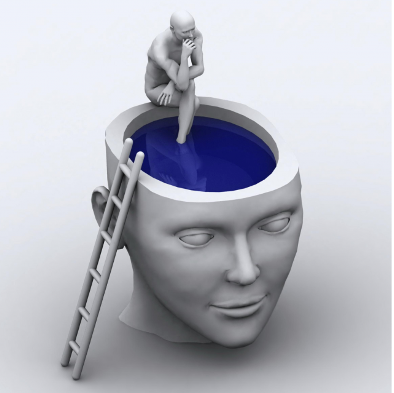

# Chapter 3: Consciousness, Drugs, Sleep, and Dreams

[//]: # (todo: add hypnosis: suggestibility, dissociation, use in pain control, psychotherapy)

Our entire subjective mental life is essentially synonymous with *consciousness* --- hence our enduring fascination with this subject.  As discussed in Chapter 1, psychology has wrestled with the challenge of subjective experience since its inception, and the stigma carried over from the behaviorist dogma against subjective experience still casts a shadow even to this day.  When you start talking about dreams and the mysterious workings of the subconscious (especially the legacy of Sigmund Freud), modern-day psychological scientists get even more uncomfortable!  Thus, we as a field know less than we probably should about some of the topics covered in this chapter, but the stigmas are slowly receding, and more and more research is being done.

As concluded in Chapter 1, we can view the +subjective and +objective worlds as two different perspectives onto the material world, not two different magical substances.  While each individual has exclusive access to their own subjective perspective, we can all work together to build a consistent objective understanding through the scientific method.  In this chapter, we build on the neuroscience foundation from Chapter 2, to understand more about the **neural correlates of consciousness** *(NCC)* and how we might somehow reconcile the subjective features of conscious experience with some objective facts about the brain.

Then, we delve into the intriguing world of altered states of consciousness induced by drugs and other factors, and then transition into the most universal state of altered consciousness that everyone can relate to: dreams!  We'll see how dreams fit into the rest of what we know about the function of sleep and the different stages of sleep, and how the brain regulates activity between sleep and arousal.  We'll also discuss *hypnosis* and whether that is considered a truly altered state of consciousness or not.

## Neural correlates of consciousness

As the chill cast over the scientific study of consciousness has thawed in the past few decades, a number of prominent theories of consciousness have emerged, most of which share a common core set of premises, even if the proponents may tend to emphasize their differences (this is how science works --- you tend to gain a lot more attention by standing out than fitting in --- *contrast* at work again).  Before we get to these core ideas, we need to be clear about some terminology and ground rules.

First, as discussed in Chapter 1 (which you absolutely need to read before proceeding!), we can productively separate the **hard problem of consciousness** from the **easy problems** [@Chalmers95].  We do this by recognizing that the hard problem, associated with +qualia (i.e., "what does it feel like?"), is inaccessible to objective science, because it is fundamentally *subjective* --- objective science requires replicable data across many observers, but every subjective experience is an N of 1 [@Nagel74].  Nothing prevents us from speculating about the connections between subjective experience and objective understanding about brains, but it would essentially be impossible to *prove* anything at an objective, scientific level.

The best vehicles for conveying subjective experience are language and art, and as these are exclusively the province of humans, establishing which other types of brains might be conscious, and what their subjective experience might be like, is thus likely impossible.  An important corollary of this is that our understanding of the term *consciousness* is inevitably shaped by our own subjective experience, and it must be acknowledged that there is no such thing as *generic* consciousness --- we can only know about *human* consciousness, and, fundamentally, about our own singular subjective consciousness.  Thus, the popular question, "which other animals, if any, are conscious?", is really asking: "to what extent is the brain of another animal like that of the human, in the ways that might matter for shaping subjective experience?"  While we can speculate about this, we will never really know for sure.

Even if we make an +AI that seems "conscious" in every objective way, we can never inhabit its subjective world, and thus can never know for sure what its subjective conscious experience is like.  However, if it starts writing heartfelt poetry, in a way that isn't just regurgitating statistical regularities in human writing (as is the case with the current generation of AI models, e.g., the otherwise impressive GPT-3 model [@BrownMannRyderEtAl20]), we might be able to capture some glimpse of the subjective world of another type of being.

### Features of Consciousness

So what is it *like* to be a human brain?  Even though we all presumably have a strong feeling that we should be able to answer that question, actually doing so in a systematic, satisfying way has proven remarkably challenging.  Early *introspectionists* like Wundt and his student Edward Titchener sought to enumerate and categorize the subjective states of consciousness, but it was precisely the difficulty in doing so that motivated the behaviorists to completely reject the enterprise.  

Modern treatments (e.g., Chalmer's list of the so-called "easy" problems) end up just listing what are essentially the main phenomenology studied by psychologists (and what we'll cover in the rest of this textbook):

* **Perception:** the ability to discriminate and categorize stimuli.

* **Attention:** the ability to focus processing on some subset, to the detriment of others.

* **Motor Behavior:** the ability to generate coordinated actions.

* **Reasoning:** the ability to integrate and organize knowledge.

* **Motivation & Control:** the goal-driven or *intentional* organization of behavior toward certain objectives.

* **Language:** the ability to verbally communicate or report on internal states, ideas, thoughts.

* **Self-awareness and metacognition:** the ability to somehow *access* internal states and be aware of being aware.

* **Wakefulness vs. sleep:** what essentially discriminates these states?  Especially in the case of dreams, this is a widely recognized challenge!

While such lists do a good job of describing what human brains do, and are useful in the medical context, they don't quite seem to capture the essential role of consciousness *per se*.  It seems like you could create a robotic system that could do all these things in a "zombie-like" manner that is essentially akin to sleep-walking: behaving and functioning in complex ways without anything that we would want to really identify as *consciousness* going on.  Indeed, many such robots now exist, and nobody is ready to ascribe true consciousness to them.

One critical interim conclusion here is that *consciousness is not a single, monolithic construct* --- it admits to many degrees or levels, and has many aspects or different facets.  Likewise, existing evidence strongly suggests that no single brain region provides the unique source of consciousness --- it cannot be simply reduced to the effects of one special magical entity (e.g., the pineal gland, as famously hypothesized by Descartes).  Instead, consciousness is almost certainly an [emergent](#emergence) phenomenon that depends critically upon neural interactions of some sort, but, just like the simple gears example from Chapter 2, it +transcends this neural substrate and cannot be simply reduced to it.

In short, maybe a brain (or AI) that is just capable of basic perception, attention, and motor behavior has some minimal level of subjective conscious-like experience, but likely it is very different in character from our full-blown, super awesome human-level consciousness.  

### Recurrent Connectivity as a Major NCC

We can zero in on this key distinction between different *levels* of consciousness within your own subjective experience, to gain some insight into the critical properties of the more full-blown conscious states.  Consider experiences when you were more "zombie-like" versus those where you were "very much aware" and "present" --- what was the critical difference?  For example, when driving down the freeway, thinking of other things in an "absent minded" manner, you may suddenly realize that you haven't been paying any attention to driving, and yet may have done fairly complex maneuvers such as changing lanes or even switching freeways etc.

This difference of being "absent" versus fully "present" seems to depend on the integrated combination of attention and awareness, with a *singular focus* of all the different parts of your brain working together.  Somehow, each part of your brain, and whatever emergent entity we ascribe as the "self", is aware of what the other parts are doing, and all are organized around a common objective.  This is often described as the **unitary** nature of consciousness.

![**Figure 3.1:** Consciousness is associated with robust recurrent processing across wide areas of the neocortex (Lamme, 2006).  (a) With just the initial +feedforward sweep of neural activity going from primary visual cortex (V1) on up, people generally do not report subjective, conscious awareness. (b) When more time has passed and +bidirectional, recurrent connections can drive activity back down through these same visual areas, people are more likely to report conscious awareness.  (c) With even more recurrent processing across more widespread areas of cortex, conscious awareness is strongly felt.  Thus, the degree of recurrent processing provides a good measure of the graded strength of consciousness.](../figures/fig_lamme06_recurrent_consc.png){ width=70% }

It is this aspect of consciousness that many neuroscience-based approaches have focused upon, and where there seems to be an emerging consensus, with terms like *global workspace* [@Baars88; @DehaeneNaccache01] and *integrated information* [@Tononi04] used to describe this ability to integrate the disparate parts of the brain together.  Perhaps the most neurally explicit theory along these lines is that **recurrent connectivity** in the brain is  necessary for this integration aspect of consciousness [@Lamme06] (Figure 3.1).  Intriguingly, this form of connectivity, where neurons in different areas have +bidirectional connections (A excites B, and B also sends excitation back to A), is almost exclusively found in the neocortex.  Furthermore, there is considerable evidence that we are exclusively conscious of neural activity in the cortex --- neural activity in  subcortical areas such as the cerebellum or basal ganglia remains subconscious (as discussed in Chapter 2) [@KochMassiminiBolyEtAl16].

The recurrent activity hypothesis also nicely accounts for **subliminal** stimuli, popularized by the [urban legend](https://www.snopes.com/fact-check/subliminal-advertising/) of *subliminal advertising*, where briefly flashed messages in movie theaters are purported to have surprisingly large effects on purchases of popcorn and Coke.  While the advertising part of this is not real (even blaringly *liminal* ads wish they could be so effective), many scientific studies have systematically varied the duration of stimulus presentation, and found that your ability to be consciously aware of the stimulus requires enough time to activate these recurrent circuits [@Lamme06].  And yes, there *are* some detectable effects of briefly flashed subliminal stimuli in these studies, e.g., being slightly faster at processing a second presentation of the same stimulus, known as *repetition priming*, but again nothing that would shape your overt behavior significantly.

In summary, it seems that our most fully conscious states depend on coordinating the firing of neurons across disparate areas of the neocortex around a common focus of attention, over a sufficiently long time period for the neurons to share their individual stories with each other.  This account "resonates" with the idea that our subjective conscious feelings emerge directly out of neural firing in the brain, but also that they are not directly reducible to this neural firing --- consciousness is perhaps the most emergent of all phenomena, requiring coordinated interactions among billions of neurons to generate enough raw emergent magic to give rise to this most amazing phenomenon in the known universe!

### Animal and AI Consciousness

According to the recurrent activity account, we can look at the brains of other animals and determine the extent to which they have the recurrent connectivity necessary to support this form of consciousness, as a way of guessing whether they may share some of this same kind of subjective experience.  Perhaps not surprisingly, our fellow primates are the closest on this score, and it would be difficult to argue that their subjective experience does not therefore resemble ours to some extent.  However, the fact that they lack language and all the amazing things that does for us and our cognitive abilities, will almost certainly make their subjective experience significantly different from ours, so it is very difficult to guess exactly how similar their level of consciousness might be.  Other mammals such as rodents have relatively little neocortex, and almost none of the critical prefrontal cortex that really broadly interconnects and coordinates cortical processing, so maybe they have a correspondingly diminished conscious awareness?

Interestingly, almost all modern neural-network-based +AI avoids any significant amount of recurrent connectivity, and the very restricted form of "recurrent networks" that are used are not capable of the kind of broad coordination associated with human consciousness.  This is consistent with the general impression that these models really lack any kind of "self awareness" or +introspection capability --- they are just massive networks of pattern transformers that can imitate the behavior of our brains to some extent, but they really lack any kind of rich internal life, which is such an integral element of human consciousness.

{ width=50% }

Figure 3.2 illustrates this key notion of +metacognition or self awareness that plausibly depends on extensive recurrent activation, so that our emergent conscious state can directly access neural activity across the brain.  In later chapters we will revisit this notion of metacognition and its various important roles in human cognition (e.g., in knowing how confident you are about a memory you've retrieved), and we will also discuss the important functional benefits of being able to integrate information across many different brain areas, e.g., for solving challenging novel problems.  Thus, consciousness is not just an interesting sideshow in the theatre of the mind --- it is very likely the main stage upon which our most advanced cognitive abilities depend, and future research on its properties and functions may be critical for making the kinds of advances needed to finally capture human-level intelligence in artificial systems.

## Altered States

As with our consideration of the different levels of consciousness experienced in normal waking, various forms of altered states of consciousness can provide important insights into the general nature of consciousness.  First, well outside the realm of normal experience, a number of studies of patients with various forms of brain damage have led to the conclusion that no particular part of the brain is essential for consciousness, except that at least some part of the neocortex must be intact.  Of course, certain brainstem areas are critical for life and for the neocortex to even function properly in the first place, but clearly the neocortex is essential.  However, no specific part of the cortex itself is essential, although higher-level association areas are likely differentially important [@KochMassiminiBolyEtAl16].

A more widely accessible source of altered states can be had by consuming various psychoactive substances, which we will describe in more detail in a moment.  From a subjective, consciousness perspective, the literature written by those under the influence of various substances, such as "The Doors of Perception" by Aldous Huxley (namesake of the band *The Doors*), provides a good illustration of how difficult it is to effectively share subjective experiences with people who have not themselves experienced something similar.  If you've had the relevant experiences, you can see what the author is trying to describe, but it is unlikely to evoke anything too sensible in someone who hasn't.  For an excellent modern account of this struggle, see this [Michael Pollan Essay (NYT)](https://www.nytimes.com/2018/12/24/books/review/psychedelics-how-to-change-your-mind.html).  Indeed, Huxley's book contains this passage aptly expressing the very impenetrability of the subjective world:

> By its very nature every embodied spirit is doomed to suffer and enjoy in solitude. Sensations, feelings, insights, fancies --- all these are private and, except through symbols and at second hand, incommunicable. We can pool information about experiences, but never the experiences themselves. From family to nation, every human group is a society of island universes. ... The mind is its own place, and the Places inhabited by the insane and the exceptionally gifted are so different from the places where ordinary men and women live, that there is little or no common ground of memory to serve as a basis for understanding or fellow feeling. Words are uttered, but fail to enlighten. The things and events to which the symbols refer belong to mutually exclusive realms of experience.

In any case, the altered states produced by psychedelics such as LSD can best be captured by the analogy of a "waking dream state" --- and indeed, these drugs have significant effects to the +serotonin system that regulates wakefulness vs. dreaming states, so this makes sense.  As such, perhaps you can imagine having a particularly vivid dream while also being in a waking state, and get a feeling for what the psychedelic experience might be like.  In objective terms, we can describe the effects in terms of perceptual hallucinations, heightened emotional states, and disordered cognition, which, perhaps not coincidently, are similar to the objective reports of the symptoms of Schizophrenia, as we'll see in Chapter 11.  These psychedelic effects contrast with the less qualitatively dramatic consequences of drugs like alcohol and +benzodiazepines, which have more "linear" effects on arousal and sedation.

Some research has attempted to connect changes in neurochemistry and receptor function to the nature of the subjective psychoactive experiences, including changes in effective inhibitory and excitatory connectivity that can give rise to characteristic features of visual hallucinations [@BressloffCowanGolubitskyEtAl02].  Thus, again, our subjective conscious states can be understood in terms of direct effects on the underlying neural substrates of the brain, but understanding these effects from the objective outside cannot directly tell us what it feels like subjectively.

### Neuromodulators and Drugs

Given their sociological, psychological and medical importance, we devote some time here to understanding the way that various well-known drugs affect the brain.  As discussed in Chapter 2, there are specific nuclei in the +brainstem *reticular activating system* that release +neuromodulators that have broad effects on wide areas of the brain.  Perhaps not surprisingly, these are the major targets of psychoactive drugs, because they have such significant modulatory effects on the brain, for example serotonin being able to shift the brain between waking and dreaming states.  By contrast, +glutamate, which is the main +excitatory +neurotransmitter in the strict sense of transmitting detailed signals from one neuron to the next, is not directly affected by most drugs, and its effects are much more local and content-specific.  +GABA, the primary +inhibitory neurotransmitter, can be considered more of a neuromodulator in that it has broader regulatory effects and is directly affected by psychoactive drugs, like the benzodiazepines.  To be clear, this difference between neurotransmitter and neuromodulator is strictly a functional distinction --- they are all just chemicals released by the +axons of neurons, but it is useful to distinguish the transmission vs. modulation roles.

Drugs can affect the brain in two opposing ways:

* **Agonists** are drugs that mimic or amplify the effect of a given neuromodulator.  This term is a bit "agonizing" because it doesn't exactly sound like what it means, but you can perhaps remember it better in relation to its opposite (antagonist).  Scientists typically reserve the term *agonist* to more precisely refer to chemicals that specifically bind to the same receptors as the +endogenous neuromodulator, but we'll adopt a looser definition that includes anything that has a net "positive" effect on the neuromodulatory pathway.  For example, *Valium* and other benzodiazepines are direct +GABA agonists by binding to the GABA receptor and enhancing the amount of *Cl-* that enters the cell, whereas *Ritalin* (+methylphenidate) enhances +dopamine effects by inhibiting the reuptake of dopamine after it is released, so it is a kind of agonist but acts more indirectly.  There are many different biochemical mechanisms that can lead to a net agonist effect.

* **Antagonists** are drugs that suppress, inhibit, or otherwise work against a given neuromodulatory pathway.  They "antagonize" that poor neuromodulator.  *Curare* poison is a well-known competitive antagonist for +acetylcholine (ACh) at the synapses of nerve fibers onto muscles, thus acting to paralyze muscles.  It acts by binding directly to the same receptors that ACh normally binds to (and it does so more effectively, i.e., with greater *affinity*), but it does *not* actually open those receptor channels, thus effectively blocking the normal effects of ACh. *Botulinum toxin* (*botox*) is also a ACh antagonist, but it works by preventing the release of ACh.

Interestingly, the neuromodulators are biologically ancient chemicals that have very different effects throughout the body, which explains why drugs often have many side-effects.  For example, ACh drives the most basic function of muscle contraction throughout the body, but in the brain it is one of those high-level control knobs affecting attention, arousal, and learning.  Dopamine receptors are also involved in lactation.  Evolution is very pragmatic in re-purposing existing technology.  Furthermore, the major players of serotonin, dopamine, and norepinephrine are all chemically very similar *monoamines*, so many drugs affect all of them to varying extents.  Thus, understanding the full effects of any given drug can be very complicated.  The following is a summary of some of the most widely-used, well-known drugs and their neural effects:

* **Caffeine** is a direct antagonist for *adenosine* receptors, which in turn are antagonistic against dopamine, and generally lead to sedation (drowsiness).  Thus, consistent with its widely known and appreciated subjective effects, caffeine directly inhibits drowsiness by blocking these sedative effects of adenosine (a double-negative of sorts), and also leads to a net increase in dopamine, producing pleasurable effects and leading to its addictive properties.

* **Nicotine** is an agonist for a type of ACh receptor (the *nicotinic* ACh receptor) that drives the +attention and arousal effects of ACh in the cortex.  This is consistent with the stereotypical chain-smoking author or detective using nicotine to enhance their ability to focus and concentrate.

* **Alcohol** (ethanol) has complex effects on neurons, that vary with dose and over time.  It acts as a GABA agonist, increasing levels of inhibition, which accounts for its psychological effects in reducing anxiety, causing sedation, and reducing "behavioral inhibition" as discussed earlier.  It also antagonizes the binding of glutamate to the NMDA receptor, which is involved in learning as we'll see in the Learning chapter.  Both the GABA and NMDA effects combine to impair learning in the hippocampus, leading to memory blackouts.  Indirectly, it also has some effects on +dopamine, causing potential for +dependence.

* **Benzodiazepines** (Valium, Xanax, Midazolam, etc) are widely-used GABA agonists, which, like alcohol, reduce anxiety, cause sedation, and generally turn off the brain to varying extents.  If you've ever had surgery, you've likely had Midazolam, which knocks you out and prevents you from remembering anything.  In low doses, Midazolam has been used in scientific studies to produce a reversible hippocampal amnesia-like condition, due to the heightened sensitivity of the hippocampus to the effects of GABA.

* **Amphetamine** (speed, Adderall) is an agonist for both +norepinephrine (NE) and +dopamine, increasing release and actually reversing the +reuptake process so that there is more of these neuromodulators in the synapse.  Both of these neuromodulators affect attention and learning, consistent with the observed behavioral and cognitive effects, summarized as +stimulants.  Adderall is used for treating people with +ADHD, which is somewhat paradoxical given the "hyperactive" component of this disorder.  However, it is likely that NE acts to keep people actively engaged for a longer time, "locking in" a given set of frontal control signals and preventing the characteristic distractability of ADHD [@Aston-JonesCohen05].

* **Cocaine** is similar to amphetamine in both biochemical and psychological effects.  It has a specific inhibitory effect on *dopamine transporter (DAT)* that is responsible for +reuptake of dopamine, thus producing a net agonist effect on dopamine (leaving more in the synapse).  These direct effects on dopamine likely play a critical role in its addictive properties, as it simulates the effects of rewarding outcomes, in a way that circumvents the natural *contrast* mechanisms that discount rewards in proportion to expectations [@Redish04]. 

* **SSRIs** (Prozac et al) affect +serotonin function by inhibiting the process of reuptake of the neurotransmitter after it has been released (i.e., *serotonin-specific reuptake inhibitors*).  This allows serotonin to linger longer, and potentially have a larger effect.  However serotonin is so incredibly complex at multiple levels, that nobody really understands exactly what is going on, and we really can't be sure if it is an agonist or an antagonist.  For example, serotonin (and all the other neuromodulators) have negative feedback mechanisms that strongly regulate the amount released, and it is possible that blocking reuptake causes these feedback mechanisms to over-react, thus leading to a net reduction in serotonin release over time.  Furthermore, different serotonin sub-nuclei within the +raphe have contradictory effects, with some promoting positive emotional states and others having the opposite effects.

* **Psychedelics** (LSD, psilocybin, peyote, etc) all have primary effects on the +serotonin system, which, among its many talents, is important for regulating sleep.  The simplest explanation for the effects of these substances is that they effectively produce a waking dream state --- dreams have similar characteristics to psychedelic experiences in terms of heightened emotional states and disorganized cognition driven by loose associative connections instead of the more controlled, willful, goal-directed states that characterize waking cognition.  The reasons for these effects can be directly connected to the effects of serotonin on different brain areas, as we discuss in the next section.

* **Cannabis** (Marijuana) is a unique case where the drug activates +receptors and associated +endogenous neurotransmitter systems that were previously unknown, and have only relatively recently been discovered as a direct result of studying the effects of the drug.  Thus, the receptors and endogenous neurotransmitters are known as *cannabinoid* receptors and *endocannabinoids*, and now that we have the tools to identify these things, they turn out to be found all over the body, like all the other more well-known neuromodulatory systems.  However, unlike these other systems, the reason we never knew of these cannabinoid systems before is that they don't have a central nucleus that releases them --- instead they are produced locally in cell membranes, and have a very localized signaling role, by sending messages *backward* across the +synapse (i.e., from +dendrite back to +axon, instead of the usual other way around).  The detailed function of these systems is still relatively unknown, and represents an exciting frontier in current research, well-timed with the recent legalization of this interesting substance in a number of different US states and other countries.

* **Opioids** (heroin, morphine, fentanyl) are agonists for the endogenous +opioid system, involved in regulating the neural response to pain stimuli.  Opioid receptors are found in the +amygdala, basal ganglia, +hypothalamus, and thalamus, and this explains the strong emotional, euphoric effects of these drugs.  These substances are widely believed to be the most addictive of all drugs.

In summary, these drugs are jacking right into the global control knobs in the brain provided by the existing neuromodulatory pathways, and, significant societal issues notwithstanding, afford a critical window into understanding how our brains function normally: your endogenous states of arousal, excitement, sedation, etc are all controlling these very same knobs.  Some of these psychoactive drugs, such as caffeine, alcohol, and nicotine are very widely used (and abused), and there have been increasingly urgent discussions about the ethics of performance-enhancing drug use in schools (e.g., the stimulants), which is on the rise.  To what extent is this like doping in sports, or should we instead consider it more like using a calculator or a computer: something that augments our native biological abilities to the general betterment of society, etc?  What is your opinion?

### Hypnosis and Meditation

The peculiar case of +hypnosis provides a particularly interesting and challenging puzzle for psychology and neuroscience --- is there some kind of strange altered state of consciousness at work here?  As you have undoubtedly seen depicted in various media, an *induction* procedure (typically involving a swinging pocket watch in the movies) can cause people to enter a trance-like state, where they become highly susceptible to suggestions from the hypnotist, performing unusual behaviors without resistance or complaint.  What is this trance-like state, and how can our brains be so easily hijacked?  First, it is important to appreciate that there are significant individual differences in susceptibility to hypnosis, with only about 10% of people being highly suggestible.

There have been a number of theories as to exactly what is going on in these hypnotized individuals, and various neuroimaging studies that have attempted to test these theories, but a clear understanding and reliable results remain elusive.  The only reliable brain region to emerge across a recent +meta-anlysis was the *lingual gyrus* [@LandryLifshitzRaz17], which was not predicted existing theories, and is a relatively under-studied brain area, which nevertheless does have intriguingly broad connectivity [@PalejwalaDadarioYoungEtAl21].  Furthermore, attempts to find other other correlations associated with highly suggestible individuals have come up empty-handed [@DienesBrownHuttonEtAl09].

From a subjective perspective, hypnotized individuals report feeling that the suggested actions are taking place "on their own" --- somehow, the hypnotist is able to disrupt the normal sense of internal cognitive control, and most theories involve trying to understand these differences in locus of control.  Thus, it seems that hypnosis may have much to tell us about the role of the +self-model in cognitive control, which we will discuss in later chapters.  Perhaps it is a critical hub for constructing and maintaining the +self-model? 

Another case of trance-like altered states comes from *meditation* practices, which involve controlled breathing and focused concentration that can bring about heightened levels of attention and relaxation.  Interestingly, some studies have also found involvement of the mysterious lingual gyrus in these cases as well [@FarbSegalAnderson13; @TangMaFanEtAl09].  It is also possible that these hypnotic and meditative trance states involve some element of dream-like brain activity patterns superimposed on an otherwise waking state, caused by deep levels of relaxation that are common to both techniques.  Interestingly, it is somewhat difficult to tell the difference between REM sleep and awake brain states via objective neuroimaging measures, indicating that perhaps we lack the relevant tools to measure the relevant differences that are otherwise quite salient subjectively.

## Sleep and Dreams

Even beyond the mystery of dreams, sleep itself is a fascinating topic that raises so many questions, and also presents critical everyday challenges for many people.  A large number (35-40%) of people in the USA do not get enough sleep [@LiuWheatonChapmanEtAl16], and yet research increasingly shows how important sleep is to health and longevity.  But I worry that this very research, and its popular dissemination (e.g., Matthew Walker's popular [TED talk](https://www.youtube.com/watch?v=5MuIMqhT8DM)), may actually be having a deleterious effect, by making people even more anxious about sleep, and thus leading to more insomnia!  Sleep is one of those few ancient, biological things that our conscious mind cannot directly control, and thus it presents a frustrating paradox: the more you *try* to fall asleep, the less capable you are of actually doing so.  Nevertheless, the positive side of all the current sleep media is the sharing of many *indirect* ways of enhancing sleep, such as exercise, diet, and meditation / mindfulness strategies that really do work.

One of the most effective sleep strategies in my family was due to an article I read many years ago, suggesting that **neuropeptide S** (*NPS*, a more localised, specialized neuromodulator in the brainstem) may be responsible for the circadian fluctuations in how brave vs. afraid different animals are.  We noticed how our cats were such "fraidy cats" during the day, but were always wanting to go out and explore at night.  I speculated that this must be due to neuropeptide S, with cats being nocturnal.  So we told our young boys about this, and how when they were trying to fall asleep but experiencing all these anxious thoughts and feelings, they were just like the fraidy cats during the day.  And when they wake up in the morning, all those nighttime fears will melt away in a flood of NPS!  Just by knowing the neural basis, and circadian timing, of these fearful thoughts, it provides a significant measure of reassurance, and a mindfulness-like ability to put those thoughts in their proper perspective.  It is just your brain trying to make sure you don't go out at night and do something foolish like getting eaten by a saber-tooth tiger!  And it looks like this NPS story is holding up, with it playing important roles in both sleep regulation and anxiety (in the amygdala, seat of both fear and positive emotions) [@ChauveauClaverieLardantEtAl20; @TillmannSkibdalChristiansenEtAl19; @JunglingSeidenbecherSosulinaEtAl08].

In addition to **insomnia**, which most people experience at least a few times, and can be debilitatingly severe, there are a number of other more rare sleep disorders, such as **narcolepsy** (sudden onset of sleep during the day --- famously prevalent in dogs), persistent **sleepwalking** or **night terrors**, and **REM sleep behavior disorder** which involves acting out violent dreams physically while remaining asleep.  These sleep disorders are recognized in a special category of the **DSM-5** (*Diagnostic and Statistical Manual of Mental Disorders*, 5th edition, of the *American Psychiatric Association*), when persistent and impairing quality of life (see Chapter 11 for more discussion).

### Functions of Sleep

Perhaps the most persistent and puzzling question about sleep is why organisms do it in the first place?  It seems like such a colossal waste of time!  Sleep is found in most animals, indicating its broad importance.   As usual, everyone wants to find *the* single reason for sleep, but there are clearly many different essential functions of sleep, including:

* Recharging metabolic batteries and building proteins and other molecules that form the body's infrastructure.  These are the *anabolic* pathways, where molecules are built up, as compared to the subsequent *catabolic* breakdown of these molecules, e.g., when bursts of energy are required.

* Repair and learning in the immune system --- reductions in sleep are associated with impaired immune function.

* Protein synthesis and other anabolic processes in neurons, which can "solidify" or *consolidate* information learned during the day.  Interestingly, we'll see in Chapter 5 that learning in the synapses connecting neurons (which is where knowledge is encoded in the brain), requires the buildup of *actin* proteins, which are also a critical ingredient in muscles.  Thus, your brain is very much a muscle (this is not just a popular metaphor), and sleep helps stabilize its critical synaptic connections.  There is a large and growing body of literature showing that memory can significantly improve after a good night's sleep [@KlinzingNiethardBorn19], as we'll see in Chapter 6 on memory!

The importance of sleep has been starkly demonstrated in experiments where some rats kept continuously awake eventually died (after 5, 13, and 33 days), while all other sleep deprived rats suffered obvious effects of lack of the above processes, looking very sickly and shriveled [@RechtschaffenGillilandBergmannEtAl83].  However, contrary to popular mythology, *people do not die from sleep depravation*, and the world record is somewhere around 11 or 18 days depending on the standard of authenticity.  As you become increasingly deprived of sleep, your brain will automatically engage in *microsleep* episodes, providing some of the benefits and preventing the worst consequences.

### Sleep Stages

{ width=75% }

In addition to there being many benefits from sleep, sleep itself is a multifaceted process consisting of 4 different stages, each with deeper, slower brain waves (Figure 3.3). These stages unfold over a roughly 90 minute cycle progressively through the night.  It is easiest to wake during the higher stages, and much more difficult and disorienting to wake during the deepest, slow-wave stages.  It is during these deep slow-wave stages when most of the above repair and rebuilding steps take place, and so these are "prioritized" at the start of sleep, with progressively longer REM phases through the later sleep cycles.

Doing the math, a 5-cycle night of 90 minute cycles is about 7.5 hours, and it may take roughly 30 min to actually fall asleep, so that accounts for the typical 8 hours of recommended sleep for adults.  You can get a device that synchronizes your alarm to your brain waves or other sleep signals such as motion sensors, to avoid waking you in deep sleep, producing a better wakeup feeling.  You can also just set your alarm in 90 minute multiples relative to when you expect to actually fall asleep (if you happen to know that!).  Entraining your body to regular sleep cycles by going to bed at roughly the same time every night is also a good way to get solid sleep, and if you plan that to work with the 90 minute cycles, you should feel consistently well rested.  Isn't that better than doing that one more thing before bed!?

The progressive slowing of brain waves across stages of sleep was nicely leveraged in the must-see Christopher Nolan movie *Inception*, with the idea that the slower brain waves translate into a compression of time.  This is an oft-reported feature of dreams, that many events seem to be compressed into a relatively short period of "waking time".  Technically speaking, you would actually need *faster* internal brain waves to explain this phenomenon, but don't let that detract from your enjoyment of the movie!  A more plausible explanation for these time dilation effects, suggested by [Nolan himself](https://www.imdb.com/title/tt1843886/) is that dreams tend to jump around quickly, so it may seem that much has happened, without having all the intervening time actually passing (just like in movies!).

The brain mechanisms driving sleep and arousal involve key roles for the +hypothalamus down low in the brainstem (which is also responsible for most other basic bodily functions) and the +thalamus as it interconnects with the cortex.  In effect, the thalamus shuts off the flow of sensory inputs, and motor outputs to / from the cortex, and it is also important in driving the slower rhythms associated with sleep stages.  This cutting off of input / output connections is important for preventing sensory inputs from overly activating, and thus awaking, the cortex, and for preventing all those crazy dream states from actually being acted out (unless you suffer from REM sleep behavior disorder or sleepwalking, which are associated with incomplete blockage by the thalamus).

While there are 4 distinct sleep stages, most cognitive neuroscience research focuses on the differences between **slow-wave-sleep (SWS)** (stages 3 & 4) versus **rapid-eye-movement (REM)** sleep, which are where most of the time is spent.  People woken from SWS report dreaming about 50% of the time, while in REM that figure is about 80%, so dreaming happens in both of these stages, contrary to popular belief that REM is the exclusive province of dreaming.  However, dreams in REM sleep tend to be more vivid, bizarre and "dreamlike" [@HobsonPace-Schott02], so REM is still the primary dreamtime.

In terms of the memory and learning effects of sleep, various sources of data suggest that, during SWS, your +hippocampus is effectively teaching the neocortex about things it has learned, while REM sleep may drive more localized, cortically-specific synaptic changes (while your subjective self is off somewhere free-associating) [@HobsonPace-Schott02; @DiekelmannBorn10; @KlinzingNiethardBorn19].  This idea that the hippocampus trains the cortex makes sense according to computational models of learning [@McClellandMcNaughtonOReilly95], and it may depend in part on sharp-wave ripple events taking place during SWS that originate in the hippocampus and propagate outward from there [@Buzsaki89].

### The Function of Dreams

Another ubiquitous question about sleep and dreams is whether dreams have any specific function, outside of the above-listed functions of sleep more generally?  You have probably heard about Sigmund Freud's famous obsession with dreams as a way of working through unresolved subconscious tensions (typically of a sexual nature), but there is not much direct modern scientific evidence about such hypotheses.  One attractive modern idea is that dreams are just the reflection of the memory replay effects described above [@Wamsley14].  Interestingly, the jumbled, random, bizarre nature of dreams may actually be beneficial in this memory consolidation process, to transform specific episodic memories into more flexible semantic knowledge where all the different parts of an episode are broken down and made available as separable mix-and-match elements [@McClellandMcNaughtonOReilly95].

{ width=75% }

One of the most important neuroscience findings about brain activity during dream states is shown in Figure 3.4, demonstrating that your *prefrontal cortex* is the cortical brain area most deactivated during REM sleep [@HobsonPace-Schott02].  Thus, every night, we all get the benefit of experiencing a full frontal lobotomy!  This then makes a lot of sense in terms of the jumbled bizarre nature of dreams: without the +frontal executive task-master keeping the rest of the brain focused on a single current objective, the +posterior cortex is left to its own devices, freely associating through its dense webs of interconnected networks of knowledge.

This freedom from executive control is probably important for enabling creativity to flow, consistent with many examples of insights obtained in the dream state.  For example, the chemist Kekule reported discovering the ring shape of benzene from a daydream of a snake biting its own tail.  It is interesting to speculate further that individual differences in the strength of frontal control during the waking state may be critical for differences in creativity too --- for example the stereotypical "artistic type" is someone who is not particularly organized or reliable, suggesting reduced frontal executive control.

Another feature of the dreaming brain state is that the +amygdala is typically more active (in part due to the deactivation of neuropeptide S), which would make sense of the increased level and intensity of emotional states typically experienced during dreaming.  Furthermore, as we discussed earlier, psychedelic drugs act by driving some of these same brain changes seen during dreaming, and they also feature increased amygdala activation, and frontal deactivation, producing similar increases in emotional significance from everyday things and events, and an overall disorganization and inability to maintain coherent trains of thought.

Finally, we complete our own circle of ideas here and return to the question of consciousness in the context of the dream state.  What can the state of consciousness during dreaming tell us about our normal waking conscious state, and about the nature of consciousness more generally?  First, we can see that the subjective properties typical of dream states are well correlated with known changes in brain activity during the different sleep stages, further establishing this direct connection between subjective, conscious states and the underlying neural substrate.  However, despite some promising initial reports, it is not clear if more detailed electrical signatures of neural activity recorded in the scalp EEG can predict when a person has been dreaming or not during SWS [@WongNoreikaMoroEtAl20].  Thus, the relationship between brain states and dreaming may be more emergent and complex than can be effectively measured using these EEG signals.

So how do we know whether "life is but a dream" anyway?  Well, if you try to use the scientific method while dreaming, and conduct replicable scientific experiments, you'll likely fail (spectacularly).  If you're like me, you'll just completely forget about the experiments after a bit, and wonder why those people from high school showed up so unexpectedly.  I'm always failing to even catch a flight, which I lapse into and out of remembering that I'm late for.  Thus, the fact that, during the waking state, we *can* successfully do science, seems like at least a pretty sensible indicator that these two states differ in important ways.

Whether the waking state is all just within some crazy big simulation remains a further, probably unanswerable question.  But having created many virtual worlds for my computer models of the brain to inhabit, creating a simulation that can withstand the extreme distances and scales penetrated by modern astronomy and physics experiments would be challenging to the point of extreme implausibilty, in my opinion.  Maybe you and Elon Musk have a different opinion, but anyway, that's why subjectivity is primary.

## Summary of Key Terms

This is a checklist of key terms / concepts that you should know about from this chapter.  As we'll learn in the memory chapter, it is a great idea to test yourself on what was said about each of these terms, and then go back and double-check --- that provides both beneficial repetition and also the *testing effect*.

* Neural correlates of consciousness
    + Hard problem vs. easy problems
    + Unitary nature of consciousness
    + Recurrent connectivity / processing
    + Subliminal processing

* Drugs:
    + Agonist: activates, enhances neurotransmitter / receptor function
    + Antagonist: inhibits, suppresses neurotransmitter / receptor function
    + Caffeine: adenosine
    + Nicotine: ACh
    + Alcohol: GABA
    + Benzodiazepines: GABA
    + Amphetamine: norepinephrine
    + Cocaine: dopamine
    + SSRI: serotonin
    + Psychedelics: serotonin
    + Cannabis: cannabinoid
    + Narcotics: endogenous opioid

* Sleep & Dreams
    + Neuropeptide S
    + Functions: recharging, rebuilding, immune system, learning consolidation
    + Disorders: insomnia, narcolepsy, sleepwalking, night terrors, REM sleep disorder
    + Stages: slow-wave-sleep vs. rapid-eye-movement (REM)
    + Hypothalamus, thalamus role

