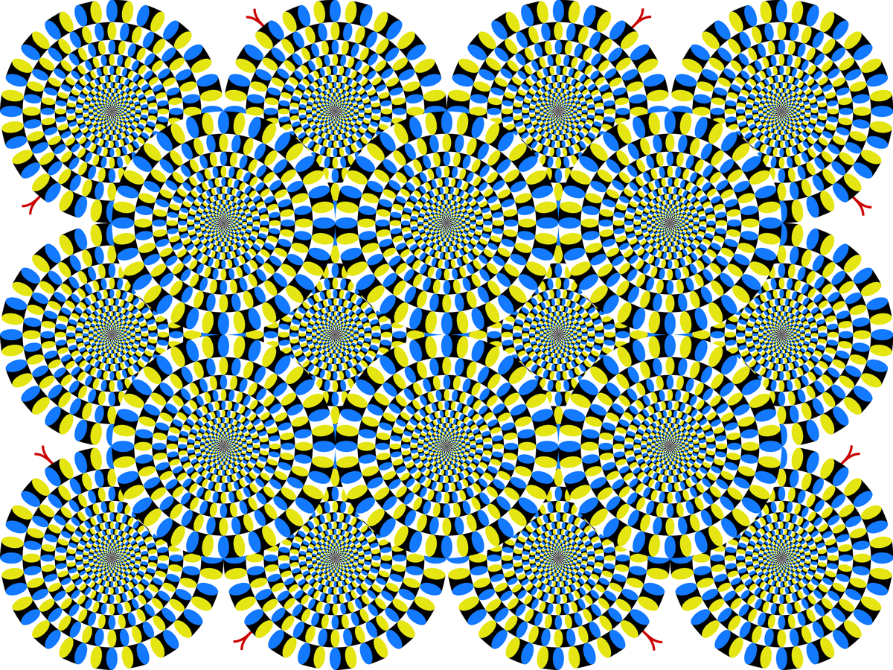
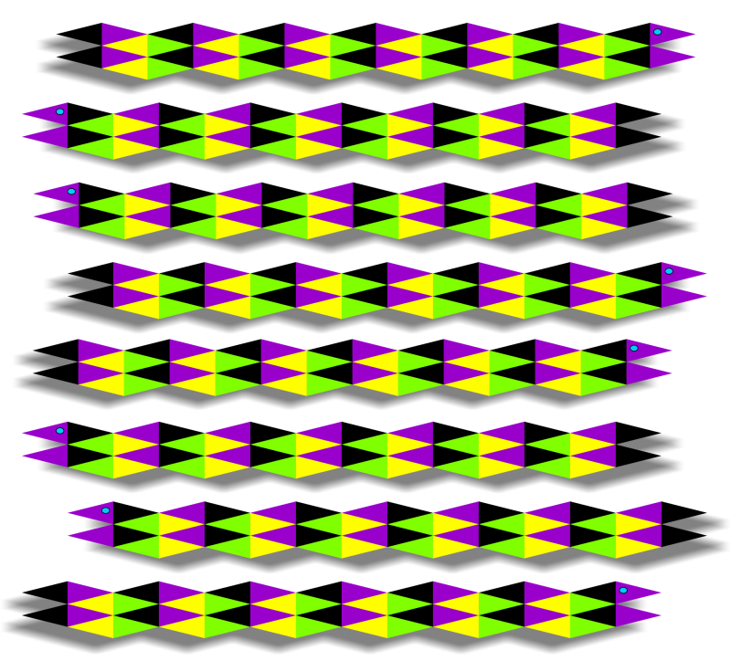
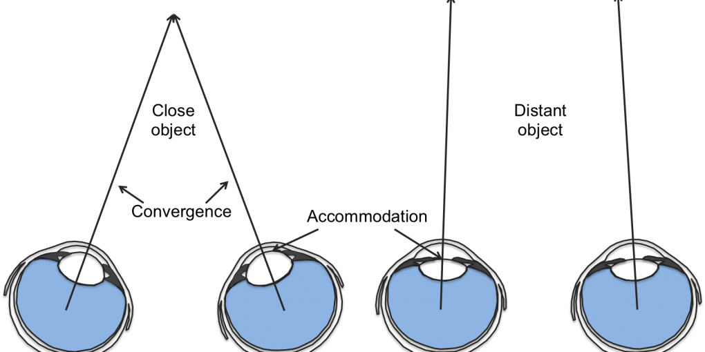
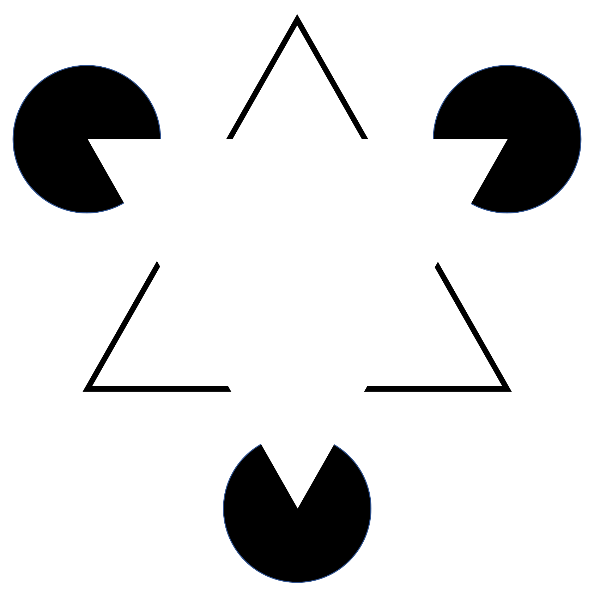
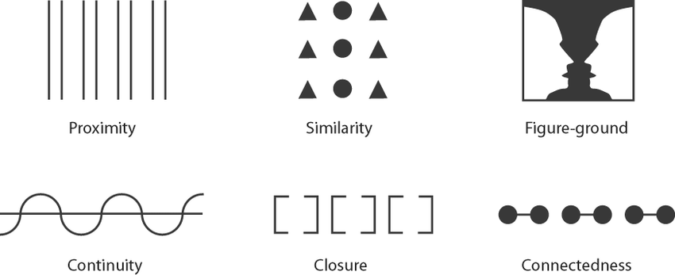

# Sensation, Perception, and Attention {#sec:ch-perc}

Channeling my hard-boiled teenage son, he would say: "Dad, why are you writing a whole `!@$#%ing` chapter about *seeing* --- you just look and you *see* `sh*t` --- what's the big deal!"  This is, actually, quite accurate.  I mean, it is what he would say (this has been confirmed), and it is also what makes this chapter a bit more challenging: we all just take perception for granted, because from our subjective perspective, it does just happen, preconsciously, and we are only aware of the results.  From a *compression* standpoint, that's about all you need to know, right!?  It just works, so get on with it!

Nevertheless, despite the potential futility of the exercise, I will persist in trying to convince you that perception is amazing and fascinating, and give you some sense of how it works, and why roughly 50% of your massive neocortex is required to solve this "trivial" problem.  We'll start by understanding the key *compression* process that gives us such a simple, direct perception of the world, and how we can start to pull back the curtain on this amazing wizard, to see some of its deeper secrets, using the magic of *illusions*.  Then, we'll discuss many aspects of sensation and perception in the context of our dominant sense: vision, followed by discussion of the remaining sensory systems.  Finally, we'll consider how *attention* emerges from the basic properties and dynamics of neurons in the brain, and how important it is for further compressing and filtering the firehose of incoming sensory signals, to capture just the right information for whatever it is that we're currently trying to do.

## Perception is (Hierarchical) Compression

The tendency to underestimate the complexity of perception has been around for a long time: there is a famous story about how, at the dawn of +AI research in the 1950's, a random graduate student was tasked with solving the vision problem over the summer, so they could plug it into the rest of the system next year.  Needless to say, it didn't happen, and in fact it is only in the last 5 years or so that AI systems finally have semi-functional perceptual front-ends.  You have likely experienced these AI systems in the speech recognition domain, when talking to Siri or other similar digital assistants: they often work but still make some basic mistakes, and they *definitely* don't seem to really understand what you are saying at any deeper semantic level, but that's another issue.

The trick to getting these AI systems to finally work was to adopt the strategy that the brain uses, by employing large networks of simulated neuron-like processing elements, organized over many +hierarchical layers (i.e., "deep" [neural networks](#neural-network)).  These networks are trained by a learning mechanism known as +backpropagation, which was developed by psychologists in the 1980's to better understand many properties of human cognition and learning [@RumelhartHintonWilliams86; @McClellandRumelhart86].  A few important computational tricks made these networks work better and faster [@LeCunBoserDenkerEtAl90], and the advent of fast computer chips developed for video gamers enabled these networks to be dramatically scaled up in size, resulting in significant performance improvements [@KrizhevskySutskeverHinton12; @LeCunBengioHinton15].

![Hierarchical organization of detectors in the visual pathway going into the temporal lobe, supporting the ability to recognize (detect) entire objects, based on earlier levels detecting parts and features of parts.  This shows the large-scale, cumulative effects of *compression* from very high-dimensional raw sensory inputs, to high-level, succinct interpretations of the world.  Although a highly simplified cartoon, this roughly captures the nature of the process actually taking place in the brain.](../figures/fig_category_hierarch_dist_reps.png){#fig:fig-hierarchy-detect2 width=100% }

The essential strategy learned by these deep neural networks, and the brain, is shown in [@fig:fig-hierarchy-detect2] (we already saw this figure in [@sec:ch-neuro]), where each layer **compresses** the complexity of the patterns on the layer before: *getting rid of irrelevant differences, while extracting the important ones that the system actually cares about.*  This is the essential function of perceptual systems, served by the 10,000-to-1 compression property of individual neurons that are detecting relevant patterns and ignoring irrelevant ones.

To use another metaphor, you can think of perception as a **filter**, filtering out irrelevant "junk" from the perceptual input signal, and purifying the relevant, important stuff.  It takes multiple layers of such filters because one step of filtration can only do so much purification, and each such layer builds on the partially-purified outputs of the layer before.  This is why it takes so many neurons in the brain, and in the AI models, to do a good job at perception --- each individual neuron can only do a small part of the overall job.

## We See the "Real" World, not Raw Sensation

Our subjective, conscious experience is dominated by the higher levels of this hierarchical perceptual filtering system, because that is what most strongly and directly interconnects with all the other brain areas, and this process of bidirectional communication and influence across brain areas is what drives consciousness as we discussed in the previous chapter.  These higher layers are called **association cortex** because they "associate" with all these other brain areas.

{#fig:fig-the-answer width=50% }

This is the reason for my son's hard-boiled attitude about perception: by the time we're aware of it, perception has already done all the hard filtering and compression work for us, and we just experience this nice simple impression of what is out there in the world!  Interestingly, we nevertheless seem to retain a bit of a sneaking feeling that our perceptual systems might be hiding something interesting from us, e.g, in the popular notion of the "doors of perception" being blown wide open by psychedelic drugs and other such experiences (e.g., [@fig:fig-the-answer]).  Somehow, we feel like we want to be able to break through all those filters, and see the world as it "truly is".

However, the truth (represented by the mirror on the white table in [@fig:fig-the-answer]) is that our perceptual systems do a really amazing job of delivering a highly accurate representation of the world --- there is no greater truth than what your eyes deliver to you, tirelessly, every moment.  So look in the mirror and behold the truth!  And, if you really want to get a different perspective, try a magnifying glass or, better yet, a microscope.  That will reveal the separate Red, Green, Blue (RGB) dots in your laptop or cell phone display, which combine at different strengths to give you a perception of different frequencies of light.  We'll discuss how this works later in the chapter.

{#fig:fig-checker-shadow2 width=50% }

In perceptual science, the fact that our perception is of the world, not the raw sensory signals that our perceptual systems receive from our sense organs, is referred to as **perceptual constancy** in general, with more specific versions such as **color constancy**, **size constancy**.  [@fig:fig-checker-shadow2] (which we saw already in the Introduction) provides a powerful demonstration of color constancy, where the exact same raw pixel RGB values are perceived as strikingly different shades, based on our ability to integrate the various elements of the scene into a coherent overall interpretation, including the effects of lighting and shadows, and the regularity of the checkerboard pattern.

![a) "The Dress", which sparked a viral internet sensation in February, 2015, because different people have strongly divergent perceptions of the dress colors.  Some see it as black and royal blue, and others as white and gold.  b) Shows an explanation for the two different interpretations, with a gold vs. blue filter over the two different colors of underlying dress --- these filters correspond to different assumptions your brain makes about the overall lighting in the picture, which is really behind the individual differences.  Similar to [@fig:fig-checker-shadow2], it is hard to convince yourself that the colors within these filtered boxes are actually identical across the left and right boxes, but they are. (Figure design by Kasuga~jawiki; vectorization by Editor at Large; "The dress" modification by Jahobr, CC BY-SA 3.0, [wikimedia.org](https://commons.wikimedia.org/w/index.php?curid=59279133.))  c) The "objective" RGB colors sampled from the original image, which in isolation are clearly gold and blueish.](../figures/fig_the_dress_explained.png){#fig:fig-the-dress width=100% }

Perhaps the most striking and popular demonstration of the divergence between raw sensory input and subjective perception is from "The Dress", which was a viral internet sensation in 2015 ([@fig:fig-the-dress]), because people experienced very divergent yet strongly felt percepts of the dress colors.  From a raw RGB perspective ([@fig:fig-the-dress]c), the dress colors are gold and blue, but studies show that 57% of people see it as black and blue, while most of the rest see it as more white and gold.  [@fig:fig-the-dress]b shows how two different color filters (gold on the left, blue on the right) produce identical stimulus-level color values for the two different dress colors that people report seeing.

In this case (and always), the visual system is just making different **assumptions** about the lighting conditions present in the picture, and because the cues for these lighting conditions are ambiguous, different people's brains make different assumptions.  If your brain assumes that the dress is in shadow and strongly backlit, the blue filter applies (and you see the dress as white and gold), whereas if you assume it is brightly lit by direct sunlight, the yellow filter applies (and you see it as blue and black).  Critically, your subjective percept is irrevocably "colored" by those assumptions, in an attempt to tell you what the *real* underlying color of the dress is, independent of the specific lighting conditions.

This is the way in which your perception is more real than your raw sensation --- most of the time it is amazingly accurate in telling you what the *real* materials (and shapes, sizes, etc) of things are in the world.  And if you see the dress as blue and black, apparently you see it as it really was, but one of the most striking aspects of this picture is that it is very hard for people to switch to seeing it the other way, and I personally am forever stuck on white and gold.

The fact that our perceptual systems need to make these assumptions sets them up for the inevitable *ass-u-me* situation (i.e., making an ass out of u and me): **illusions** reveal the nature of these assumptions, and are thus a fun and informative way to understand how the perceptual system works, under the hood.  Some lucky researchers basically spend their entire day just coming up with new illusions (although this is increasingly less viable of a career path these days, as the chances of finding truly new illusions are dwindling).  Anyway, this is certainly the approach we're going to take for the rest of the chapter, so buckle up and get ready to see some crazy stuff!

Before we go there, however, it is important to point out that the current generation of AI models discussed above almost certainly do *not* "see" the world in the way we do.  There is nothing in the way that these models are trained that would cause them to make the same kinds of assumptions necessary for the color constancy demonstrated in the above figures.  Furthermore, they are typically strictly +feedforward in their processing of the sensory input --- raw image pixels go straight up the hierarchy, without any higher-level interpretations of the scene coming back down to influence the way these lower levels process things.  By contrast, the mammalian visual system is massively [bidirectionally](#bidirectional) connected, and the +top-down connections from higher levels to lower levels is critical for enabling the overall scene-level information to so strongly affect our basic perception of the elements of the scene, as is so well demonstrated in [@fig:fig-checker-shadow2].

Extensive neural evidence shows how these top-down processes shape the firing of neurons throughout the visual system, all the way down in primary visual cortex (V1) [@LeeYangRomeroEtAl02; @AngelucciBressloff06].  And there are some neural network models with bidirectional connectivity, which demonstrate simple versions of these kinds of top-down phenomena [@OReillyWyatteHerdEtAl13], but considerable more work needs to be done to capture something like [@fig:fig-checker-shadow2].  There is a further important question for AI models of perception: what kind of learning signal might cause the model to encode the stable features of the world instead of the raw sensory features?  One idea is that the brain may learn by trying to predict what will happen next, and the stable, predictable things in the world are therefore what is learned (more on this in [@sec:ch-learn]).  By contrast, existing AI models are typically trained to label the category of objects in a scene, using massive human-labeled datasets --- in effect, they are just learning to imitate one small part of the human perceptual filtering process.

## Sensory Systems

Now that we have a sense of some of the big-picture issues and challenges in perception, we will dig into some of the more specific details about different sensory systems, so we can understand how it all works.  As you undoubtedly already know, we have 5 major sensory modalities, which we have reliable and salient conscious awareness of.  However, there are two other important sensory pathways that are critical for motor control, that we are not as aware of, likely because they are typically activated by our own motor actions, so we don't experience them as distinct from these actions.  A number of other sensory modalities exist in other animals, including echolocation in bats, whiskers in many different types of animals, and magnetic sensing in a range of animals, especially birds.

{#fig:fig-modalities width=100% }

[@fig:fig-modalities] shows the basic facts about each of these sensory modalities, including what physical **stimulus** activates them, the names of the receptor(s) that **transduce** (convert) this stimulus into a neural signal, and how that neural signal makes its way into the cortex by way of the thalamus.  Interestingly, our sense of smell, which is evolutionarily the most ancient sense, present in even the most primitive beasts in the ocean, bypasses the thalamus and jacks straight into the cortex, in a brain area that is close to the hippocampus.  This may explain why odors can be such powerful memory triggers, as famously captured in Marcel Proust's *Remembrance of Things Past*.

The **subcortical** part of the sensory pathway, prior to the arrival of the neural signal in the thalamus and cortex, performs significant **preprocessing** of the signal using complex, sophisticated, and evolutionarily pre-wired circuits.  For example, the subcortical auditory pathways have very fast spiking neurons that can process the tiny time differences between when a sound arrives in one ear versus the other, to extract the angle of the sound source relative to the head.  This angle signal is then sent up to the cortex, which otherwise is way too slow to be able to pick up on these fine timing differences.  Many other forms of initial processing of the sensory signal are performed across different modalities, as we discuss below in the context of each such modality.  In general, these subcortical processing steps also perform the first pass of **compression** and **contrast**, which also makes the cortex's job significantly easier.  Many of these forms of subcortical processing are well-enough understood to be implemented in signal processing toolkits implemented in computer software.

The role of the thalamus in the sensory pipeline is somewhat less clear.  A unique feature of the thalamus is that the neurons there have essentially no direct connections amongst themselves, and generally seem to just pass the signal through to the cortex relatively unchanged (hence its characterization as a *relay*).  However, the thalamus receives massive numbers of top-down connections from its corresponding sensory cortex (e.g., more than 90% of connections in the LGN come from V1), suggesting that a major function of the thalamus is in supporting *top-down modulation* of the incoming sensory signal.  For example, this can support **attention**, where these top-down cortical signals "shine a spotlight" on a subset of incoming sensory signals --- we return to this topic later in the section on Attention.

## Vision

![The visual pathway.  Light rays reflect off of objects, which could be either in the left or right visual field, and proceed through the lens of the eyes, onto the retina at the back of the eyeball.  The photoreceptors there transduce the light into electrical signals, which are then transformed through a relatiely complex network within the retina itself into the firing of the retinal ganglion cells.  These cells send their axons to the LGN of the thalamus, crossing over at the optic chiasm so the full left visual field ends up going to the right hemisphere, and vice-versa.  The LGN neurons then communicate the visual signal up to area V1 in the very back of the brain, in the occipital lobe, and from there it makes its way back forward up the hierarchy of compression and filtering as shown in [@fig:fig-hierarchy-detect2]](../figures/fig_vis_optic_path.png){#fig:fig-visual-pathway width=50% }

[@fig:fig-visual-pathway] shows the pathway of visual information, from light rays reflecting off of objects in the world, that are then focused by the lenses of your eyes onto the **retina** at the back of the eyeball, where the light is transduced (converted) from photons into electrons by **photoreceptor** cells (rods and cones), in very much the same way that the camera in your cell phone does it.  Speaking of which, your eye has roughly 120 megapixels (i.e., 120 million photoreceptors), but they are not distributed uniformly as they are in your camera ([@fig:fig-megapixels]).  Instead, there are many more **cones** (color sensitive photoreceptors) in the center of your retina, called the **fovea**, with the density falling off rapidly as you go out from this center into the **perhiphery**, where the monochromatic, motion-sensitive **rods** predominate.  If you do some math about *visual angles* as shown in [@fig:fig-megapixels], the fovea can resolve about 300 dots per inch (dpi), which is the resolution of current high-res displays like those found on most higher-end cell phones.  Thus the "retina" marketing from Apple is actually accurate.

![How many megapixels is your eye?  First, unlike a camera, the photoreceptors are concentrated in the very center of your retina, called the **fovea**, which is also where most of your color-sensitive **cones** are (left panel).  Out in the **periphery**, monochromatic **rods** predominate --- they are also better at detecting motion, so you are actually better at seeing things move when you're not looking right at them.  The right panel shows that we can resolve about 300 dots per inch (dpi) at a distance of 10 inches, which is not coincidentally the "retina" screen resolution on modern high-res displays, and even on old-fashioned laser printers. ](../figures/fig_vis_retina_cone_rod_dpi.png){#fig:fig-megapixels width=100% }

While the rods do not resolve multiple different colors, and have lower resolution, they are much better at detecting **motion**, and thus it can be useful to actually look away from something to detect motion better.  Cats seem to know this trick, and will look away from the mouse playing dead (or the cat toy playing dead, more likely), to better detect when it starts to move.  Or maybe they are just communicating disdain.  Hard to know with cats.

There are several crazy-but-true things about the visual system:

* The rod and cone photoreceptors are at the very *back* of the retina, behind a bunch of extra pre-processing circuitry that does the compression and contrast enhancement.  There are also blood vessels all over the place.  Apparently they don't end up blocking the light too much, or distorting its path, but still.  Also, as shown in [@fig:fig-megapixels], there is a huge chunk of visual space, about 1 degree of visual space in diameter (same as the fovea), which has no photoreceptors at all!  This is the so-called **blind spot** where the axons for the optic ganglion cells (i.e., the *optic nerve*) are all gathered and head back to the thalamus.  

    You can find this spot (if you haven't already), by moving your outstreched arm with thumb pointed up, out to an angle of about 12:30 or 1 o'clock (where 12 is straight ahead), and noticing where, now that you're paying attention, you see it disappear!  You don't notice it normally because, as we've said already, your perception is about the world, not your raw sensory signals, so your brain just papers over that little hole there for you, using all the signals surrounding it.

{#fig:fig-inverted width=50% }

* The photoreceptors are constantly active (*depolarized*), and light actually *inhibits* them, instead of turning them on, as you would otherwise expect.  Why this is the case seems to still be a mystery --- it is not true across the animal kingdom, so it could go the other way.  Interestingly, there are *many* instances like this across the brain, where neurons are *tonically* (continuously) active and then get inhibited by relevant signals.  Although you would think this would cost a lot of energy, and the brain does consume about 1/3 of the human body's energy budget, the actual amount of energy required to sustain neural firing is likely a small fraction of this total cost (all the maintenance and upkeep and building of synapses, etc is likely much more expensive).

* Everything in the retina is upside-down and backward relative to the world ([@fig:fig-inverted]).  This is a result of basic optics, as evident in [@fig:fig-visual-pathway] tracing the light rays from the world, through the lens, and into the retina.  Do you need any more convincing that we see the world and not our raw sensory stimulus?  Through experience in the world, we quickly learn the very systematic relationship between patterns of neural firing in the retina, and the direction of gravity, etc, and this is then what we perceive.  This lesson is really important more generally: all neurons communicate with spikes that are essentially identical to those from any other neuron --- they do not come with extra "annotations" indicating things like "up" or "down" --- so each neuron has to learn *de novo* the meaning of each of its inputs in relation to all the others.  This is also why it is actually quite possible that you are a brain in a vat (as in the *Matrix* movie) --- everything we know is encoded in these patterns of neural spiking, and we only make plausible inferences about the most "reasonable" interpretation of all these patterns.

    Also, if you want to know why mirrors only flip left and right, but not top and bottom, check out this video by [Physics Girl](https://www.youtube.com/watch?v=vBpxhfBlVLU) who provides a comprehensive explanation.  Basically, mirrors only reflect, they don't flip anything --- we just get confused when looking at a reflection, because it shows us as we would look if we were facing ourselves from a point on the other side of the mirror.  Careful not to fall into the looking glass!

### Compression and Contrast in Vision

{#fig:fig-retina width=50% }

![Diagrams of the receptive fields for on-center vs. off-center versions of center-surround cells.  The receptive field (RF) is the region of illumination that directly influences the firing of a given neuron.  The on-center neuron is excited by light in a smaller center region, and inhibited by light in the wider surrounding ring, while the off-center is the opposite.  This center-surround organization is critical for *compression* by reducing or eliminating firing where the light is constant (uniform) across the entire RF (the excitation and inhibition balance out below the spiking threshold in the tug-of-war inside the neurons).  Such neurons only respond to regions of *contrast* in the image, where there is a transition (*edge*) between a darker and lighter level of illumination, thus compressing the signal sent to higher levels.  Edges contain the most important visual information.](../figures/fig_on_off_rfields_edge.png){#fig:fig-center-surround width=50% }

Despite all the weirdness, the retina works really well, and one of the most important things it does is to **compress** and enhance **contrast** in the visual signal, before it is converted into neural spikes and sent through the **retinal ganglion** cells up to the LGN of the thalamus.  [@fig:fig-retina] shows some of the preprocessing circuits that achieve this compression and contrast enhancement, through a feature known as **center-surround** contrast, which is illustrated in more abstract form in [@fig:fig-center-surround].  Here's how it works:

* There are two main types retinal ganglion output neurons: **on-center** and **off-center**.  Each of these cells has a target-like **receptive field** (RF) that defines the region over which light will affect the firing of the neuron, with a central circle surrounded by an outer ring --- light falling into one of these regions excites the neuron, while the other inhibits it.  Now can you guess how the on-center neuron responds?  Yep, it is excited by light falling into the center region of the target, and inhibited by light falling in the surround (outer ring), while the off-center has the opposite pattern of responding (see [@fig:fig-center-surround]).

* Recall from [@sec:ch-neuro] that each neuron is sensitive to the *contrast* or relative balance between its excitatory and inhibitory inputs, in terms of the tug-of-war inside the neuron, with the inhibition pulling down using $Cl-$ chloride ions and excitation pulling up using $Na+$ sodium ions (see [@fig:fig-tug-of-war] from [@sec:ch-neuro]).  In these ganglion neurons, if there is an equal amount of light on *both* the center and the surrounding ring, then this balance point is *below* the +threshold for spiking, and no signal is communicated.  This is what happens when there is *uniform* lighting across then entire receptive field, e.g., when staring at a blank wall.  After all that, the key point is that this contrast coding in the retina prevents your brain from getting excited about blank walls!

* Instead, the ganglion cells only get excited at *edges* (or particularly well-placed polka-dots that just hit the center and not the surround), where there is a *different* amount of light on the center vs. the surrounding ring (as shown in [@fig:fig-center-surround]).  It turns out that most of the relevant information about our visual world comes from these edges --- edges define the shape of objects, letters --- everything!  So it makes sense that already in the retina, these most relevant features are being preferentially extracted, enabling the amount of information communicated along the optic nerve to be greatly compressed by removing all of those boring empty spaces in the visual input, and only sending along the edges.

* Interestingly, in this case, and many others, *contrast* based processing in the neuron also helps with *compression* --- by only responding to areas of contrast, the retina can greatly compress the image.  Higher up in the visual system, the funnel-like property of neurons working to categorize shapes and objects does a lot more compression (as we'll see in a bit), not based on contrast per se, so it isn't like the two are equivalent, but they can work together nonetheless.

* The example of going from bright sunshine to a dark room, which we talked about to illustrate the principle of contrast in earlier chapters, applies directly to these retinal ganglion neurons.  Because each neuron is responding to the relative balance of excitation and inhibition in the center vs. surround, it doesn't make much difference when both of these are increased or decreased by the same amount --- again, the neuron is only sensitive to the *relative* differences.

* Finally, why are there separate on-center and off-center neurons?  Any idea?  Both of these are needed because neurons only send a *positive-valued* signal: they either spike or they don't, but there is no such thing as a *negative spike*.  Thus, if you didn't have both on- and off-center cells, you could either signal areas where the center was brighter than the surround, or darker, but not both.  In general, the brain uses this same strategy in many different cases, for example firing spikes for both the onset of a sound, and for the offset.  Basically, anything that the brain needs to respond to must be encoded in terms of spikes, so it must encode the *absence* of something (e.g., the absence of light) using positive rates of spiking.

![Simple cells in primary visual cortex (V1) combine multiple center-surround inputs from the LGN to form *edge detectors* that encode a consistent, elongated edge or transition in illumination across an image.  This is referred to as the *classical receptive field* for V1 neurons, and its discovery by Hubel and Weisel in the 1950's and 60's won them the Nobel prize!  The JPEG compression technique for pictures works by extracting these same kinds of oriented edges of contrast in images, and it greatly reduces the number of bits of information needed to encode large images.](../figures/fig_v1_simple_dog_edge.png){#fig:fig-v1-simple width=30% }

In summary, your retina is already quite a sophisticated bit of neural computing machinery, getting the compression and contrast process started right away.  The primary visual cortex (V1) then builds on the center-surround signals coming from the LGN (which passes them along from the retina more-or-less intact), to detect more elongated, oriented edges of light / dark *contrast* in the image ([@fig:fig-v1-simple]).  Hubel and Wiesel discovered this property of V1 neurons by recording from V1 neurons in anesthetized cats shown simple images of oriented bars of light, and won the Nobel prize in 1981 for this and other discoveries about the visual system.  Here's a [YouTube Video](https://www.youtube.com/watch?v=KE952yueVLA) about their work, and a more modern approach using [reverse correlation](https://www.youtube.com/watch?v=n31XBMSSSpI).  These oriented edge detectors are shown in [@fig:fig-hierarchy-detect2] as the starting point for even more complex patterns detected at higher layers in the visual system.

Thus, in addition to seeing upside-down and backward, we mainly see the outlines or edges of things, and essentially assume the continuation of surfaces in between these edges.  This may explain why we so readily process line drawings, which provide a good "illustration" of what our higher visual areas are largely processing.  The efficiency of encoding the visual world in this way is demonstrated also by the widely-used JPEG compression standard, which greatly reduces the size of image files using a similar strategy.

In summary, vision provides clear, well-understood examples for how the brain compresses incoming signals to extract features that will be of greatest value for subsequent stages of processing.  In this and many other cases, this compression occurs by focusing on the key points of *contrast* --- where things are changing.  This principle of contrast also applies to the time domain as well --- all stages of visual processing are also particularly sensitive to changes over time, such as the onsets and offsets of illumination caused by motion.  This is particularly true of the rod-driven motion processing pathways, which dominate in the cat visual system, and explain why cats are so captivated by moving laser pointer dots.

### Color Contrasts

![Color is encoded by receptors sensitive to different wavelengths of light (just barely different in the case of M and L) which are paired into two sets of opponents: red (L = long wavelength) vs. green (M = medium wavelength) and blue (S = short wavelength) vs. yellow, which is created by the combination of red and green, and is not provided by its own separate photoreceptor.  Luminosity (black vs. white) is coded by integrating across all receptors, including rods which have a more blue-shifted tuning.](../figures/fig_vis_color_tuning_opponents.png){#fig:fig-color width=70% }

In addition to coding illumination contrasts at edges, the visual system is also tuned to contrasts between different wavelengths of light, which forms the basis for color vision ([@fig:fig-color]).  Color is efficiently encoded in the brain by using only three different types of cone photoreceptors, which can span the entire spectrum of visible light by mixing these three elements in different relative strengths, just as a painter can mix a wide range of colors from a small set of primary colors.  Although we commonly think of these **primary colors** as Red, Green and Blue (RGB), [@fig:fig-color] shows that the Red and Green detectors are surprisingly overlapping in their response to different frequencies.  For this reason, and because of their wide tuning, scientists refer to these photoreceptors as L = long wavelength (Red), M = medium wavelength (Green), and S = short wavelength (Blue), but we'll stick to the more familiar primary color names.

For the same reason that center-surround coding produces effective compression and contrast-enhancement, the brain also encodes color using color contrasts, using two **opponent** pairs of colors: Red vs. Green, and Blue vs. Yellow.  Indeed, these color contrasts are often superimposed with the center-surround contrasts, such that e.g., the center responds to Red and the surround Green.

{#fig:fig-rot-snakes width=70% }

{#fig:fig-mov-snakes width=50% }

A number of visual illusions reveal the underlying color opponency at work in our visual systems, such as those in [@fig:fig-rot-snakes, @fig:fig-mov-snakes], which interact with the constant motion of our our eyes to create apparent motion where there is none (see [Akiyoshi Kitaoka's Web Page](http://www.psy.ritsumei.ac.jp/~akitaoka/ICP2016.html) for many other such demonstrations).  Other illusions involve staring at one set of colors and then looking at a white page, wherein the fatigue caused in the one pair of the opponent allows the other to get a bit more active, driving its perception.  [This illusion](https://www.youtube.com/watch?v=gur-_IGV7F8) provides a compelling set of illusory percepts based on red vs. green opponency.

Despite the presence of these "oopsie" cases in carefully-crafted illusions, the color opponent system normally enables us to make highly accurate inferences about the "real" colors of different objects, compensating for the impact of different lighting conditions.  This is known as *white balance* in photographic terms, and in the brain it depends on the ability of e.g., a preponderance of yellow activation from yellow lighting producing a compensatory accentuation of the blue opponent, which we could see at work in "The Dress" illusion discussed at the outset.

### Depth

Our retinas only provide a 2D window onto the full 3D world, so we have to rely on a number of assumptions to reconstruct that missing 3rd dimension --- these assumptions then provide a treasure trove of illusions that can keep you entertained for hours!  This missing 3rd dimension of depth is an important example of the *ill posed* nature of perception, which is a mathematical description of a situation where you have more unknown variables than data points available, so you have to rely on extra constraints or assumptions.

There are two major categories of **depth cues** used to reconstruct the missing 3rd dimension:

{#fig:fig-convergence width=50% }

* **Binocular** cues that depend on the **parallax** effect, where the left and right eyes receive slightly different views of the world based on their different horizontal positions.  The use of these two views to extract depth is known as **stereopsis** (same root as "stereo", and same effect as stereo sound).  There are two forms of these binocular cues: the **retinal disparity** (differences) across the left and right eye views of the same general region of visual space (enabled by the cross-over and combination of different-eye views into the same visual hemisphere, as shown in [@fig:fig-visual-pathway]), and the **convergence** of the two eyes to focus the center of vision at the same point in depth ([@fig:fig-convergence]).

   These binocular cues give the most vivid sense of 3D depth, and are what 3D movie and TV technologies provide, by being able to project different images to the two eyes, either by using different color filters (red vs. blue, as in the old 1950's 3D glasses) or different polarization of light (the current generation of 3D glasses).  3D technology has generally remained a bit of a "fad", not nearly as important as color, because we have so many other cues to depth (and the glasses can be uncomfortable, and they cut the image brightness in half).

   [@fig:fig-autosterogram] shows an *autostereogram* or single-image stereogram, which is a version of a *random dot stereogram*, popularized by the *Magic Eye* books several years ago.  To see depth here, you have to adjust your eye convergence outward ("wall eyed", focusing well beyond the image plane itself), causing each eye to see a different offset of the random dots in the image.  These offsets across the two eyes are the *retinal disparity* signal, and the fact that you can see depth with *only* this retinal disparity signal was a big deal when first discovered by Bela Julesz in 1959.  When you (eventually) get just the right eye position, a previously-hidden 3D world gradually materializes out of the sea of random dots!  This takes a lot of practice and patience --- see this [wikipedia page](https://en.wikipedia.org/wiki/Autostereogram) for more info and examples.

{#fig:fig-autosterogram width=100% }

* **Monocular** cues, which operate strictly within a single 2D image, include **occlusion** (one object in front of another), **relative size** (larger = closer), **texture gradients** (also including local surface texture indicating convex and concave shapes), and **linear perspective**, as shown in [@fig:fig-monocular-depth].  There are many others, especially if you include motion, which can give strong depth signals.  One can trace a progression in art over centuries in terms of the use of these cues to create a perception of depth, with occlusion, relative size, and texture gradients being among the earlier ones, while the use of linear perspective was revolutionary in  the renaissance period.  Modern-day sidewalk artists employ these techniques to great effect ([@fig:fig-sidewalk-art]).

{#fig:fig-monocular-depth width=70% }

{#fig:fig-sidewalk-art width=50% }

### Compression in Object Recognition

{#fig:fig-clouds-toast width=50% }

As illustrated in the hierarchical filtering process from [@fig:fig-hierarchy-detect2], every stage of processing in the perceptual pathways (and everywhere in the cortex more generally) produces more and more compression and contrast effects like those we've seen already, starting right in the retina itself.  Thus, you should not be surprised to learn that the brain has a strong bias toward organizing the features in an image into a much simpler, compressed encoding in terms of *objects*.  Saying "its a dog" represents a massive degree of compression relative to all the visual information that goes into the image of a typical dog.  This bias toward seeing known objects in images is behind the common "mild hallucination" of perceiving objects where none exist, for example in the shapes of clouds, wood grain, toast --- whatever has enough raw material to organize into objects ([@fig:fig-clouds-toast]).

![An image of a plate of spaghetti transformed by Google's Deep Dream neural network algorithm that progressively enhances features of the image consistent with what it has learned across a large number of "normal" images.  This produces hallucinogenic images similar to those seen on LSD and other psychedelic drugs, reflecting the imposition of our simplifying biases onto images --- just a more extreme form of [@fig:fig-clouds-toast]](../figures/fig_vis_deep_dream_spaghetti.jpg){#fig:fig-deep-dream width=50% }

[@fig:fig-deep-dream] shows the output of a [neural network](#neural-network) model trained on millions of photographs, when the input image (a plate of spaghetti in this case) was progressively altered in a way that better fit the internal biases of the model.  These images resemble the kinds of hallucinations produced by psychedelic drugs such as LSD, suggesting that these drugs have the effect of enhancing the influence of internal representations over the raw input stimuli.  Thus, we are all mildly hallucinating all the time, and the waking dream state produced by these drugs just accentuates these processes.

{#fig:fig-dalmatian width=50% }

[@fig:fig-dalmatian] demonstrates the important benefits of this bias to "see things" in images --- more often than not, there actually are things there, which might be obscured in various ways, and having the ability of top-down expectations and biases to influence our perception helps pull these things out [@OReillyWyatteHerdEtAl13].

{#fig:fig-kanisza-triangle width=25% }

The classic **Kanisza triangle** ([@fig:fig-kanisza-triangle]) provides another demonstration of this bias toward seeing a simpler, more compressed encoding of the world.  These kinds of effects have traditionally been explained in terms of **gestalt principles**, developed by a school of influential German school of psychologists in the early 1900's to explain how we tend to impose higher-level *gestalt* groupings onto images ([@fig:fig-gestalt]).  From the modern perspective, the attempt to explicitly enumerate long lists of such "principles" seems like a mismatch relative to the way that top-down and bottom-up *constraints* or *biases* interact in a more graded, emergent way in actual perception.  These biases and constraints are much "softer" and more "fluid" than things you might articulate as "principles".

{#fig:fig-gestalt width=60% }

And speaking of soft, fluid images, the artwork of Salvador Dali provides an excellent illustration of the hallucinogenic top-down biases at work, trying to organize and simplify the world ([@fig:fig-dali]).

{#fig:fig-dali width=100% }

{#fig:fig-the-cat width=30% }

[@fig:fig-the-cat] shows a simple but powerful demonstration of the +bidirectional interactions among different levels of the compression hierarchy, in this case between letter-level and word-level processing.  Consistent with an early neural network model by James McClelland and David Rumelhart, we automatically interpret letters in a way that is consistent with their surrounding letters, in terms of the words they spell [@McClellandRumelhart81].  Thus, higher word-level information is feeding back to support consistent letter processing at the lower level, and incremental updates at both levels act to mutually inform and constrain the overall interpretation.  This is known as **multiple constraint satisfaction** in interactive, bidirectionally-connected networks, developed further in models by physicist John Hopfield [@Hopfield84].

### Time Contrast: The Novelty Filter

Another very important form of *contrast* that drives perception is **contrast over time** --- i.e., "the news" --- the visual system prefers new stimuli and new ways of seeing things.  In other words, it functions as a **novelty filter** --- filtering out the old and focusing on the new.  Like compression, this happens at all levels in the system, from the retina on up, based in part on the **adaptation** / **accommodation** / **fatigue** property of all neurons, as discussed in [@sec:ch-neuro].  If the same level of excitatory / inhibitory input is maintained over time, a neuron will progressively fire fewer spikes over time, in effect getting "bored" with that same-old signal.  If a different neuron that has not recently been excited then gets new inputs that excite it to the point of spiking, it will tend to spike more frequently, thereby drawing more attention to these new inputs.

In the retina, if you prevent the eye from moving at all, and present a static image, the firing of retinal neurons will slowly start to fade away, and the world will go black.  This experiment has actually been conducted by paralyzing the eye muscles!  The various color opponency illusions mentioned earlier also demonstrate this novelty-filter property, where staring at one color causes those color coding neurons to fatigue, such that the opponent color is relatively more activated.

{#fig:fig-necker-cube width=80% }

[@fig:fig-necker-cube] demonstrates a higher-level version of the neural adaptation that drives these novelty filter effects.  If you stare at these images for long enough, you will find your brain spontaneously switching to a new way of seeing the image, without any explicit attempt on your part to do so.  In fact, it is difficult to prevent your brain from switching in this way --- because it is built right into the neural hardware.

## Audition

{#fig:fig-auditory width=80% }

Because the same principles just explored for the visual system apply to all of the other sensory modalities, and it is harder to share the relevant perceptual experiences via a book, we spend significantly less time on these other modalities.  Indeed, the very same neural network AI models that work for vision also work well for auditory signals (after the subcortical-level preprocessing has been performed, which remains very modality-specific), and a landmark experiment showed that re-routing visual inputs into auditory cortex in a ferret resulted in the development of standard visual neural responses in auditory cortex [@SurGarraghtyRoe88].  Thus, we focus primarily on the way that the sensory signals are transduced in each of the remaining senses, starting with audition, which is easily our next most important sense.

[@fig:fig-auditory] shows the essential features of the auditory transduction process, where sound waves are converted into neural firing, via *hair cells* in the *cochlea*, as follows:

* First, sound travels as *waves* of changing air pressure --- no air, no sound (which is violated by nearly every space movie).  These waves can be described in terms of **amplitude** (intensity --- i.e., differences between peak and trough air pressure) and **frequency** or **wavelength** (pitch, which we hear as low vs. high tones).  These vibrating sound waves cause the **ear drum** to vibrate (like a drum!) and this vibration is then amplified by tiny bones (*ossicles*: Malleus, Incus, Stapes --- no you don't need to memorize these!) that cause your inner squid (the liquid-filled **cochlea**) to vibrate in tune with the sound.  Inside the cochlea are only about 3,500 inner **hair cells** that are responsible for transducing the liquid vibrations into neural firing signals.  This is an incredibly tiny number of *anything* at the cellular level --- your hearing is precious and you should do everything you can to preserve those priceless cells!

* The cochlea transforms the time-varying sound waves into a much more useful format for how the brain likes to encode information, where different frequencies of sound are encoded by different hair cells, known as **place coding**.  This is similar to how different frequencies of light are encoded by different neurons in the visual pathway --- in general the brain likes to have different neurons detecting different signals, so having distinct neurons detecting and signaling the different frequencies is much more useful than keeping this signal in its original form as oscillations.  Furthermore, the higher frequencies are way too fast for neocortical neurons to process over time, going up to 20,000 vibrations a second (Hz).

![A spectrogram, plotting the intensity (power) of different sound frequencies on the vertical (Y) axis, over time on the horizontal (X) axis.  Human speech is typically characterized in terms of the low frequency bands known as *formants* as shown, which result from the different configurations of the vocal tract, and are apparent in the spectrogram with distinctive trajectories over time.  Thus, speech recognition depends on detecting these patterns in the place-coded spectrogram, similar to how vision detects patterns in an image.](../figures/fig_spectrogram_formants.jpg){#fig:fig-spectrogram width=80% }

* Mathematically, this place coding of frequency is effectively the same as performing a *fourier transform* of the original sound waves, resulting in a **spectrogram**, typically plotted with time on the X axis and frequency on the Y axis ([@fig:fig-spectrogram]).  By splitting out different frequencies across different neurons, it becomes easier to recognize patterns across these frequencies --- e.g., the distinctive patterns of human speech, called *formants* that are characteristic patterns of frequency changes over time, as shown in the figure.  This pattern recognition process in speech is very similar to the process of pattern recognition in images, which is why the same kinds of higher-level cortical pathways and principles apply to both.

In short, after the subcortical auditory pathways transduce and transform the sound signal into something like a spectrogram, the auditory cortex does the same kind of compression and contrast processing of the auditory signals, extracting simpler ways of summarizing all of the sound information through a series of hierarchical layers.  At the upper levels, which we are consciously aware of, we have things like "Max wants a banana", summarizing a long complex auditory stimulus with a relatively few bits of information.

An important finding in auditory speech perception, known as the **McGurk effect**, demonstrates that our different sensory modalities are constantly interacting, much in the same way as the multiple constraint satisfaction demonstration from [@fig:fig-the-cat].  In the McGurk effect, a video of a person saying one word is combined with the audio of that person saying a different word, and often the participant perceives a third word that represents an attempt to combine the auditory and visual signals [@McGurkMacDonald76].  This shows that we are all implicitly lip readers, and indeed other studies show that we gain significant robustness in speech perception by simultaneously doing lip reading.  This is also a demonstration of the benefits of pervasive +bidirectional connectivity throughout the cortex, so that all relevant information can be brought to bear on interpreting sensory inputs.

## Other Senses

For the time being, please refer to [@fig:fig-modalities] for the relevant basic information about the other senses.

## Attention

{#fig:fig-attention width=30% }

In addition to all the compression described so far, there is another critical driver of compression effects in perception, known as **attention**.  Subjectively, attention is often described as a **spotlight**, shining a bright mental light on one, or at most a few, items in the current *attentional focus*, which also has the effect of pushing everything else off into the shadows.  Like compression, attention operates everywhere in the cortex, and can be understood in terms of basic features of the circuits and neurons there.

[@fig:fig-attention] shows how attention emerges from the interactions between **bidirectional excitation** and **inhibition** among neurons [@CohenRomeroFarahEtAl94].  Top-down and bottom-up excitation provide the basic drivers of attention, either or both of which can tip the balance in favor of what gets the current focus, while inhibition creates a competition among various things that could be in focus, strongly limiting the total scope of what can be in focus (most typically just a single focal item).  This inhibition also automatically pushes everything else out into the shadows.  Not coincidently, this bidirectional excitation is the same central ingredient in consciousness that we discussed in [@sec:ch-consc] (aka *recurrent* processing) --- the focus of attention typically corresponds to what we are consciously aware of.

There is a special part of the brain, in the *parietal lobe*, that seems to be particularly important for **spatial attention** (i.e., paying attention to different parts of space), which has been extensively studied.  Although attention itself is ubiquitous, spatial attention is particularly important in perception because discrete objects tend to occupy different regions of space, and thus we tend to use this spatial attentional focus as a way of directing attention at different objects of interest.  This special role for spatial attention is also directly tied to the fact that the very same neural circuits in the parietal lobe are used for deciding where to move our eyes.  Thus, attention is typically synonymous with *looking*, and the motor action of looking (moving the eyes) requires working with the spatial coordinates of where to look.

![Demonstrations of hemispatial neglect.  Upper left: Progression of self portraits by an artist with hemispatial neglect, showing gradual remediation of the neglect over time.  Right: Drawings of given target objects by patients with hemispatial neglect, showing profound neglect of the left side of the drawings.  Lower left: Results of a line bisection task for a person with hemispatial neglect. Notice that neglect appears to operate at two different spatial scales here: for the entire set of lines, and within each individual line.](../figures/fig_neglect_all.png){#fig:fig-neglect width=50% }

Some of the most striking evidence that the parietal cortex is important for spatial attention comes from patients with **hemispatial neglect**, who tend to ignore or neglect one side of space ([@fig:fig-neglect]). This condition typically arises from a stroke or other form of brain injury affecting the right parietal cortex, which then gives rise to a neglect of the left half of space (due to the crossing over of visual information).  Interestingly, the neglect occurs across multiple different scales, as shown in the line bisection task, where lines on the left side of the entire image tend to be neglected, and also each individual line is bisected more toward the right, indicating a neglect of the left portion of each line ([@fig:fig-neglect]).  This remarkable finding (which has been seen in many different studies in various ways) shows that attention is a very dynamic thing that can zoom in and out and move around over time, all the while using the same neurons (with the same effects of damage evident).  Moreover, these neglect effects even operate on memories, such that people neglect things on the left side of an imagined scene or object (e.g., when just imagining a clock and reading off numbers).

### The Posner Spatial Cueing Task

![The Posner spatial cueing task, widely used to explore spatial attention effects. The participant is shown a display with two boxes and a central fixation cross --- on some trials, one of the boxes is cued (e.g., the lines get transiently thicker), and then a target appears in one of the boxes (or not at all on catch trials). The participant just presses a key when they first detect the target.  The typical data plotted on the right, showing that the target detection reaction time is quicker for valid cues vs. invalid ones.  This suggests that spatial attention was drawn to that side of space. Patients with hemispatial neglect exhibit slowing for targets that appear in the neglected side of space, particularly when invalidly cued.](../figures/fig_posner_task_data.png){#fig:fig-posner width=70% }

One of the most widely used tasks to study the spotlight of spatial attention is the Posner spatial cueing task, developed by Michael Posner [@Posner80] ([@fig:fig-posner]).  One side of visual space is cued, and the effects of this cue on subsequent target detection are measured.  If the cue and target show up in the same side of space (*valid* cue condition), then reaction times are faster compared to when they show up on different sides of space (*invalid* cue condition).  This difference in reaction time (RT) suggests that spatial attention is drawn to the cued side of space, and thus facilitates target detection. The invalid case is actually worse than a neutral condition with no cue at all, indicating that the process of reallocating spatial attention to the correct side of space takes some amount of time. Interestingly, this task is typically run with the time interval between cue and target sufficiently brief as to prevent eye movements to the cue --- thus, these attentional effects are described as *covert attention*, while eye movements constitute *overt attention*.

Patients with hemispatial neglect show a disproportionate increase in reaction times for the invalid cue case ([@fig:fig-posner]), specifically when the cue is presented to the good visual field (typically the right), while the target appears in the left.

## Psychophysics

One of the oldest areas of research in psychology is known as **psychophysics**, which goes back to the 1860's and the work of Gustav Fechner, and concerns the relationship between perception and the detailed physical properties of a stimulus.  One of the main questions of interest here is the *threshold* level of stimulus intensity that can just barely be detected, which tells us how sensitive our sensory systems are, as summarized in [@fig:fig-modalities] in terms of the **absolute threshold**.  A key issue in determining this threshold is in coming up with an appropriate definition of what it means that a stimulus can be detected --- what if you can't quite detect it all the time, but still most of the time --- does that count?  The widely adopted convention has been to use a *50% probability of detection* for the threshold, such that half the time you detect it and half the time you don't.

We can also determine the **discrimination threshold** or **just-noticeable difference** (*JND*), which is how big of a *difference* between two different stimuli that can be reliably detected (again typically at the 50% probability level).  One of the most exciting results in psychophysics is that this JND is a function of the intensity of the stimuli, and the famous **Weber's Law** (named for Ernst Weber who discovered it back in the 1830's) says that it is a constant proportion of the intensity.  For example, if people can detect differences in fairly dim lights of say 5 percent relative to the brightest of the two lights, then to detect differences in much brighter lights, the raw differences must also be much larger, exactly in proportion to the increased intensity of the lights.  This proportion (e.g., 5% in this example) is known as the **Weber fraction**.  Weber's Law is exactly what the *contrast* coding of neurons would predict --- neurons respond to the *relative* balance of inputs coming in, and when you scale those inputs up or down in strength, then it is really just the percent difference that matters for a neuron's firing.

## Summary

This chapter has a lot of detailed information, but the overarching theme of *compression* and *contrast* hopefully comes through.  Your brain is wired to be a *simplicity filter* and a *novelty filter*, delivering the simplest interpretation of a complex pattern of sensory input, and focusing on what is new and different.  These same processes, which can be tied directly back to the properties of neurons as explained in [@sec:ch-neuro], operate throughout your brain, at all levels, shaping how you perceive other people (in terms of simplifying stereotypes) and the world (always seeing out news, and quickly discounting the past).  Thus, perception truly is a window onto the soul, and we return to these lessons throughout the remainder of the textbook.

## Summary of Key Terms

This is a checklist of key terms / concepts that you should know about from this chapter.  As we'll learn in the memory chapter, it is a great idea to test yourself on what was said about each of these terms, and then go back and double-check --- that provides both beneficial repetition and also the *testing effect*.

* Hierarchical compression
    + Filtering
    + Raw sensation vs. subjective perception

* Perceptual constancy
    + Color constancy
    + Size constancy
    + Assumptions, illusions

* Sensory systems
    + Physical stimulus, transduction, subcortical preprocessing
    + Vision, rods, cones, retina, LGN, V1
    + Audition, hair cells, cochlea, MGN, A1
    + Olfaction, hair cells, ofactory epithelium, olfactory cortex
    + Gustation, taste buds, papillae, VPN, Insula
    + Somesthesis, free nerve endings

* Vision
    + Retina, periphery, fovea, photoreceptors, blind spot
    + Cones for color, rods for motion
    + Center-surround contrast detectors
    + R,G,B primary color photoreceptors (L,M,S)
    + Red-green, blue-yellow opponent color coding
    + Binocular depth cues: retinal disparity, convergence
    + Monocular depth cues: occlusion, relative size, texture, linear perspective
    + Object, top-down biases, hallucinations, Kanisza triangle, multiple constraint satisfaction
    + Gestalt principles
    + Time contrast: novelty filter, adaptation etc

* Audition
    + Amplitude, frequency, wavelength
    + Ear drum, cochlea, hair cells
    + Place coding, spectrogram
    + McGurk effect
    
* Attention
    + Spotlight, bidirectional excitation and inhibition
    + Spatial attention in parietal lobe: Hemispatial neglect
    + Posner spatial cuing task

* Psychophysics
    + Absolute threshold
    + Discrimination threshold, just-noticeable-difference (JND)
    + Weber's law, Weber fraction
