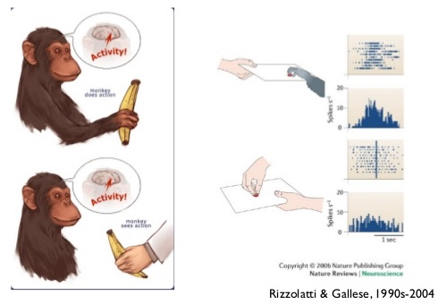
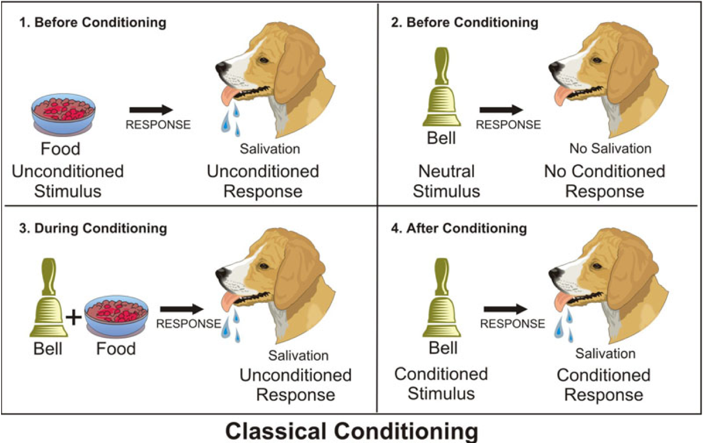
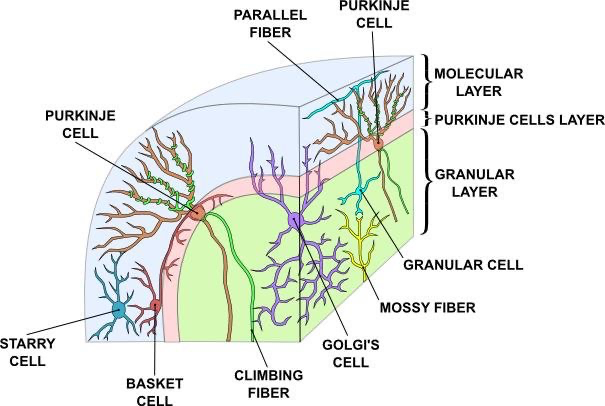
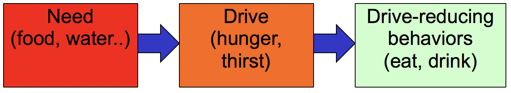
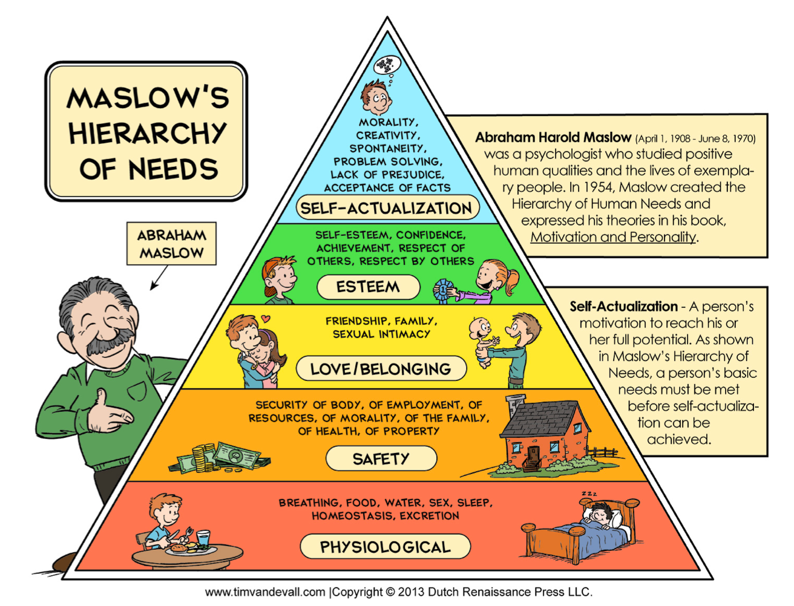
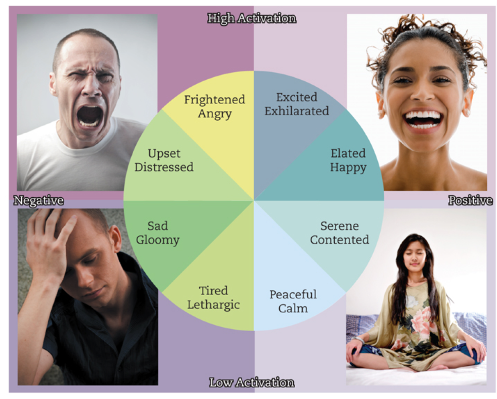
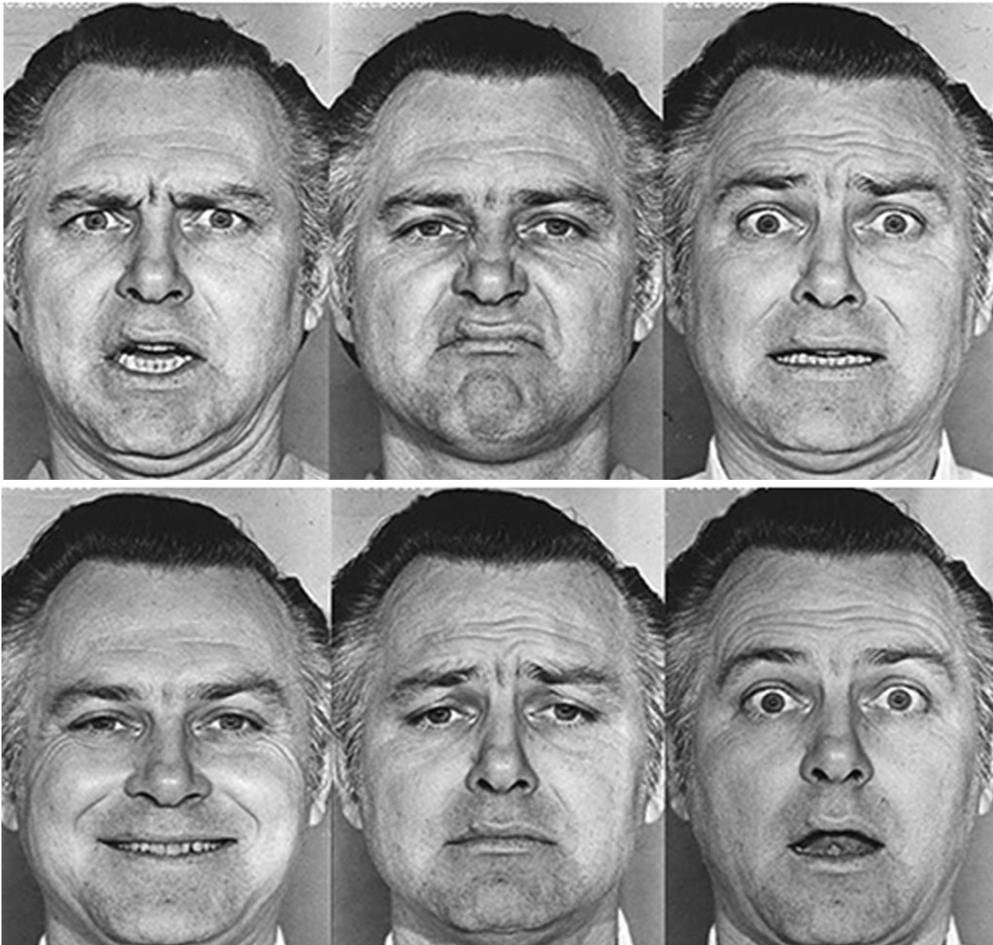
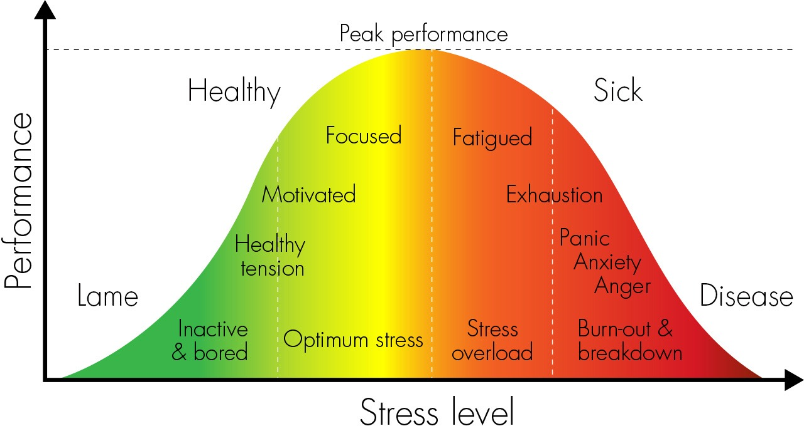

# Learning, Motivation, and Emotion {#sec:ch-learn}

Learning is the single most important process taking place in the brain.  Without learning, nothing else is possible.  All of our focus on the three-C's of compression, contrast, and control presumes a brain with sensible patterns of synaptic connectivity, that produce *useful* forms of each of these phenomena.  Without learning, neurons would randomly compress incoming sensory information, detecting irrelevant, bizarre features that don't have any behavioral relevance.  Contrast would compare these random things against each other, producing equally meaningless relative comparisons.  Control would drive us toward random goals, and our behavior would be just a jumble of strange impulses.

Learning is essential because there are *way* (way, way, way...) too many synapses for any kind of genetic process to shape in a detailed way.  There are only about 20,000 different protein-coding genes in the human genome, which is only 2 times the number of synaptic inputs on a *single* neuron.  It is inconceivable that genes could code for any sensible fraction of the 100 *billion* times that amount of information that would be required to configure the full human brain.  This genetic argument accords with the obvious fact that we learn the vast majority of our abilities over an extremely protracted developmental window, in a way that depends critically on the experiences and education that we are exposed to.

Thus, the brain (specifically the neocortex) is fundamentally a +self-organizing system, which somehow magically transforms raw sensory inputs into *knowledge* encoded in its billions of synaptic connections.  The mystery of this process has long perplexed philosophers, who have explored the opposing ideas of **empiricism** vs. **rationalism** and positions in between.  Empiricists embrace the idea that learning proceeds directly from sensory experience, while rationalists argue that there is no way that raw experience by itself is sufficient to create the sophisticated level of knowledge an adult human (philosopher) has, and therefore that logic and reasoning are more important sources of reasoning.  Modern scientific approaches to this question retain much of this ancient debate, with some favoring a generous amount of innate knowledge (i.e., **nativism**), and others arguing that almost everything is learned.

We'll return to these issues in the Origins chapter ([-@sec:ch-origins]), but the quick summary is that neither extreme view is likely to be correct, with genetic and experiential factors each playing critical roles.  In particular, there is ample evidence that genes establish broad patterns of initial connectivity and orchestrate developmental transitions, such as synaptic pruning, which in turn strongly influence an experience-driven learning process operating at synapses throughout the neocortex.

Our objective in this chapter is to first understand the nature of these synaptic learning processes, which have been figured out in spectacular biological detail at this point, and explore some ideas about how they might result in this magical self-organization of knowledge over development.  Then, we turn to the forms of learning that were the focus of behaviorism: *classical and operant conditioning*.  These both depend on similar dopamine-driven learning mechanisms operating in the [basal ganglia](#basal-ganglia), +amygdala, and related areas, which are now relatively well understood.  These forms of learning shape our core decision-making process to select actions that are likely to be rewarding, and not punishing.

Finally, we broaden our perspective beyond the limited world-view of the behaviorists, and consider the possibility that *internal* factors such as *goals*, *drives*, and, ultimately, *emotions*, might play a central role in driving both our learning and decision-making behavior.  This perspective, long embraced by social psychologists, is only recently beginning to be explored from the neuroscientific angle, which has tended to focus more on well-controlled external reward signals.

## Synaptic Plasticity

Learning is the most important process in the brain, and one of the most important facts about learning is that it takes place in the synapses interconnecting neurons.  The idea that this is where learning happens goes back at least to Santiago Ramon y Cajal in the late 1800's, a pioneering Spanish neuroscientist who advanced the broader idea that interconnected networks of neurons are doing most of the work in the brain.  Logically, the strength of the connections between neurons should alter the patterns of information flow through these networks, so it makes sense that synapses are the primary locus of learning, and knowledge.

Donald Hebb further developed this idea with a compelling proposal that memories are formed when neurons that are active at the same time increase the strength of their synaptic connections, so that they are then more likely to co-activate each other in the future [@Hebb49].  In effect, learning is "gluing together" the different elements of a memory, where increased synaptic strength is the glue.  This idea has been captured with the pithy statement that "neurons that fire together, wire together".

More than two decades after Hebb's ideas were published, this **Hebbian** form of learning was actually demonstrated in the brain [@BlissLomo73].  They described a form of **Long Term Potentiation** (**LTP**) of the synaptic strengths between well-defined groups of neurons, where potentiation means "getting stronger" and the "long-term" aspect of it was critical to distinguish from earlier discoveries of synaptic potentiation that only lasted for a few minutes.  If synaptic changes are really the basis for learning and knowledge in the brain, they had better last for more than a few minutes, because clearly our memories and knowledge can last a very long time.

The field of LTP research expanded rapidly from that point onward, and progressively more detailed questions were addressed about the exact nature of what is changing in the synapses, and what specific factors in the activity of the sending and receiving neurons on either side of the synapse were critical for causing it to change.  After many controversies and twists and turns in this amazing story of scientific discovery, we now have a solid and detailed understanding of how this process works, at least in terms of the underlying biochemical mechanisms.  It is a fabulous success story for the power of the scientific method, to drill down and figure out exactly how some complex system actually works.  Perhaps most remarkably, Hebb's original idea seems to have been nicely supported, by a remarkable interaction of different moving parts: changing the strength of the synapse requires *both* the sending and receiving neurons to be active.

![Mechanisms of synaptic plasticity, resulting in changes in the overall strength of the synaptic connection between the sending axon and the receiving dendrite.  1. The receiving neuron must be active, so that: 2. its elevated membrane potential (Vm) kicks out the positively-charged Mg+ ions from the NMDA receptors. 3. The sending neuron must fire and release glutamate, which then binds to the NNDA receptors.  4. Causing them to open and Ca++ ions to enter.  5. Ca++ then triggers complex chemical pathways that ultimately result in changes in the numbers of AMPA receptors poking out across the membrane, which thus changes the overall amount of Na+ that can enter for any given firing of the sending neuron.](../figures/fig_ltpd_synapse.png){#fig:fig-ltp width=50% }

[@fig:fig-ltp] shows the major steps in the process of synaptic change.  The receiving neuron must be active enough so that its elevated membrane potential pushes out positively-charged magnesium ions (*Mg+*), which are otherwise blocking the opening of the *NMDA* receptors (positive charges repel each other, so as the neuron becomes more positively charged, that repels the *Mg+* ions).  And the sending neuron must be actively releasing glutamate neurotransmitter, as a result of spiking, because glutamate binding to the NMDA receptors (in addition to the AMPA receptors) is necessary to cause them to open.  Whereas AMPA receptors allow Na+ ions to flow into the cell, NMDA allows *calcium* (*Ca++*) ions to enter, and these Ca++ ions then trigger a cascade of chemical reactions that ultimately leads to the change in synaptic plasticity.  This critical role for Ca++ is consistent with many other similar such biochemical processes throughout the body --- it is important for many more things besides building bones!

The main initial consequence of Ca++ entry is a change in the number of AMPA receptors in the synapse, which then changes the overall amount of Na+ that can enter when the sending neuron spikes.  Much more can be said about the details of these Ca++ driven chemical pathways [@Rudy13], and the other associated changes that take place in the synapse, but the core logic remains the same as Hebb envisioned it: both neurons must be active for the synapse to change.

However, Hebb overlooked one *essential* aspect of learning, which was also neglected in the early days of research on LTP.  This is the fact that you can't only *increase* the strength of synapses.  Eventually, all the synapses would get ever-stronger, and the brain would blow up in a huge epileptic seizure.  Instead, it is equally if not more important that synapses also *decrease* in synaptic strength, which has been named **Long Term Depression** or **LTD**.  Decreases may be more important than increases, from the perspective of the *compression* function of neurons: each neuron has to essentially throw away a huge amount of information in order to compress its 10,000 inputs into a single output signal, and LTD makes synapses weaker and thus facilitates this information filtering process.

{#fig:fig-ltp-ca2 width=30% }

[@fig:fig-ltp-ca2] shows that the balance between LTP and LTD is a function of the overall amount of calcium entering the dendrite --- lower amounts result in LTD, while higher amounts result in LTP.  This behavior emerges from a competition between two different chemical pathways, one which drives LTP and the other LTD, and their relative dependence on Ca++ levels.  This is yet another kind of tug-of-war taking place within neurons, and in general there are many such competing pathways throughout the brain and body.

## Neocortical Learning: Predicting and Propagating

Now that we know in detail how learning operates at the synaptic level, you might think that all of the mysteries of brain function should be solved, given what we said about the essential role of learning.  Unfortunately, this is not the case --- the Hebbian-like learning mechanisms described above (and many other variations on that theme) do *not* really work all that well for organizing the collective behavior across many interconnected neurons.  The basic problem is that while forming associations between active neurons sounds like a plausible idea at the local level of individual neurons, learning must really be understood in the broader context of neural networks, because ultimately it is how these larger-scale networks function that really matters for overall behavior and cognition.

Unfortunately for you the student, and for the broader field of neuroscientists and psychologists, understanding the complexities of learning across distributed networks of neurons is pretty tricky, and it is not necessarily something that lends itself to simple intuitions (indeed, Hebb's intuition sounded perfectly compelling --- it just doesn't happen to actually work all that well).  Furthermore, it is something that happens entirely below your own level of subjective awareness, so any intuitions you might have are not likely to be all that informative.  Therefore, we'll just have a simple high-level story here and a few hints at the deeper issues, and hope you can at least get some rough big-picture understanding of what is going on.

To adjust the individual synapses between neurons in just the right way to get the overall network to behave "properly", you can mathematically derive a learning rule that directly minimizes the  *errors* in the overall behavior of a neural network.  This is the **backpropagation** learning mechanism derived by David Rumelhart and colleagues in the 1980's [@RumelhartHintonWilliams86], as mentioned in [@sec:ch-sci].  Backpropagation refers to the ability to propagate *error* signals "backward" through the network of neurons, to gradually reduce these errors, so ultimately the network is doing what you want it to do.  This is the learning mechanism that is now driving all the current +AI (artificial intelligence) models powering the speech recognition and other advanced capabilities in your cell phone and other gadgets (as discussed in the previous chapter).

Unfortunately, the literal math equations that are used in this learning mechanism do not fit well with the known biology, a fact that was pointed out rather prominently by the person who co-discovered the structure of DNA, Francis Crick [@Crick89].  However, it is possible to rearrange these equations in terms of standard +bidirectional connections between neurons, to come up with a more biologically friendly way of making backpropagation work [@OReilly96].  Given that we have seen many other useful benefits of these bidirectional connections (e.g., attention, consciousness), and they are found throughout the neocortex (and nowhere else), this was a promising development, which has recently been a subject of increased attention in the literature, along with various other ideas proposed since then [@LillicrapSantoroMarrisEtAl20]. 

There is one additional major problem with backpropagation, which is that it requires a source for the *target* behavior that the network is trying to learn to match, which then is the source of the error signals that drive learning.  In the AI applications of these models, this problem can be solved in a number of practical ways (including crowdsourcing huge datasets by making users click on images containing trucks or traffic lights in +CAPTCHA tests!), but in the brain, it remains a much bigger question: how does the brain know what it is supposed to be doing, internally?  This is really the fundamental question of self-organization: how can the brain figure out on its own what it needs to learn, without some kind of omniscient external "oracle" providing all the right answers?

One widely-proposed idea is that people learn just by trying to predict what will happen next, known as **predictive learning** [@Clark13], which is appealing because *something* always happens next, and if you actively try to predict it, then there is an essentially unlimited supply of the kinds of error signals that are needed to drive backpropagation.  Furthermore, this kind of learning signal is powerful in the sense that *if* you were able to accurately make such predictions, then you must have learned some pretty sophisticated things about how the world works (e.g., a good internal model of physics that predicts the motions of objects, and of lighting to predict what will happen to the colors you see as the lighting changes).  Even more importantly, you can learn to predict the sensory outcomes of your own actions, and then hopefully use that information to your advantage in selecting which actions to perform, and how to perform them, to get the outcomes you want.

All of this predictive learning could result in a solid foundation for further learning at higher levels, shaped by social and cultural inputs and just exploring different strategies --- various current theories hypothesize that we use internal models of the world and our selves to plan, reason, and interpret [@DawNivDayan05; @HerdKruegerNairEtAl21].  There is some recent indication that this overall approach might work, and thus provide for the first time a fully consistent account of learning in the neocortex that goes all the way from the low-level synaptic biology up to large-scale networks of neurons in the neocortex [@OReillyRussinZolfagharEtAl21].  The next section provides some more details about these ideas.

### Thalamocortical Predictive Learning

There are many different ways in which the general idea that the cortex learns by predicting could be implemented in the biological circuits of the neocortex [@WalshMcGovernClarkEtAl20].  One recent proposal is that the distinctive circuits connecting the neocortex and the thalamus are ideally configured for supporting a form of this predictive learning [@OReillyRussinZolfagharEtAl21].  Specifically, the brain is constantly making predictions at a rate of about 10 times per second (i.e., the *alpha* frequency), and the difference between these predictions and what actually happens can drive learning in synapses throughout the cortex to improve the accuracy of these predictions.  Furthermore, computer models show that this form of learning can lead to the development of higher-level abstract category-based encodings of visual objects that are similar to those found in the visual pathways of humans and other primates, as discussed in the previous chapter (i.e., they compress and simplify the visual world).

Furthermore, to bring things back down to the level of Ca++ ions in the synapse, very recent research by Karen Zito and her lab at UC Davis has found that the types of prediction error signals that drive backpropagation learning in these models also drive learning in neural pathways in the brain in the same way.  These preliminary findings, if validated and replicated with further research, would for the first time provide a consistent model of computationally-powerful learning from synapse to full brain function.

### Other forms of Neocortical Learning

Another way of understanding learning taking place in the neocortex is in terms of **imitation learning**, also known as **observational learning**, where somehow we are able to observe other people's behavior, and then turn around and produce some approximation of that behavior ourselves.  The popular phrase "monkey see, monkey do" suggests that this form of learning is widespread in primates, but the actual behavioral data across a range of species suggests that people are by far the most likely to engage in true imitation, while other species exhibit a range of socially-influenced learning that often falls short of direct imitation of actions [@Jones09a; @CarceaFroemke19].  This imitative capacity is closely related to *cultural transmission* of behavior across individuals [@Tomasello01], and the best non-human examples of this comes from chimpanzees who learn techniques for getting termites using sticks, or using moss as a sponge [@LamonNeumannGruberEtAl17].

Although imitation may sound relatively simple, upon closer examination, the process of turning the perception of behavior into your own motor program requires a highly sophisticated perceptual and motor control system [@Paulus14].  Thus, the claims that even young infants appear to be capable of imitation [@MeltzoffMoore94; @FerrariVisalberghiPauknerEtAl06] are difficult to reconcile with our understanding of the required neural mechanisms, and have led to claims that imitation is innately coded in our brains [@IacoboniDapretto06].  However, considerable doubt has been cast upon the early imitation data [@Anisfeld96; @Jones09a], and it is clear that the most unambiguous evidence of imitation learning emerges over protracted development in human children, consistent with the idea that it builds on a foundation of perceptual and motor learning [@Jones09a; @Paulus14].  We return to these issues in [@sec:ch-soc].

{#fig:fig-mirror width=50% }

Despite these controversies, there is extensive evidence that monkeys naturally learn to encode the actions of others in the same way that they encode their own actions, which at least is useful for interpreting the *intentions* of others, if not full-blown imitation.  The initial discovery in this area centered around the finding of **mirror neurons** in the higher-level motor areas of monkeys, which respond to both self-generated actions and the observation of others performing the same action ([@fig:fig-mirror]) [@IacoboniWoodsRizzolatti99; @IacoboniDapretto06].  However, it is not known how these neurons learn this mapping in the first place (perhaps through predictive learning?), so it remains a phenomenon in search of a deeper explanation [@Paulus14].  Nevertheless, there is an intriguing suggestion that these mirror neurons might be affected in +autism spectrum disorders, which could potentially account for the difficulties in empathy in this population [@GalleseKeysersRizzolatti04; @IacoboniDapretto06], although it is unlikely that any such simple explanation applies in this complex and multi-dimensional disorder.  We discuss these and other related issues in [@sec:ch-soc] in terms of the learned +self-model, and how that might go awry in autism, in [@sec:ch-disorders].

## Classical (Pavlovian) Conditioning

Most introductory textbooks still focus almost exclusively on the relatively well-understood domain of conditioning, which has been studied since the days of Pavlov and the behaviorist school in the early 1900's.  This has become an area of renewed interest in neuroscience, since the discovery that dopamine activity almost perfectly accounts for the nature of these conditioning phenomena [@MontagueDayanSejnowski96; @SchultzDayanMontague97].  Here, we examine the behavioral and brain basis of conditioning, starting with *classical* conditioning and then moving on to *instrumental* or *operant* conditioning, where behavioral actions are learned under the control of rewards and / or punishments.  The *basal ganglia* and dopamine play key roles here, while the neocortex is less critical, which makes sense given that these are evolutionarily much older and survival-critical forms of learning.

{#fig:fig-cond width=80% }

The classical conditioning paradigm ([@fig:fig-cond]) centers around learning the connection between a previously *neutral* stimulus (the **conditioned stimulus** or **CS**) and a biologically-established, affectively significant *outcome*, known as the **unconditioned stimulus** or **US**.  In the classic experiments by Pavlov, the ringing of a bell served as the CS, and food reward as the US, and the subjects were dogs, who learned over a few repetitions of the CS followed by the US to salivate after hearing the bell, in anticipation of receiving the food. The salivation is somewhat confusingly labeled the **un/conditioned response** (U/CR), where it is *un*-conditioned (UCR) prior to learning in response to the food US, and *conditioned* (CR) after learning in response to the CS.  So, the same response has two different labels depending on what is driving it.

Ecologically, this simplified lab experiment is thought to capture the real-world learning about different stimuli that help us anticipate and prepare for important upcoming outcomes.  For example, when you are hungry and driving down the highway on a road trip, the sight of a McDonald's sign alerts you to the availability of food there.  Thus, the McDonald's sign is effectively a CS, and indeed this conditioning paradigm applies well to the goal of advertising, which is to establish a solid connection between a brand logo and desirable US outcomes.  In many ads, the use of sexual imagery or famous faces directly activates the brain's reward pathways --- they are literally replicating the classical conditioning paradigm to associate the CS (brand / logo) with the US driven by these rewarding stimuli.

![Dopamine neuron firing in a classical conditioning paradigm of CS followed by US (labeled R for reward --- it was actually a drop of juice).  Top: Unexpected rewards (at time point R) drive dopamine firing.  Middle: Trained CS followed by R shows dopamine firing at the CS, but *not* for the reward.  Bottom: Trained CS followed by *omission* of R shows reduction of firing at R. Each row of dots shows when a dopamine neuron fired a spike on a given recording trial, and the bars at the top show the accumulated histogram of all the spikes at that corresponding point in time across all such trials.  Dopamine does *not* respond to raw reward input, because it fails to fire in when the reward is accurately predicted by the CS, in the middle panel.  Furthermore, it directly signals "disappointment" by reducing doapmine firing when an expected reward is not received.  These and many similar results show that dopamine responds to the *contrast* or difference between predicted and actual rewards.  From Schultz et al, 1997.](../figures/fig_schultz97_vta_td.png){#fig:fig-vta width=40% }

Although Pavlov and the behaviorists where exclusively concerned with overt behavior such as salivation, we now know the internal biology that drives this form of learning.  [@fig:fig-vta] shows how dopamine neurons in the *ventral tegmental area* (*VTA*) of the brainstem reticular activating system respond in a classical conditioning experiment [@Schultz86; @SchultzDayanMontague97].  When the US (labeled R = reward, a juice drop) is presented without any prior CS, dopamine responds with robust firing above its "tonic" steady base rate of firing.  This is consistent with the naive idea that dopamine encodes raw reward signals.

However, when the very same reward is presented after a CS (which has been reliably paired with the reward in prior conditioning trials), *dopamine no longer fires to the reward!*  Furthermore, when the CS is presented and the reward is *withheld*, dopamine neurons  show a suppression or *dip* in firing below their tonic baseline.  Psychologically, you would feel disappointed if you didn't get the reward you expected, and indeed that is exactly what the dopamine neurons are signaling.

These results, from the pioneering work of Wolfram Schultz and colleagues, have profound, far-reaching implications, and represent one of the most exciting and important findings in neuroscience.  They are also one of the most important examples of the **contrast** principle, as we emphasized in the introductory chapter.  Specifically, these results show that dopamine neurons respond to the contrast or difference between an expectation of reward, and what is actually received, *not* to the raw reward input itself.  This contrast property of dopamine is what drives people to always want and expect more out of life, which is a really essential thing for progress at the individual level throughout the course of development.

Imagine how things would be if you remained completely in awe of the coincident feeling of your fingers moving, and the sight of *those very same fingers*, which, amazingly, are moving in just the same way!  At one point in your young life, you likely spent hours fascinated by this amazing coincidence, with the dopamine flowing heavily.  But, once you got used to this incredible new discovery, your dopamine system (and the rest of your brain) came to expect it, forcing you to seek out ever greener pastures of discovery and imagination, eventually landing you here, among other places, reading about how fascinating dopamine is!  It is of course a cruel irony that you probably already knew about dopamine already (even before reading about it in the introduction), and were already bored with it!  Apparently the kids these days are intentionally doing really boring things for a few days to reset their dopamine levels, so lifehacking has fully digested the essence of dopamine already. 

In any case, the benefits of the contrast property of dopamine extend to society as a whole, driving our collective expectations ever higher, and producing increasing standards of living and technological advancements for larger numbers of people.  In [@sec:ch-soc], we consider the question of *happiness*, which is clearly connected to dopamine in some way, but not in the simple way that most people imagine (even beyond the fact that it is always relative to expectations).  For now, it suffices to say that happiness is definitely not a simple function of wealth or material possessions, and that the Buddha's wisdom from so many centuries ago still holds true: because our happiness is so dependent on our attachments, which are much like these expectations for the dopamine system, we may be better off focusing on that end of things, rather than getting caught up in a never-ending cycle of greed and dissatisfaction.  And, as we discussed in the Introduction, the present levels of greed and extreme wealth inequality are arguably creating significant problems across many cultures and countries, so it is really important to better understand what is going on, and find ways of controlling and more optimally harnessing our dopamine systems.

To carry on with that goal, the *contrast* properties of the dopamine system can be understood from a learning theory perspective, because *learning is most efficient when it is focused on what is not yet learned.*  Learning something you already know simply doesn't make much sense.  For example, in classical conditioning, continuing to learn about the fact that the CS predicts the reward after the system has already acquired this association isn't very useful.  Therefore, it makes sense that you no longer get the dopamine at the point of the reward, because you have already fully learned to expect it, so no more learning is required.  This logic shows that dopamine is fundamentally a *learning* signal, not a reward signal.  In particular, as we'll see in the next section, dopamine directly affects learning in the basal ganglia and other brain areas, including the areas that are learning about the CS -- US association in the first place.  Thus, as dopamine stops firing at the time of the US (R, reward), it stops the further learning of this association (because it has already been learned).

This basic theory of how learning should function was systematized by Robert Rescorla and Allan Wagner in a seminal paper [@RescorlaWagner72], where they proposed a simple mathematical "learning rule" that says that the amount of new learning should be proportional to the contrast or difference between the actual reward you receive and what you already expect the reward should be.  This is also known as a **reward prediction error** (**RPE**).

Roughly a decade later, Rich Sutton and Andy Barto published an important extension to this idea [@SuttonBarto81], known as the *temporal differences* (*TD*) learning rule, which can also account for the fact that dopamine learns to fire at the onset of the CS, even as it stops firing for the expected US.  Furthermore, this work led to the development of many advanced mathematical techniques in a field collectively known as **reinforcement learning** (*RL*), which is a branch of *machine learning* that deals specifically with learning from overall reward / punishment signals.  These RL techniques have been used in many different AI technologies, and play a central role in the recent advances from the Google DeepMind group, in their models that learn to play Go and challenging video games [@SilverSchrittwieserSimonyanEtAl17; @MnihKavukcuogluSilverEtAl15].

![Biological systems involved in classical conditioning.  There are two major learning systems, LV and PV (columns), each of which has cortex-like, basal-ganglia-like, and brainstem components (rows).  LV (*learned value*) reflects the contributions of the amygdala to forming CS -- US associations.  PV is the ventral striatum, which drives reward-prediction-error (RPE) firing in the dopamine system (VTA / SNc).  Together these constitute the PVLV system, named in honor of Pavlov.  The BLA (basolateral amygdala) within the LV system learns to associate CS's with corresponding US's, while the CEA (central amygdala) reduces these higher-level associations down to specific "Go" vs "NoGo" signals in a basal-ganglia-like fashion, and directly drives dopamine firing and core behavioral responses (*conditioned responses*) appropriate for different US's.  The PV system likewise has a cortical component in the ventral and medial areas of the prefrontal cortex (vmPFC), and a basal-ganglia component in the ventral striatum (VS).  Dopamine firing in the VTA / SNc drives learning throughout all of these areas.](../figures/fig_bvpvlv_functional_org_simpler.png){#fig:fig-pvlv width=40% }

Although the TD learning rule provides an elegant and powerful mathematical description of classical conditioning, the brain networks actually involved in this form of learning are considerably more complex.  Just to give you a quick taste for the kind of complexity present in these networks (no need to try to memorize any of these details), look at [@fig:fig-pvlv] [@MollickHazyKruegerEtAl20; @HazyFrankOReilly10].  Conditioning learning involves interactions between two "vertically" organized sub-systems, one involved in forming associations between CSs and USs, and another that compares current rewards with expected rewards (i.e., the RPE or reward prediction error part).  The first, associative system depends on nuclei within the +amygdala, and the second depends on the +ventral (bottom) areas of the striatum in the [basal ganglia](#basal-ganglia).  This framework can account for a wide range of data about the biology and function of dopamine-driven learning in the brain, and, given the overall complexity of the system, the ability to simulate it all in a computer model is essential for understanding how it works.

### Extinction and Context in Conditioning

The flip side of conditioning, where the associations between CS and US are *unlearned*, is just as important as the initial learning, because the environment can change and learning needs to be able to keep up with these changes.  This involves the phenomenon of **extinction**, where the CS is repeatedly presented while withholding the US, which should produce repeated *dips* in dopamine levels (much disappointment) according to [@fig:fig-vta].  In principle, this dopamine dip should in turn should drive LTD in synaptic connections between the CS and US, causing the association between the CS and US to be unlearned.  Once the CS no longer drives an expectation of reward (US), then there won't be anymore dips, and thus no more learning --- the same kind of self-correcting learning operates in extinction just like in acquisition.

Interestingly, this simple idea turns out to not be true for the special case of CS -- US learning, even though it is true in most other similar cases in the brain, for reasons that make sense ecologically.  Instead, *new associations* are learned during these extinction events that *override* the prior associations (with just a bit of weakening of the old ones too, just to make things even more complicated) [@QuirkMueller08].  These new associations effectively encode **context-specific exceptions** to the original association --- e.g., "in this particular situation, you're not going to get the food, but you might still get it in other situations".  Furthermore, the nature of this new learning is under top-down control from the +ventral / +medial +frontal cortex, which can play a critical role in interpreting the nature of what is going on: has the world really changed, or is there just some kind of randomness happening right now [@GershmanBleiNiv10]?

The advantage of all this is that the initial CS -- US association is relatively preserved, and especially if this was something learned through a painful, dangerous experience, it is probably a good idea to keep these memories around.  Better safe than sorry.  The disadvantage is evident in the phenomenon of PTSD (post-traumatic stress disorder), where traumatic memories cannot be extinguished, and keep intruding into normal life.  There are significant individual differences in the extent of PTSD, and a major factor reflects the ability to exert top-down control and establish a strong new context to override the traumatic situation.

Another important consequence of this type of learning is that people will tend to hold onto these associations even in the face of repeated disconfirmation, explaining each new failure as another "special case" or circumstance --- this is evident for example in doomsday cults, which respond to each absence of predicted doomsday by reinforcing their core beliefs, while attributing the failures to unforseen contingencies [@BoudryBraeckman12].

In the lab, the phenomena of *spontaneous recovery*, *reinstatement*, and *renewal* provide evidence for the preservation of the underlying CS -- US association in the face of extinction training:

* **Spontaneous recovery** refers to the re-emergence of the CS -- US association after extinction (typically after some time has passed), without any further training, clearly showing that extinction learning did not erase this original memory.

* **Reinstatement** occurs after a single US presentation without the prior CS, after which the CS -- US association is reinstated.  The US acts like a retrieval cue to reactivate the associated memory of the CS, and then having both of those active together is enough to reestablish the association.  Just imagine that you'd been repeatedly lightly shocked (US) after the onset of a particular tone (CS) --- if you experience that shock again, you'll likely remember the tone, and given that you had not experienced the shock in a while (due to the extinguishing training where the shock was absent), you would be justified in worrying that the whole tone-shock thing is making a comeback...

* **Renewal** is particularly revealing of the important role of context.  In this case, the subject is conditioned in one environment (A) and extinguished in a second, novel context (B).  When put back into the original context (A), the original CS -- US association is *immediately* effective without any further learning.  In other words, the subject learned a context-specific exception ("when in context B, I won't get shocked") instead of unlearning the original association.  For people who have experienced traumatic events, this means that even if they successfully extinguish the fear feelings in environments in which they consistently feel safe, a later exposure to something that resembles the original situation in which their traumatic event occurred can then renew the negative associations, even without any further exposure to trauma.  While this may be intuitively reasonable, there are many challenges in testing such theories in people [@VervlietBaeyensVandenBerghEtAl13].

Generally speaking, any attempt to apply simple conditioning learning principles to humans has been challenging, for the same reason that the field of psychology is no longer dominated by behaviorism: we are cognitive beings that have a lot more neocortex than your average rat (which is where most of these conditioning and extinction experiments are done), and, as we'll see in [@sec:ch-disorders], cognitive elements are important in treating mental disorders including PTSD, depression and anxiety disorders.  Nevertheless, conditioning principles still play an important role too: people still have fully functional subcortical systems that operate according to much the same principles as rats.

### Secondary and Higher-Order Reinforcers

Why are we willing to work for money?  Money is just an abstract concept, and has no direct, intrinsic worth itself --- these days it is almost entirely virtual and managed through electronic transactions, without even bits of paper being handed around.  Nevertheless, many psychology experiments have demonstrated that our dopamine system responds directly to money and it can act like a US in a conditioning experiment --- clearly people learn to crave it as much as anything else.  Technically, money is known as a **secondary reinforcer** --- something that does not have direct biological benefit to the organism, but nevertheless has been sufficiently strongly associated with **primary** reinforcers (things of actual biological value) that it takes on the ability to function as a US in its own right.  This is one form of higher-order effects in reinforcement, on the US side of things.

One the CS side of the learning process, it is possible, though somewhat difficult, to train an animal to associate CS1 with CS2 (e.g., a light and a tone) and CS2 with the US, so that, indirectly, CS1 becomes associated with reward.  To isolate the learning strictly to the CS side, these experiments are typically run as follows:  First, CS2 is conditioned in the usual way, to predict the US.  Then, CS1 -> CS2 is presented *without* the US at all, and then finally CS1 is tested and, if the procedure was successful, it elicits the CR.  Interestingly, presenting just the CSs without the US means that this is effectively an *extinction* learning experiment, and thus some of the complexity there comes into play, and overall these higher-order conditioning results are rather weak and unreliable.  

### Biological Limits on Conditioning

In the heyday of behaviorism, some scientists thought that conditioning was a fully general principle of learning that would eventually explain all forms of knowledge acquisition.  However, subsequent research established that there are strong limits and biases on the nature of the learning process, which make sense ecologically, but nevertheless undermine the full generality of this type of learning [@GarciaMcGowanGreen72].  For example, John Garcia demonstrated that rats who became nauseous as a result of radiation would learn in a single trial, after an interval of several hours, to avoid anything they had eaten prior to the radiation treatment.  This extremely fast and robust learning across a very long delay was unheard of in any other form of conditioning.  Furthermore, they would not learn to associate signals such as tones or lights with the nausea, while these signals are readily learned as predictors of shock USs, while rats do not learn to associate food with shock.  This pattern of results suggests that there are strong biological constraints on the conditioning process.

We can understand the nature of some of these constraints in terms of the pathways through the +amygdala where the CS and US associations are forged.  The neurons have fairly strong built-in US-specific responses, and these different US cells can receive different types of sensory inputs.  Presumably, evolutionary pressures in this and other brain systems have established preferential patterns of connectivity, which makes good sense in terms of the kinds of things that actually matter in the animals life.  Nevertheless, it does suggest that human-level abstract learning of advanced novel concepts is not likely to be supported by these kinds of more limited learning systems, consistent with the critical involvement of the neocortex and more the general-purpose learning mechanisms at work there.

## Operant / Instrumental Conditioning

Classical conditioning is the sensory front-end to the other major form of learning studied by the behaviorists: *operant* or *instrumental* conditioning.  This form of learning occurs through the reinforcement or punishment of *actions*, instead of stimuli like CSs.  The central idea is captured in **Thorndike's law of effect**: *actions that lead to good outcomes are more likely to be taken, while those that lead to bad outcomes are less likely* [@Thorndike1911].  This is so intuitive that it is difficult to imagine it being otherwise, but nevertheless, it captures a considerable amount of behavior in humans and animals.  Furthermore, we now know how this type of learning works, in terms of dopamine's effect on the basal ganglia [@Frank05; @GerfenSurmeier11].

![The Go (direct) vs. NoGo (indirect) pathways through the basal ganglia.  When the Go neurons in the striatum are activated by excitatory inputs coming from the cortex (timecourse of activity shown in the small graph above Go --- striatum neurons are usually not firing), they inhibit the GPi (globus pallidus internal segment) neurons, which are typically active (as shown in graph).  This inhibition of GPi releases the Thalamus neurons from the inhibition they were otherwise receiving from the GPi: this is called *disinhibition* --- the release of inhibition, and it is a common if difficult to understand motif found in many areas of the brain.  The disinhibition of the Thalamus allows bidirectional excitatory connections with the frontal cortex to generate mutual excitation, which then enables the frontal activity to drive motor responses (or internal cognitive actions).  The NoGo pathway adds yet another inhibitory link into this pathway, through the GPe (GP external segment), which has the opposite effect as the Go pathway, removing inhibition of the GPi and thus causing it to be more active, inhibiting the Thalamus, and preventing action initiation.](../figures/fig_bg_gating_circuit.png){#fig:fig-bg width=30% }

The first step in understanding this somewhat complex (but potentially satisfying to understand) system, we first need to understand how the basal ganglia circuit works, in terms of two opposing pathways that start in the +striatum.  These pathways are known as the *Go* (*direct*) and *NoGo* (*indirect*) pathways, where the Go pathway ends up driving action initiation, while the NoGo pathway has the opposite effect [@Mink96].  As explained in [@fig:fig-bg], the Go pathway has a net *disinhibitory* effect on the thalamus and +frontal cortex, while NoGo opposes that effect, but it is not essential to understand these admittedly complex details.  Dopamine has opposite effects on these two pathways, through two different dopamine receptors: *D1* receptors on the Go pathway neurons have a net excitatory effect, and also cause strengthening (LTP) on the inputs to these neurons, while *D2* receptors on the NoGo pathway neurons have the opposite pattern of effects.

![How increases in dopamine (bursts) and decreases in dopamine (dips) drive learning in opposing Go vs. NoGo pathways in the basal ganglia.  When an action leads to an unexpected positive outcome, the resulting dopamine burst activates a special type of dopamine receptor (the D1 receptor), which is excitatory on the Go neurons and drives LTP learning in the input synapes to these neurons.  This makes those neurons more likely to fire again under similar circumstances, achieving Thorndike's law of effect.  The opposite happens when dopamine dips occur for unexpectedly bad outcomes, which interesingly has a net LTP effect on the NoGo neurons via D2 receptors, while also being inhibitory on these neurons overall, and also has an LTD effect on the Go neurons.](../figures/fig_bg_frontal_da_burst_dip.png){#fig:fig-bg-da width=70% }

Putting this all together ([@fig:fig-bg-da]): If an action results in an unexpectedly positive outcome, then dopamine will burst (as we saw in [@fig:fig-vta]), causing excitation and strengthening (LTP) of the Go pathway, making it more likely that these Go pathway neurons will fire again (and more strongly) the next time that action is being contemplated, thereby achieving Thorndike's law of effect.  Because dopamine has opposite effects on the NoGo pathway (via D2 receptors), it ends up weakening this pathway, so there is less "hesitation".  Interestingly, the appropriate opposite pattern of effects occurs if there is an unexpectedly bad outcome, which drives a dip in dopamine firing (i.e., a pause in its otherwise continuous, tonic activity): this strengthens inputs to the NoGo neurons, making them better able to veto the action next time around.  Furthermore, the inputs to the Go pathway are also weakened, so the changes on both pathways are coordinated overall.  The net effect is that actions that lead to bad outcomes are less likely to be triggered, consistent with the other half of Thorndike's law of effect.

![*Actor-Critic* schematic for the relationship between the dopamine (DA) signal driven by principles of classical conditioning (the critic), and action decisions triggered in the basal ganglia (BG) (the actor).  The environment *state* is represented by various abstract, higher-level *compressed* representations in neocortex, which feeds into both the critic and actor.  The actor decides on actions to take as a function of these neocortical inputs, and the critic generates predictions about the kinds of US outcomes that are likely to result.  Learning in both the critic and actor is a function of the dopamine signal, which is symbolized as a delta, or *reward prediction error* (RPE).  Thus, classical and operant / instrumental conditioning are connected through this actor --- critic relationship. ](../figures/fig_actor_critic_state_bio.png){#fig:fig-actor-critic width=30% }

The overall relationship between dopamine and the basal ganglia is summarized in [@fig:fig-actor-critic], where classical conditioning processes train the **critic** about what kinds of rewards or punishments to expect, and the resulting differences between these expectations and actual rewards / punishments, reflected in the dopamine signal, then drives learning in the **actor** (basal ganglia) [@JoelNivRuppin02].  This image of dopamine as a critic fits with our overall conception of the *contrast* nature of this signal: it is never satisfied and quick to criticize, just like a critic.  Of course, the poor actor has to do all the hard work of coming up with stuff for the critic to critique, but, as you may have experienced, it is often hard to be properly critical of your own behavior, whereas it is much easier to see what is wrong with other people.  Thus, separating the critic and actor components in the brain makes sense, and is another example where two fully interdependent systems can nevertheless be seen as performing distinct functions.

### Partial Reinforcement, Gambling, and Shaping

One of the topics that the behaviorists explored extensively was *reinforcement schedules* --- different rates and patterns of delivering rewards.  The most interesting and relevant finding from this work is that **partial reinforcement** can have surprisingly strong effects compared more reliable reinforcement schedules.  In a partial reinforcement schedule, rewards are only delivered randomly on a fraction of successful action trials.  In effect, it is just like gambling, where there is a relatively infrequent, random payout.  One consequence of this is to confound the critic system, which can no longer accurately predict what kind of outcome to expect.  Therefore, when a positive reward is received, it is not *discounted* like would have been if it was perfectly predictive.  You will get that burst of dopamine for the reward!  This is why gambling can be so addictive --- it works just like addictive drugs in disabling the stingy, harsh dopamine critic.

Another important discovery in instrumental conditioning was that more complex behaviors can be built up from simpler elements through the process of **shaping**.  This is the technique used to get circus animals to perform their complex tricks, for example, and is often used in scientific research with animals to study more difficult cognitive tasks.  For example, if you want to train your dog to learn to roll over on command, you first start with simpler actions, such as "sit".  Even when training "sit", you first shape the behavior by pushing the dog's butt down on the ground while saying "sit", and then providing positive reinforcement (a doggie treat) for successful repetitions of the action.  Depending on the dog, it will eventually get the connection between the verbal command and the desired action, reinforced through the treat.  Next, you can add "lie down" to the initial "sit" repertoire, by adding that after the dog is already sitting (and you can push them into position as well).  In this way, each successive step builds on the prior learning, and eventually your dog will be making you dinner!

## Learning in the Cerebellum

{#fig:fig-cereb-inputs width=30% }

Now that we understand how the basal ganglia can learn from dopamine which actions to perform (and which to avoid), we turn to the cerebellum, which takes over once an action has been initiated, and uses a highly specialized form of error-driven learning to shape the performance of the action so that it is accurate and well-coordinated. As shown in [@fig:fig-cereb-inputs], the cerebellum only receives from cortical areas directly involved in motor production, including the parietal cortex and the motor areas of frontal cortex. Unlike the basal ganglia, it does not receive from prefrontal cortex or temporal cortex, which makes sense according to their respective functions. Prefrontal cortex and temporal cortex are really important for high-level planning and action selection, but not for action execution.

However, we do know from +neuroimaging experiments that the cerebellum is engaged in many cognitive tasks --- this must reflect its extensive connectivity with the parietal cortex, which is also activated in many cognitive tasks. One idea is that the cerebellum can help shape learning and processing in parietal cortex by virtue of its powerful error-driven learning mechanisms --- this may help to explain how the parietal cortex can learn to do all the complex things it does. However, at this point both the parietal cortex and cerebellum are much better understood from a motor standpoint than a cognitive one.

{#fig:fig-cereb width=50% }

The cerebellum has a well-defined and distinctive anatomical structure as shown in [@fig:fig-cereb], with the same basic circuit replicated over and over again throughout its entire extent.  Thus, like the basal ganglia, it seems to be performing the same basic function replicated over a wide range of different content domains (e.g., for different muscle groups, and for different areas of parietal and frontal cortex).  You don't need to memorize the details, but we can understand this function from the structure of this circuit.  Input signals coming from various sources are conveyed into the cerebellum via *mossy fiber* axons, which terminate onto *granule cells*, of which there are roughly 40 billion in the human brain --- that is more than the number of neurons in the entire neocortex!  Each granule cell receives only 4-5 mossy fiber inputs, and there are roughly 200 million mossy fiber inputs, with each mossy fiber synapsing on roughly 500 granule cells. Thus, there is a great expansion of information coding in the granule cells relative to the input --- we'll revisit this important fact in a moment.

To complete the circuit, the granule cells send out *parallel fiber* axons, that synapse into the very dense dendritic trees of *Purkinje cells*, which can receive as many as 200,000 inputs from granule cells. There are roughly 15 million Purkinje cells in the human brain, and these cells produce the output signal from the cerebellum. Thus, there is a massive convergence operation from the granule cells onto the Purkinje cells. The Purkinje cells are tonically (continuously) active, and the granule cells are *excitatory* onto them, making it initially a bit puzzling to figure out how the granule cells convey a useful signal to the Purkinje cells. The other cell types in the cerebellum (stellate, basket, and golgi) are +inhibitory +interneurons that provide inhibitory control over both granule cell and Purkinje cell firing.

The final piece of the cerebellar puzzle is the *climbing fiber* input from the *inferior olivary nucleus* --- there is exactly one such climbing fiber per Purkinje cell, and it has a very powerful effect on the neuron, producing a series of *complex spikes*. It is thought that climbing fiber inputs convey a training or error signal to the Purkinje cells, which then drives synaptic plasticity in its associated granule cell inputs.  Specifically, it produces LTD (weight decrease) for synaptic inputs where the granule cells are active, which then makes these neurons *less* likely to fire the Purkinje cell in the future. This would make sense given that the Purkinje cells are inhibitory on the *deep cerebellar nuclei* neurons, so to produce an output from them, the Purkinje cell needs to be turned off.  This is again a disinhibition situation, just like in the basal ganglia.

Putting all these pieces together, David Marr [@Marr69] and James Albus [@Albus71] argued that the cerebellum is a system for error-driven learning, with the error signal coming from the climbing fibers.  Critically, the learning is done in a very high-dimensional space over the huge population of granule cells --- this allows learning to effectively "memorize" a different motor command even for very similar situations --- it acts as a kind of giant "lookup table" for which motor command to perform in a given very specific situation.  The drawback is that it does not generalize to novel input patterns very well, and this may explain why gymnasts and other elite athletes require so much practice to perfect complex motor skills over time.  Basically, the cerebellum has to memorize the right thing to do for each tiny difference in posture and motion!

## Motivation

Despite the satisfying modern synthesis between dopamine and the behaviorist-era conditioning phenomena, this overall view of behavior focuses almost entirely on **extrinsic** (external) factors (reward / punishment) to the exclusion of **intrinsic** (internal) factors such as goals, drives, desires, etc.  This is consistent with the behaviorist-era prohibition on considering internal factors more generally, but we should have no such constraints on our modern thinking about this topic.  Nevertheless, the current neuroscience-based research still carries some of this extrinsic bias, with the central role of internal factors having been less emphasized.  By contrast, researchers in the field of social psychology have a long tradition of thinking about the central role of goals, desires, emotions and mood on behavior [@Bandura77a; @Bandura77; @RyanDeci00], as we'll discuss in detail in [@sec:ch-soc].

Before exploring some of these ideas, it is interesting to ponder the state of mind of a behaviorist from the 1920's: did they really think that their *own* personal behavior was fully determined by external rewards and punishments?  Were they not aware of having internal goals that drove them to torture rats for long hours, day after day, in pursuit of such ineffable, remote rewards as scientific understanding and a chance of prestige and fame?  The tangible rewards associated with scientific research are sufficiently distant and improbable, while the immediate working conditions involve relative poverty and extreme hard work, that it is really hard to understand why people would do such a thing in terms of purely external rewards.  Instead, there must some significant long-term internal forces driving such "crazy" pursuits, which are evident across many domains of human endeavor.

{#fig:fig-drives width=70% }

One of the few types of internal state that behaviorists did consider was the notion of a *drive* or state of internal discomfort (e.g., due to lack of food or water) that then motivates behavior toward reducing that discomforting state [@Hull43] ([@fig:fig-drives]). But this **drive reduction** theory has trouble accounting for motivations such as our desire to learn and work, which don't really seem to be associated with discomfort-reduction processes. 

{#fig:fig-maslow width=80% }

A more comprehensive theory of motivation was developed by Abraham Maslow, at around the same time as Hull [@Maslow43].  Maslow's **hierarchy of needs** ([@fig:fig-maslow]) captures the intuitive idea that higher-level needs are not relevant unless the more basic needs essential for survival are satisfied.  The two lowest levels in the hierarchy are physiological needs (breathing, food, water, etc) and safety.  Once those are satisfied, then higher-level needs such as love and belonging and esteem become relevant.  Finally, at the highest level, Maslow put *self actualization*, which includes things like morality, creativity, and lack of prejudice.  Interestingly, this highest level resembles the Buddhist notions of enlightenment, where one transcends lower-level attachments and needs, and can act in a more principled, rational, and yet spontaneous manner.  These frameworks capture the subjective feeling that we are controlled by our basic needs, and yet we yearn to be free from these low-level demands.

One problem with Maslow's theory, shared with any theory that attempts to articulate universal features of human behavior, is that people are rarely so compliant, and regularly violate his strict hierarchy.  For example, people have been known to literally work themselves to death, including recent cases of video gamers playing to death as a result of neglecting basic bodily needs.  Furthermore, teenagers routinely risk their personal safety in order to show off and otherwise enhance their social belonging and perceived self-esteem.  Nevertheless, as a general tendency, the hierarchy makes sense, and certainly the numerous cases of cannibalism in the face of extreme hunger suggest the power of these more basic physiological needs.

### Goal-driven Behavior

A more general motivational framework is based on the idea that people are specifically motivated to achieve *goals*.  These goals can be highly diverse in their specifics (and can satisfy needs such as Maslow articulated), and it is somewhat difficult to precisely identify exactly what counts as a goal, even though people generally have a subjective sense of their psychological reality.  One important, perhaps defining property is that they deliver positive reward signals upon goal completion (e.g., "the satisfaction of a job well done"), and for progress toward goal completion ("almost there, just around the corner.."), and corresponding negative states associated with failure or lack of progress (disappointment, embarrassment, lack of self-esteem, frustration, anger).  Many aspects of goal-driven behavior have been studied over the years from various perspectives [@Tolman48; @MillerGalanterPribram60; @Powers73; @Klinger75; @Bandura77; @HeckhausenGollwitzer87; @Gollwitzer93; @CarverScheier90; @RyanDeci00].

In the animal behavioral tradition, goal-driven behavior has been studied in the context of paradigms such as *satiety* and *devaluation* [@BalleineDickinson98].  In the **satiety** paradigm, an animal is instrumentally conditioned to press a lever for food while in a state of hunger, and is then given as much food as they want (i.e., their hunger is fully sated).  They are then put back into the box with the lever --- if behavior is driven by purely *habitual* stimulus --- response associations, they should push the lever even if they are no longer hungry.  However, if they are actually thinking about the *outcome* produced by pressing the level, and recognizing that they don't want that outcome, then they should not press the lever.  Interestingly, results show that damage to the +ventral and +medial areas of +prefrontal cortex (**vmPFC**) causes rats to press the lever even when they are full!  The same kinds of results have been shown in the **devaluation** studies, where the food is subsequently paired with a bitter taste outside of the lever-pressing context, so that it is no longer desirable.  If the animal still presses the lever, then they aren't clearly representing the outcome of the lever press.

The importance of the vmPFC brain areas for goal-driven cognition is consistent with neural data showing that these areas (in particular the *orbital frontal cortex*, *OFC* and *anterior cingulate cortex*, *ACC*) have many neurons that anticipate the possible US outcomes associated with a given situation and actions taken within that context, and impair goal-directed behavior when damaged [@RichWallis16; HuntMalalasekeraBerkerEtAl17; RudebeckWaltonSmythEtAl06].  More generally, the prefrontal cortex is important for driving goal-driven controlled behavior, which requires the tight coordination between plans and their potential outcomes in order to decide on the plans that will lead to the most desirable potential outcomes [@OReilly20].

As discussed in [@sec:ch-neuro], these vmPFC areas are directly interconnected with the basal ganglia, amygdala, and dopamine system, forming the overall *control* and *decision-making* system of the brain, and each of these areas plays a critical role in supporting the overall emergent ability to behave in a goal-driven, controlled manner.  Furthermore, as we'll see in [@sec:ch-disorders], these are the brain systems that are implicated in most of the major clinical disorders, which reflect a breakdown in the control system in one way or another.

Some further insights into the nature of goal-driven cognition comes from the pervasive problem of **procrastination** -- why do people continue to put off doing things that they *know* (at some level) will make them feel so much better if they could just do it (and there are strong negative consequences of not doing it).  The *Rubicon* model [@HeckhausenGollwitzer87] and related theories [@OReilly20] suggest that we procrastinate because once we engage and commit to achieving a goal, that goal ends up taking over our mental and emotional life to a significant extent, causing us to become frustrated if our progress is impeded, and sometimes overly obsessed with positive signs of progress even for otherwise "objectively" fairly pointless tasks (e.g., getting more points on a video game you don't even care about, or cleaning every last leaf out of a pool even though many more will fall into it soon).  

This **goal-engaged** state can be contrasted with the **goal-selection** process when we aren't otherwise currently under the sway of an active goal, and are instead deciding what to do next.  The key point is that, during this latter state, our brains are *extra cautious* about starting a task that seems like it might be difficult or take a long time, because your brain knows that these will have a high risk of leading to frustration and becoming an all-consuming obsession for a long time.  Thus, when faced with the choice between starting on that big paper you need to write, or spending a few minutes cleaning and sorting the silverware drawer, the latter naturally wins.  Indeed, procrastination is a great way to get a lot of other things done that compare favorably in length and difficulty with the main thing you actually need to do!

According to this understanding of what is going on, the single most important way to fix your procrastination problems is to turn that big, hard task into a short, simple one.  Instead of thinking about writing an *entire* paper (or responding to *all* of your unanswered emails), just take on a much simpler task: just write one paragraph (or even just a sentence), or respond to 2 emails.  What you'll find (but don't think about this in advance!) is that *once you get started*, the positive feedback loop of perceived progress will kick in, and you'll keep going once your initial goal has been satisfied.  This strategy of breaking a big task down into smaller, tractable pieces is nicely described by Anne Lamott in her "Bird by Bird" book [@Lamott95] --- it is a good mantra to just take everything "one bird at a time" instead of getting overwhelmed and procrastinating (the birds in question were for a report that her brother had to write, which he had procrastinated to the last minute on).

Finally, one of the most fascinating and controversial demonstrations of the importance of intrinsic motivation comes from studies showing that giving people extrinsic rewards can actually *undermine* intrinsic motivation [@DeciKoestnerRyan00]!  For example, giving kids awards for drawing actually caused them to draw less than kids who did not receive these awards.  These results are controversial, however, and systematic reviews of the literature have reached opposite conclusions [@CameronBankoPierce01].  One of the most important factors appears to be whether the task in question is actually reasonably strongly intrinsically motivating in the first place: there is stronger evidence of the undermining effect when the task has stronger intrinsic interest, compared to more "boring" tasks, for which external rewards might be useful.

## Emotion and Arousal

{#fig:fig-emote-circumplex width=60% }

The same brain areas involved in goal-driven motivated behavior are also the primary areas associated with *emotion*, which raises the important question as to the relationship between emotion and motivation [@CardinalParkinsonHallEtAl02].  Intuitively, our motivational goals are strongly connected to things that we have strong emotional feelings about: things that we think are important and significant for our lives.  However, providing a more crisp, principled definition of what an *emotion* actually is, is just about as difficult as doing the same for the notion of a *goal*.  In both cases, we have a general subjective understanding, but turning that into a clear objectively defined concept is challenging.

Some widely-recognized properties of emotion are that it has some kind of distinctive, characteristic subjective *feeling*, is associated with physiological arousal at least to some extent, and that it drives associated behavioral responses.  It is generally agreed that emotion should be biologically grounded, at least in the more "primitive" or basic level of emotions.  We'll see that this issue of "grounding" extends all the way to the body: if an internal brain state is driven by something happening all the way "out there" in the body, then it must be special and important, as compared to all those things that are "just in your head".

In terms of the connections between emotions and goals, it is relatively straightforward to think of goals as being directed toward achieving, or avoiding, certain emotional states.  For example, we tend to pursue goals that we think will make us feel happy and secure, and also ones that will help us from feeling unhappy or afraid.  In addition, the very process of engaging in goal-driven behavior is supported by specific emotional states, as noted above, in terms of the feelings of satisfaction and happiness at goal completion, and disappointment, embarrassment, frustration, and anger associated with barriers to or failures of goal completion.

{#fig:fig-face-emote width=60% }

In any case, let's begin by looking at various attempts to specify and organize the different possible emotional states.  [@fig:fig-emote-circumplex] shows the simplest standard model of emotion, known as the **circumplex model**, which distinguishes between two separate dimensions of *valence* vs. *arousal*. Valence refers to the "sign" of the emotion, positive vs. negative, while arousal refers to the intensity of the emotion.  Anger and exhilaration are opposite valence but the same high level of arousal.  These two valences are also associated with opposing *approach* vs. *avoid* behavioral orientations, which have been identified as core opponent aspects of emotional / motivational states and corresponding personality dimensions [@CarverWhite94; @ReadMonroeBrownsteinEtAl10].

While this simple framework captures the most essential dimensions of affective / emotional states, it is likely that the valence aspect of emotion is considerably more complex than the *bivalent* (two valences) nature of the circumplex model.  For example, Paul Ekman found that there are 6 **basic emotions** that have clearly recognizable facial expressions, which are universal across cultures: **anger, disgust, fear, happiness, sadness,** and **surprise** ([@fig:fig-face-emote]) [@EkmanFriesen76].  The universal nature and grounding in facial expressions supports the idea that these are really biologically primitive emotions.

![28 different emotions that were reliably recognized from facial expressions, and endorsed as having been seen and produced with the frequencies shown here [@CowenKeltner20].](../figures/fig_face_emotions_28_eco.png){#fig:fig-face-emote-28 width=100% }

Subsequent work has expanded the set of emotions that can be reliably recognized from facial expressions, and are widely endorsed as having been seen and produced by a large sample of participants [@fig:fig-face-emote-28] [@CowenKeltner20].  These overlap considerably with an attempt to systematize the emotions in terms of 8 emotion categories arranged in opponent pairs, with an arousal dimension as well ([@fig:fig-plutchik]) [@Plutchik01].

![Plutchik's wheel of emotions, with arousal (intensity) represented as distance from the center along any of 8 different categories of opponent emotions [@Plutchik01].](../figures/fig_emotion_plutchik.png){#fig:fig-plutchik width=60% }

In addition to the basic happy / sad elements of emotion, which may be more closely related to goal-driven motivational states, some of these other emotional states are more clearly social in nature, and the role of facial expressions and vocalization clearly implicates a strong social communication role for emotions.  Thus, we can potentially organize emotional states in terms of a set of distinct functional domains, where these states can serve to motivate people toward appropriate patterns of behavior.  We roughly organize these according to Maslow's hierarchy of needs, with slightly different groupings.

* **Physiological States:** **Hunger, thirst, pain, tiredness, lust,** and the **need to excrete** are all basic motivational states associated with core body functions necessary for survival, and correspond with the physiological level in Maslow's hierarchy.  These may not be considered "emotional" states per se, but they share the same properties of being strongly biologically determined, varying in level of intensity or arousal, and capable of driving appropriate behaviors to mitigate negative states and approach positive ones.  While hunger and thirst may not typically need to be communicated socially using basic facial expressions, tiredness and lust likely do, and have clear social cues in the form of yawning and flirting behavior.

* **Safety states:** **Fear** is the emotional correlate of Maslow's safety level, and has both a direct internal motivational role (driving you to avoid scary situations), and an important social communication role for alerting others of potentially dangerous situations, which is facilitated by the presence of the unique fear facial expression.  **Disgust** is an interesting case which may be more strongly social in nature: it is important to communicate to others that food might be rotten and disgusting, and it seems likely that this original function has been extended to apply to labeling the behaviors of others in the group as dangerous or otherwise something to be avoided.  **Hate** is an emotional state that is also clearly negative and social in nature, and associated with disgust: it is the emotional state and social communication associated with labeling others as belonging to the out-group.

* **Social states:** **Love** is the opposite of hate, and is the positive social affective state associated with members of the in-group.  It obviously corresponds with Maslow's 3rd level of love and belonging.  Other important social states include **dominance** and **submission** dynamics, along with trust and admiration, which have to do with establishing and perceiving relative status within the social order.  These correspond with Maslow's esteem level, and are very strong and often-overlooked motivational states for social beings, from dogs to monkeys to humans.  Some of the emotion categories here include **contempt**, **doubt**, **pride** and **triumph**, **shame**, and **sympathy**.  We'll get more into these social interactions in [@sec:ch-soc].

* **Goal-associated states:** many of the remaining states are associated with goal-driven behavior, including **happiness** and **sadness** (and their varying levels of intensity or arousal) as noted above, but also **anger** and **frustration** which are associated with impediments to progress toward achieving one's goals, and **curiosity**, **interest**, and **surprise** which are associated with recognition of new interesting avenues to pursue.  **Boredom**, **distraction**, **optimism**, and **anticipation** are also other states that clearly seem to be goal-related.  **Grief** and loss are perhaps not so obviously goal-related, but in some ways they reflect a profound disruption of one's sense of overall control and order in the universe, in addition to the basic feelings of missing a loved one. 

Thus, overall, it does seem that emotional states can generally be understood as corresponding to biologically-determined motivational states, which provides a clear functional story for why we have emotional states in the first place [@CardinalParkinsonHallEtAl02; @Plutchik01].  As such, this raises important questions about the standard "Hollywood" story about the special status of emotion as a unique aspect of human beings.  Under this motivational framework, many of our emotional states are common across all mammals at least, and represent a genetically-coded, low-level aspect of our brains, not something special and unique about humans.  On the other hand, because our emotional states are so strongly felt, and provide dramatic color to our lives, we regard them as special.

Also, emotion is what keeps us from harming each other (except when it is what drives us to harm each other, in the case of hate and anger), and the lack of basic emotional connections in psychopaths enables them to do horrible things that "normal" people would never do.  So, from a survival perspective, we really depend on everyone sharing these protective emotional responses, and anything that doesn't is immediately scary and foreign.  Furthermore, we do have a large portion of our vmPFC devoted to emotional processing, and these emotional representations are likely novel combinations of more basic, lower-level emotional states, shaped over our personal histories, and thus likely provide a much richer and elaborated emotional tapestry than found in other animals.

### Emotional / Motivational Encoding in vmPFC

![Map of ventral / medial frontal cortex (vmPFC) areas including regions of ACC (anterior cingulate cortex) and OFC (orbitofrontal cortex) and their associated roles in emotional / motivational states, as a function of connectivity with subcortical areas that have established emotional / motivational valences, and proximity to other frontal areas such as supplementary motor areas (SMA), dorsolateral PFC (dlPFC, high-level control), and ventrolateral PFC (vlPFC, high-level sensory processing).  The broad organization is consistent with the circumplex model, with separate positive (appetitive) and negative (aversive) areas, and a separate arousal area, along with other forms of specialization.  BLA = basolateral amygdala; CNA = central amygdala; PAG = periaqueductal grey; LH / MH / DMH = lateral / medial / dorsomedial hypothalamus.](../figures/fig_macacque_medial_pfc_theory.png){#fig:fig-vmpfc width=50% }

[@fig:fig-vmpfc] shows a map of what the vmPFC emotional / motivational tapestry might look like, based on tracing the inputs and outputs of these areas relative to lower-level emotional and motivational areas in subcortical areas [@OngurPrice00].  Consistent with the circumplex model ([@fig:fig-emote-circumplex]), there are separable areas for positive vs. negative valence, and arousal.  Interestingly, the negative valence area, known as area 25 or subgenual ACC, has been implicated in major depressive disorder through the work of Helen Mayberg and colleagues, and electrical stimulation in this area is a promising treatment [@Riva-PosseChoiHoltzheimerEtAl14].

Also, consistent with the anatomical principles from the Neuroscience chapter, these areas relate to nearby areas in terms of the ACC areas at the top relating to motor plans coded in surrounding PFC areas, and OFC areas toward the bottom being driven by visual, olfactory, taste, and viceral inputs coded in nearby areas.  Thus, we can think of ACC as being more associated with action planning, including things like effort and difficulty costs, while OFC is more important for representing outcomes in terms of their relevant sensory features (taste, appearance, etc).

### Biological Grounding of Emotion and Arousal

Finally, we consider another historically-significant angle on the desire to "ground" emotions in something more real than just neural firing in the brain.  This involves the role of direct bodily sensations such as physiological arousal (sweating, heart racing) on higher-level emotional states.  Specifically, William James and Carl Lange each independently proposed that emotion arises first in our bodily responses, and is only later recognized as an emotional response as a direct result of these initial physiological responses.  In contrast to this **James-Lange** theory, Walter Cannon and Phillip Bard proposed that higher-level processes in the brain play a critical role in driving our emotional experiences (**Cannon-Bard** theory).  Finally, Stanley Schacter and Jerome Singer argued that both physiological and higher-level interpretational processes were both essential, with their Schacter-Singer **two-factor theory**.

Ultimately, all of these theories still emphasize that emotional states have both physiological and higher-level interpretational aspects, and the unique, interesting aspect of emotion is that it can interact with the body in ways that purely abstract mental states do not.  From a modern perspective, it is clear that many different brain and body responses occur essentially in parallel, producing our rich, complex, and fascinating subjective experiences of emotion.  Thus, as is often the case, early dichotomous (two extreme positions) debates end up converging on a more nuanced middle ground.  For example, we know that the +sympathetic and +parasympathetic nervous systems have significant representation within the brainstem, in the +hypothalamus and other areas, which are in turn bidirectionally communicating with the +amygdala and vmPFC, so these systems are directly interacting and mutually influencing each other.

There is a growing field researching **interoception**, which means "looking within" --- i.e., our ability to perceive our own internal body states, and in particular the role of the **vagus nerve** that carries most of these signals up to the brain, which can be stimulated in various ways to examine its role on shaping higher-level brain activity and emotional states [@PaciorekSkora20].  In my own personal experience, I relatively recently began to realize how strong an influence my digestive state has on my mental state --- bad digestive states definitely produce an overall feeling of anxiety.  Now that I am aware of this connection, it is much easier to recognize the source of these feelings, and just that recognition alone is greatly comforting.

{#fig:fig-yerkes-dodson width=60% }

One final issue concerns the optimal level of arousal, often discussed in terms of stress driving this arousal, for driving motivated behavior.  The **Yerkes-Dodson law** [@YerkesDodson08] established the principle that there is an optimal level of stress / arousal somewhere in the middle between low and high levels, following an **inverse-U-shape** curve [@fig:fig-yerkes-dodson]. This same curve has been found for levels of dopamine as well [@CoolsDEsposito11].  You may have experienced this in experimenting with different levels of caffeine --- too much is actually not productive, as you get too hyper and unable to focus, but if you're like me, too little results in a very drowsy individual.

## Summary of Key Terms

This is a checklist of key terms / concepts that you should know about from this chapter.  As we'll learn in the memory chapter, it is a great idea to test yourself on what was said about each of these terms, and then go back and double-check --- that provides both beneficial repetition and also the *testing effect*.

* Synaptic Plasticity
    + Hebbian Learning
    + Long Term Potentiation (LTP)
    + Long Term Depression (LTD)
    + 5 Steps of NMDA / Ca++ synaptic plasticity
    + What determines LTP vs. LTD direction of synaptic plasticity?
    + Error backpropagation

* Classical Conditioning
    + Conditioned stimulus (CS)
    + Unconditioned stimulus (US)
    + Un/conditioned response (U/CR)
    + Dopamine responses to CS, R, no-R in conditioning expt
    + Rescorla-Wagner learning rule / reward prediction error model of dopamine
    + Extinction, and its context sensitivity: spontaneous recovery, reinstatement, renewal

* Operant / Instrumental Conditioning
    + Thorndike's law of effect
    + Implementation thereof in terms of dopamine effects on BG Go / NoGo
    + Actor / Critic model
    + Partial reinforcement and gambling
    + Shaping to build up complex behaviors
    + Primary and secondary reinforcers

* Motivation
    + External (extrinsic) vs. internal (intrinsic) motivation
    + Drive reduction
    + Maslow's hierarchy of needs (levels of hierarchy)
    + Goal-driven: progress, satisfaction, frustration, anger, disappointment; satiety & devaluation paradigms
    + Procrastination: goal-engaged, goal-selection, bird-by-bird
    + vmPFC in satiety / devaluation effects

* Emotion and Arousal
    + Circumplex model
    + Six basic emotions according to Ekman's original faces
    + Relationship between emotion and motivation
    + Importance of both physiological and higher-level interpretations for emotion
    + Yerkes-Dodson law: inverted U

