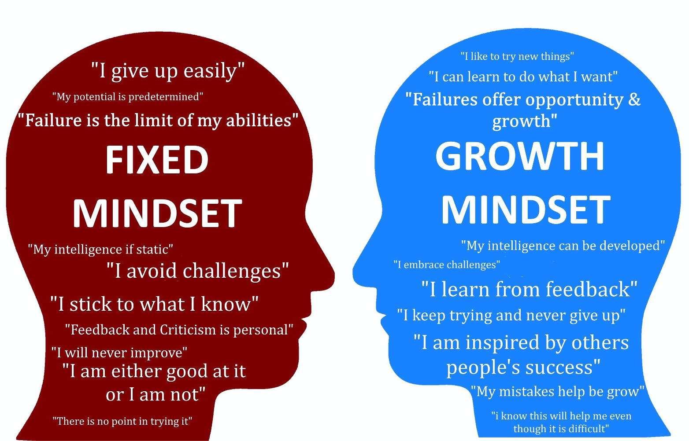

# Thinking, Control and Intelligence {#sec:ch-think}

What is *smart*?  This is the fundamental question for this chapter, with many profound personal and societal implications.  Is there just one kind of smart, or are there multiple different forms of intelligence?  How can we reconcile any form of *general* intelligence with everything we've learned up to this point, about how the brain works at a biological level?  The brain is composed of billions of neurons, interconnected by vast networks of synapses, wherein all of our knowledge, and, presumably, intelligence, must lie.  Do "smart" people have more neurons or synapses?  Or, perhaps, *fewer* synapses?  Are their neurons somehow fundamentally different from other people who measure as less smart according to standard intelligence tests?

And what are those intelligence tests measuring anyway?  Are they really some kind of "pure" measure of intelligence, or do they just reflect the degree of western-style education (and health and wealth) that a person has?  What does your IQ score really tell us about you as a thinker, and about your prospects for future success in school and the real world?  So many important questions!

If our brains were more like digital computers, these questions would have much simpler answers, and, unfortunately, most people intuitively think about intelligence in these simpler terms, leading to a significant and pervasive misunderstanding of the true nature of intelligence in the brain.  As we discussed in the previous chapter, a computer has discrete parts (the CPU, RAM, and hard drive; [@fig:fig-computer-memory]), and each of these parts can be directly quantified in terms of capacity and speed.  If you're at all savvy about these things, you can obsess about getting the best value for your money along each of these dimensions, and, generally speaking, the faster the CPU and the more RAM and hard-drive storage, the more you can achieve with your computer.  Computers really do come in obvious degrees of "smartness".

But our brains are nothing like that of a digital computer.  Instead, cognition emerges out of the interactions of billions of chattering neurons, which are fundamentally shaped by learning processes over an extended period of time.  As we will explore in [@sec:ch-origins], we start out with virtually no discernible intelligence (despite how cute and special our parents think we are), and it takes most people a few *years* to even learn how to control their own bowels!  Wow.  The rest of the animal kingdom must think we are complete idiots, which comports with an amusing *Onion* headline to that effect.

Given that we clearly don't start out with much in the way of intelligence, it seems hard to escape the conclusion that intelligence is fundamentally a product of learning (in concert with other developmental / maturational changes).  And this view is also hard to avoid when you think about all those synapses that need to get wired up in just the right way to produce whatever cognitive abilities we end up with.

So are "smart" people just better learners then?  If so, what makes some people better at learning than others?  When we explored this question in [@sec:ch-learn], one of the major conclusions is that learning is driven fundamentally by *motivation*, and all that dopamine and related machinery that gets us up in the morning and ready to pursue our daily goals, etc.  Indeed, we will review various sources of evidence that are consistent with the overall idea that motivational differences play an outsized role in determining measured level of intelligence.  Of course, there are many, many complex factors that shape an individual's trajectory of learning and development, and motivation is itself a multi-faceted thing, so perhaps we aren't explaining too much when we say that motivation plays an important role.

{#fig:fig-dweck width=50% }

But understanding the major factors shaping intelligence may affect how we think about ourselves, and others, in important ways.  If we view intelligence as a product of learning and motivation, then it is more obviously malleable.  This is the critical difference between a **fixed mindset** about intelligence, versus a **growth mindset**, as emphasized by Carol Dweck and colleagues [@Dweck08], in an increasingly influential body of work ([@fig:fig-dweck]).  The growth mindset emphasizes that intelligence is not something that people "have", but rather, something they have to cultivate --- something that grows over time.  Increasingly, schools and teachers are recognizing that motivational factors have a huge impact on educational success, and they are developing innovative ways of motivating students to learn, and making the material more obviously self-relevant.

Fundamentally, the idea that intelligence is largely the product of time spent learning means that **anyone can learn anything**, if they only have sufficient motivation and time to invest into it.  This open-ended, ambitious view of intelligence surely has the effect of opening up your individual horizons and sense of what is possible.  Personally, I have always had this belief, and I have learned lots of complicated things, often slowly and with great difficulty.  Eventually, things that once seemed impenetrable become just another familiar part of my mental toolkit.  I have a very salient early memory of spending far longer than my peers figuring out how to simply connect a battery to some gadget in a summer school class as a kid.  I felt like an idiot.  But eventually, I figured it out, and learned this valuable lesson that, with sufficient effort, I could succeed.

Hopefully, you are now motivated to learn more about the history and current state of understanding about the nature of human intelligence, and the thinking processes that underlie it!  We'll start off by exploring the core questions of what "thinking" is, and what kinds of brain mechanisms are particularly important for it.  The conclusion from this may seem to contradict what was just said above: maybe we *do* have something like a CPU in our heads after all --- except it is a CPU made out of neurons and brain systems, and it runs on dopamine!  This is an important example of an *emergent* system, like the gears we talked about in [@sec:ch-neuro]: the function of a CPU can be supported by various different "substances", just like the gears can be made of many different materials.

Nevertheless, our neural CPU has major differences from a computer CPU, and the fact that it is made of neurons does have important implications for how it works.  Indeed, one can understand a lot about the particular strengths and limitations of human cognitive function, in terms of the idea that we can do both neuron-like computation, *and* something that approximates the function of a digital CPU.  We have yet to develop powerful +AI (artificial intelligence) systems that capture this unique combination of both forms of computation, and perhaps once we do, we will unlock the real magic of our brains!

After gaining a better understanding of the "mechanics" of intelligence, we'll review the history of thought about the nature of intelligence, and how it has been measured.  Furthermore, we'll examine the data about the real-world implications of IQ test scores, and circle back to these big questions about the relationship between intelligence and motivation.

Another way of thinking about all of these issues, is in terms of the *control* component of the three-C's.  Our neural CPU serves as a kind of overall control system for the rest of our brain, and, as we have emphasized, this is fundamentally a *motivated* form of control, focused on getting us the things we need and want, and avoiding all the bad stuff.  Thus, the idea that motivation and intelligence are inextricably intertwined makes perfect sense from this perspective: the brain systems supporting our control functions (in the +prefrontal cortex and [basal ganglia](#basal-ganglia)) are the very same ones that directly interface with lower-level motivational and emotional pathways in the +amygdala and +dopamine system.

## The Neural CPU in the Prefrontal Cortex and Basal Ganglia

{#fig:fig-turing width=50% }

To understand what kind of neural machinery it would take to support CPU-like functionality in the brain, we start with the surprisingly simple mechanisms needed to make a computer work.  At the most abstract level, Alan Turing and John Von Neumann worked out the basic principles of a **universal computational device** (something that could in principle do *anything*) in the 1930's and 40's [@Turing36; @vonNeumann45].  Amazingly, this device only requires three essential components ([@fig:fig-turing]):

1. A way of reading and writing information from a **memory system** (conceptualized as a *tape* by Turing)

2. A +program that determines how this information is transformed in between being read and written

3. Some **active memory** where things can be temporarily cached, for the program to refer to.

These elements were elaborated by Von Neumann, in one of the most important unpublished papers of all time [@vonNeumann45], creating the foundation for modern digital computers.  We now take it for granted that computers can do almost anything, but this was just theory not so long ago.

{#fig:fig-mental-mult width=50% }

You can get a good feel for how a computer works, and why it can do anything, by considering the traditional strategies for performing multi-digit arithmetic ([@fig:fig-mental-mult]).  Instead of just staring at those big numbers and hoping a number pops to mind, you break the problem down into a sequence of simple, discrete steps.  That sequence of steps is the *program* or +algorithm, and each individual *operation* involves one of a small set of different processes, such as adding or multiplying single-digit numbers, writing down some numbers for later use (i.e., storing onto the tape in a Turing machine), and reading those numbers back in at the appropriate time (as you move to the next column of digits).

This kind of sequential, discrete, step-wise processing is entirely different from how our neurons work.  Neurons also break down a problem in to simpler components, but a critical difference is that they all work together in *parallel* instead of the fundamentally sequential, *serial* processing required for a universal computer.  The major advantage of serial processing is that it is much more flexible --- any arbitrary collection of operations can be sequenced one after the other over time, but the same is *not* true for parallel computation.  Some operations are mutually incompatible with each other, or depend one on the other, and simply cannot be performed simultaneously in parallel.

Indeed, one of the great challenges of modern computer science is trying to come up with even moderately usable parallel computing frameworks, and it is clear that the universal flexibility of traditional serial computation does not extend into the parallel realm: parallel computation must generally be setup on a case-by-case basis.  For example, in the case of multi-digit multiplication, you have to do the tens-place part of the problem first, before you know how much to carry over to the higher digits, etc --- you can't just do everything all in one step.

More generally, parallel systems are really good at doing the same kind of thing over and over again really fast (e.g., detecting patterns via networks if interacting neurons in our brain), but they are not so good at doing random, arbitrary, *different* things, which is precisely where serial computation excels.  However, serial computation is inherently much slower (one step at a time).  These fundamental tradeoffs between parallel and serial computation mean that a system that can do both will be able to achieve the best of both worlds --- that is the magic recipe that the human brain has achieved.  Our brains are parallel at the level of individual neurons and networks of neurons, but at the larger *systems* level of the brain, we can achieve a form of flexible, serial computation.

Before turning to the biology of the brain systems supporting this latter form of computation, we can see strong evidence for the presence of these two different forms of computation at the psychological level.  For example, we would predict that you need to use your "mental CPU"-like capacity whenever you take on a novel task.  For example, when you first learned to drive a car, you relied on a sequential, deliberate process that consumed all of your attention --- at each point in time, you had to keep reminding yourself of what you were supposed to be doing.  However, with sufficient practice over time, these slow, effortful processes gradually become **automated**, and you may now find yourself driving down the freeway with very little awareness of any of the underlying steps you're effortlessly performing.

This difference between the initial effortful **controlled processing** and the subsequent **automatic processing** was captured in a highly influential pair of papers by Walter Schneider and Richard Shiffrin (the same one who published the famous paper on the modal model of memory from the previous chapter) [@SchneiderShiffrin77; @ShiffrinSchneider77].

![The Stroop task (Stroop, 1935; MacLeod, 1991) demonstrates the difference between controlled and automatic processing, in the context of reading words in different ink colors.  If you try to name the ink color of the word "Green" when it is written in red ink (the *Conflict* condition), the automatic process of reading dominates over the relatively rare process of naming ink color, and you have to deploy controlled processing, which takes extra time as shown in the plotted data.  Reading words (bottom line) isn't affected much by the ink color --- the well-trained brain networks supporting this process proceed in parallel without any supervision required.  Interestingly, even when the response is identical in the *Congruent* case, the task of color naming is still slower than word reading, reflecting the extra control being exerted.  The *Control* condition involves either non-color-word reading, or pure color naming.](../figures/fig_stroop_data.png){#fig:fig-stroop width=40% }

A widely-studied example of this difference between controlled vs. automatic processing is shown in [@fig:fig-stroop] --- the **Stroop task** [@Stroop35; @MacLeod91].  The participant is instructed to either read the word or name the color of the ink the word is written in.  Because word reading is so overpracticed, it is an automatic process for most adults (to the point that you often can't stop yourself from re-reading the annoying text on your cereal box every morning).  Therefore, when confronted with the diabolical *Conflict* condition in the Stroop task, where a color word (e.g., "Green") is written in a different ink color (e.g., red), it takes extra cognitive control to prevent yourself from just blurting out the word ("Green"), when the task is to name the color (for which you have much less practice).  This shows up as a significant delay (and overt errors) in this condition.  Interestingly, even when the ink color and the word are *Congruent* (the same), there is still a delay associated with naming the color --- there is extra control being exerted to support this relatively unfamiliar color naming process.

If you run the Stroop task on kids, they don't show the same effects --- reading has yet to become automatic in them.  Furthermore, some Stroop researchers spent enough time color naming so that *it* become more automatic than reading, and they showed a kind of reverse-Stroop effect!  Thus, this process of *automatization* is dependent on learning and practice --- over time, our brains naturally turn deliberate, sequential, controlled processing into more parallel, automatic fast processing.  This is the same phenomenon that occurs for driving and so many other tasks that you once found difficult and mentally all-consuming.

Automatization is analogous to the *chunking* process discussed in [@sec:ch-mem] --- we have a very limited active memory capacity, but once we learn new concepts, we can greatly expand our capacity by using this limited capacity on chunks of information that used to be separate.  Automatization is the process of forming *procedural* chunks --- combining sequential steps into faster parallel processing that becomes relatively independent of our mental CPU --- we no longer need to exert detailed conscious effort keeping the process moving along.  In computer science terms, we seem to have a built-in *compiler* that turns serial programs into parallel processes that can be executed much more efficiently in our underlying neural hardware.

### What it takes to be a Computer

The human brain is likely unique in having the ability to function like a Turing machine --- other animals have plenty of automatic parallel processing skills, but they just don't seem to be capable of solving novel, complex tasks by performing a sequence of mental processing steps.  The reason we can function like a computer is that we have some special capacities lacking in other types of brains, supplying the key ingredients of a Turing machine:

* **Program:**  we use our *natural language* (e.g., English) as a kind of programming language.  There is abundant evidence that we routinely use verbal self-instruction to remind ourselves of what we're supposed to do next in a complex, novel task [@MiyakeEmersonPadillaEtAl04].  We literally talk ourselves through the problem, and this capacity for stringing together different such verbal programs is an essential element of flexible, universal computation.  It is unclear how far we might be able to get at flexible controlled processing without language, but likely not very far.

* **Active Memory** (registers, cache memory): special properties of our *frontal cortex* and *basal ganglia* give us the ability to maintain a small amount of information in active, **working memory**, as mentioned in the previous chapter.  This is what you use when solving a mental arithmetic problem, by constantly juggling the digits around in your working memory.  Working memory replaces the piece of paper you would otherwise use in keeping track of all the *partial products* and *control state* needed to keep progressing through a complex problem.  It is also essential for maintaining the program itself, and in this way it much resembles the function of RAM in a computer, which maintains both the program and the *stack* and *heap* forms of active memory needed to carry out the program.

* **Controlled Memory Storage and Retrieval:** we also have the ability to take control over our hippocampal episodic memory system, to deliberately encode and retrieve task-relevant information as needed, playing the role of the memory tape system in the Turing machine, and a hard drive in a modern computer.

{#fig:fig-bg-var-bind width=60% }

Consistent with the central role of the frontal cortex in making our mental computer work, this brain area (particularly the part of it in front of the primary motor area --- the **prefrontal cortex**) is differentially expanded in humans relative to other primates and mammals more generally [@SemendeferiLuSchenkerEtAl02].  Thus, a simple story is that our unique mental-computer skills are due to this expanded brain area [@DuncanAssemShashidhara20], but this cannot be entirely correct, because prefrontal cortex is also expanded in other great apes.  Further, despite its expanded size, the capacity of our prefrontal working memory system (around 4 chunks) is dramatically smaller than that of even the most primitive digital computer, so it remains unclear exactly what kind of capacity a larger prefrontal cortex truly provides.

The **basal ganglia** also play a critical role in making our mental CPU function, by orchestrating the serial, sequential steps of cognitive operations that we take in solving a problem --- it turns the parallel brain into a serial system.  As discussed in [@sec:ch-neuro] and [@sec:ch-learn], the basal ganglia are critical for making Go / NoGo decisions about what to do next, and this decision-making bottleneck forces us to take discrete, sequential cognitive steps [@HerdKruegerNairEtAl21].  Interestingly, the early cognitive models of human reasoning and problem solving incorporated something called a **production system** [@NewellSimon72], which plays the same role as the basal ganglia in the brain [@StoccoLebiereAnderson10; @JilkLebiereOReillyEtAl08]. [@fig:fig-bg-var-bind] also shows that the basal ganglia can enable a form of flexible *variable binding* [@OReilly06], which is another important property of computer systems that is otherwise hard for neurons to achieve.  There are still important mysteries about how exactly the prefrontal cortex and basal ganglia learn to become a Turing-machine like system, but we do understand many of the basic principles at work already.

In summary, although we are unique in having *some* ability to perform flexible, serial, controlled processing to solve novel tasks, our brain is still running in automatic, parallel processing mode under the hood, and that strongly affects our computer-like abilities.  For example, while our brains are impressive in many ways, they pale in comparison to a dime-store calculator for doing basic arithmetic!  What we lack in serial computing abilities, we try to make up for with all the amazing mental skills that we have automatized through learning and practice.  This is consistent with the idea that motivation, which drives this learning, plays such an important role in human intelligence.  In particular, learning and motivation are essential for taking advantage of the intellectual building blocks that our cultural and educational environment provides to us.  Language is also essential for leveraging our vast cultural storehouse of knowledge, in addition to being essential for our internal programming capacity. 

Thus, we tend to seek a *single* critical factor that makes something happen (e.g., a large PFC = intelligence), but instead it is almost always many interacting factors, which is clearly the case here (and we haven't even talked about the importance of being able to cook food to get substantially more calories, so we have time to think instead of foraging all day long!).  Indeed, so many different factors had to come together to enable the extremely recent flourishing of human intelligence, it truly boggles the mind.  You are exceptionally lucky to be living at this point in time, when all of this is happening, and yet the vast majority of people just take all of this for granted!

## Strengths, Weaknesses, and Biases of our Neural Computer

The picture of human intelligence that has emerged from the above considerations has important implications for understanding how we think and reason in real-world situations, with life-and-death consequences.  To summarize:

* Our brains operate best on familiar, concrete problems via prior learning and automatization.

* But we do have a limited ability to tackle novel problems through slow, serial, controlled processing.

* Also we are generally lazy and motivational factors are paramount in everything we do and learn.

This particular combination of strengths and limitations results in a systematic set of **cognitive biases** and other cognitive properties, many of which were first characterized by the nobel-prize winning psychologist Daniel Kahneman and his late longtime collaborator Amos Tversky.  These biases are described in terms of the reliance on **heuristics**, which are short-cut, "rule of thumb" kinds of solutions to problems, in contrast to the typically more labor-intensive (and often intractable) *optimal*, *rational* solutions.

For example, the **representativeness heuristic** characterizes our reliance on overall similarity judgments of a given situation to a stereotype or prototypical situation that we have previously learned about.  In other words, instead of going through all the mental effort of trying to truly understand a novel problem or situation, we just lazily rely on our previously-learned parallel neural pathways that *compress* something down into a seemingly well-understood high-level summary.  Indeed, the representativeness heuristic is really just another name for our principle of compression.

The classic demonstration of this heuristic involves the fictional *Linda*, who is described as follows: 

> Linda is 31 years old, single, outspoken, and very bright. She majored in philosophy. As a student, she was  deeply concerned with issues of discrimination and social justice, and also participated in anti-nuclear demonstrations.

You are then asked which of the following alternatives is more probable:

> A. Linda is a bank teller.

> B. Linda is a bank teller and is active in the feminist movement.

What do you think?  Most people answer B, because it is more similar to the stereotype activated by the description of Linda.  Again, we lazily rely on our basic neural processing mechanisms whenever possible, and these naturally produce a stronger match for the second characterization of Linda.  But, from a rational, mathematical perspective, it is *impossible* for B to be more probable.  That word *and* is mathematically equivalent to multiplying probabilities, and the probability of anyone being active in the feminist movement is, objectively, less than 1.  Thus, the joint probability of being a bank teller *and* a feminist must necessarily be less than just being a bank teller!

The **availability heuristic** is similar to the representativeness heuristic, in also relying on a general sense of familiarity, instead of doing the hard cold math.  In this case, the familiarity comes from the emotional (motivational) salience of different events, instead of our compiled stereotypes (though both are very similar in relying on learned synaptic pathways --- it is not clear that these are really distinguishable at a neural level).  To demonstrate this heuristic, please estimate which is more likely:

> A. Dying in an airplane crash

> B. Dying in from nephritis, nephrotic syndrome, and nephrosis

Many people avoid flying in airplanes due to fear of crashes, which inevitably get extensive media coverage, and are highly salient and gruesome.  It is not clear if there has ever been any major media coverage of the latter cause of death, or if you even know what it is.  Yet it is the 9th highest cause of death, at over 50 thousand in the USA in 2016, according to the CDC: [CDC.gov stats page](https://www.cdc.gov/nchs/fastats/leading-causes-of-death.htm).  In contrast, there were only *59* total deaths *worldwide* due to airplane crashes in 2017!

The real-world life-and-death implications of our reliance on the availability heuristic were starkly illustrated in an analysis by Gerd Gigerenzer of people's avoidance of flying after the September 11, 2001 terrorist attacks in the US [@Gigerenzer06].  He found that there were roughly 1,500 additional deaths caused by people choosing to drive instead of fly --- driving is much, much riskier than flying, and yet because it is so familiar and commonplace, people vastly underestimate the relative risks.

Gigerenzer and colleagues have many other studies showing our general incompetence in dealing with statistical information, again with real-world implications.  For example, even highly-trained doctors make significant mistakes interpreting the statistical results of medical studies on health risks and probabilities.  One of the most important errors we make is known as **base rate neglect**.  For example, if you hear that drinking alcohol increases your risk of death by 12%, that sounds like a big effect.  But people routinely neglect to take into account that the base rate against which this percentage is measured is extremely low.  In practice, the difference amounts to just *4* additional deaths per 100,000 people per year: [New York Times article](https://www.nytimes.com/2018/08/28/upshot/alcohol-health-risks-study-worry.html). This is really an instance of the *contrast* effect --- we focus on relative differences as captured in the percentage, but not on the raw values.

{#fig:fig-wason width=50% }

Another important demonstration of our strong preference for reasoning about familiar, concrete situations comes from the **Wason card selection task** [@Wason68] ([@fig:fig-wason]).  Here, your job is to verify the application of a particular rule about what is on different sides of the cards.  Look at the figure and formulate your answer.  Now, consider this alternative problem:

> You are a bartender.  If you are going to serve alcohol to someone, they need to be over 21.  Who do you card?

Critically, you card someone who is *under* 21.  Did you likewise decide to flip the *brown* card in the Wason card selection task?  Probably not.  But think about it: if a card has brown on one side, and it has an even number on the other side, then the rule is incorrect.  The brown card is the "cheater".  You probably said that the red card should be flipped.  But the rule says nothing about the other side of a red card --- it could be either even or odd.  Likewise, people over 21 can either drink or not drink --- it doesn't matter.  You don't card people who are obviously over 21.

This task again demonstrates that our ability to perform abstract logical reasoning is extremely limited, and we do much better with familiar, concrete cases like the bartender example.  By contrast, a standard digital computer programmed with the basic rules of logic can easily get the abstract form of this problem correct, and in fact would struggle understanding a question like "who do you card?" without much more explict specification of what that means.  Thus, people are really good at "common sense" reasoning, and pretty bad at abstract reasoning, and computers are generally the opposite.

### Task Transfer and Education

{#fig:fig-toh width=50% }

Another very important consequence of the concrete nature of our brains is that things we learn in one context often do not **transfer** very well to another context.  For example, classic studies of problem solving tasks such as the *Tower of Hanoi* ([@fig:fig-toh]) have found that, having figured out a solution to that problem, people are generally not very good at applying that same solution to another version of the same underlying problem, portrayed in a different "skin" (i.e., differing in only superficial, task-irrelevant factors) [@KotovskyHayesSimon85].  Although transfer can occur, and there are reliable ways to make it more likely to occur [@AndersonRederSimon96], it is clearly not the natural state of the system.  From a neural perspective, the brain learns everything in terms of the specific patterns of neural activity present during the learning episode, so the only way to get knowledge to transfer to a novel situation is to ensure that these patterns of neural activity are shared across situations.

These and other related findings have led to the development of the **situated learning** theory [@LaveWenger91; @GreenoMooreSmith93], which emphasizes the concrete, specific nature of human learning.  Although there have been some debates about the generality of this framework [@AndersonRederSimon96] --- people *do* have some ability to engage in abstract reasoning and *some* knowledge does transfer --- the basic principles remain solid and are increasingly incorporated into educational strategies.

A recent controversy about transfer of learning has arisen in the context of the increasingly popular brain training programs, such as that offered by `lumosity.com`.  These programs are based on the idea that you can train up your brain like a muscle, and increase your intelligence as a result.  However, consistent with the difficulty in transferring learning, a recent review of a number of studies shows that there is very little transfer of this brain training beyond the specific tasks that you practice [@SimonsBootCharnessEtAl16].  So, you can get better at the specific arcane puzzles that you practice, but, unfortunately, it doesn't really transfer to make you generally more intelligent.  And lumosity was successfully sued for making false, misleading claims to the contrary!

## Programs in the Mind: Problem Solving and Reasoning

Despite all the denigration of our capacity for abstract reasoning, and the relatively modest power of the neural CPU in our brains, we nevertheless can do some impressive feats of cognition.  At least, some of us can!  After all, Turing was able to prove the universal nature of his computational machine, using his own relatively modest neural CPU (he didn't have a real computer to work with yet).  In this section, we review some of the kinds of things we can do with our neural CPUs, and how these have been studied in psychology.

Some of the pioneering early work using the computer as a model for the human mind was conducted by Allan Newell and Herbert Simon at Carnegie Mellon University (CMU) in Pittsburgh, PA [@NewellSimon72].  These scientists and their colleagues focused on how people solve various kinds of challenging puzzles and games, including the *Tower of Hanoi* ([@fig:fig-toh]), and chess.  When you first start doing any kind of puzzle, the initial strategy is often a semi-random **trial-and-error** process of trying out different actions, and seeing how it goes.  Another name for this is **hill-climbing** or **gradient ascent**, where you measure success in terms of the visual similarity of the current state to the target state.  In the case of Tower of Hanoi, this results in trying to put discs on the destination peg as early as possible, which turns out to not be such a great idea.

Interestingly, good puzzles often have this characteristic of requiring you to move further *away* from something that looks like the final solution, in order to solve the problem.  In other words, they specifically thwart the natural hill-climbing solution.  This ability to move away from the goal has been studied in babies and animals using a *transparent barrier detour* task, where a desired object (food or toy) is hidden behind a transparent barrier --- the direct reach solution must be rejected in favor of the indirect reach-around behind the barrier [@Diamond90; @WallisDiasRobbinsEtAl01].  These studies show that the prefrontal cortex is important for this ability to overcome the direct approach in favor of the indirect reach, consistent with the idea that these kinds of challenging puzzles more generally tap our higher-level flexible cognitive processing.

{#fig:fig-outside-box width=20% }

This same requirement for overcoming the initial "obvious" solutions to a problem is featured in **insight problems**, where the surface features of the problem strongly suggest one type of solution, but another,  different kind of solution is actually required ([@fig:fig-outside-box]).  The relative difficulty that we have breaking out of a given **mental set**, known as **functional fixedness**, is nicely illustrated by these problems.  But really, it is just a more advanced version of the same problem in all of these puzzles: the first ideas don't work, and you need to hunt around for an entirely different approach.  This has entered the popular lexicon in terms of "thinking outside the box", likely in reference to the puzzle in [@fig:fig-outside-box].

Games such as chess provide the opportunity to explore more advanced strategic thinking.  Early AI approaches to solving these games involved the "obvious" strategy of figuring out what your opponent might do if you make a given move, and so on, to pick the move with the best potential future outcome.  This is known as a *look-ahead* search algorithm, and is essentially what the Deep Blue chess playing computer employed when it beat the famous chess champion, Gary Kasparov.  The main challenge with such an algorithm is the *combinatorial explosion* problem associated with the very large *state space* of a complex game like chess --- there are so many different possible future move strategies, that searching all of them quickly becomes computationally prohibitive.  The Deep Blue computer basically used massive numbers of computer chips to search this space in parallel, executing a pure "brute force" solution.

The limited capacity of our neural CPU prevents us from using such a brute force strategy.  Instead, research from Simon and colleagues at CMU showed that people use a much more perceptually-based strategy [@GobetSimon96]. Specifically, chess experts leverage their massively-parallel neural networks to recognize good and bad board positions, based on extensive learning experience with the game.   The recent advances by the Google DeepMind team on AI systems that play the ancient game of *Go* essentially combine this perceptual expertise strategy with the brute-force look-ahead strategy, to create a human-crushing Go master machine [@SilverSchrittwieserSimonyanEtAl17].  This system provides a good demonstration of the power of the combination of parallel neural-like computation, with more flexible CPU-like processing.

However, unlike people, the DeepMind model can *only* do this one task --- the challenge of capturing the open-ended flexibility of the human mind remains very much beyond any existing AI technology at this point.  Another critical difference is that people have an awareness of the strategies they are trying, and can explicitly formulate particular aspects of the overall puzzle, to guide their insight process along.  Thus, we are using something more like a **means-ends** analysis of the problem --- reasoning backward from target solutions (the "ends") to the means that should lead to those ends.  More generally, the ability to leverage +metacognitive knowledge of our own internal mental states, and use that to figure out what steps need to be taken to solve a truly novel problem that we've never encountered before, is likely an essential strength of the human brain, which is tied directly to our capacity for conscious awareness, as discussed in [@sec:ch-consc].

Another important lesson from studying advanced human cognitive performance is the 10,000 hours of experience required to become an expert in a domain [@EricssonLehmann96]: after all this experience, people can develop deep, systematic ways of encoding a domain, that enables them to derive truly novel insights and make the kinds of  advances that propel fields forward.  Although we all take it for granted, most people develop systematic levels of sensorimotor and language expertise over the first several years of life, which provides the foundation for our extensive cognitive abilities shaped through subsequent education.  Thus, while we do have our limitations, understanding better how learning shapes the neural pathways supporting this domain expertise may provide critical insight into our uniquely human intelligence.

## Measuring Intelligence and its Implications

Now that we have some understanding of the nature and scope of human intelligence, we turn to the controversial history of IQ testing.  This history is controversial because the central question of the genetic versus environmental basis for intelligence has been at the center of these tests from their beginning, and because of the major question of the potentially biased nature of these tests.  Briefly, one of the earliest tests was developed by Alfred Binet in France in the early 1900's, and translated and further developed by Lewis Terman at Stanford University, resulting in the **Stanford-Binet** IQ test.  This test was based directly on academic skills, and includes factors such as knowledge, quantitative reasoning, visual-spatial processing, working memory, and fluid intelligence.  The test was standardized for children at different grades, and was initially focused on identifying children who were outside of the normal range for each grade.

{#fig:fig-wais width=80% }

The later **Wechsler Adult Intelligence Scale (WAIS)**, first developed by David Wechsler in the 1930's, is still widely used to this day, and is by far the most popular IQ test.  It attempted to improve over the Stanford-Binet by separately testing verbal and non-verbal ("performance") intelligence ([@fig:fig-wais]), and relying less on raw speed as a factor (though it is retained as a specific sub-factor).  The WAIS is similar to the Stanford-Binet test in using more of a "scattershot" approach to measuring intelligence --- many different specific tests are combined together to paint an overall picture.  Working memory constitutes one of four major subscales in the WAIS, which is consistent with the essential role of working memory in supporting flexible CPU-like processing.

An important feature of the WAIS measure is that it has been **standardized** so that a score of 100 is *defined* as having a precisely average level of intelligence, and intervals of 15 points represent a standard deviation according to the normal (gaussian) distribution.  Thus, someone with an IQ of 115 is one standard deviation above the mean, and is thus measured as being "smarter" than 84.13% of the population, and someone with an IQ of 130 is "smarter" than 97.72% of the population.  This standardization applies to "adults" aged 16 or older, and there is a different scale for children.

One of the major sources of controversy about IQ tests such as the WAIS is the extent to which it might be systematically biased against different populations, such as women and minorities.  This is a difficult question to answer, because there is no other accepted standard to compare against.  In this case, we can at least address three important features of the test: its **reliability**, **construct validity**, and **predictive validity**.  The reliability is assessed by repeatedly testing the same people, ideally with different versions of the same general test, and measuring the consistency of their scores across tests.

Construct validity is much more subjective and difficult to assess --- basically it is a judgement call on the part of scientists that the individual test components are actually measuring something useful about the construct of intelligence.  In any case, it is somewhat circular: the test measures those specific abilities that it actually tests, and your score reflects your ability to perform those specific tasks.  No specific test can ever measure anything other than what it specifically tests.

Thus, the most important property of the test is its *predictive validity*: how well does it predict *other* things about people?  This is the most relevant and directly measurable property of an IQ test --- if it is really measuring intelligence, then it should be able to predict how well people do at things that we generally agree require intelligence.  Here, the evidence is a bit mixed.  For example, your IQ test score predicts subsequent school performance (i.e., grades) with a correlation factor of about 0.5 [@NeisserBoodooBouchardEtAl96].  This is actually not a very strong correlation --- even though it sounds like a "half strong" correlation, you have to square this number to determine how much total variance in grade outcomes are accounted for by IQ --- so only 25% of the total variance.  This means 75% of the variance is *not* attributable to IQ --- by far the majority of it.  Nevertheless, it is probably the best *single* predictor of academic performance.  Interestingly, in discussing the strength of this factor, [@NeisserBoodooBouchardEtAl96] point largely to motivational factors as likely additional determiners of academic performance.

The amount of variance predicted by IQ scores on factors such as job performance, income, socio-economic status (SES), health, and social status are all lower than for school performance, and it is very difficult to accurately factor out the contributions of parental factors (e.g., parent SES), which affect both IQ and most of these other factors (this point also applies to the educational predictiveness).

Importantly, the predictive validity of IQ scores does *not* differ across different groups, such as women or minorities [@NeisserBoodooBouchardEtAl96].  This provides one way of assessing whether IQ tests are inherently biased, and the results suggest that they aren't biased at this level.  However, just looking at the test from a construct validity perspective, it definitely does test lots of knowledge that is typically learned in school, and must be expressed verbally.  Thus, an individual's prior schooling environment is undoubtedly going to have a significant impact on their IQ score.

Furthermore, as noted above, there are significant correlations between parental SES and IQ, at about 0.33 [@NeisserBoodooBouchardEtAl96].  Thus, there is no doubt that your raw IQ score reflects a strong contribution from various environmental factors that likely systematically vary among different groups.  Importantly, the predictive validity factor is not directly affected by such mean differences --- it is only affected by the *variance* in scores across individuals.

In summary, IQ is both a biased and fair test of intelligence!  It is biased at the mean level, and by the very fact that *any* test of complex task performance is likely to be affected by relevant SES-level factors.  But at the level of predictive validity, it is fair in that there aren't significant differences across groups.  We'll consider the data on the genetics and heritability of intelligence in [@sec:ch-origins].

### Multiple intelligences

One of the major debates about IQ measures is the extent to which there are really distinct aspects of intelligence, or rather a single underlying **general intelligence factor**, typically denoted by the letter *g*.  Charles Spearman was the main original advocate of the importance of this *g* factor --- he noted that performance across the different subscales of IQ tests is positively correlated, and attributed this common factor (*g*) as being the "true" underlying meaning of intelligence.  Arguing the opposite case was L. L. Thurstone, who advocated a multi-factorial model of intelligence.  Interestingly, both were looking at the same data, and just interpreting them differently --- this data shows both multiple separable intelligence factors in addition to the common variance across all of them associated with *g*.

A distinction that is less subject to these different interpretations is the difference between **crystallized** and **fluid** intelligence, as proposed originally by Raymond Cattell.  Crystallized intelligence refers to the accumulated knowledge and skills learned over experience, whereas fluid intelligence refers to the ability to actively juggle information in your mind (e.g., in the service of mental arithmetic).  Thus, fluid intelligence corresponds to the *controlled processing* abilities discussed above, and the neural CPU functionality supported in part by the prefrontal cortex and basal ganglia.

By contrast, crystallized intelligence refers to the accumulated synaptic changes from learning.  These two forms of intelligence are often considered from an developmental perspective, where crystallized intelligence generally increases over the lifespan (i.e., wisdom accumulates over time), while fluid intelligence unfortunately declines.  This decline is thought to mirror the declines in dopamine levels with aging, which may suggest that there may be an important motivational component to the story as well.  Could a strongly-motivated senior still muster the computational horsepower of a young adult?

{#fig:fig-ravens width=60% }

One of the best single measures of general fluid intelligence is the Raven's progressive matricies task, shown in [@fig:fig-ravens] [@RavenCourtRaven77; @ConwayCowanBuntingEtAl02].  This task is also similar to the matrix tasks used in the WISC, to assess non-verbal intelligence.  The non-verbal nature of the task likely helps to keep it from being "contaminated" by crystallized knowledge factors, and thus contributes to its ability to more directly measure the construct of fluid intelligence.  It clearly requires considerable juggling of information in working memory, to figure out which of the possible patterns best completes the missing cell in the matrix.  Consistent with everything said above, this Raven's task and the fluid intelligence construct have been closely associated with working memory function [@ConwayCowanBuntingEtAl02].

As discussed earlier, many people interpret this notion of fluid intelligence and working memory function in computer-like terms --- some people just have better "RAM" than other people.  However, the available evidence more strongly implicates motivational factors as paramount.  Thus, a revised interpretation would be: measures of general fluid intelligence reflect the extent to which an individual is willing to exert significant cognitive effort on arbitrary lab tasks.  People who are more willing to do this score higher on these measures, and, perhaps not coincidently, also tend to do a bit better in school overall --- school similarly requires you to allocate cognitive effort on things that you might not otherwise want to spend time and effort on.

## Individual Differences in Prefrontal Cortex / Basal Ganglia?

The critical role for working memory, cognitive control, and the prefrontal cortex / basal ganglia system in supporting our flexible computer-like cognitive abilities does introduce another possible explanation for individual differences in intelligence, however.  It *could* be the case that different people somehow have different capacities / speeds / functionality in these particular brain systems, and that is what explains differences in intelligence.  Furthermore, *if* this were the case, then because this flexible controlled-processing system is used as the first step in learning new skills and cognitive abilities (especially in math and other school-based learning), there could be a kind of snowballing effect where small initial differences in these brain areas could multiply over time, leading to larger differences in measured IQ scores.  This kind of scenario is most similar to the "traditional" notions of intelligence as a fixed thing that you either have or don't have, and obviously fits well with intuitions based on the computer metaphor of the mind.

But how well does it fit with the available data?  First of all, it is well-established that major disruption to the prefrontal cortex results in impairments to controlled processing, for example on the classic Stroop task [@CohenServan-Schreiber92; @StussFlodenAlexanderEtAl01], and on many aspects of social, moral and other forms of reasoning [@EslingerFlaherty-CraigBenton04].  However, the latter paper, and various other related findings, have shown that measured IQ scores can be relatively intact even with significant early frontal brain damage, suggesting that the relationship may be somewhat more complicated.

The most relevant question, however, is whether *normal* variation in prefrontal cortex / basal ganglia function accounts for much of the measured individual differences in intelligence?  One early attempt to answer this question relied on establishing correlations between measures of working memory and intelligence, and came up with a strong positive correlation on the order of 0.6 to 0.8 (where 1 is the strongest possible correlation) [@Engle02].  However, subsequent work largely undermined that conclusion, instead suggesting that there is a separate factor for general fluid intelligence, independent of working memory capacity [@Engle18].

Another angle on this question found that much of the measured differences in working memory capacity were actually due to motivational factors in the first place [@AdamVogel16].  Specifically, participants who scored lower on their working memory scale did so because they had a higher probability of **lapsing** --- entirely failing to engage in the task on a given trial.  However, when they did engage, their measured working memory capacity was essentially the same as those who had a high working memory capacity score (and who also had a high level of task engagement with much less lapsing).  Further studies showed that this rate of lapsing could be significantly reduced by effective motivational manipulations.  Thus, *motivation* could indeed be the critical "third variable" that drives the relationship between measured working memory and intelligence scores.

![Correlation between brain activity & functional connectivity, and measured general intelligence (Hearne et al, 2016).  The "default-mode network" areas in red are primary emotional / motivational areas in frontal cortex (see [@fig:fig-vmpfc]) that are active when people are left to their own thoughts in the scanner.  The fronto-parietal network in yellow are areas associated with cognitive control and working memory.  Interestingly, the emotional / motivational areas make a major contribution to the correlation, both in terms of within-network interconnectivity and cross-network connections to the control areas.](../figures/fig_hearne_et_al_16_iq_nets.png){#fig:fig-iq-brain width=80% }

A recent attempt to more directly find the neural correlates of individual differences in intelligence found that motivational and emotional areas of the prefrontal cortex are among the most strongly correlated with measured general intelligence [@HearneMattingleyCocchi16] ([@fig:fig-iq-brain]).  Thus, the same answer keeps coming back up across all of these different studies: individual differences in intelligence seem to be more strongly driven by motivational factors than by the raw capacity or other properties of the prefrontal cortex / basal ganglia system. 

This conclusion also makes sense given the relatively tiny capacity of prefrontal cortex, where only around 4 items can be maintained at a time --- this tiny number seems completely out of proportion with the billions of neurons in this brain area.  Thus, the overall functional properties of this system are unlikely to be due to normal variation in the numbers of neurons or other basic biological properties of these areas.  Instead, they are much more likely to be due to the degree of learning and experience that has shaped these networks to perform like a serial computer.

## Control

Ultimately, everything comes down to a question of *control*.  The prefrontal cortex and basal ganglia are critical for cognitive control, but also for control of your entire self, at all the relevant levels.  The ventral and medial areas of prefrontal cortex receive extensive inputs from brainstem emotional and body-state areas, and integrate this "hot" state information with "cold" planning and sensory-motor control strategies, all in the service of keeping *you* in control of *you*.  

In other words, control is about achieving your own goals, satisfying your own needs, etc.  Thus, when scientists bring you into the lab, you really are a *participant* in the experiment, and the degree to which different people actually participate varies according to their motivational goals.  If someone is really interested in what is going on inside their brain, and motivated to demonstrate their own sense of mental superiority, they may devote considerable effort to a given lab task.  But others may have "more important" things on their minds, and spend less overall effort.

Neuroimaging studies have provided a peek into this internal battle between your own desires and goals, and those of the psychology experimenter.  In any given experiment, your brain can be seen switching between a "task engaged" mode and the "default mode" [@FoxSnyderVincentEtAl05].  The default mode (see [@fig:fig-iq-brain]) involves all the motivational / emotional areas of the frontal cortex, interconnected with the hippocampus and other brain areas that are relevant for thinking over important recent events and planning upcoming activities.  Basically, the stuff you think about when left to your own devices.  By contrast, the task-engaged brain areas involve the working-memory and problem-solving, cognitive control areas that are needed to keep you focused and solving complicated tasks.

As we saw in the working memory capacity results discussed earlier [@AdamVogel16], the major determiner of measured capacity is how often people were willing to actually engage in the working memory task. Presumably, the rest of the time they were thinking about more self-relevant things, and exerting their own personal control over what they allocate their attention to.  Likewise, you may have drifted off into your own mindwandering space while nominally reading this chapter --- we can throw the words at you, but ultimately you are in control of whether you want to read them!

Finally, the need for control, and motivational factors more generally, may be the most important source of cognitive biases, dwarfing those mentioned earlier.  For example, in the political arena, it is typical for people from different parties to each have strongly-held and mutually incompatible views about the very same facts and events.  Are humans contributing to climate change?  This question is not really in doubt scientifically, but because it has become politicized, it has become question of emotional significance, tied directly to one's own personal sense of self and identity.

Dan Kahan and colleagues have demonstrated the power of these kinds of motivational, cultural identity-related factors in biasing people's thinking [@KahanJenkins-SmithBraman11], and the effect sizes are quite large.  More generally, when you see someone behaving in a way that you think is blatantly irrational (e.g., people voting for political candidates whose positions directly disenfranchise them), it is much more likely that they are doing that because of strong emotion-laden values, than because of some kind of error in statistical reasoning.  In other words, of the three C's, Control is by far the most powerful force shaping our behavior, even though Compression and Contrast also play important roles.

## Summary of Key Terms

This is a checklist of key terms / concepts that you should know about from this chapter.  As we learned in the memory chapter, it is a great idea to test yourself on what was said about each of these terms, and then go back and double-check --- that provides both beneficial repetition and also the *testing effect*.

* Fixed vs. growth mindset

* Neural CPU:
    + Universality of serial processing
    + Algorithm, program, active memory, main memory
    + Working memory supported by prefrontal cortex = active memory / RAM in a computer
    + Basal ganglia = production system = sequentializing cognitive steps
    + Natural language (e.g., English) = program
    + Production system
    
* Automatic vs. controlled processing
    + Stroop task
    
* Individual differences in Prefrontal cortex / basal ganglia
    + Working memory capacity
    + Effect of lapsing
    + Role of motivation
    
* Cognitive biases / heuristics
    + Representative heuristic (as compression)
    + Availability heuristic
    + Base-rate neglect
    + Wason card selection task
    + Transfer of learning
    + Situated learning
    
* Problem solving:
    + Strategies: trial-and-error, hill-climbing / gradient ascent, means-ends
    + Insight problems
    + Functional fixedness
    
* Intelligence tests:
    + Stanford-Binet
    + Wechsler Adult Intelligence Scale (WAIS)
    + Standardized scale
    + Reliability, construct validity, predictive validity
    
* Multiple intelligences
    + Generalized intelligence factor *g*
    + Crystallized vs. fluid intelligence
    + Raven's progressive matricies
    
* Control:
    + Cognitive control
	
