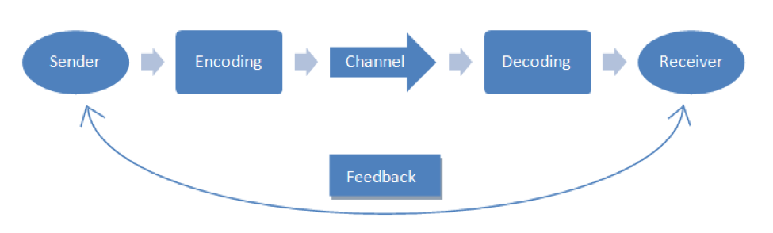
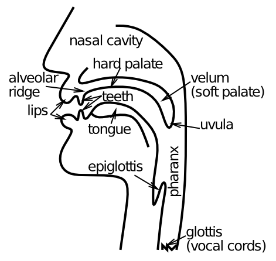
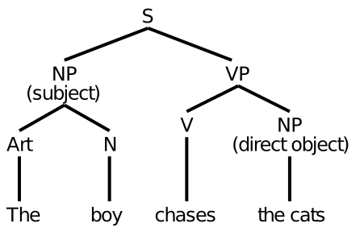
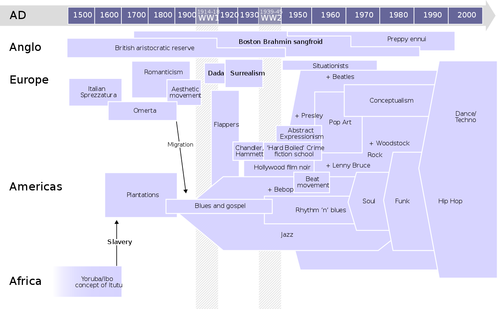

# Language {#sec:ch-lang}

Language is like water to a fish.  It is everywhere, and, as a result, we can often end up taking it for granted.  Indeed, it is right here, right now, at every moment of this text as I'm writing it and you are reading it.  It is unfolding right before your eyes, and somehow dribbling out of my fingers as I type these words.  Without it, we would truly be nowhere.  At least, certainly not *here*.

The full scope of language is unique to humans, although other animals certainly communicate in a variety of ways, and because we aren't native speakers of those languages, there remains some doubt that we might be underestimating their expressive power.  Over the first few years of life, we somehow naturally soak up and master language, in ways that adults remain jealous of when they try to learn a new one --- it is only then that we truly start to appreciate the incredible complexity of language (or when you try to read about it in a textbook like this)!  This natural affinity for learning language has led many to believe that the brain comes pre-wired with a kind of proto-language module built right in, while others have examined the remarkable learning abilities of infants and toddlers and concluded that language learning from a kind of blank slate can explain everything.  As usual, the truth is likely somewhere between these *nature* vs. *nurture* extremes, as we'll revisit in [@sec:ch-origins].

Once we have acquired language, how does it change our brains?  How would a human brain function *without* language?  These fascinating questions are almost impossible to answer precisely, but there are a number of remarkable examples of children raised by wolves and other rather more horrible circumstances that provide some insight.  Furthermore, it is perhaps not unreasonable to use our closest great ape species as points of comparison for organisms in their natural environment with highly similar brains, but without our capacity for language.  From that standpoint, it is clear that language is enabling just about everything that makes us unique among all the animals --- chimps and gorillas are pretty amazing, but they aren't flying airplanes, are they!

For that matter, however, neither were we until a little over 100 years ago, and looking back, there is clearly some kind of exponentially accelerating process, going from the earliest societies with recorded histories several thousand years ago, to the breakneck speed of progress in the present day.  It is not a coincidence that the pace of progress seems to be correlated with technological developments that enable faster and more efficient forms of communication, among ever-larger groups of people.  In short, the airplane and today's proliferation of rocket ships are really fueled by the progression of communication technologies, starting with the printing press in 1440, and continuing from there, with the telegraph, telephone, radio, television, internet, and cell phone each providing qualitative advances in our ability to communicate.  Together with the development of computer technology from the 1960's onward, we are witnessing the fundamental importance and power of *information* and *communication*.

Just in my lifetime, I witnessed the development of most of these more recent advances.  When I was was a kid in the early 1970's, my sister and I would watch *Gilligan's Island* on a color TV with no remote control (we had to get off the couch to change the channel, and there were only 3-4 channels anyway, so it wasn't that big of a deal), and we would read newspapers and magazines that delivered information updated at most once per day.  By the time I was in middle school, I took a class on computer programming, using the brand new Apple II computer, saving programs on floppy disks, or printing things out on a huge printer.  I had a progression of computers through middle school, high school, and college, none of which were connected to the internet (which was only available in the military and universities).  Finally, in graduate school starting in 1990 I used computers connected to the internet, and discovered the world of email and the *usenet* newsgroups.  I remember exactly the day in 1993 that a programmer working with me first pulled up a web browser and connected to the world-wide-web: we looked at a webcam of a coffee pot in Hawaii, and I thought it all seemed pretty silly.  I never really thought of a computer as a communication device, and spent most of my time writing my own programs to simulate the brain.

As we will revisit in [@sec:ch-soc], we always seem to underestimate the importance of our social and cultural environment in shaping and enabling our individual abilities.  We are only conscious of our internal mental state, which is uniquely ours, and all that other stuff out always seems peripheral.  But soon enough, that silly internet became an incredible timesaver: I no longer had to go to the library to look up scientific articles.  I could google (I was an early google adopter, which I thought was cool because they used Linux) information that helped me write programs faster, and download software directly from the internet instead of waiting for a disk to be snail-mailed to me.  It is impossible for people who grew up with the internet and always-connected cell phones to appreciate how *slow* and *inconvenient* communication was in the "olden days".  And I of course could not imagine how people used to depend on horses and even foot travel to deliver hand-written messages on paper, or just by word of mouth.

In short, the pace of progress is directly proportional to the pace of communication, which has increased exponentially, and this all goes back to the importance of language, without which we are unable to communicate.  One of the most important features of language and communication more generally is the need to adopt *standards* or *conventions* --- despite our strong individualistic tendencies, we all must work together to agree upon a standard of communication, whether that is in terms of the words we use, or the adoption of standard protocols such as the internet itself, or HTML and other standards built on top of it. The biblical story of the *Tower of Babel* speaks to the importance of a shared language, and the fundamental confusion that arises when confronting people who speak a different language.  The bible also provides a testament to the central importance of language in defining cultural identity, inevitably creating a conflict between the desire to share and communicate across ever broader groups of people, and the opposite desire to build a unique identity and culture that has special meaning among a "chosen people".

In the modern world, we have a tension where English has emerged as the *de facto* standard language across the world, which has enabled these amazing advances in sharing information (e.g., all important scientific papers are written in English), but many cultures are simultaneously working to reestablish their own native languages as a way of preserving their own unique cultural identity and history.  Furthermore, somewhat ironically (and perhaps tragically), the technological advances built upon the standard computer communication protocols have enabled the current trend toward increasingly polarized, insular, and "dissociated" groups on the internet, which have created their own separate standards for what is true and accepted as fact.  This is a direct manifestation of the fundamental tension between the individual and the larger society, and the desire to create special *in-groups* that reinforce our need for *control* and power --- we need to establish *contrasts* between ourselves and others.  Thus, the fundamental influence of the 3 C's is ever-present (language itself is all about *compression* as well), and language is one battle ground on which all of this plays out in dramatic fashion.

One final question that is interesting to ponder in this context: have we reached some kind of maximum level of communication technology at this point, or are there obvious qualitative ways in which our ability to communicate could be improved yet further?  Certainly there always seems to be room for further improvements in the speed and reliability of the raw communication channels, but we now have complete portability and sufficient bandwidth to support immediate, bidirectional information exchange or large amounts of data, pretty much anywhere.  Likewise computer chips have, for the moment, also reached a kind of plateau.  What if we are approaching peak IT (information tech)?  Anyway, it is notoriously difficult to predict the future of technology, and certainly AI and maybe quantum computing will have transformative effects, but it is interesting to try to imagine what obvious form of communication that we are currently missing that people in the future will look back on and say: wow, I can't believe you grew up without *that!*  Holograms maybe?  

In the remainder of this chapter, we first discuss the basic elements of language, from speech to writing and syntax and semantics, and then investigate the nature of language acquisition, for both first and second languages.  Then, we explore the relationships between language and thought, including the power of language in enabling our cognitive abilities, driving the intellectual and technological advances highlighted above.

## The Elements of Language

{#fig:fig-communication width=80% }

Language is a means of communication, and communication is, at its most basic, the process of **encoding** **information** in a **sender**, **transmitting** that information across a **channel** of some form, and then **decoding** the message in the **receiver** ([@fig:fig-communication]).  There is also an important potential auxiliary feedback channel that can help control the communication process (e.g., putting up your hand in a blocking gesture when not ready to receive a message).  These elements of communication apply generally to *any* form of communication, including between computers.

{#fig:fig-communication-speech width=80% }

In the case of human speech, and almost all forms of animal communication, the *channel* is vibrations in the air, and encoding and decoding involve creating and perceiving these sound waves [@fig:fig-communication-speech].  For any communication process to be successful, there must be some kind of **protocol** or *mutually-understood convention* for encoding and decoding.  As shown in the figure, there are multiple levels to this protocol (as is the case in computer communication as well --- it is a *stack*), including the *physical* level of the actual sound stimulus, and the *linguistic* level that can be understood apart from the physical sounds, and is really the main level at which the meaning is represented.  

These different levels are *independent* of each other, in the sense that they can be swapped out in different ways.  For example, the same linguistic level message could be conveyed through a different physical channel (writing for example), and the same physical level signal (a given speech sound) could be used in different languages to convey different meanings (e.g., the word "pan" in English means something different than that same sound in Spanish or Japanese).  Again, this is all the same set of issues that arise in computer communications, where for example the world-wide-web is essentially the HTML protocol operating on top of the internet packet routing protocol operating on top of any number of different physical channels from WiFi to physical cables, and each of these different levels can be swapped out for other such protocols.

At a more abstract level, language depends essentially on the exchange of **physical symbols** that, through culturally or biologically-established convention, take on **meaning** in the minds of those communicating.  In the following sections we describe some features of the physical levels of speech and writing, and then move up to the linguistic level in terms of syntax and semantics.

### Speech

{#fig:fig-vocal-tract width=40% }

![Left panel: International Phonological Alphabet (IPA) for vowels, as a function of where the tongue is positioned (front vs. back, organized horizontally in figure), and the shape of the lips (vertical axis in figure) --- these two dimensions define a space of vowel sounds.  Right panel: Version of IPA vowel space with vowel labels used by PMSP and in our simulations --- these are all standard roman letters and thus easier to manipulate in computer programs. Only the subset present in English is used. ](../figures/fig_ipa_chart_vowels_clear.png){#fig:fig-ipa-vowels width=50% }

{#fig:fig-ipa-consonants width=100% }

The development of the human ability to produce the sounds of speech is one of the essential and mysterious precipitating events in the course of human evolution, and there are extensive differences between the **vocal tract** of humans vs. the other great apes, with some indications that we did not have our current vocal expressive capabilities until around 50,000 years ago [@Lieberman07].  Our vocal tract [@fig:fig-vocal-tract] can produce an amazing range of sounds, based on three major factors that change the sound: the position of the tongue in an otherwise open tract, which produces **vowel** sounds [@fig:fig-ipa-vowels] (you can sing a vowel), the activation of the **vocal cords** or not, and a wide variety of ways of blocking or obstructing the passage of air through the mouth, that produce different **consonants** [@fig:fig-ipa-consonants].  These figures show the International Phonological Alphabet (IPA) coding for the different sounds: **phonology** is the study and organization of speech sounds, which are called **phonemes**.  There are a number of other key phonological features not shown in these figures, but these represent the most common, widely used elements of phonology.

For example, the long "ee" vowel sound as in "seen", written as an /i/ in the IPA (the slashes denote the use of IPA instead of standard English), is produced with the tongue forward (*Front*) and the lips relatively closed (*Close*) [@fig:fig-ipa-vowels].  The sound "a" as in "cat" (/a/) has the mouth very *Open* and the tongue in a *Central* location, while the "oo" sound in "boot" (/u/) has the mouth closed but the tongue very far *Back*.  As for the consonants [@fig:fig-ipa-consonants], the "p" sound in "pit" (/p/, in the upper left of the chart) is a *Plosive* --- the sound *explodes* out of the mouth, and it is *Bilabial* because your two lips are used to block the sound.  The "t" sound as in "tip" (/t/) involves the tongue going up against the *alveolar ridge* ([@fig:fig-vocal-tract]) so it is called an *Alveolar* Plosive.  The "s" sound in "sip" (/s/) is known as a *Fricative* because it involves a friction-like obstruction of the air, also in the *Alveolar* zone.  For each of these consonants, there is a "twin" consonant that is otherwise the similar, except it is *voiced*, which means that your vocal cords vibrate for it --- compare /p/ vs /b/, /t/ vs /d/, and /s/ vs /z/ by saying them out loud to yourself!  When you whisper, you say things things in an *unvoiced* way, which also means that there are other subtle differences between voiced and unvoiced in addition to the vocal cords.

To see a video of the movements of the tongue in vocal output, see this [YouTube link](https://www.youtube.com/watch?v=M2OdAp7MJAI) (warning: graphic content not suitable for squeamish --- if you really want to be grossed out, search for vocal cords on YouTube!).  It is truly mind-blowing how much our mouths are constantly bouncing around and our tongues gyrating every time we talk!

One of the key features of this human speech production system is that we can produce sounds that are highly distinct from each other in terms of the resulting auditory signal, even with very different physical sizes and shapes of mouths etc, so that the decoding side of the communication channel is not too hard and error-prone.  This is not possible with the vocal systems of great apes, and most other animals, so certainly we have significant biological adaptations to support our amazing language abilities.  Most of the known languages in the world make use of a common subset of phonemes, including the vowels /i/, /e/, /a/, /o/, /u/, and the consonants /p/, /t/, /k/, /m/, /n/.  From there, things diverge significantly, with some languages having over 100 different phonemes, and English has 13 vowels and 22 consonants at a minimum (things get complicated quickly in terms of dialects and what exactly counts as distinct).

All known languages are also organized into combinations of phonemes known as **syllables**, which are combinations of consonants and vowels, with the standard case being a *CVC* pattern: consonant-vowel-consonant.  This is useful because the vowel allows the speaker to exhale through the open mouth associated with vowels, whereas the airway is typically blocked in consonants.  It is important to still be able to breathe while talking!  Furthermore, there are certain combinations of consonants and vowels that "flow" better than others, and the syllable-level structure reflects these constraints.

From an *information theory* perspective, the larger the number of distinct sounds used to communicate, the greater the amount of information that can be conveyed per unit time (assuming all such sounds take roughly the same amount of time).  However, this advantage trades off against the difficulty of decoding sounds, so the actual mix of sounds in use in a given language presumably represent different ways of balancing these two opposing considerations.  Another way of thinking about this is that the number of different *words* you want to communicate requires a certain number of distinct sounds to make up those words.  If you have more sounds, then each word can in general be shorter and still have a distinct overall sound pattern.  However, if you only had a few distinct sounds, it would take a very long time to say each word.  For example, if you only had 2 different sounds available, that is equivalent to a *binary* code, and it takes 8 different binary digits (*bits*) to produce 256 distinct patterns.  A typical modern human vocabulary can be 50,000 words or more, so that would require 16 bits minimum, and many of those sound patterns would be highly similar to each other.  Thus, it really is important that we have a lot of different sounds at our disposal to support a complex language with a large vocabulary!

On the receiver side of the communication channel, [@fig:fig-spectrogram] from [@sec:ch-perc] showed what speech sounds look like as they are processed by the cochlea, which creates a **spectrogram** by way of **place coding**, so that different frequencies are represented by different neurons firing, and the pattern over time ends up being distinctive for the different phonemes.  Interestingly, this speech signal is actually not so easy to decode in a way that generalizes across many different speakers and accents, and it was only very recently that deep neural network AI systems were able to do this with any significant degree of accuracy.  This advance is what has now allowed you to speak to your various devices, including the *Alexa* system from Amazon, and those annoying interactive phone systems.  The success of these systems validates the fact that a reliable signal really is buried there in the speech stream.

{#fig:fig-categorical-perc width=40% }

[@fig:fig-categorical-perc] shows the phenomenon of a **categorical perception** boundary between phonemes, where people categorize a continuously-varying auditory signal into two phonemic categories, /t/ vs. /d/ [@KuhlMiller75].  Of relevance to whether the human auditory system is specialized for speech, these researchers were able to train Chinchillas (a South American rodent species known for its fur) to recognize these phonemes, and they also showed characteristic categorical perception.  A hallmark of categorical perception is that native speakers of a given language actually lose the ability to tell the difference between sounds that fall within the same phonemic category.  This is a great example of the principle of *compression*, where the low-level details in the sound input are filtered out, and given that we know this is a basic property of neural processing in the brain, it is perhaps then not too surprising that Chinchillas also show it.

One of the most striking (and sometimes amusing) examples of the inability to discriminate non-native phonemes is with the distinction between /l/ and /r/, which is meaningful in English but not for Japanese, where there is just a single phoneme that spans the range of /l/ and /r/ sounds.  Thus, to a Japanese speaker, "rice" and "lice" sound the same!  Likewise, English speakers are insensitive to many distinctions in other languages, such as several different verb sounds that are distinct in Swedish, and various consonants that are distinct in Hindi.  Furthermore, there is an entire *world* of sound distinctions that Chinese speakers are sensitive to, in terms of the overall shape of the rising and falling tones across a word, that most other languages do not distinguish.  This makes it very difficult in general to learn Chinese as a second language.

### Writing

{#fig:fig-pictograms width=30% }

The use of sound to communicate is hardly unique to humans, even if human speech is particularly complex and information-dense.  However, the use of writing to communicate is truly unique to humans, and historically recent at that, with the first known writing systems emerging independently, starting a bit over 5,000 years ago, in Mesopotamia, Egypt, China, and Mesoamerica, initially based on stylized representations objects called **pictograms** [@fig:fig-pictograms].  Even until relatively recently, many people remained **illiterate** (unable to read and write) in many cultures, and others never developed a writing system at all.  Unlike spoken language, writing is difficult to learn and does not just happen automatically over the course of development: it is truly a cultural artifact that requires a significant amount of deliberate practice to learn.

It is impossible to overstate the importance of the development of writing for the advancement of technology and economic sophistication of a given society.  Without written language, there is no ability to record information for later use --- all communication must be in the moment, one person talking to another.  Writing vastly increases the amount of information at any one person's disposal, with major consequences for the development of human societies, at many levels.

As only the most immediate example, what if writing did not exist, and I had to try to teach this course entirely without this textbook, and without you being able to write down notes.  We could gather a reasonable number of people together as we do in a lecture hall, and I could try to tell my story.  But because you can't take any notes, and neither could I, I would have to think of everything I wanted to say, on the fly.  And you would likely forget most of it.  It would vastly limit the scope of what could be communicated.  This is in fact how oral histories as recorded in the Bible and other early documents were passed on, from one person to the next, but it took an immense amount of time and effort, and greatly reduced the scope of what could be shared as an accumulating foundation for a given culture.

How could you have the American system of government without all the written documents at its core: the constitution, bill of rights, etc, to say nothing of the massive tomes of law that address all the rules and regulations by which our society functions?  Writing enables people to establish lasting ideas and ideals, and for future generations to more easily acquire that knowledge and build upon it.  The invention of the printing press by Gutenberg in 1440 was revolutionary because it made it so much easier to share these ideas in written form widely across space and time. Writing without printing is still shackled with the individual labor of transcribing a text so that another person may have access to it --- it provides a significant memory advantage but the time savings is not quite there yet.

It is no accident that the modern information processing infrastructure of computers, the internet, email, and texting are all in the written form, rather than speech-based.  Written material has already been encoded into a discrete form suitable for digital encoding in a way that the continuous unfolding of speech signals is not.  Furthermore, it is not just any kind of writing, but specifically alphabetic forms of writing that are particularly compatible with computers, which require a typewriter-based data entry system (the keyboard) and benefited from the relatively small number of letters in an alphabetic system for binary codes, and also for simpler display systems.  Written information can be communicated over slow channels, and broken up into many separate packets, whereas speech requires a much higher bandwidth, low-latency channel (as provided by the original voice-based telephone network, which only recently is switching fully over to the packet-based internet system). 

From what we can tell, the earliest forms of writing were used for accounting --- basically hash marks on clay tablets, and that pragmatic function remains an essential job for written records to this day, including all those annoying receipts we still seem to have to deal with.  The early hash mark tablets were then augmented with symbols depicting what was being bought or sold, as in [@fig:fig-pictograms], and things progressed from there in various directions in different cultures.

![Origin of the first alphabetic writing system, using Egyptian hieroglyphs to represent the sounds (phonemes) of an ancient Semitic language which was the basis for the Phonecian writing system, which was then adopted in ancient Greece and Roman cultures.  The order is consistent with the Greek alphabet which may be familiar: A=alpha, B=beta, $\Gamma$=gamma, $\Delta$=delta, E=epsilon, Y=upsilon, Z=zeta, H=eta, $\Theta$=theta, I=iota, K=kappa, $\Lambda$=lambda, M=mu, N=nu, $\Xi$=xi, O=omicron, $\Pi$=pi, M=san, Q=qoppa, P=rho, $\Sigma$=sigma, T=tau  ](../figures/fig_egyptian_to_semitic.png){#fig:fig-semitic-alphabet width=100% }

In the Egyptian and Chinese writing systems, the initial pictographic forms developed into **logographic** writing systems that retained a large number of different symbols, with one symbol for each distinct word or syllable of a word.  The clear pictographic representation of these symbols was gradually lost, but the overall idea of having a large number of unique symbols, called *characters*, was retained.  To accommodate an increasingly large vocabulary, words were constructed from combinations of such symbols and even systems of combining features within each symbol.  A typical Chinese person knows roughly 4,000 different characters, and roughly 3,000 are required to read a newspaper --- compared to the vocabulary size of roughly 50,000, you can see that many words are composed of multiple characters.

A fateful and distinct approach was taken in the development of a writing system for ancient Semitic languages including *Phonecian*, where specific Egyptian hieroglyphs were used to form an **alphabetic** writing system for the first time, with distinct symbols representing different *sounds* (phonemes), instead of words or concepts [@fig:fig-semitic-alphabet].  This *phonetic* alphabet then spread to ancient Greek and Roman cultures, ending up with the familiar *Latin* alphabet that is used in many western languages including English.  This amazing preservation of the writing system over time contrasts dramatically with the constant changes in the languages using this writing system over the period of thousands of years, and reflects how "artificial" and explicitly taught writing is relative to speaking.

There is a third type of writing system, known as a **syllabic** system, where each character represents an entire syllable instead of just a phoneme.  This is used in two of the three Japanese writing systems, Hiragana and Katakana, while the third is highly overlapping with the Chinese logographic system, known as Kanji in Japanese.

Across these three different writing systems, and across languages, there are major differences in the relationship between the written and spoken forms of words, i.e., the **spelling-to-sound correspondence**.  Some languages such as Spanish, German and Russian, which all use alphabetic writing (Russian uses the Cyrillic alphabet derived from Greek in the 800's and credited to two brothers named Cyril and Methodius), have highly **regular** correspondences between letters and sounds, and are thus relatively easy to learn to read and write.  The Arabic, Hebrew and related alphabets do not have symbols for the vowels (some long vowels are marked in various ways), so you just have to supply those vowels yourself.  Other alphabetic languages, notoriously English and French, have highly **irregular** spelling-to-sound correspondences, and are very difficult to learn to read and write.  As a demonstration of how bad English is, the constructed word *ghoti* is pronounced almost nothing like it is spelled.  How would you pronounce it?  It is pronounced "fish", where the *gh* is an *f* sound as in *tough*, *o* is an *i* sound as in *women*, and *ti* is a *sh* sound as in *nation*!

There was a bit of a kerfuffle in the 1990's about whether people use explicit mental rules to pronounce words in English, or whether it is better understood as a pathway of neurons in the brain that just does it through synaptic connections, as part of a larger debate about the overall nature of cognition in the brain [@SeidenbergMcClelland89; @PinkerPrince88].  The full list of rules and exceptions for English is so tortured, that this probably wasn't the best place for the rules-based people to fight this battle [@ColtheartCurtisAtkinsEtAl93]!

For the logographic languages such as Chinese and Japanese Kanji, there is no possibility of any systematic mapping between the written and spoken forms --- you just have to memorize it.  Interestingly, because the written forms are largely shared between these two languages, Chinese and Japanese speakers can read and understand each other's writing to some extent, but the pronunciation is largely different, so they can't understand each other's spoken language!  Japanese also has two entirely separate syllabic writing systems that are highly regular --- so learning this language requires a lot of work (I have semi-learned the syllabic forms and have no hope of mastering Kanji).  As noted above, alphabetic writing systems are particularly convenient for computers, and all of the world's widely-used programming languages are written in English.  Chinese speakers use a *romanization* (alphabetic) version of the language known as *pinyin* to write on a computer using a Latin-based keyboard.  Otherwise, the keyboard would require thousands of different keys to enter characters directly!

### Syntax and Semantics

Speech and writing represent the physical layer of the basic two-layer human language protocol stack [@fig:fig-communication-speech], while *syntax* and *semantics* represent the higher *linguistic* level of the "protocol".  The details of these are different for each language, but there are many shared properties across all human languages.

{#fig:fig-syntax width=30% }

In brief, **Syntax** refers to the **grammatical** rules and conventions for organizing words into sentences, while **semantics** refers to the meanings of the words that are used in a given language.  Each language has a **lexicon** (dictionary) of known words (with lots of fuzzy cases on the fringes) and an individual has a give **vocabulary** of known words.  When you learn a new language as an adult, these are the two things you are explicitly taught: new vocabulary words and the grammatical rules of that new language.

There are many components to syntax, involving everything from how words are generally ordered within a sentence, to how some words are *inflected* by adding special suffixes or prefixes to them (e.g., adding -ed to indicate the past tense). The term **morpheme** refers to the smallest unit of meaning in a language, and includes things like those suffixes, but also entire words, and **morphology** refers to the organization of word-level units including rules for inflecting words, etc. [@fig:fig-syntax] shows a syntactic tree diagram for a simple sentence, which identifies the **part of speech** for each word in the sentence (e.g., *noun*, *verb*, *adjective*, *adverb*, etc).  Interestingly people learn all these things automatically and implicitly as young children while learning their native language, but need to be explicitly taught about these different types of word functions and how the syntax or grammar rules apply to for them.  This suggests that whatever rules we learn about language, they are initially subconscious, and not something that people are explicitly aware of and deliberately thinking about as they learn and use the language.  There may be some deep wisdom in the way the kids do it!

One of the main features of syntax is the *standard word order* for a given language.  For example, in English the order is usually SVO: subject, verb, object, as in "The boy chases the cats".  In Japanese, the order is subject, object, verb, (SOV), and these two orders are used in roughly 85% of the world's languages.  Yoda from Star Wars uses a highly unusual word order: OSV, as in, "Truly wonderful the mind of a child is."

With respect to semantics, we'll discuss some interesting facts about how people learn words in the Language Acquisition section below.  It is estimated that a typical adult knows somewhere between 40-50,000 words, which is an astonishingly large number!  This technically refers to different *lemmas*, which are the "dictionary form" of a word, so it excludes all the different variants of a word (e.g., different tenses of verbs, or plural forms, etc).

One of the big questions in linguistics is the extent to which syntax and semantics are separable, or strongly interact.  Noam Chomsky argued on the basis of his famous *example sentence*:

* *Colorless ideas sleep furiously.*

That people are capable of judging whether that is a syntactically correct sentence, even though it makes no semantic sense.  However, other example sentences show the need for strong interactions:

* *Fruit flies like a banana.*
* *Time flies like an arrow.*

Here the entire syntactic structure of the sentence changes based on the meaning of the words.  In the first case, the word "flies" is a noun, and in the second case, it is a verb.  Likewise, the word "like" is a verb in the first case, and an adverb in the second.

As usual, the answer is likely somewhere in between.  We have some level of abstract understanding of the general rules of grammar, but semantic meaning can strongly influence our unfolding interpretation of a sentence.  Given all the extensive +bidirectional connectivity in the brain, there is no reason to assume that syntactic and semantic pathways in the brain could not interact significantly during the processing of language inputs.  Furthermore, the entire point of communication in the first place is ultimately about decoding the *meaning* of a sentence, so in some sense, semantics is really the primary driver of comprehension in the first place.  This is consistent with the fact that actual spoken language is very often not grammatical, and rarely does that impede people's ability to understand the intended meaning of the message.  For example former president George W. Bush was famous for his ill-formed statements, but people generally had a good idea of what he was trying to convey, as in this example:

* *Families is where our nation finds hope, where wings take dream.*

In short, getting the syntax exactly right is typically reserved for written communication, where fortunately we now have handy grammar checkers that can flag whatever is wrong with your sentences.

## Language Acquisition

Some of the most fascinating questions about language concern the way in which we learn it, and even that we can learn it at all in the first place.  As we discussed in [@sec:ch-perc] on perception, we just take our amazing language skills for granted, as most of the underlying "machinery" for understanding and communicating is not directly within our subjective conscious experience, even if the messages themselves are.  It is only once you begin learning about all the amazing things our brains are effortlessly doing that you start to appreciate how much complexity there is.  And then you really start to wonder how it all could be learned!  Another notable mystery is that across all the world's languages, many of which developed in significant independence from each other, there are striking commonalities and constraints in the types of grammars that have emerged --- although there is a lot of variety, it is all among a fairly limited set of different elements that can be mix-and-matched to fit any given language.

Perhaps with that perspective, you might be able to appreciate that a dominant line of thinking in the field has been that we must be born with an innate **universal grammar** inside our brains, which embodies the constraints seen across all the different languages, and then the infant's job during learning is basically to figure out which specific options among all the possibilities applies to their own language.  That would be a lot simpler than having to learn the entire complex grammar from the ground up.  This is the essence of the hypothesis proposed by Noam Chomsky [@Chomsky65], which was bolstered by a proof that under certain assumptions, human language appears to be unlearnable [@Gold67].  The specific claim is that children are not exposed to enough *negative examples* or *negative feedback* to know what is grammatically correct or not --- this is known as the **poverty of the stimulus** argument against the learnability of language.

However, as with all such arguments, everything rests on the detailed nature of the assumptions involved --- if your assumptions end up being faulty in some way, then the conclusions from those assumptions can break down.  And indeed, the entire edifice of universal grammar logic failed to take into account the power of *statistics*!  It was all based on whether some form of grammar or expression was *ever* seen or not, but completely neglected the potential information contained in how *frequent* different kinds of expressions and grammatical forms are.  Once you incorporate this information into a reasonable learning model, many aspects of language now become learnable based on realistic patterns of input that children actually hear [@RamscarYarlett07].

Specifically, if you imagine a child generating predictions about what they might hear next according to their developing internal model of the language, the continued failure to hear some of their crazier predictions serves as an implicit error signal, enabling learning of exactly the kind of negative evidence that Chomsky was worried about.  More generally, the idea that the cortex relies on **predictive learning** as discussed in [@sec:ch-learn] provides exactly this form of statistically-sensitive learning that has been shown to learn a variety of different forms of grammars [@Elman90].  

There is an increasingly large body of evidence showing that infants and toddlers are indeed highly sensitive to patterns of statistics in sequences of speech input (and across other modalities too).  For example, 8-month-old infants could learn to properly segment a continuous stream of phonemes into distinct words, just by somehow learning about the statistical probabilities of phonemes within vs. between words [@SaffranAslinNewport96].  Many other examples of **statistical learning** have been reported, leaving little doubt that it plays an essential role in language learning, and likely many other forms of learning [@SaffranKirkham18].

The other puzzle that motivated Chomsky was the striking similarity across languages.  This has also been explained without appealing to an innate universal grammar, in terms of the combination of basic facts about the world, and constraints coming from the brain [@Tomasello10; @Dabrowska15].  For example, language is used primarily to describe *things* and *events* --- this gives rise to the need for *nouns* and *verbs*.  Given our penchant for *compression*, we tend to create categories for our nouns ("fish", "tree", etc) but then we need to also be able to describe them in more detail, so we need *adjectives* ("green fish", "tall tree", etc).  Logically, you pretty much want to put the adjective next to the noun that it applies to, so that's kind of a "no brainer".  In terms of the brain constraints, we have a very limited working memory capacity, and this also dictates that relevant information should be grouped together in time, giving rise to *clause* structure [@BatesElmanJohnsonEtAl97].  Furthermore, there are limits to our ability to stack more and more information together, and these limits are also part of the universal grammar.  By the time you work through all of these kinds of factors, it ends up accounting for most of what is universal about human languages.

Thus, after all that, it is not clear that we really need to invoke an innate universal grammar to understand our capacity for learning languages [@Tomasello10; @Dabrowska15].  Maybe that is why Chomsky turned to politics instead of linguistics, and has written a large number of influential books from a strong liberal perspective.  However, we still don't have a full-scale learning model that definitively shows that an entire human language can be learned purely through learning.  And the fact remains that people are the only animals that learn our language in full, so clearly there has got to be *something* special about people that makes that happen.  As we discussed in the previous chapter, this something special is almost certainly the **neural CPU**, which requires a convergence of several factors, one of which is actually language itself.  Thus, perhaps the most appropriate conclusion is that language and our advanced cognitive abilities are synergistic and co-dependent --- neither can be reduced to the other, and both must work together to make it all happen.

### Word Learning

{#fig:fig-vocab-explode width=50% }

The astounding nature of human language learning is evident in the **vocabulary explosion** that takes place between roughly 16 -- 30 months of age [@fig:fig-vocab-explode], where kids learn an average of roughly 10 words per day!  Although this is truly impressive, there are a few key points that help us understand what is really going on here.  First, this explosion is in terms of the *productive* vocabulary --- what the child actually says.  There is evidence that their *receptive* vocabulary --- what they can understand --- is considerably larger, and that it develops much earlier (although it is more difficult to objectively measure it) [@BergelsonSwingley12].  For example, it is increasingly popular to teach infants sign language well before they can speak ("baby sign"), and most kids can pick this up quickly and appear quite excited to be able to actually communicate what they clearly already know and want [@NelsonWhiteGrewe12].  We did this with our kiddos and they became quite adept at signing "more" and "no" and a few other things.

Thus, the vocabulary explosion is likely more about learning to *speak*, building on top of an already substantial underlying knowledge of word meanings.  And speaking requires several important developmental steps involving various parts of the body (lungs, mouth, tongue), which take a while to mature to the point of supporting comprehensible speech.  Furthermore, Bob McMurray showed that the explosion aspect of the curve is pretty much a "no duh" result of any kind of maturational-like process where there is a natural delay before it can happen, and there is some normal variation in when things emerge [@McMurray07].  Basically it is just like planting seeds in a garden --- all the plants "explode" out of the ground at some point!  So, in short, the vocabulary explosion itself really just reflects the fact that by around 2 years of life, kids have heard and understood a *lot* of language, and they are finally getting to the point where they can start driving their vocal tract with enough skill to be understood, so the floodgates have opened up!

Prior to this vocabulary explosion, there is an extensive period of babbling, which is as cute as can be, and appears to reflect an extensive trial-and-error like learning process where babies are experimenting with all kinds of ideas about how to make speech-like sounds.  This is a great example of complex motor skill learning, and there are models that attempt to explain how the knowledge learned from this exploratory babbling phase can then be put to work to attempt to produce a specific target output sound [@GuentherVladusich12], as a form of **imitation learning** as discussed in [@sec:ch-learn].

{#fig:fig-word-learning width=50% }

In terms of learning about the underlying meaning of words, there are a number of different lines of evidence, and plenty of vigorous debate, about how actively the child is reasoning about the different possibilities, versus relying on simpler associative learning mechanisms.  [@fig:fig-word-learning] shows three different phenomena that inform our understanding of this word learning process, and we note a couple of others as well:

* The **mutual exclusivity** principle, proposed by Ellen Markman [@Markman90], suggests that children can reason about which object an unfamiliar word refers to, based on their own familiarity with the set of potential objects.  In a typical experiment, a child sees two objects, one of which is already in the child's vocabulary (e.g., a "ball") and the other of which is novel, and then an experimenter uses an unfamiliar new word (somehow it is always "dax").  The child exhibits a strong bias toward thinking that the new word refers to the unfamiliar object, presumably because they have an underlying assumption that each object category has only one word labeling it.

* **Fast mapping** is the ability to quickly associate a new word with a novel object --- such rapid learning is generally rare, and has been argued to reflect a special-purpose language-learning mechanism.

* **Social cues** such as visual gaze are used to disambiguate the reference of a novel word.

* **Shape bias** children seem to assume that words apply to shapes instead of materials or textures --- i.e., we tend to name *things*, not *stuff*.  This may reflect statistical features of the language that children hear [@ColungaSmith05].

* **Whole object bias** children assume that words apply to entire objects, not parts.  This can interact with the mutual exclusivity bias, such that if the whole object name is already known, then they do assume that a part of that object is being named.

Although the mutual exclusivity logic seems like an active kind of reasoning, it can potentially be explained in terms of simpler mechanisms.  Linda Smith and Chen Yu have advocated a major role for simpler **associative** learning processes, akin to statistical learning in many ways, in word learning.  For example, they showed that children track the statistics of object / word co-occurrence across multiple separate situations, to decide what a given word means  [@YuSmith12a].  However, further tests suggest that a more active form of hypothesis testing may better explain the full pattern of results [@StevensGleitmanTrueswellEtAl17].  Given the active, goal-directed nature of a child's behavior emerging around the age of 2 or so, these more active reasoning processes do not seem implausible.  However, perhaps the simpler associative learning processes build a foundation of early word knowledge, and continue to contribute.  As usual, almost always simple dichotomous debates end up having a bit of truth on both sides.

### Critical Periods and Second Language Acquisition

The truly awesome learning abilities of young children have inspired a kind of reverence that begs further investigation.  This reverence is evident in many different forms in popular media, from the freaky space baby in *2001: A Space Odyssey* (related to Arthur C. Clarke's *Childhood's End*) to the extreme +neoteny (preserving juvenile features) of standard representations of aliens (oversized heads, large eyes).  Babies are mysteriously, even scarily smart.  And nowhere is this more evident than when adults try to replicate the job of learning a new language, in the process of **second language acquisition** (SLA), which inevitably seems to go much worse than the first time around, requiring considerable overt effort and typically producing notably inferior results.  What accounts for these differences?

One hypothesis is that language learning is subject to a **critical period**, where maturational changes in the brain make it much less capable at learning after a certain age [@Lenneberg67].  Aside from SLA issues, evidence for a critical period include the impairments in *first* language learning by those who experience delays in when this happens, due to a wide range of causes such as delayed recognition of deafness, being raised by wolves, or other unfortunate circumstances.  For example, there was a famous case of a boy of about 12 years of age found in the forest of Aveyron in France in the late 1700's, known as Victor, the Wild Boy of Averyon.  Despite extensive efforts by a man named Jean-Hart Itard, Victor never learned to speak, but did develop an understanding of everyday language spoken to him [@Lebrun80].  Another particularly well-documented case is of "Genie" (not her real name), who was severely neglected and abused as a child until the age of 13, after which time she was rescued and nurtured and studied.  She rapidly acquired a significant spoken vocabulary but only a very basic level of grammar [@FromkinKrashenCurtissEtAl74].

In general, almost all such cases demonstrate significant impairments in the ability to speak and also with grammar, if language learning has been significantly delayed, suggesting that these aspects of language are the most sensitive to the critical period.  This is also consistent with the aspects of second language learning that people still struggle with even after many years of learning: pronunciation and aspects of grammar that are inconsistent with their first language.  Given the amount of motor skill required to produce speech, it is perhaps not surprising that the neuromuscular pathways may atrophy if not developed by a certain point.  There are often also lasting differences in the motivational aspects of language, with several cases exhibiting an extreme focus on food but not much interest in other aspects of communication [@Lebrun80].

As we will see in [@sec:ch-origins], one of the major maturational processes in the brain is extensive synaptic pruning, which occurs at different points in time in different parts of the brain.  If a given neural pathway has not been established and well-developed by the time this pruning occurs, it is likely that the residual pruned pathway cannot support the same level of learning that the young pathway can.  Thus, when we go to try to learn a second language as an adult, we're doing so in the context of synaptic pathways that have been shaped and pruned for our native language.  If the second language is sufficiently similar to our native pathway, there can be significant sharing of those pathways for both languages, and outcomes are generally better.  However, trying to learn a very different language can be quite challenging.

There are many other aspects of second language acquisition that can lead to worse outcomes as well.  As noted above, statistical and predictive learning are likely critical for language learning, and yet the way that many adults go about learning a second language involves a highly declarative, explicit process of memorizing rules and word meanings, that completely fails to engage the same underlying learning mechanisms at work in first language learning.  Thus, learning in an *immersive* environment with lots of exposure to the language itself being spoken by native speakers is likely to make a big difference.  Also, adults are much less likely to take the kinds of trial-and-error risks that young learners take, and therefore miss out on this important aspect of learning signals as well.  Some scientists have gone so far as to argue that adults have *too much* cognitive and working memory capacity, which actually interferes with the ability to learn language [@Thompson-SchillRamscarChrysikou09; @Elman93].

Finally, there is a controversial but fascinating literature on the potential cognitive advantages of **bilingualism**, specifically in the case of second language learning that happens when a child is young, including the simultaneous learning of two languages.  A long line of work by Ellen Bialystok has shown that bilinguals have certain executive function advantages, including the ability to rapidly switch between tasks, which is thought to be connected to their extensive practice switching between different languages [@Bialystok17].  However, these results have not been reliably replicated across different labs, and a recent +meta-analysis suggests that there may be some reliable effects for switching, but they are relatively weak, and many of the original effects are likely due to +third-variable [confounds](#confound), including the tendency for bilinguals to have a higher level of +socioeconomic-status.

### Language in Animals

We have repeatedly noted that humans are the only ones capable of full complex language capabilities, but to really know this for sure, it is important to rule out the possibility that animals can't learn language just due to "peripheral" issues, as opposed to something more fundamental about the differences in their brains.  With this goal in mind, a number of well-publicized attempts have been made to teach various great apes language, using sign language or other techniques to try to get around the barrier of speech.  Koko the gorilla was taught sign language by Francine Patterson and developed a vocabulary of over a thousand words [@Patterson79], and famously became attached to kittens as pets.  There are many examples of novel utterances made by Koko, but no evidence of any significant grammatical learning.  Kanzi the Bonobo (pygmy chimpanzee) was perhaps the most remarkable case, exhibiting significant use of language to get what he wanted, and having many documented examples of producing novel word combinations that make sense in novel contexts [@Savage-RumbaughRumbaughMcDonald85].  Another impressive set of animal learning studies were conducted with Alex the African Grey Parrot by Irene Pepperberg, who demonstrated impressive numerical reasoning abilities and a vocabulary of over 100 words, along with clear use of communication to get what he wanted [@Pepperberg13].

There were many critics of these studies, notably Herbert Terrace who raised a chimpanzee named Nim Chimpsky (in reference to Noam Chomsky), who argued that these animals were just being conditioned by their trainers, and didn't really have any true communication abilities [@TerracePetittoSandersEtAl79].  On balance, it just doesn't seem that implausible that an animal could use a simple tool such as a sign to get what they want --- chimpanzees have reliably been shown in their native environments to use tools such as sticks to get termites out of a log.  Young infants learning baby sign, and their early spoken language, are pretty much at this same level, which is also the same level that the unfortunate cases described above of people with significantly delayed language learning achieve.  In short, language in animals is ultimately a tool for getting what you want, and given everything we know about the importance of motivation in shaping learning, it just doesn't seem that controversial to think that this level of language use is well within reach of non-human animals.  And putting together novel combinations to express novel meanings is really impressive, but also not such a huge surprise given the distributed nature of neural representations in the brain, and our natural ability to recognize novel objects using combinations of existing representations.

However, the deeper lesson from all of these studies is that what *really* makes people different is what we want in the first place!  This was the main conclusion of Michael Tomasello in his direct and indirect experience with primates over many years [@Tomasello01]: people exhibit a qualitatively different level of **motivation to share**, at many different levels, relative to other great apes.  People actually care what other people think, and children are *constantly* saying "look at me" to share their experiences.  They are also constantly asking questions: language is directly used as a way of satisfying the high level of curiosity present in young humans (and perhaps less present in other animals).  This desire to share is obviously critical for turning language into a truly deep and powerful communication tool: we are masters of language because we really *need* it to satisfy our desire to share experiences, thoughts, and knowledge with other people.  As we strongly emphasized in the previous chapter, this motivational component is essential for driving learning, and the young human child learns language so effortlessly in part because it allows them to share, and yes manipulate, their world.

## Language in the Brain

{#fig:fig-lang-areas width=40% }

The intimate and pervasive interrelationship between language and cognition suggests that language is likely to be important in shaping widespread brain areas, and that appears to be the case.  If you give people even a basic language comprehension or production task in a +neuroimaging brain scanner, pretty much the whole brain lights up.  Nevertheless, two specific brain areas have historically been most strongly associated with two specific aspects of language ([@fig:fig-lang-areas]):

* **Broca's** area in the +frontal lobe, just in front of the part of the +motor +homunculus area that drives your mouth, which is consistent with a role for the higher-level control of speech, including, interestingly, some indication of a role in producing *and* understanding syntactically complex aspects of language.  This area is also a potential +homolog of the place where *mirror neurons* were found as discussed in [@sec:ch-learn].  People with damage to this area produce simple, direct utterances not unlike what the language-trained apes produce: "me...want...food".

* **Wernicke's** area in the junction between the temporal and parietal lobes, which is associated with the ability to access semantic knowledge through language.  For example, a person who suffers a stroke or other form of damage to Wernicke's area can produce fluent, syntactically-correct speech, which is essentially devoid of meaning. Here is one example:

> *"You know that smoodle pinkered and that I want to get him round and take care of him like you want before"*

which apparently was intended to mean: "The dog needs to go out so I will take him for a walk."

There is a massive bundle of axons interconnecting these two brain areas, known as the *arcuate fasiculus*, which is significantly enlareged in the human brain, and is also larger in the dominant left hemisphere, which is more specialized for language function.  Thus, these two areas and their bidirectional interactions appear to play a particularly important role in language production and comprehension.  The scientists who study these areas take great pains to emphasize that the classical "syntax vs. semantics" way of understanding the functions of these two brain areas is overly simplistic (though easy to understand and remember).  This is consistent with our understanding that the brain is a massively interconnected system with only weakly localized functionality ([@sec:ch-neuro]).

## The Language of Thought

We began this chapter focusing on the critical role of language in advancing human cognition and technological achievements.   In [@sec:ch-think], we argued that language can serve as a kind of internal programming language for our internal mental computer (the *neural CPU*), and there is extensive evidence that people can accurately and  automatically report the contents of their thoughts when doing complex tasks [@EricssonSimon80].  Furthermore, blocking people's ability to talk to themselves (even just by holding a popsicle stick between their teeth) while performing *executive function* tasks produces significant impairments [@EmersonMiyake03].  These results are compatible with most people's subjective experience when trying to do something complicated, and are thus not particularly controversial.

However, significantly more controversy surrounds a stronger connection between language and thought formulated separately by Edward Sapir and Benjamin Whorf, that one's native language fundamentally shapes the kinds of thoughts that a given person can entertain, known as the **Sapir-Whorf hypothesis**.  The strong form of this hypothesis holds that if a particular language does not have a word for a given concept, then a native speaker of that language cannot even represent this hypothesis.  This was tested in what was in retrospect an unfortunate way, by testing whether individuals from the Dani culture in Papua New Guinea, who only have two color terms (*light* and *dark*), could distinguish among relatively close differences in shades of color.  They were indistinguishable from English speakers, striking a blow for the strong form of the hypothesis.

More recently, there have been a number of studies exploring a weaker form of the hypothesis, that language shapes the typical patterns of thought in different ways, without strongly limiting what can be represented [@Boroditsky01].  After all, one of the most important features of language is its generativity, which means that combinations of existing words and concepts can be used to represent new ideas and thoughts.  

## Culture and Language Evolution

{#fig:fig-history-of-cool width=80% }

{#fig:fig-cool-slang width=50% }

Language is not some kind of stuffy, static edifice, but rather a dynamic growing thing, which we can see by tracking the forefront of language: *slang*.  Language is ultimately just another tool for people to satisfy their needs and desires, and as we'll see in the next chapter, one of the strongest of which is establishing a relative standing of *dominance* within a relevant peer group.  A long-lasting term for describing someone with high relative social standing is "cool", and one interpretation of the broader sense of what is "cool" across time and different cultures is shown in [@fig:fig-history-of-cool].  If we try to get an updated picture of the latest slang for "cool", the handy [urban thesaurus](https://urbanthesaurus.org) gives you something like [@fig:fig-cool-slang].  Of these, I'm familiar with a few, such as "sick", "bitchin", "bomb", "rad", "groovy", "sweet", and "dope", which inevitably means that they are not likely to actually be "cool" words right now (honestly, I'm surprised about "bitchin" being so high on the list ---- that was cool when I was in high school).  Unless there has been a full 360 rotation, words like "snazzy", "hot dog", and "fresh" connote, even to me, the exact opposite of cool, and I only ever used "groovy" with a healthy dose of irony.  So really, language is like fashion --- few things are truly timeless, and most of it is, by definition, out of date as soon as anyone who is decidedly "uncool" like me has even heard of it.  

Many aspects of our current standard English language were once "cool" twists that eventually became mainstream.  There are many other forces that shape the evolution of language, including making frequent things simpler to say, adapting to major changes in technology (e.g., the verb "to google"), and incorporation of words from other languages due to social mixing and other forces.  For example, English words are considered "cool" in Japan, but there is also a conflicting desire to preserve and venerate existing Japanese words.  Also, Japanese has an entirely separate alphabet dedicated to writing foreign words (Katakana), so it explicitly marks these differences.  The French are trying hard to preserve their language and resist incorporation of too many English words, including modern technology words (e.g., the use of "ordinateur" instead of "computer").

There are some special and dramatic cases of language development that have been widely studied.  For example, when circumstances cause a major mixing of people speaking different languages, there is a well-documented transition between a **pidgin** to a **creole**, where the creole is a full-fledged synthetic language learned as a first language by children, while the pidgin is an initial synthesis created by adult speakers and, as with most second language learning, it lacks a fully systematic grammar.  The children born into the environment of a pidgin language tend to systematically regularize the grammar and that process is one essential step in the development of the creole.  This provides an important window into the nature of language development and evolution, and further establishes the important qualitative differences between first and second language acquisition.  One recent example documented in great detail is with the development of Nicaraguan Sign language [@SenghasKitaOzyurek04].

## Summary of Key Terms

This is a checklist of key terms / concepts that you should know about from this chapter.  As we learned in the memory chapter, it is a great idea to test yourself on what was said about each of these terms, and then go back and double-check --- that provides both beneficial repetition and also the *testing effect*.

* Communication
    + encoding, channel, decoding
    + protocol levels
    + physical symbols
* Speech
    + vocal-tract, phonemes, phonology, vowel, consonant, vocal cords, syllables
    + spectrogram, place coding, categorical perception
* Writing
    + history
    + pictograms, logographic, alphabetic, syllabic
    + spelling-to-sound correspondence: regular, irregular
* Syntax and Semantics
    + lexicon, vocabulary, morpheme, morphology
    + grammar, part of speech
* Language acquisition
    + universal grammar, poverty of the stimulus
    + predictive learning, statistical learning
    + word learning, vocabulary explosion
    + mutual exclusivity, fast mapping, social cues, shape bias, whole object bias
    + critical period, second language acquisition, bilingualism
* Language in Animals
    + differences from human language
    + motivation to share
* Language in the Brain
    + Broca's area
    + Wernicke's area
* Language of Thought
    + Sapir-Whorf hypothesis
* Culture and Language Evolution
    + "cool"
    + pidgin, creole
    
