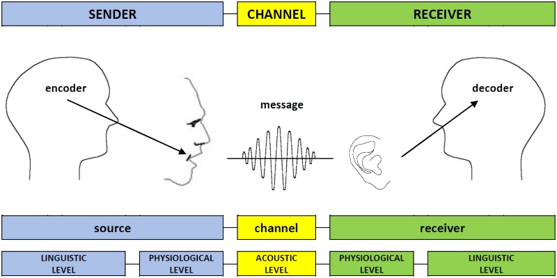

# Language {#sec:ch-lang}

[//]: # (Past tense, rules vs. not.  Piaget / Pinker vs. Connectionists.  Neural CPU suggests both are right.)

[//]: # (add pointer back to this discussion in development chapter, about neural CPU, rules, etc.)

Language is like water to a fish.  It is everywhere, and, as a result, we can often end up taking it for granted.  Indeed, it is right here, right now, at every moment of this text as I'm writing it and you are reading it.  It is unfolding right before your eyes, and somehow dribbling out of my fingers as I type these words.  Without it, we would truly be nowhere.  At least, certainly not *here*.

The full scope of language is unique to humans, although other animals certainly communicate in a variety of ways, and because we aren't native speakers of those languages, there remains some doubt that we might be underestimating their expressive power.  Over the first few years of life, we somehow naturally soak up and master language, in ways that adults remain jealous of when they try to learn a new one --- it is only then that we truly start to appreciate the incredible complexity of language (or when you try to read about it in a textbook like this)!  This natural affinity for learning language has led many to believe that the brain comes pre-wired with a kind of proto-language module built right in, while others have examined the remarkable learning abilities of infants and toddlers and concluded that language learning from a kind of blank slate can explain everything.  As usual, the truth is likely somewhere between these *nature* vs. *nurture* extremes, as we'll revisit in [@sec:ch-origins].

Once we have acquired language, how does it change our brains?  How would a human brain function *without* language?  These fascinating questions are almost impossible to answer precisely, but there are a number of remarkable examples of children raised by wolves and other rather more horrible circumstances that provide some insight.  Furthermore, it is perhaps not unreasonable to use our closest great ape species as points of comparison for organisms in their natural environment with highly similar brains, but without our capacity for language.  From that standpoint, it is clear that language is enabling just about everything that makes us unique among all the animals --- chimps and gorillas are pretty amazing, but they aren't flying airplanes, are they!

For that matter, however, neither were we until a little over 100 years ago, and looking back, there is clearly some kind of exponentially accelerating process, going from the earliest societies with recorded histories several thousand years ago, to the breakneck speed of progress in the present day.  It is not a coincidence that the pace of progress seems to be correlated with technological developments that enable faster and more efficient forms of communication, among ever-larger groups of people.  In short, the airplane and today's proliferation of rocket ships are really fueled by the progression of communication technologies, starting with the printing press in 1440, and continuing from there, with the telegraph, telephone, radio, television, internet, and cell phone each providing qualitative advances in our ability to communicate.  Together with the development of computer technology from the 1960's onward, we are witnessing the fundamental importance and power of *information* and *communication*.

Just in my lifetime, I witnessed the development of most of these more recent advances.  When I was was a kid in the early 1970's, my sister and I would watch *Gilligan's Island* on a color TV with no remote control (we had to get off the couch to change the channel, and there were only 3-4 channels anyway, so it wasn't that big of a deal), and we would read newspapers and magazines that delivered information updated at most once per day.  By the time I was in middle school, I took a class on computer programming, using the brand new Apple II computer, saving programs on floppy disks, or printing things out on a huge printer.  I had a progression of computers through middle school, high school, and college, none of which were connected to the internet (which was only available in the military and universities).  Finally, in graduate school starting in 1990 I used computers connected to the internet, and discovered the world of email and the *usenet* newsgroups.  I remember exactly the day in 1993 that a programmer working with me first pulled up a web browser and connected to the world-wide-web: we looked at a webcam of a coffee pot in Hawaii, and I thought it all seemed pretty silly.  I never really thought of a computer as a communication device, and spent most of my time writing my own programs to simulate the brain.

As we will revisit in [@sec:ch-soc], we always seem to underestimate the importance of our social and cultural environment in shaping and enabling our individual abilities.  We are only conscious of our internal mental state, which is uniquely ours, and all that other stuff out always seems peripheral.  But soon enough, that silly internet became an incredible timesaver: I no longer had to go to the library to look up scientific articles.  I could google (I was an early google adopter, which I thought was cool because they used Linux) information that helped me write programs faster, and download software directly from the internet instead of waiting for a disk to be snail-mailed to me.  It is impossible for people who grew up with the internet and always-connected cell phones to appreciate how *slow* and *inconvenient* communication was in the "olden days".  And I of course could not imagine how people used to depend on horses and even foot travel to deliver hand-written messages on paper, or just by word of mouth.

In short, the pace of progress is directly proportional to the pace of communication, which has increased exponentially, and this all goes back to the importance of language, without which we are unable to communicate.  One of the most important features of language and communication more generally is the need to adopt *standards* or *conventions* --- despite our strong individualistic tendencies, we all must work together to agree upon a standard of communication, whether that is in terms of the words we use, or the adoption of standard protocols such as the internet itself, or HTML and other standards built on top of it. The biblical story of the *Tower of Babel* speaks to the importance of a shared language, and the fundamental confusion that arises when confronting people who speak a different language.  The bible also provides a testament to the central importance of language in defining cultural identity, inevitably creating a conflict between the desire to share and communicate across ever broader groups of people, and the opposite desire to build a unique identity and culture that has special meaning among a "chosen people".

In the modern world, we have a tension where English has emerged as the *de facto* standard language across the world, which has enabled these amazing advances in sharing information (e.g., all important scientific papers are written in English), but many cultures are simultaneously working to reestablish their own native languages as a way of preserving their own unique cultural identity and history.  Furthermore, somewhat ironically (and perhaps tragically), the technological advances built upon the standard computer communication protocols have enabled the current trend toward increasingly polarized, insular, and "dissociated" groups on the internet, which have created their own separate standards for what is true and accepted as fact.  This is a direct manifestation of the fundamental tension between the individual and the larger society, and the desire to create special *in-groups* that reinforce our need for *control* and power --- we need to establish *contrasts* between ourselves and others.  Thus, the fundamental influence of the 3 C's is ever-present (language itself is all about *compression* as well), and language is one battle ground on which all of this plays out in dramatic fashion.

One final question that is interesting to ponder in this context: have we reached some kind of maximum level of communication technology at this point, or are there obvious qualitative ways in which our ability to communicate could be improved yet further?  Certainly there always seems to be room for further improvements in the speed and reliability of the raw communication channels, but we now have complete portability and sufficient bandwidth to support immediate, bidirectional information exchange or large amounts of data, pretty much anywhere.  Likewise computer chips have, for the moment, also reached a kind of plateau.  What if we are approaching peak IT (information tech)?  Anyway, it is notoriously difficult to predict the future of technology, and certainly AI and maybe quantum computing will have transformative effects, but it is interesting to try to imagine what obvious form of communication that we are currently missing that people in the future will look back on and say: wow, I can't believe you grew up without *that!*  Holograms maybe?  

In the remainder of this chapter, we first discuss the basic elements of language, from speech to writing and syntax and semantics, and then investigate the nature of language acquisition, for both first and second languages.  Then, we explore the relationships between language and thought, including the power of language in enabling our cognitive abilities, driving the intellectual and technological advances highlighted above.

## The Elements of Language

{#fig:fig-communication width=80% }

Language is a means of communication, and communication is, at its most basic, the process of **encoding** **information** in a **sender**, **transmitting** that information across a **channel** of some form, and then **decoding** the message in the **receiver** ([@fig:fig-communication]).  There is also an important potential auxiliary feedback channel that can help control the communication process (e.g., putting up your hand in a blocking gesture when not ready to receive a message).  These elements of communication apply generally to *any* form of communication, including between computers.

{#fig:fig-communication-speech width=80% }

In the case of human speech, and almost all forms of animal communication, the *channel* is vibrations in the air, and encoding and decoding involve creating and perceiving these sound waves [@fig:fig-communication-speech].  For any communication process to be successful, there must be some kind of **protocol** or *mutually-understood convention* for encoding and decoding.  As shown in the figure, there are multiple levels to this protocol (as is the case in computer communication as well --- it is a *stack*), including the *physical* level of the actual sound stimulus, and the *linguistic* level that can be understood apart from the physical sounds, and is really the main level at which the meaning is represented.  

These different levels are *independent* of each other, in the sense that they can be swapped out in different ways.  For example, the same linguistic level message could be conveyed through a different physical channel (writing for example), and the same physical level signal (a given speech sound) could be used in different languages to convey different meanings (e.g., the word "pan" in English means something different than that same sound in Spanish or Japanese).  Again, this is all the same set of issues that arise in computer communications, where for example the world-wide-web is essentially the HTML protocol operating on top of the internet packet routing protocol operating on top of any number of different physical channels from WiFi to physical cables, and each of these different levels can be swapped out for other such protocols.

At a more abstract level, language depends essentially on the exchange of **physical symbols** that, through culturally or biologically-established convention, take on **meaning** in the minds of those communicating.  In the following sections we describe some features of the physical levels of speech and writing, and then move up to the linguistic level in terms of syntax and semantics.

### Speech

{#fig:fig-vocal-tract width=40% }

![Left panel: International Phonological Alphabet (IPA) for vowels, as a function of where the tongue is positioned (front vs. back, organized horizontally in figure), and the shape of the lips (vertical axis in figure) --- these two dimensions define a space of vowel sounds.  Right panel: Version of IPA vowel space with vowel labels used by PMSP and in our simulations --- these are all standard roman letters and thus easier to manipulate in computer programs. Only the subset present in English is used. ](../figures/fig_ipa_chart_vowels_clear.png){#fig:fig-ipa-vowels width=50% }

{#fig:fig-ipa-consonants width=100% }

The development of the human ability to produce the sounds of speech is one of the essential and mysterious precipitating events in the course of human evolution, and there are extensive differences between the **vocal tract** of humans vs. the other great apes, with some indications that we did not have our current vocal expressive capabilities until around 50,000 years ago [@Lieberman07].  Our vocal tract [@fig:fig-vocal-tract] can produce an amazing range of sounds, based on three major factors that change the sound: the position of the tongue in an otherwise open tract, which produces **vowel** sounds [@fig:fig-ipa-vowels] (you can sing a vowel), the activation of the **vocal cords** or not, and a wide variety of ways of blocking or obstructing the passage of air through the mouth, that produce different **consonants** [@fig:fig-ipa-consonants].  These figures show the International Phonological Alphabet (IPA) coding for the different sounds: **phonology** is the study and organization of speech sounds, which are called **phonemes**.  There are a number of other key phonological features not shown in these figures, but these represent the most common, widely used elements of phonology.

For example, the long "ee" vowel sound as in "seen", written as an /i/ in the IPA (the slashes denote the use of IPA instead of standard English), is produced with the tongue forward (*Front*) and the lips relatively closed (*Close*) [@fig:fig-ipa-vowels].  The sound "a" as in "cat" (/a/) has the mouth very *Open* and the tongue in a *Central* location, while the "oo" sound in "boot" (/u/) has the mouth closed but the tongue very far *Back*.  As for the consonants [@fig:fig-ipa-consonants], the "p" sound in "pit" (/p/, in the upper left of the chart) is a *Plosive* --- the sound *explodes* out of the mouth, and it is *Bilabial* because your two lips are used to block the sound.  The "t" sound as in "tip" (/t/) involves the tongue going up against the *alveolar ridge* ([@fig:fig-vocal-tract]) so it is called an *Alveolar* Plosive.  The "s" sound in "sip" (/s/) is known as a *Fricative* because it involves a friction-like obstruction of the air, also in the *Alveolar* zone.  For each of these consonants, there is a "twin" consonant that is otherwise the similar, except it is *voiced*, which means that your vocal cords vibrate for it --- compare /p/ vs /b/, /t/ vs /d/, and /s/ vs /z/ by saying them out loud to yourself!  When you whisper, you say things things in an *unvoiced* way, which also means that there are other subtle differences between voiced and unvoiced in addition to the vocal cords.

To see a video of the movements of the tongue in vocal output, see this [YouTube link](https://www.youtube.com/watch?v=M2OdAp7MJAI) (warning: graphic content not suitable for squeamish --- if you really want to be grossed out, search for vocal cords on YouTube!).  It is truly mind-blowing how much our mouths are constantly bouncing around and our tongues gyrating every time we talk!

One of the key features of this human speech production system is that we can produce sounds that are highly distinct from each other in terms of the resulting auditory signal, even with very different physical sizes and shapes of mouths etc, so that the decoding side of the communication channel is not too hard and error-prone.  This is not possible with the vocal systems of great apes, and most other animals, so certainly we have significant biological adaptations to support our amazing language abilities.  Most of the known languages in the world make use of a common subset of phonemes, including the vowels /i/, /e/, /a/, /o/, /u/, and the consonants /p/, /t/, /k/, /m/, /n/.  From there, things diverge significantly, with some languages having over 100 different phonemes, and English has 13 vowels and 22 consonants at a minimum (things get complicated quickly in terms of dialects and what exactly counts as distinct).

All known languages are also organized into combinations of phonemes known as **syllables**, which are combinations of consonants and vowels, with the standard case being a *CVC* pattern: consonant-vowel-consonant.  This is useful because the vowel allows the speaker to exhale through the open mouth associated with vowels, whereas the airway is typically blocked in consonants.  It is important to still be able to breathe while talking!  Furthermore, there are certain combinations of consonants and vowels that "flow" better than others, and the syllable-level structure reflects these constraints.

From an *information theory* perspective, the larger the number of distinct sounds used to communicate, the greater the amount of information that can be conveyed per unit time (assuming all such sounds take roughly the same amount of time).  However, this advantage trades off against the difficulty of decoding sounds, so the actual mix of sounds in use in a given language presumably represent different ways of balancing these two opposing considerations.  Another way of thinking about this is that the number of different *words* you want to communicate requires a certain number of distinct sounds to make up those words.  If you have more sounds, then each word can in general be shorter and still have a distinct overall sound pattern.  However, if you only had a few distinct sounds, it would take a very long time to say each word.  For example, if you only had 2 different sounds available, that is equivalent to a *binary* code, and it takes 8 different binary digits (*bits*) to produce 256 distinct patterns.  A typical modern human vocabulary can be 50,000 words or more, so that would require 16 bits minimum, and many of those sound patterns would be highly similar to each other.  Thus, it really is important that we have a lot of different sounds at our disposal to support a complex language with a large vocabulary!

On the receiver side of the communication channel, [@fig:fig-spectrogram] from [@sec:ch-perc] showed what speech sounds look like as they are processed by the cochlea, which creates a **spectrogram** by way of **place coding**, so that different frequencies are represented by different neurons firing, and the pattern over time ends up being distinctive for the different phonemes.  Interestingly, this speech signal is actually not so easy to decode in a way that generalizes across many different speakers and accents, and it was only very recently that deep neural network AI systems were able to do this with any significant degree of accuracy.  This advance is what has now allowed you to speak to your various devices, including the *Alexa* system from Amazon, and those annoying interactive phone systems.  The success of these systems validates the fact that a reliable signal really is buried there in the speech stream, and it also suggests that our human auditory system may have certain forms of processing that are specifically adapted to make it easier for us to understand this signal.

TODO: categorical perception of phonemes.

### Writing

{#fig:fig-pictograms width=30% }

The use of sound to communicate is hardly unique to humans, even if human speech is particularly complex and information-dense.  However, the use of writing to communicate is truly unique to humans, and historically recent at that, with the first known writing systems emerging independently, starting a bit over 5,000 years ago, in Mesopotamia, Egypt, China, and Mesoamerica, initially based on stylized representations objects called **pictograms** [@fig:fig-pictograms].  Even until relatively recently, many people remained **illiterate** (unable to read and write) in many cultures, and others never developed a writing system at all.  Unlike spoken language, writing is difficult to learn and does not just happen automatically over the course of development: it is truly a cultural artifact that requires a significant amount of deliberate practice to learn.

It is impossible to overstate the importance of the development of writing for the advancement of technology and economic sophistication of a given society.  Without written language, there is no ability to record information for later use --- all communication must be in the moment, one person talking to another.  Writing vastly increases the amount of information at any one person's disposal, with major consequences for the development of human societies, at many levels.

As only the most immediate example, what if writing did not exist, and I had to try to teach this course entirely without this textbook, and without you being able to write down notes.  We could gather a reasonable number of people together as we do in a lecture hall, and I could try to tell my story.  But because you can't take any notes, and neither could I, I would have to think of everything I wanted to say, on the fly.  And you would likely forget most of it.  It would vastly limit the scope of what could be communicated.  This is in fact how oral histories as recorded in the Bible and other early documents were passed on, from one person to the next, but it took an immense amount of time and effort, and greatly reduced the scope of what could be shared as an accumulating foundation for a given culture.

How could you have the American system of government without all the written documents at its core: the constitution, bill of rights, etc, to say nothing of the massive tomes of law that address all the rules and regulations by which our society functions.  Writing enables people to establish lasting ideas and ideals, and for future generations to more easily acquire that knowledge and build upon it.  The invention of the printing press by Gutenberg in 1440 was so important because it made it so much easier to share these ideas in written form widely across space and time --- writing without printing is still shackled with the individual labor of transcribing a text so that another person may have access to it --- it provides a significant memory advantage but the time savings is not quite there yet.

It is no accident that the modern information processing infrastructure of computers, the internet, email, and texting are all in the written form, rather than speech-based.  Written material has already been encoded into a discrete form suitable for digital encoding in a way that the continuous unfolding of speech signals is not.  Furthermore, it is not just any kind of writing, but specifically alphabetic forms of writing that are particularly compatible with computers, which require a typewriter-based data entry system (the keyboard) and benefited from the relatively small number of letters in an alphabetic system for binary codes, and also for simpler display systems.  Written information can be communicated over slow channels, and broken up into many separate packets, whereas speech requires a much higher bandwidth, low-latency channel (as provided by the original voice-based telephone network, which only recently is switching fully over to the packet-based internet system). 

From what we can tell, the earliest forms of writing were used for accounting --- basically hash marks on clay tablets, and that pragmatic function remains an essential job for written records to this day, including all those annoying receipts we still seem to have to deal with.  The early hash mark tablets were then augmented with symbols depicting what was being bought or sold, as in [@fig:fig-pictograms], and things progressed from there in various directions in different cultures.

![Origin of the first alphabetic writing system, using Egyptian hieroglyphs to represent the sounds (phonemes) of an ancient Semitic language which was the basis for the Phonecian writing system, which was then adopted in ancient Greece and Roman cultures.  The order is consistent with the Greek alphabet which may be familiar: A=alpha, B=beta, $\Gamma$=gamma, $\Delta$=delta, E=epsilon, Y=upsilon, Z=zeta, H=eta, $\Theta$=theta, I=iota, K=kappa, $\Lambda$=lambda, M=mu, N=nu, $\Xi$=xi, O=omicron, $\Pi$=pi, M=san, Q=qoppa, P=rho, $\Sigma$=sigma, T=tau  ](../figures/fig_egyptian_to_semitic.png){#fig:fig-semitic-alphabet width=100% }

In the Egyptian and Chinese writing systems, the initial pictographic forms developed into **logographic** writing systems that retained a large number of different symbols, with one symbol for each distinct word.  The clear pictographic representation of these symbols was gradually lost, but the overall idea of having a unique symbol for each word was retained.  However, a fateful and distinct approach was taken in the development of a writing system for ancient Semitic languages including *Phonecian*, where specific Egyptian hieroglyphs were used to form an **alphabetic** writing system for the first time, where distinct symbols were used to represent *sounds* (phonemes), instead of words or concepts [@fig:fig-semitic-alphabet].  This *phonetic* alphabet then spread to ancient Greek and Roman cultures, ending up with the familiar *Latin* alphabet that is used in many western languages including English.  This amazing preservation of the writing system over time contrasts dramatically with the constant changes in the languages using this writing system over the period of thousands of years, and reflects how "artificial" and culturally-transmitted writing is relative to speaking.

There is a third type of writing system, known as a **syllabic** system, where each character represents an entire syllable instead of just a phoneme.  This is used in two of the three Japanese writing systems, Hiragana and Katakana, while the third is highly overlapping with the Chinese logographic system, known as Kanji in Japanese.

### Syntax and Semantics

Speech and writing represent the physical layer of the basic two-layer human language protocol stack [@fig:fig-communication-speech], while *syntax* and *semantics* represent the higher *linguistic* level of the "protocol".  The details of these are different for each language, but there are many shared properties across all human languages.

{#fig:fig-syntax width=30% }

In brief, **Syntax** refers to the **grammatical** rules and conventions for organizing words into sentences, while **semantics** refers to the meanings of the words that are used in a given language.  Each language has a **lexicon** (dictionary) of known words (with lots of fuzzy cases on the fringes) and an individual has a give **vocabulary** of known words.  When you learn a new language as an adult, these are the two things you are explicitly taught: new vocabulary words and the grammatical rules of that new language.

There are many components to syntax, involving everything from how words are generally ordered within a sentence, to how some words are *inflected* by adding special suffixes or prefixes to them (e.g., adding -ed to indicate the past tense). The term **morpheme** refers to the smallest unit of meaning in a language, and includes things like those suffixes, but also entire words, and **morphology** refers to the organization of word-level units including rules for inflecting words, etc. [@fig:fig-syntax] shows a syntactic tree diagram for a simple sentence, which identifies the **part of speech** for each word in the sentence (e.g., *noun*, *verb*, *adjective*, *adverb*, etc).  Interestingly people learn all these things automatically and implicitly as young children while learning their native language, but need to be explicitly taught about these different types of word functions and how the syntax or grammar rules apply to for them.  This suggests that whatever rules we learn about language, they are initially subconscious, and not something that people are explicitly aware of and deliberately thinking about as they learn and use the language.  There may be some deep wisdom in the way the kids do it!

One of the main features of syntax is the *standard word order* for a given language.  For example, in English the order is usually SVO: subject, verb, object, as in "The boy chases the cats".  In Japanese, the order is subject, object, verb, (SOV), and these two orders are used in roughly 85% of the world's languages.  Yoda from Star Wars uses a highly unusual word order: OSV, as in, "Truly wonderful the mind of a child is."

With respect to semantics, we'll discuss some interesting facts about how people learn words in the Language Acquisition section below.  It is estimated that a typical adult knows somewhere between 40-50,000 words, which is an astonishingly large number!  This technically refers to different *lemmas*, which are the "dictionary form" of a word, so it excludes all the different variants of a word (e.g., different tenses of verbs, or plural forms, etc).

One of the big questions in linguistics is the extent to which syntax and semantics are separable, or strongly interact.  Noam Chomsky argued on the basis of his famous *example sentence*:

* >Colorless ideas sleep furiously.

That people are capable of judging whether that is a syntactically correct sentence, even though it makes no semantic sense.  However, other example sentences show the need for strong interactions:

* >Fruit flies like a banana.
* >Time flies like an arrow.

Here the entire syntactic structure of the sentence changes based on the meaning of the words.  In the first case, the word "flies" is a noun, and in the second case, it is a verb.  Likewise, the word "like" is a verb in the first case, and an adverb in the second.

As usual, the answer is likely somewhere in between.  We have some level of abstract understanding of the general rules of grammar, but semantic meaning can strongly influence our unfolding interpretation of a sentence.  Given all the extensive +bidirectional connectivity in the brain, there is no reason to assume that syntactic and semantic pathways in the brain could not interact significantly during the processing of language inputs.  Furthermore, the entire point of communication in the first place is ultimately about decoding the *meaning* of a sentence, so in some sense, semantics is really the primary driver of comprehension in the first place.  This is consistent with the fact that actual spoken language is very often not grammatical, and rarely does that impede people's ability to understand the intended meaning of the message.  For example former president George W. Bush was famous for his ill-formed statements, but people generally had a good idea of what he was trying to convey, as in this example:

* >Families is where our nation finds hope, where wings take dream.

In short, getting the syntax exactly right is typically reserved for written communication, where fortunately we now have handy grammar checkers that can flag whatever is wrong with your sentences.

### Culture and Language Evolution

* language "bling" and contrast effects -- cool words, etc

## Language Acquisition

* babbling

* mutex principle, language explosion

* Critical periods

* First vs. Second Language

* cognitive advantages of bilingualism

### Nativists and the Innate Grammar

Chompsky -- maybe he should stick to politics! :)

### Statistical Learning

### Language in Animals

## Language in the Brain

Wernicke, Broca

## The Language of Thought

Sapir / Worf, Neural CPU programs, etc

