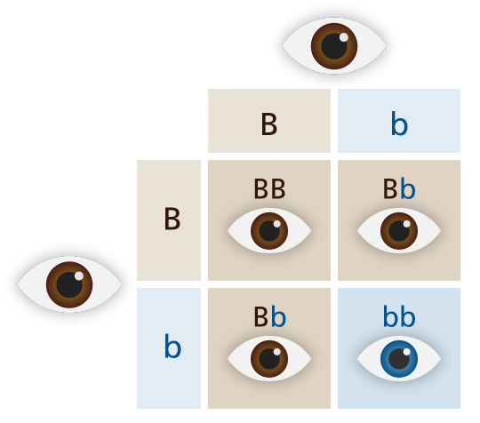

# Origins: Evolution, Genetics, and Development {#sec:ch-origins}

Having now explored the full scope of human psychology and neuroscience, from perception to the highest levels of intelligent reasoning and social behavior, we now circle back and consider the incredibly fascinating and challenging question of *origins* --- where does it all come from in the first place?  In [@sec:ch-learn], we touched a bit on this question, arguing that the genetic code could not possibly contain enough information to directly specify the synaptic connection strengths of even a small fraction of the billions of cortical neurons that support all of our cognitive functions.  Thus, learning must play a critical role.  In other words, there is general agreement that development is an interaction between *nature* and *nurture*.  And yet, we don't yet have fully satisfying, widely-accepted accounts of how this learning unfolds, and how the considerable genetic shaping of the basic organization and wiring of the brain interacts with these learning processes to determine how we develop.

Thus, development remains more of a mystery than most of the other topics that we cover.  But certainly much is known about the *phenomenology* of development, e.g., the general chronology of when different capacities begin to emerge.  Furthermore, we also know a great deal about genetics and how the blueprints of life are encoded in our genes, and understanding the nature of these mechanisms is essential for having a more complete picture of how biology can shape and constrain our developmental processes.  We begin our exploration of these issues at the natural beginning: with the process of evolution --- the origin of everything!

## Evolution

Evolution is an absurd theory on the face of it.  How is it even remotely possible that a beast such as a fish could *ever* give birth to something that was *not* a fish?  And even if it did, how could that freak ever mate with anything else to propagate its non-fishiness?  Two freaky non-fish emerging at the same time, in close enough proximity to propagate this new species?  It just doesn't add up.  Presumably everyone has heard the basic principle of *survival (and reproduction) of the fittest* as the primary engine of **adaptation** in evolution, but it seems that this alone does not really explain things.  Undoubtedly, the sheer implausibility of the ideas at this basic level contributes to the continued reluctance that people have toward this theory.

There are several things we can work through to help resolve some of these conundrums.  First, we need a clear overall framework for thinking about biology, and what we are actually made of --- fortunately, LEGO provides a really nice, familiar analogy.  Second, we need to think more carefully about the actual nature of evolutionary change: it is very incremental, and yet somehow can produce large changes over time --- reconciling those two points is difficult within our limited scope of experience.  Here, computational models can be immensely useful in providing the missing "long timeframe" perspective, by simulating many generations of evolution within a few minutes of human time.  Furthermore, a few key principles can go a long way toward resolving the basic problems stated above.

{#fig:fig-cells width=60% }

![Biology is remarkably like LEGO: the same small set of basic building blocks can be recombined to produce many different animals.  This continuity across all animals makes it clearer how evolution can work: you just need to tweak the instructions a bit and you can end up with entirely different animals, as in this 3-in-1 kit that uses the same parts, with different instructions, to make very different animals.  In biology, genes are the instruction set, and these instructions are constantly subject to random changes, producing novel "experiments of nature". ](../figures/fig_lego_animals.png){#fig:fig-bio-lego width=60% }

When you think of the manifold differences between a fish and a human being, evolution seems impossible.  However, these differences disappear when you zoom in to the cellular level, where it immediately becomes clear that all animals are made from the same basic building blocks ([@fig:fig-cells]).  This is really the level at which evolution is operating --- the macroscopic forms of organisms (which is what we perceive) are more of an emergent result of cellular and sub-cellular processes unfolding over the developmental process, just like our cognition is an emergent product of our neurons interacting in complex ways.

The easiest way to understand this is in terms of the more familiar process of building different things out of LEGO blocks ([@fig:fig-bio-lego]).  A small set of basic building blocks can be used to make an essentially infinite number of different objects.  Furthermore, the developmental process is akin to the process of following the step-by-step instructions to assemble the final product.  As you may have experienced, small random errors at an early stage can have major implications later.

Likewise in biology, relatively small changes in the developmental process can lead to major changes in the shape and function of the organism.  To make a bigger brain, you just have to extend the timing window when nerve cells divide and proliferate, in the same way you would just keep adding blocks to a LEGO wall to make it bigger.  Thus, major macroscopic changes can emerge from relatively minor changes in the program.

In biology, the genetic code is the equivalent of the LEGO instruction booklet, and we'll see below that much of the genetic information is devoted to controlling the timing and coordination of the building process (as compared to the raw bricks themselves), and this is likely where much of the action has taken place over the course of evolution.

Perhaps it is now clearer how very different-looking organisms can emerge from relatively minor tweaks to the genetic code, and how in fact a fish very likely could produce some rather different offspring even in a single generation.  Indeed, there are plenty of examples of "genetic freaks of nature" that can be found on the internet (e.g., [list25.com 25 disturbing freaks](https://list25.com/25-disturbing-freaks-of-nature-you-have-to-see-to-believe/)).  But the other puzzles remain: how could that weird offspring itself procreate, and lead to the origin of new species, and more complex, sophisticated biological machinery?  This is really the hard problem of evolution that Darwin tackled, and later theorists such as Stephen J. Gould wrestled with.  

One key idea here is that gradual, continual change from one generation to the next is much easier to understand than some kind of entirely new beast emerging whole within a single generation --- even though random changes in the genetic code can produce such things, they indeed aren't likely to have survived and procreated.  But how does gradual, incremental change ever lead to the emergence of something dramatically, qualitatively different?  We can consider two cases: emergence of the ability to breathe air in a fish, enabling the big move onto land, and the emergence of flying birds from dinosaurs.

In the case of the air breathing, one could easily imagine that there was some gradual advantage to being able to gulp some extra oxygen from the surface of the water --- such fish would have more energy, and this would be especially important if the water ended up being less oxygenated, e.g., as happens in algae blooms.  Also, there is plenty of evidence that proto-lungs emerged for various other digestive and buoyancy-control functions.  Then, as this ability was selected for over time, more and more oxygen could be processed, until at some point, such animals could actually survive by breathing air.  If they happened to get trapped on land, as often happens during tidal cycles, then you end up with all the right ingredients for one of the most dramatic events in evolutionary history: the transition from the sea to land.  Of course, we don't know how it actually happened for sure, but by thinking about how gradual *quantitative* processes can eventually turn into a major *qualitative* changes, at least it may seem more plausible.

In the case of bird feathers and flight, we now know that many dinosaurs had feathers, presumably for temperature regulation.  Thus, like the oxygen example, something can be adaptive in one way, before it becomes *co-opted* for something else entirely --- Gould referred to this as an **exaptation**, while Darwin referred to it as *preadaptation* (which sounded a bit too "prescient" for Gould).  Thus, the dinosaurs that climbed trees, and had feathers for keeping cool, eventually discovered that they could glide their way to safety using these same feathers, and a whole new adaptive function and corresponding gradual selection pressure emerged, to make better and better wings.

Putting all this together, this initially crazy-sounding idea perhaps makes more sense.  It just takes a lot of time and a lot of random accidents and amazing stories of survival --- those challenges are the *desirable difficulties* of evolution that have driven survival of the fittest to select some radical new innovations.  It took many  cataclysmic apocalypses to shake things up and get us where we are today, and it is thoroughly mind-blowing to try to grasp this idea that we are just the latest spawn in a *great chain of being* stretching back billions of years.  But look again at [@fig:fig-cells]: at this level, not that much has really changed in all those years!

To see evolution happening in *real time* that we can actually comprehend, people have developed computer simulations of evolution, and it definitely works!  Indeed, there is a quote that neural network algorithms (modeled on the functioning of the brain) are the second best solution to any complex problem, and the third best solution is a **genetic algorithm**, which is the computer-science version of evolution.  The genetic algorithm works by randomly generating *exemplars* in a complex, high-dimensional space, and then combining the features of the best-functioning exemplars.  This works surprisingly well for finding novel, previously-unimagined solutions to complex problems.  Interestingly, both genetic algorithms and neural networks have the same property of following *gradients* (i.e., hill climbing, as was discussed in the case of problem solving strategies earlier) --- this is the core property of evolution where some adaptive property gets *optimized* over successive generations.

Jeff Clune and colleagues have developed particularly compelling, bio-mimetic simulations of the evolution of organisms, often with very funny but functional properties: [YouTube video of Evolving Soft Robots](https://www.youtube.com/watch?v=z9ptOeByLA4) --- this is really a must-see video, and should hopefully make evolution come to life in a unique and compelling way.

## Genetics

{#fig:fig-dna width=50% }

As was mentioned above, the biological equivalent of the LEGO instruction booklet is the **genome** --- the collection of genes that determine how everything in our bodies (and every other living organism) is built.  It is amazing how much progress has been made in understanding the genetic basis of biology since the structure of DNA was discovered in the early 1950's, and published in 1953 by James Watson and Francis Crick (who later became somewhat of a neuroscientist, confirming that the brain is the most fascinating thing in the universe, and the "last refuge of scoundrels").  And it is also amazing that this all happened so recently --- we are the first few generations of beings that now know (more or less) how that great chain of life actually works.

At its base, the genetic program is remarkably simple: there are only *4* different letters in the language of life: G, C, T, A, which are always paired GC and TA ([@fig:fig-dna]).  These 4 **base pairs** don't do much by themselves --- it takes 3 of them in sequence to determine a corresponding **amino acid** (of which there are 20 different varieties coded in the DNA).  Interestingly one of these amino acids is *Glutamic acid*, which is the basis of both the ubiquitous excitatory neurotransmitter glutamate, and MSG, and another is *Tyrosine*, which is the direct chemical precursor of the major neuromodulators dopamine, epinephrine, and norepinephrine.  Thus, like the sodium and chloride ions, the key ingredients that make the brain tick are really basic and universal in biology, coded directly by just 3 base pairs in our DNA.

The more complex building blocks in biology are composed from sequences or polymers of these amino acids, i.e., **proteins**.  In the LEGO analogy, amino acids are like the plastic, and proteins are the fully formed LEGO blocks of the body.  Our DNA directly codes for how to build these blocks via those sequences of 3 base pairs.  However, only a tiny fraction (about 1.5%) of our total DNA actually codes for these proteins, of which there are about 20,000 different types.  Proteins come in various lengths, from a few hundred up to 20,000 amino acids in size.  However, the *genes* that code for these proteins are typically *much* longer than the minimal number required to code for the literal amino acid sequence --- there is clearly a lot more going on in the genome than just the literal coding of amino acids to build proteins, even among the tiny fraction of genes that actually code for proteins in the first place.

Thus, there is quite a gap between the very concrete, well-understood level of DNA, amino acids, and proteins, and the rather fuzzier notion of **genes**.  Genes are defined functionally as units of **heredity** --- the basic elements that we can inherit from our parents, and the simple idea that each gene codes for a different protein holds in some cases, but only a tiny minority.  Again, LEGO is incredibly helpful in understanding why this might be the case.  When you're building a LEGO kit, the vast majority of the information in the instruction booklet concerns *where* and *when* to place the bricks, with only a relatively tiny bit of information concerning the different bricks that are available to build with.  For example, there may be around 100-200 different types of bricks in a modern LEGO kit, but the amount of information it takes to specify exactly where to place those bricks is much greater (and somewhat difficult to quantify, given its visual nature).

In short, although the remaining 98% of the human genome that does not code for proteins was originally characterized as *junk DNA*, it is highly likely that most of it is serving a vital function akin to the bulk of the LEGO instruction booklet: determining when and where to build all those proteins.  For example, we know that much of the extra "junk" within a given protein-coding gene plays a *regulatory* role, shaping the complex process that actually *transcribes* the DNA sequence into a corresponding amino acid sequence to make up the proteins.  Perhaps we will ultimately find the equivalent of a computer programming language embedded in all this regulatory DNA, complete with `if-then` rules and `for` loops, etc.  As with the LEGO instruction booklet, most of the power and functionality in a computer program comes from these kinds of control structures, rather than the raw data that is being manipulated.

### Sexual Reproduction

Aside from the pure intellectual fascination of understanding the amazing genetic machinery that makes us tick, the practical relevance to psychology and neuroscience comes in understanding how our genetic information is inherited from our parents, and how much of our brain function it ends up determining.  This is the domain of **behavioral genetics**, which traditionally has been performed by comparing **identical (monozygotic)** versus **fraternal (dizygotic)** twins.  We are now also able to leverage the advances in **molecular genetics** to directly compare genetic material across people.  To understand how all this works, we first need to understand how **sexual reproduction** works!

Monozygotic twins started out from the same **zygote** (fertilized egg cell), and they thus share 100% of their DNA, whereas dizygotic twins came from two separate egg cells, and have the same genetic similarity on average as any siblings born from the same parents (i.e., 50%).  The exact process by which this 50% genetic similarity arises is surprisingly complex.  Likely everyone remembers hearing about *meiosis* and *mitosis* from high-school biology, but you probably don't remember all the crazy details.

{#fig:fig-meiosis width=80% }

Interestingly, all of the genetic shuffling responsible for producing the essential randomness that powers evolution happens *before fertilization!*  Thus, even though everyone talks about sexual reproduction as being the source of this randomness --- no further mixing-up of genetic material occurs when the egg and sperm fuse to form the zygote ([@fig:fig-meiosis]).  Specifically, each **gamete** (germ cell --- egg or sperm) undergoes **meiosis**, and this is where *the future parent's own genetic material* that was inherited from *their* parents is shuffled.  Thus, each parent is actually re-shuffling the genes from their own parents (the grandparents of the future child) to create some new random genetic sequences.  This shuffling process occurs as the two copies of each **chromosome** (one from grandpa and one from grandma --- the parents of the future parent) are split apart, such that each gamete only has *one* copy of each chromosome (i.e., it is *haploid*, compared to the normal *diploid* with 2 copies).

As you likely know, there are 23 distinct chromosomes, which are large collections of DNA.  When the egg and sperm join to form the zygote, the separate collections of 23 chromosomes from each parent are simply added back together to form a "full deck" of 46 chromosomes, without any further mixing.  Thus, you are really the *sum* of random combinations of genes from each of your two sets of grandparents, and your two parent's gene sets won't really mix until you have your own kids!

After fertilization, the zygote only divides via **mitosis**, which is the much more frequent form of cell division that preserves the full deck of chromosomes in each of the two new *daughter* cells: each chromosome, one inherited from each parent, splits and replicates, again with no further recombination.   Thus, your two parent's chromosomes are preserved intact from that point onward, and the primary form of interaction between them is in terms of the relative *dominance* vs. *rescessiveness* of the genes inherited from each parent.  If both resulting copies of a given gene across the two chromosomes are the same, then there is nothing further of interest to discuss --- that gene will do whatever it does, in the same way, all the time.  This is actually the default case: over 99% of our genes are identical across all people, and thus across your two parents.

{#fig:fig-recessive width=40% }

However, for the roughly 0.6% of our genes that do differ across people, you may end up with a different version of that gene in each of your different chromosomes.  These different versions are called **alleles**, and they are entire focus of interest in behavioral genetics and the study of heritability more generally.  Some versions of a given gene are more likely to be transcribed and **expressed**, or to produce a functional protein product, and this is what is meant by **dominant** vs. **recessive** (and like most things, it is a continuum, not a dichotomy) ([@fig:fig-recessive]).  Thus, only if you end up having both copies of a gene in the recessive (non-dominant) form, will that recessive version actually do its thing (or fail to do the thing that the dominant gene would otherwise do).  Otherwise, having a recessive form of a gene typically doesn't make much of a difference in the overall function of the organism.

This presence of recessive genes is the reason we (still) have genetic disorders at any significant rate in the population.  Any allele (genetic variant) that is dominant *and* produces bad effects, is quickly driven out of the population through natural selection --- people with that gene version don't tend to survive and reproduce.  However, a recessive gene can fly under the radar and persist in the population, because the odds of two people having the *same* recessive gene variant is really quite low on average (only 0.6% of genes vary at all, and most recessive alleles are relatively rare on top of that).  Except, of course, if they are siblings or otherwise closely related, which is why incest is generally frowned upon.

It is also interesting to speculate that there might be a *benefit* to the recessive genes, in terms of a kind of "reserve" of diversity that is kept around without doing too much overall damage, but maybe some of those alternative genes end up doing something useful in the right combinations, at some point down the road.  If there is no such benefit, why does this mechanism of having recessive genes around in the first place still persist even though it is certainly harmful to many individuals?

## Heritability and Individual Differences

Now we can actually talk about how behavioral genetics works.  Basically, it amounts to comparing the genetic similarity of people against their *phenotypic* similarity, where the **phenotype** is just a complex word for the thing you are actually interested in, such as IQ, height, eye color, etc.  For a very small set of phenotypes, your genes essentially determine 100% of how you'll end up.  For example, there are specific recessive genes that cause Huntington's disease, and cystic fibrosis.  But for almost everything else, the relationship between genetic differences and phenotypic differences is much more complex, and actually determining how much can be attributed to genes is surprisingly challenging.

Let's take the case of IQ.  As we discussed in [sec:ch-think], there is ample evidence that your IQ is a function of learning, motivation, and the wealth and general +socioeconomic status **(SES)** of your parents.  Thus, any dependence on genes is likely to be at least somewhat indirect.  But how can we measure it?  The only way until very recently is to compare the IQs of identical (monozygotic) versus fraternal (dizygotic) twins, and somehow use their known genetic similarity differences to compute how much of their measured IQ differences can be accounted for by those known genetic factors.  This is known as the **twin method**.

{#fig:fig-heritability width=60% }

Critically, we need to also include some kind of factor that can account for non-genetic influences on IQ, which goes under the general category of **environmental** factors.  To, make things more interesting, this latter category is typically split into **shared (common)** and **non-shared (unique)** environmental contributions, determined by whether the children were reared in the same family environment or not.   Thus, there is a three-way tug-of-war dynamic between genetic factors (which are labeled with the letter *A* for additive genetic factors), and these two environmental factors (*C* = common and *E* = unique), comprising the ACE model shown in [@fig:fig-heritability].  The overall genetically-associated portion is called **heritability**, and is denoted with the letter *h*.  It is a ratio (proportion) of *variances* (amount of individual differences across people) and as such is a fundamentally *relative* factor.

The relative nature of heritability in the twin method is a source of major interpretational problems.  Just as we saw back in [@sec:ch-neuro], relativity or *contrast* is great for some things, but it also makes it essentially impossible to determine *absolute* levels.  In this case, it means that *we have no way of assessing the absolute amount of heritability, only the relative balance between genetic and non-genetic factors, which can be affected by increases or decreases in our measurements of either of these factors.*  Furthermore, we have much better tools for estimating genetic similarity compared to those available for the environmental factors [@Turkheimer00].  Also, it is essential to remember that we're always talking about differences among people here (i.e, variance) --- if everybody is the same, there is no variance, and that doesn't factor into the heritability measure.  This turns out to be critical.

The bottom line is that you should regard the heritability measures determined through this twin method, which was the only method available until recently, with a healthy dose of skepticism.  Indeed, we will see that more direct methods based on the genetic code itself result in heritability estimates that are about half as strong as those from twin studies, and there is reason to believe that those are more accurate estimates overall.

### Problems with the Twin Method

Because so much of behavioral genetics is based on the twin method, we will go into some detail about the problems with this method.  This is fairly advanced material that you likely won't be tested on, but provides some interesting insight into the logical and empirical problems of trying to answer really important questions with the limited kinds of data that we have available.  These kinds of problems plague all manner of different scientific fields in different ways, so even if the details differ, it is important to see how things play out in this case.

First, as noted above, the apparent heritability of IQ could increase just by *decreasing* the measured strength of environmental factors.  Indeed, there is considerable evidence for exactly this effect happening in **WEIRD (Western, Educated, Industrialized, Rich, Democratic)** societies, where the majority of the population has essentially comparable levels of health, nutrition, education, etc.  In this case, the impact of environmental factors on *variance* between people is greatly reduced compared to cases where some people are severely malnurished and have little access to education.  In other words, if everyone has a very similar environment, then there isn't much that environmental variance can do to affect people's outcomes.

![Idealized estimate of the effect of parental education on environmental (E and C) versus genetic contributions to the phenotype of reading (word recognition).  Environmental influences go down with greater parental education, increasing the apparent amount of genetic heritability according to the *relative* nature of *h* measures, *without any actual change in genetic influence*.  *h* heritability is computed as A / (A + C + E) so as C and E go down, h goes up.  C is specifically reduced because E also includes everything random about an individual, so it cannot go down that much.  From Kremen et al (2005).](../figures/fig_heritability_variance_kremen_05.png){#fig:fig-heritability-env width=70% }

[@fig:fig-heritability-env] shows an idealized representation of the results of an attempt to *independently* estimate the amount of environmental versus genetic contributions to the phenotype of reading ability, as a function of the parent's education level [@KremenJacobsonXianEtAl05].  As you can see, they found evidence that the amount of environmental variance went way down with increasing parental education, directly consistent with this broader WEIRD effect.  Parents with more education generally are wealthier, and provide more enriched educational opportunities to their children --- thus eliminating variability in these factors across individuals.  What is left over is the raw genetic variability, which, due to the random mixing processes at work ([@fig:fig-meiosis]), remains relatively constant.

Thus, the bottom line is that the raw magnitudes of heritability scores cannot be taken as a direct measure of absolute genetic influence --- just like absolute, perfect pitch is very difficult due to our contrast-based perceptual systems, it is extremely difficult to quantify the absolute level of genetic influence in any meaningful way, because it is always relative to the environment.  And the environment is even harder to measure directly than genetic differences are!  Most studies of heritability take place in WEIRD societies, and have produced estimates of heritability around 0.5 for almost every phenotype you can think of ([@fig:fig-h-est]).  In addition to those shown, personality factors of *neuroticism* and *openness* have a measured heritability of 0.4 to 0.6 [@PowerPluess15].

Another complicating factor in interpreting these heritability estimates derives from the fact that the environment and genetic factors interact, such that "it is impossible to assign quantitative values to the fraction of a trait due to each, just as we cannot say how much of the area of a rectangle is due, separately, to each of its two dimensions" [@FeldmanRamachandran18].  These **gene-by-environment interactions** are likely significant.  For example, consider a genetic factor that causes a small increase in anxiety levels, which could cause people to be more introverted, and thus spend more time doing solitary activities, including reading and computer-based activities.  This differential environment could then lead to higher academic performance, and the development of a "geek" or "smart kid" identity, which further reinforces associated behaviors of studying, and socializing with like-minded individuals, and having geeky conversations, etc.  Through these environmental impacts from the small original genetic difference, you can end up with a much more significant impact on the "phenotype" of measured intelligence.  A similar feedback loop could go in the opposite direction, magnifying a reduced level of measured intelligence for people who are highly social and end up hanging out with the "wrong" crowd.

![Heritability estimates of various phenotypes, computed either from twins or directly from the genome (GCTA = genome-wide complex trait analysis) (Trzaskowski et al, 2013).  There is a *missing heritability* in the direct genetic measures (which are about half as big as the twins), or an *excess heritability* in the twins, depending on which is closer to the underlying truth.  There are more reasons to doubt the twin method than the GCTA results at this point, suggesting that the true heritability is likely to be around 25% across various phenotypes, rather than the 50% from twin studies.](../figures/fig_heritability_twin_vs_gcta.png){#fig:fig-h-est width=90% }

In addition, it turns out that various other factors are also hard to disentangle in twin studies [@KellerCoventry05; @EvansTahmasbiVriezeEtAl18].  For example, people who share various traits are more likely to marry and have children (known as *assortative mating*), which thus inflates the overall genetic similarity of even the fraternal twins, beyond what is assumed by the simple twin model.  In addition, genes don't combine additively, as assumed by the model --- instead they interact through the dominant vs. recessive dynamic discussed earlier (and other similar non-additive interactions across genes, known as *epistasis*), and this can significantly reduce the expected genetic similarity of DZ twins (because the MZ twins have the same genes, this factor affects them both in the same way).  Because heritability is computed as the difference between MZ and DZ, reducing DZ similarity inflates the apparent effects of the shared genes in MZ.

### Direct Genetic Similarity Measurements

A completely different way of estimating heritability is to directly measure the genetic similarity of completely *unrelated* people, and determine how much of their phenotypic similarity is driven by these genetic differences.  This was not possible until recently, because we did not have practical ways of directly measuring genetic similarity in a large enough sample of people to be able to get reliable heritability estimates.  The right side of [@fig:fig-h-est]  shows results from these **Genome-wide Complex Trait Analysis (GCTA)** studies [@TrzaskowskiDalePlomin13].  Across many applications of this and related techniques, there is a consistent finding that heritability estimates are about half those based on twins!

{#fig:fig-iq-gwas width=100% }

[@fig:fig-iq-gwas] shows what the detailed direct genetic data looks like for the phenotype of IQ [@SniekersStringerWatanabeEtAl17].  This is known as a **Genome-wide Association Study (GWAS)**, which examines correlations between individual gene variants and the overall measured IQ of the participants, across a huge number of people (78,308 in this case).  A subsequent study with 269,877 people showed similar results but with more power to detect individually significant gene contributions [@SavageJansenStringerEtAl18].  The large sample size is necessary because each individual gene accounts for only a tiny amount of the variation among people, with 18 different locations showing a statistically significant association in the first study and 205 in the second.

Putting all of the individual gene contributions together accounts for only 4.8% of the variance in the first study and 5.2% in the second.  This is much less than the 50% heritability estimation from twins, and 25% from GCTA.  The GCTA technique uses all of the genes to estimate genetic contributions, while the GWAS focuses only on the small subset showing individual statistically significant associations, so the difference between these two tells us about how concentrated the important genetic factors are within a smaller subset of genes, as opposed to being distributed widely across many genes.  Thus, these results show that IQ is *highly* distributed across many, many genes, and even the strongest gene accounts for much less than 1% of the variance.

One concern about the GCTA heritability estimate is that it may underestimate the true genetic similarity between people, because they use less-expensive ways of estimating genetic similarity rather than actually sequencing the entire human genome for each of the people studied.  In particular, these techniques fail to measure *rare genetic variants*, and instead only measure a relatively small number of common markers of genetic variation (alleles).  However, recent analyses based on full genetic sequencing have estimated that these rare variants are likely to only contribute about 5% of this missing heritability [@EvansTahmasbiVriezeEtAl18].

Thus, it is likely that the total direct genetic heritability is significantly less than what the twin method measures.  This is the latest version of the **missing heritability** problem that has come up repeatedly over many years of attempts to use direct genetic measurements to predict phenotypic variance across people  [@Turkheimer00; @Turkheimer11; @PlominDeary15].  By now, given the issues raised above and some others that we consider next, it is perhaps more reasonable to conclude that the twin method produces **excess heritability** and these more direct methods are providing a more accurate picture.  Thus, our current best guess as to the "true" level of genetic influence on various phenotypes is more like the right-hand side of [@fig:fig-h-est] based on direct genetic measurements, rather than the traditional twin-based estimates.

## Shared Environment and Parental Influences

Another striking finding from twin studies is that the estimates of the *C* factor in the ACE model, representing shared environmental influences due to children being reared in the same household, are almost always near zero.  Judith Rich Harris has interpreted these pervasive findings to argue that **parents don't matter** in shaping how their children turn out, beyond of course contributing their genes to their children [@Harris11].  If they did matter, then this common environmental factor should reflect the shared influence that a given parent has on their kids, and it shouldn't be near zero.

This striking conclusion flies in the face of most people's deeply-held beliefs about the importance of parents in shaping their kids, and Harris's book raises many fascinating points about why these belief might in fact be wrong.  For example, children of immigrants typically become most proficient in the language of their new home, not the one spoken by their parents, and in general seem to be much more strongly influenced by their peers than by their parents.  Indeed, probably most parents can recognize that their kids do seem to take them for granted, and are typically much more sensitive to what their friends think and do.  Especially for teenagers, parents can sometimes wonder if the kids would notice if they were suddenly replaced by a robot that prepared meals and otherwise took care of their basic needs.  If that is the case, then yeah, maybe parents don't matter as much as we thought?

Another thing that parents with multiple kids are always struck by is how *different* their kids can be.  That genetic crossover mixing stuff really works!  Thus, Harris emphasizes that the environment for each such kid is very much an *interaction* between the parent and the child, with perhaps relatively little of a *main effect* of the parent across all the kids.  In other words, the child shapes their own environment as much as the parent does, so the amount that is shared (i.e., the C factor) across two kiddos in a twin study may be relatively little.  Furthermore, if the kid is shaping much of their own environment based on their own genetic temperament and other factors (i.e., the *gene-by-environment interaction* discussed above), then identical twins would tend to shape more similar environments compared to fraternal twins, causing the shared environment factor to instead get sucked up into the genetic factor according to how the equations work.

More generally, the interaction effect is consistent with our focus on the importance of *control* in the individual: just as we cannot convince our friends to change their beliefs, neither can a parent really control their child as much as they wish they could!  The developmental transitions starting with the *terrible twos* mark the real onset of an independent, willful being, and from that point onward, the parent's influence is on a consistent downward slide.  Of course, some kids turn out very much like their parents, but a roughly equal portion end up rebelling and try to be as different from their parents as possible.  Thus, when looking for a consistent statistical effect of parents, perhaps you could see how it might be hard to find.  In short, it could well be that parents really *do* matter in important ways beyond the genes they contribute, but because we can't measure these parental impacts very well, this contribution ends up getting soaked up by the much stronger genetic factor [@Turkheimer00].

In summary, despite the chemical precision of our knowledge about the molecular basis of life and the nature of DNA, once you get up to the level of the entire organism, there is a great deal of uncertainty in estimating the contributions that our genes make to the kinds of traits that we care about as psychologists (e.g., IQ and personality).  Despite all these difficulties, there is no doubt that genes are making an important contribution, but it may have been overestimated by twin studies, and is likely to account for roughly a quarter of the differences across individuals (in WEIRD societies).  This leaves a huge amount of variance to be explained by the unique life experiences and learning processes within each individual, which is impossible to measure objectively but subjectively highly salient, and consistent with what we know about how the brain self-organizes as we saw in [@sec:ch-learn].

Furthermore, the ability to predict *anything* at all about a *single individual* based on their genetic profile is *extremely limited* and generally nonexistent, outside of the few strong recessive genetic disorders where one or a few genes can make a huge difference.  There are simply way too many complex interactions both within the biology, and between a person and their environment, to make any kind of predictions at the individual level.  Movies such as *Gattaca* which depict a dystopian future where everyone's future is predicted from their genes will almost certainly remain the stuff of science fiction.  This also provides yet another reason to think in terms of a growth mindset about individual capacities such as intelligence as discussed in [@sec:ch-learn]: the genetic contributions are likely small and diffuse, and can easily be swamped by differences in how much time and effort someone spends on learning.

## Development

People are fascinated by butterflies because we are very like butterflies in the dramatic nature of our developmental transformations!  The differences between you as a newborn and you as a young adult are truly astounding, and it is not too much of a stretch to say that we start out as something resembling a larva, and seemingly magically transform into a fully-functioning being with capacities unparalleled in the known universe.  Indeed, the first three months of our larval life stage have been described as the *fourth trimester* --- we should still be in the womb, but then we would be too big to ever get out, so we complete the last part of our gestation outside the womb.

After about four months, the pace of progress starts to increase, and after about six months, you can really start to see some signs of neural activity going on under the hood!  Babies at this point can actually recognize their parents, and start babbling in a way that is distinguishable from mere drooling and gurgling.  They are obsessed with putting things in their mouths, and generally can reach for things with a non-zero chance of grabbing them.  After all this time, they can finally start to sit up and support their own huge heads, and maybe start crawling.

With another 6 months, babies can start saying "mamma" and "dada" and learn some sign language, and follow simple directions --- language is really starting to happen.  They can drink from actual cups (though most parents will stick with sippy cups for a while longer), and have recognizable hand-eye coordination for grabbing stuff and putting things where they want (though they will not be able to catch anything for years to come).  Standing is starting, walking with support may be getting underway.  Peek-a-boo may still be interesting, but you can see that bigger things are on the horizon.

By their second birthday, kiddos are finally recognizably human beings in their basic capacities.  They have basic mastery of their sensory and motor systems (though still have a long way to go for catching things, and potty training is a major issue at this age), and language learning has entered that exciting **naming explosion** period when 10's of new words can be learned in a single day ([@sec:ch-lang]).  Most importantly, kids start using language to say the most important word: "no"!  This is the onset of the **terrible twos**, when *cognitive control* emerges, and a real sense of independent motivation takes hold.  In other words, the basic elements of all of our special human capacities are at least minimally present, and from this point onward, as a gross oversimplification, it is just more, better, faster, smoother...

### Piaget and the Development of the Neural CPU

{#fig:fig-piaget width=80% }

Jean Piaget, a founding figure in developmental psychology, put the end of the first stage of development (the **sensorimotor stage**) at this two-year mark ([@fig:fig-piaget]).  Everything beyond this first two years was focused on further stages of progress toward something he called **formal operations** (emerging fully after 11 years of age), which is the ability to perform abstract, logical reasoning, and engage in effective planning and strategizing.  Furthermore, he emphasized the ability to transfer knowledge across different domains at this level.  Basically, Piaget is describing the function of the **neural CPU**, supported by the **prefrontal cortex** and **basal ganglia**, as we discussed in [@sec:ch-think].  These systems work together to enable information to be juggled in **working memory**, and behavior to be controlled by something approximating a **program** of steps to execute in sequence over time.

The fact that it takes roughly 11 years for this capacity to develop is consistent with the idea that the natural function of the neural networks of the brain is *not* intrinsically based on logic or symbolic processing like in a digital computer.  Thus, per Piaget, it takes a *long* developmental progression for our limited abilities to perform logical, abstract reasoning to emerge [@InhelderPiaget58].  One of the main critiques of Piaget's work was that he only *described* the trajectory of steps toward this ultimate formal reasoning ability (as shown in [@fig:fig-piaget]), without providing a clear, testable proposal as to *how exactly this reasoning ability develops* [@LourencoMachado96].  However, we *still* don't have a very good idea how this kind of thing emerges over the course of learning, experience, and brain development, so perhaps we shouldn't be too hard on Piaget.  His proposal was at least based on a number of very specific behavioral tasks that characterize the level of competence at each of his stages, and those tasks have been widely tested.

![Siegler (1981)'s results on the extent to which people at different ages are able to integrate across multiple dimensions in three related tasks (brighter, more yellow = higher % of rule use across participants).  The different rules (1-4) involve a progression of ability to integrate the different dimensions (e.g., weight vs. distance in the balance scale), as tested in problems like those shown at the top, where these dimensions are differentially relevant.  While there is clearly a developmental progression, at each age there is considerable variability within and between tasks, and even adults are not perfectly "logical" (rule 4).](../figures/fig_siegler81_balance_rules.png){#fig:fig-siegler width=50% }

Piaget's **preoperational stage** (ages 2-7) marks the emergence of *symbolic*, but not logical thinking (a clearer term would be the *symbolic stage*).  During this time, children build on their initial language competence to use words to refer to non-present objects, and develop more complex symbolic mental abilities --- e.g., imagining entire scenarios and events unfolding over time.  One of the signature developments during this time is the increasing ability to deal with *multiple factor relationships*.  For example, on the **balance scale task**, there are two relevant factors or dimensions: distance and weight.  Children start out only being able to focus on one of these at a time, and time, and then gradually become better at integrating across these two dimensions ([@fig:fig-siegler]).

As Robert Siegler has emphasized, children's use of different levels of this integration is highly variable both between and within different tasks that are otherwise formally equivalent, as shown in [@fig:fig-siegler] [@Siegler81].  This variability, which persists into adulthood, is inconsistent with the idea that people's behavior is strongly and consistently driven by different levels of logical reasoning and rules, which a simple reading of Piaget's theory would suggest [@LourencoMachado96].  On the other hand, it was possible to characterize any given person's reasoning on a given task, at a given point in time, according to specific, enumerable rules.  Thus, unlike the 3-year-olds, people *do* appear to be using some kind of explicit rule-like reasoning process.  It is just not very systematic across people and across time. 

Another widely-studied example is the **conservation task**, where two identical glasses initially have the same amount of water, and the child can recognize that.  Then, a taller, thinner glass is introduced, and the child watches as water is poured entirely from one of the two identical glasses into the tall, thin one.  Logically, the tall glass must have the same amount of water, but a younger child will typically say that the tall one has more, because it looks like it does. Here's a [YouTube video of conservation tasks](https://www.youtube.com/watch?v=gnArvcWaH6I) (this is a must-watch --- just too cute, hilarious, and informative!).  Siegler also demonstrated a similar level of variability in the developmental trajectory of more logical reasoning in these tasks, that take into account the shape and height dimensions [@Siegler81].  Even in adults, bartenders can still get away with this trick (as long as we don't see them actually do the pouring)!

In Piaget's **concrete operational stage** (ages 7-11), kids can now master some feats of logical reasoning, but only in concrete, specific situations.  Thus, some can solve the conservation tasks, but not because they have the general abstract principle of conservation of mass (or energy), but rather because they've had enough physical experience and common sense to recognize that the water isn't going anywhere else.  This is much like the *Wason card selection task* you tried to solve in [@sec:ch-think] --- you could nail the task when it was posed in a concrete, familiar situation (carding underage drinkers), but likely failed when it was novel and abstract.  Thus, our brain's preference for concrete, familiar situations does not magically disappear after age 11 --- it is always there, and only our ability to overcome it gets progressively better (but clearly never achieves anything like perfection).

### The Development of the Prefrontal Cortex

{#fig:fig-dev-pruning width=70% }

Consistent with Piaget's focus on this protracted development of our logical, symbolic reasoning abilities that depend on our neural CPU, there is considerable evidence that the prefrontal cortex is one of the last brain areas to fully mature [@GogtayGieddLuskEtAl04].  This evidence comes from measurements of cortical thickness --- your brain becomes progressively thinner as synapses are pruned over the course of development ([@fig:fig-dev-pruning]).  This pruning is associated with patterns of neural connectivity stabilizing and thus extra unnecessary connections can be eliminated, making neural information processing (i.e., detection, compression) more efficient.  But also less flexible --- this is one of the reasons it is difficult to "teach an old dog new tricks."

There are many other indications of the protracted nature of prefrontal development.  In addition to being important for supporting abstract, logical, computer-like processing, the prefrontal cortex is important for enabling *controlled processing* to overcome stronger, habitual automatic processing pathways.  As we saw in [@sec:ch-think], there are a number of problem-solving tasks and puzzles that depend on having to overcome the "obvious" but wrong solution.

Piaget developed a version of such a task that kids initially struggle with at around a year of age, and then master in the subsequent few months, known as the **A-not-B task**.  In this task, a toy is repeatedly hidden in one location (*A*), and the infant is allowed to reach for it there.  Then, it is hidden in a new location (*B*), but the child tends to reach back to the original *habitual* location, hence the name: A, not B. Here's a [YouTube video of A-not-B](https://www.youtube.com/watch?v=lhHkJ3InQOE). Success in this task is thought to depend on the increasing ability to maintain neural activity representing the actual hiding location, dependent in part on the developing prefrontal cortex  [@Munakata98].  

Well after children succeed at this A-not-B task, they still fail at a related task involving sorting cards according to different dimensions (e.g., color vs. shape) [@ZelazoFryeRapus96].  Here's a [YouTube video of DCCS](https://www.youtube.com/watch?v=0L7xzcvJzZc).  Again, the explanation is that prefrontal cortex is continuing to develop throughout this long developmental period.  But why does this manifest in different tasks at different time?  One important factor is the relative familiarity and concreteness of the situation.  In the A-not-B case, kids get a lot of experience tracking and reaching for objects, and thus it becomes "second nature" to track the hiding location of the toy.  For the card sorting task, kids of this age have much less experience applying relatively arbitrary rules to sorting cards, even though the dimensions of color and shape are presumably quite familiar.

Thus, these weaker mental states can be more strongly influenced by the new experience, and people get "stuck" in a mental set associated with the first sorting rule [@YerysMunakata06].  Likewise, when adults confront the Wason card selection task, we still don't have much experience applying those kinds of arbitrary if / then rules in that way, and fall back on the raw perceptual match of the cards and the terms in the rule.

{#fig:fig-iq-h-age width=50% }

Another interesting potential indication of extended prefrontal development is that the genetic heritability of IQ actually appears to *increase* over time ([@fig:fig-iq-h-age]) [@HaworthWrightLucianoEtAl09].  This is not consistent with the idea that the genes are directly shaping the raw computational power of the neural CPU, but rather that they influence factors that shape the nature of learning over the relatively long developmental timecourse.  As we discussed earlier, it is likely that motivation plays an especially large role in shaping measured IQ, and this is consistent with the idea that it is the sustained influence of motivation over a relatively long time that produces increased genetic differences.  Furthermore, other work has shown that people who have the highest measured IQ levels exhibit a longer period of greater environmental vs. genetic influence over IQ [@BrantMunakataBoomsmaEtAl13].

### Crystallized vs. Fluid Intelligence Development

From everything that we just discussed, you might conclude that cognitive development is mostly about the improvement of the neural CPU *hardware*, in particular via development of the prefrontal cortex.  We can think of this as improvements in the raw capacity for *fluid intelligence*.  But in fact, it could just as well be more about the *software* that drives this neural CPU --- that is, the specific knowledge that is learned via synaptic plasticity taking place through learning.  This corresponds with crystallized intelligence, which as noted in [@sec:ch-think] is more generally thought to develop over time.  Indeed, various evidence suggests that the raw capacity constraints of our working memory and other elements of the neural CPU are likely to be relatively fixed over time, and across different content domains.

For example, as we reviewed in [@sec:ch-mem], the same strong constraint of 4 items applies across a wide range of domains [@Cowan01; @LuckVogel97].  Furthermore, the main way that memory capacity is increased is by forming new *chunks* that integrate previously separate items.  These chunks are really just integrated knowledge representations shaped over learning, through synaptic plasticity mechanisms.  This then suggests that perhaps the best way to improve the capacity and function of our neural CPU is similarly by developing more powerful knowledge structures that enable more sophisticated kinds of abstract and formal reasoning, using essentially the same raw hardware capacity.

Likewise, we reviewed in [@sec:ch-think] that brain training programs have been remarkably ineffective in improving people's general cognitive capacity, and mostly just improve their abilities to solve specific problems [@SimonsBootCharnessEtAl16].  Furthermore, Siegler's data on people's application of logical rules to various of Piaget's tasks shows a high level of variability and inconsistency, which again is consistent with the idea that specific experience-driven knowledge representations are playing a large role in shaping our reasoning abilities.

To summarize, it is likely that cognitive development is mostly about learning, learning, and more learning, and that through this process, synapses throughout the brain are shaped (and pruned), and this ultimately results in better chunks and abstractions that we can use to drive the limited capacity of our neural CPU.  At every age, we *always* find it challenging when we are pushed outside of the zone of the concrete and familiar, and adults really don't seem to ever achieve anything like perfectly logical formal reasoning abilities.  Nevertheless, we do have this neural CPU capability that apparently no other animal does, and with enough experience and learning, we can make it do some pretty amazing things.

### Early Sensory and Motor Development

Circling back to the beginning, there has been extensive research on the nature of early sensory and motor development, providing insight into the earliest cognitive triumphs of the developing mind.  We only have space here to review a few select examples from this large literature.

![Data on face processing at different ages, informing the CONSPEC vs. CONLERN model.  At 5 weeks, there are no significant differences in looking time at any of the face stimuli as shown at the bottom, reflecting a relatively simple genetically-coded face detection system (there is a lot of variability so the differences are not significant).  However, by 10 weeks, there is a strong preference for the most realistic face stimulus, which is thought to reflect cortical learning in the CONLERN system.  By 19 weeks, infants are bored with actual faces and prefer the weird ones!](../figures/fig_conspec_conlearn_exp2.png){#fig:fig-conspec-conlern width=50% }

One of the most widely-studied phenomena is the development of **face processing** from newborns on up, building on the apparent preference for newborns to focus their attention on faces, which makes a lot of sense for all kinds of good reasons.  Is this genetically coded or learned?  The classic nature vs. nurture debate is always close at hand.  An early and highly influential theory proposed that early visual attention in the first month or so of life is driven by subcortical, genetically-coded mechanisms, which is has a relatively crude ability to detect faces.  By about 2 months of age, the cortical system starts to come online, and it has learned from the subcortical mechanism what is interesting to look at, and exhibits a much more sophisticated understanding of what a face actually looks like [@MortonJohnson91] [@fig:fig-conspec-conlern].  The subcortical system was dubbed the CONSPEC (conspecific) system, while the cortex is the CONLERN system.  However, there have been many other perspectives [@GauthierNelson01], with some questioning the early genetically-coded system (might the cortex actually learn much more quickly?), and others postulating that the cortex also has a genetically-coded face area.  Other research has focused on the development of more specific aspects of face processing, including race and gender [@QuinnLeePascalis19].

{#fig:fig-motor-dev width=80% }

{#fig:fig-visual-cliff width=80% }

[@fig:fig-motor-dev] shows the standard milestones of early motor development, up through walking [@AdolphRobinson15]. One of the most notable phenomena in motor learning is the nature of learning about obstacles such as cliffs and slopes: early crawlers happily cruise right up to and over a **visual cliff** (which is safely covered in glass in the lab) [@fig:fig-visual-cliff], but more experienced kiddos will stop.  Then, once kids start walking, the seem to forget everything they've learned previously when crawling, and will happily try to walk down very steep ramps!  Thus, the learning about limits and parameters of motor actions seems to be highly specific to the particular type of motor action involved, which may reflect in part the extreme specificity of learning in the +cerebellum as discussed in [@sec:ch-neuro; @sec:ch-learn].

Later steps in sensory-motor development involve more complex cognitive skills, some of which may seem initially rather surprising.  For example, the ever-popular shape sorter toy seems like such a simple thing to master, and yet kids are highly skilled walkers and runners past the age of 2 or even 3 before they really figure out how to put a block of a given shape into the right slot!  To an adult, it seems simple to notice the difference between a round or square shape, and match that to the shape of the corresponding slot.  However, for a young child, this ability to compare across multiple objects, and then manipulate the object to fit in the right slot, actually requires a lot of additional sequential cognitive steps, which is taxing for the nascent neural CPU abilities of a 2-3 year old [@OrnkloovonHofsten07].  Another notable difficulty is in the anticipation required for catching a ball --- this takes a surprisingly long time to develop, up through 5-10 years of age [@Williams92a]!

### Social, Personality and Moral Development

{#fig:fig-erikson width=100% }

While Piaget focused mostly on cognitive development, other theorists focused on broader social, moral, and personality stages of development.  For example, Erik Erikson articulated a set of stages that were partly inspired by Freudian psychoanalytic principles ([@fig:fig-erikson]), and feature a dramatic, almost literary battle between opposing forces at each stage [@Erikson56; @EriksonErikson98].  Like Freudian theory, and unlike Piaget, Erikson's ideas were based on observation and conjecture, not experimental data.  Nevertheless, they certainly resonate with many of the themes that people wrestle with across the lifespan, and are indeed often the subject of great works of literature.

Up through adolescence the overriding issues center around personal control, and a broader social sense of belonging, as we discussed in the previous chapter.  The focus on individual control, autonomy, initiative, and industry are all very compatible with the idea that prefrontal cortex, which plays such a critical role in cognitive control, is among the brain areas developing throughout this same time period ([@fig:fig-dev-pruning]).  Furthermore, the motivational and emotional areas in ventral and medial prefrontal cortex also seem to undergo extensive periods of development.  Thus, in fact, Piaget and Erikson can be seen as describing two sides of the same developing coin!  This coin is the third of our three C's, *control*, and again it emerges as the central feature of human cognition, motivation, and social orientation.

Erikson's focus on the **identity crisis** in adolescence is one of the most impactful aspects of his framework, and connects directly to the themes from the previous chapter.  From an evolutionary psychology perspective, adolescents have to decide which tribe or group they will join --- will they stay with their parental group, or break away and start off in a new direction?  Will they try to become a leader or a lone wolf?  Likewise, adolescent humans face dramatic choices about which direction their lives will take, and what role they will play in society.  This is really the final step of the long process of asserting full independence and autonomy, that started back in the terrible twos (Erikson's 2nd stage).

In the sphere of personality development, **attachment theory** has been very influential, and it corresponds mostly with Erikson's first stage, about establishing a sense of trust or mistrust.  An early inspiration for this theory was the work of Harry Harlow, who raised monkeys without their mothers, and found that they instead became very attached to cloth surrogate mothers, and ended up treating the cloth like children often treat their *attachment object* (e.g., a favorite stuffed animal or blanket) --- they needed it around to feel comfortable, and became distressed when it was removed.

Mary Ainsworth studied infant attachment to their mothers, using a similar **strange situation** where the mother left the child alone with a stranger.  Infants exhibited three characteristic patterns of behavior: **Secure attachment**, where they were comfortable exploring when their mother was around, and distressed when the mother was absent; **Insecure-avoidant attachment** where they had little interest in the mother or distress at her absence; and **Insecure-ambivalent attachment**, where the infant sought maternal attention and did not explore the environment as much, and exhibited high levels of distress when the mother left.

Interestingly, in this latter case, the infants subsequently expressed ambivalence toward the mother when she returned, alternately seeking closeness and pushing her away.  Although evidence has shown that these early attachment behaviors are correlated with various factors later in life, it remains unclear to what extent these are actually reflecting individual differences in personality and genetically inherited personality factors from the mother [@Harris09]. 

{#fig:fig-kohlberg width=50% }

Lawrence Kohlberg developed another stage-based developmental theory, in this case about *moral* development [@KohlbergHersh77] ([@fig:fig-kohlberg]).  This framework was originally based on some of Piaget's ideas, and it also connects with Maslow's hierarchy of needs.  It features three major levels with sub-levels within each.  The first **preconventional** level characterizes the moral level of children: avoiding punishment and seeking rewards (self-interest).  This level directly corresponds to the dopamine-based learning of the basal ganglia, and can thus be considered the biological foundation of all human (and animal) decision making.  The **conventional** level is hypothesized to characterize the typical moral reasoning of a normal adult, based on both a seeking of social approval, and a respect for laws and a sense of duty to uphold them, to maintain social order.  Thus, the conventional level could be considered the *social* level (i.e., social conventions), whereas the preconventional level is clearly the *individual* level. The highest level is **postconventional**, and involves moral reasoning based on a more abstract understanding of the necessity to preserve a social contract, and on abstract principles of basic human rights and ethics.

The correspondence with Piaget's focus on a progression toward more abstract, logical, rational thinking is evident in Kohlberg's stages.  Consistent with the challenges that people have with actually thinking logically and rationally, a major critique of Kohlberg's framework is that it is very difficult to find any people who apply his highest level of moral reasoning in their daily lives.

One particularly interesting feature of Kohlberg's approach is that he employed a structured interview format based on moral dilemmas, in particular this famous *Heinz dilemma*:

> A woman was on her deathbed. There was one drug that the doctors thought might save her. It was a form of radium that a druggist in the same town had recently discovered. The drug was expensive to make, but the druggist was charging ten times what the drug cost him to produce. He paid $200 for the radium and charged $2,000 for a small dose of the drug. The sick woman's husband, Heinz, went to everyone he knew to borrow the money, but he could only get together about $1,000 which is half of what it cost. He told the druggist that his wife was dying and asked him to sell it cheaper or let him pay later. But the druggist said: "No, I discovered the drug and I'm going to make money from it." So Heinz got desperate and broke into the man's laboratory to steal the drug for his wife. Should Heinz have broken into the laboratory to steal the drug for his wife? Why or why not?

Critically, there is no right answer to this dilemma --- Kohlberg instead was interested in what kind of reasoning people used in justifying their answers.  Those reasons typically aligned with his different stages, e.g., "Heinz should not have stolen the drug because that is breaking the law", consistent with the law & order conventional stage.

### Lifespan development

Erikson's stages were among the first to consider the full scope of the lifespan, beyond early development up to the start of adulthood.  Many challenges and issues remain even after the turbulence of adolescence!  There are now many scientists actively researching the cognitive, social, and emotional aspects of aging.  However, given that typical students in this class cannot be bothered by the problems afflicting old people like their parents and grandparents, we won't cover these issues in detail here.

It suffices to say that after age 25 your dopamine levels start to slide, causing your fluid intelligence to decline, and you begin a gradual process of physical and mental decay that ends ultimately and inevitably in death.  Many people will suffer from **Alzheimer's** disease, which is a progressive form of **dementia** (of which there are other similarly dreary varieties), gradually robbing them of their ability to form new memories, and then of their ability to remember their past.  Even relatively healthy aging people will tend to suffer increasing difficulties with memory.  The challenges of parenting and taking care of grandparents keep many adults busy, as do the pressures and ambitions of their careers.  In short, there is a clear message here for young people: enjoy your youth while you have it, and don't give truth to the saying that "youth is wasted on the young!"

On the brighter side of things, your dopamine system will continue to adapt to all the changes you face in life, and you'll likely remain about as happy as you ever were.  My dad is in the early stages of Alzheimer's and is just as jolly as can be!  As you get older, you may gain a much deeper perspective on life, and accumulate massive amounts of crystalized intelligence, while also accumulating wealth and success, and achieve some of your lifelong goals.  In other words, your level of *life satisfaction* may go up, and you may make important and lasting contributions to a number of different people and groups, leaving the world a better place.

One of the most important perspectives on life is that it is the ultimate foil to any kind of +counterfactual argument.  At the cosmic scale, it seems impossible that life, and especially human life, and most of all *your* life, could exist in the universe, given all the complexity of the human brain, and all the amazing accidents, hardships, and heroic journeys that all the living organisms that preceded you had to endure and accomplish (to say nothing of all the things that our planet, solar system, galaxy, and universe have been through!).  But here we are, and here you are, so the probability that it all happened is identically 1.  There is no counterfactual case.  You could not have been born in a different country, to different parents, etc.  

According to the framework developed in [@sec:ch-sci], you are the emergent subjective perspective from within your physical brain, and your physical brain is not something that admits to any kind of counterfactual existence --- it simply would not be the same thing if any of its history was altered.  A major part of what makes your subjective perspective unique is that every distinct, stable physical system in the universe has its own unique perspective --- literally its own space-time trajectory.  If you change the trajectory, it becomes a different subjective experience, just like with identical twins who have as similar of a starting point as possible, and yet remain separate subjective beings.  Going forward, your present and future are unfolding as we speak, and this strange thing called *fate* is unfolding before our eyes.  From the perspective of the future, everything that happens between now and then will have happened with probability 1. 

Our brains have such an amazing ability for creative imagination --- we have these powerful internal models of the world that allow us to imagine all manner of alternative paths and possible realities, which make for great stories in books and movies.  However, these alternate realities can also be distressing, by creating rosier points of comparison against which our actual reality could be compared (e.g., a version of human aging that doesn't ultimately suck).  Somehow, we must each find a way to envision and create a future for ourselves and our world that is better and brighter, while also learning to accept the unchangeable past and forces of fate moving forward.  Its the same eternal wisdom of the Buddha and the serenity prayer again:  hopefully you can achieve the serenity to accept your fate and make the most of your brief time in this unbelievable universe!

## Summary of Key Terms

This is a checklist of key terms / concepts that you should know about from this chapter.  As we'll learn in the memory chapter, it is a great idea to test yourself on what was said about each of these terms, and then go back and double-check --- that provides both beneficial repetition and also the *testing effect*.

* Evolution:
    + Adaptation, survival and reproduction of the fittest
    + Exaptation
    + Genetic algorithm

* Genetics:
    + Base pairs (G, C, T, A)
    + Amino acid, protein
    + Genes, junk DNA

* Sexual reproduction:
    + Zygote
    + Identical twins, monozygotic
    + Fraternal twins, dizygotic
    + Gamete, sperm, egg
    + Meiosis, mitosis
    + Alleles
    + Dominant, recessive, rare recessive diseases

* Heritability:
    + Phenotype
    + Environment (shared, non-shared), additive genetic contributions (ACE)
    + Heritability
    + WEIRD societies
    + GCTA
    + Missing heritability, excess heritability
    + Parents don't matter & shared environment (C)
	
* Development:
    + Piaget stages: sensorimotor, preoperational, concrete operational, formal operations
    + Formal operations
    + Balance scale, conservation tasks
    + Brain development, synaptic pruning, thinning
    + Prefrontal cortex development
    + A-not-B, card sorting tasks
    + Crystallized vs. fluid intelligence development
    + Face processing: CONSPEC, CONLEARN
    + Motor learning: visual cliff and ramps
    + Erikson's stages of psychosocial development: control, autonomy, and identity crisis in adolescence
    + Attachment theory, Harry Harlow's motherless monkeys
    + Strange situation, secure attachment, insecure-avoidant, insecure-ambivalent
    + Kohlberg's stages of moral development: preconventional, conventional, postconventional

