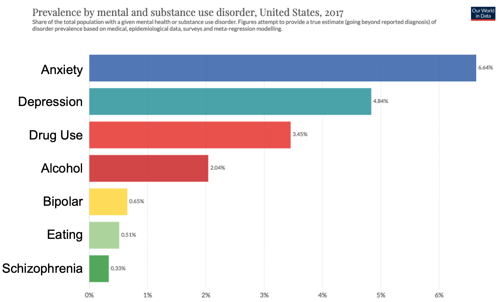

# Chapter 11: Disorders and Treatments

The astronaut John Glenn's quote about how he felt before taking off in the rocketship *Friendship 7* in 1962:

> *I felt exactly how you would feel if you were getting ready to launch and knew you were sitting on top of 2 million parts --- all built by the lowest bidder on a government contract.*

reflects how we might feel about the incidence of mental disorders in people.  We're all sitting on top of a brains made of billions of neurons and trillions of synapses, all built by itself.  *What could possibly go wrong!?*

The fact that our brains so routinely self-organize into highly functional beings is one of the greatest miracles of the natural world.  But, alas, things can, and do, go awry.  At any given time, roughly 20% of the US population is suffering from a mental illness according to the [NIH](https://www.nimh.nih.gov/health/statistics/index.shtml), and over the lifetime, an estimated 30% will suffer from anxiety disorders, and more than 20% will suffer from major depression.  These are astounding statistics, and our task here is to understand how and why things can go wrong, and what ways we have to try to help people suffering from these disorders. There are many important and challenging issues to confront.

First, to what extent are mental disorders based on *biology,* like other diseases that might afflict other parts of our body?  This **disease model** is appealingly simple --- find the biological source and deliver some kind of drug or other treatment to fix it, and send people on their merry way!  But despite all the recent hype about *Prozac* and other "miracle drugs", it is becoming increasingly clear that the most prevalent disorders, depression and anxiety, are *not* due to a simple *chemical imbalance* in the brain for most people, and that **therapy** is likely the best treatment for all but the most severe cases.

On the other hand, rarer and more severe forms of mental disorders such as *schizophrenia* almost certainly do have at least a partial biological basis (and are partially genetically heritable), but we now know that schizophrenia is a very diverse disorder with many distinct causes (**etiologies**), and despite massive efforts by many people over many years, it remains incompletely treated by available drugs and therapies.  Then there are the clear cases of biologically-based diseases, such as *Parkinson's disease*, where the precise neural basis of the disease is known, and biologically-based treatments are the medical standard of care.

Another challenging question that is especially pressing in some disorders such as *autism*, which encompass a huge range of different degrees and symptoms, is the extent to which we should even be using the term *disorder*?  Is it better to think instead in terms of **neurodiversity** --- just different ways that the brain can function?  For high-functioning individuals with autism, this seems like a reasonable argument, but what about those with severe disabilities in terms of language, cognitive function, and basic tasks of daily living?  In short, we have to be careful to recognize that our practical definitions of what counts as a disorder are always relative to some statistical, conventional definition of "normal" or **neurotypical**, and that such definitions are subject to change over time.  For example, homosexuality was once officially recognized as a disorder, but now it is not.

And even if there is some agreement that a particular type of disorder deserves the label as such, *where do you draw the line* between *normal* and *disordered*?  And how many such lines are there -- how do we categorize the set of such disorders in some kind of systematic, effective way that helps us actually understand and treat these disorders?  Although significantly less so now, mental disorders have typically carried a **stigma** associated with them, and thus there are potential costs associated with labeling someone as having a disorder.  On the other hand, such labels are essential for the medical community to organize treatment, including everything from insurance coverage to the nature of treatment, etc.

We can understand why mental disorders have a stigma in a way that other health disorders do not: brain function is inexorably tied to the subjective inner *self* in a way that liver function just isn't.  When something goes wrong in your brain, you are right there with it, and others tend to wonder what kind of causal role you might have in bringing about the disorder in the first place, and also why you can't just fix it on your own.  This goes back to the core issues of self-control that we discussed in Chapter 9. Fortunately, awareness of the prevalence and nature of these disorders is helping to mitigate these stigmas, and making it easier for people to seek help when they need it.

![**Figure 11.1:** Attractor (network) model explanation of the comorbidity across many disorders.  Each disorder has a different starting point (etiology) but due to the vicious cycle nature of certain symptoms and states, they can be "attracted" to a common state.  A wide basin of attraction implies many different such starting states can be drawn into the same attractor, which can explain why even in more biologically-based disorders such schizophrenia, there can be a huge number of different genetic risk factors.  It also explains how environmental factors can interact with biological factors in complex ways, by pushing these attractor dynamics around.](../figures/fig_disorders_attractor.png){ width=40% }

To understand why the disease model does not apply in many cases, we need to recognize that the brain is not like a car or other mechanical device, where discrete parts break and give rise to clear symptoms, and have clear fixes.  Instead, as we've emphasized throughout, the brain is an unbelievably complex emergent system, and the ways in which it goes wrong are also complex and emergent.  This perspective is captured in the increasingly influential **network model** of mental disorders [@CramerWaldorpvanderMaasEtAl10; @Borsboom17], which explains how a wide range of different biological and psychological causes can all lead to a kind of **attractor state** in the system (Figure 11.1).

A particularly important signature of this kind of attractor state is the high level of **comorbidity** across different disease categories and etiologies --- despite these different starting points and apparent biological causes, there is a relatively high probability of people being classified as having additional disorders.  Depression and anxiety, which are the two most prevalent disorders, are also the most likely to be *comorbid* (co-occurring) with other disorders, and with each other.  Furthermore, most of the disorders involve the same major brain areas, including the **prefrontal cortex**, **basal ganglia**, **amygdala**, and **midbrain dopamine** systems, which you hopefully recognize as the major components of the cognitive and self control system, including especially the ventral and medial "limbic" areas of frontal cortex (e.g., orbitofrontal cortex and anterior cingulate cortex) that are involved in affective and motivational processing and control.

Putting all of this together, the attractor state typically corresponds to a **vicious cycle** of negative affect (fear and depression) that short-circuits the motivational and cognitive control systems in the prefrontal cortex and basal ganglia, which in turn leads to more negative affect due to a reduced level of self-esteem, perceived self-efficacy, and general feelings of loss of control and motivation to function.  The essential role of self-control and self-efficacy in the human motivational system was discussed in Chapters 9 and 5 --- from this basis, it should be clear that dysfunction in these core systems can really bring the whole self-model down.

This framework also helps us understand how and why therapy can help: the most effective therapies directly target these core systems of self-control and self-efficacy, and by essentially "rebooting" these systems, they help break the vicious cycle and propel people back out of this bad attractor state, and into a more positive **virtuous cycle** where feelings of self-efficacy give rise to motivated thoughts and behaviors that result in sustained and enhanced feelings of self-efficacy.  Consistent with this understanding, **behavioral activation** is the most effective element of the most effective form of therapy for treating depression [@DimidjianMartellHerman-DunnEtAl14], and these issues of perceived self-control and self-efficacy are reliable precursors for depressive episodes [@IacovielloAlloyAbramsonEtAl10].

The social relationship established between the therapist and the client, known as the **theraputic alliance** is also recognized as a critical contributor to the success of therapy.  This taps into the power of social forces in shaping our behavior, and provides an interesting model for how one person really can help another, slipping past all of the various defense mechanisms that normally confound such things.  Meanwhile, the negative side of the social forces is evident in many of the disorders, which involve an important component of social withdrawal and isolation, which are a major contributor to the vicious cycle and amplify the severity of any disorder.  Thus, the social bond of therapy breaks that vicious cycle too.

Although the close proximity of the *self* and mental disorders can be a source of stigma, it is also critical to appreciate that *we have someone on the inside* who can tell us some important things about what is going on in the maelstrom of this complex system.  That special someone can actually do things to *fix the system from the inside out.*  This is the core premise of therapy, and the undeniable efficacy of modern, empirically-supported therapeutic techniques clearly indicates that we do in fact have some (albeit imperfect) ability to fix ourselves from the inside.

After going over a few key definitions, we start to tackle the above questions, while exploring the range of recognized mental disorders and some of their treatments.

## Psychiatry, Psychology, Neurology

The ambiguity between the *medical* and *psychological* nature of mental disorders is also captured in the professions that typically treat these disorders.  A **psychiatrist** is a medical doctor (MD) who has special training in dealing with mental disorders, and is licensed to prescribe medications to treat disorders.  A **clinical psychologist** is an individual trained in various forms of therapy, typically with a Masters or PhD level degree, along with relevant state professional certification.  Recently, in some states, clinical psychologists with additional training can prescribe medications.  A **social worker** also has some clinical training and typically has a Masters-level graduate degree.  A **neurologist** is an MD who has more specialized training in direct brain-level interventions such as neurosurgery --- they are typically involved in diagnosing and treating more clearly biologically-based diseases such as Parkinson's disease.

Then you have people like me, who are non-clinical psychologists with PhD's who just try to figure out how the brain works, but aren't licensed or really able to help anyone with their particular disorders (despite the confusing fact that we are often addressed as "Dr.").  When I sit next to someone on the airplane, I always say I'm a "cognitive neuroscientist" because then they don't get uncomfortable and think I'm analyzing them, or ask me to diagnose them or something awkward like that.  Inevitably, they end up referring to me as a "neurologist" later, but whatever.

## The DSM-5 Disorders

The "bible" of mental disorders is known as the **Diagnostic and Statistical Manual of Mental Disorders**, currently in its fifth edition (**DSM-5**), published by the *American Psychiatric Association*, which represents the work of thousands of scientists in a highly contentious and controversial process to arrive at a consensus on all those thorny questions raised above.  How could it be otherwise?

Here is the very pragmatic answer that earlier versions of the DSM provide to one of the most important questions, **what counts as a disorder?**

> *a disorder must cause **distress** and / or **disability** (impairment in one or more important areas of functioning).*

The first criterion is fundamentally *subjective* (a report from the inside), which has many important implications, and is typically given a lot of weight in the diagnosing process.  Taken together, these two criteria help resolve many potentially problematic issues.  For example, if you're a "strange bird" that other people might tend to describe as "crazy", but you are personally not experiencing any distress, and you are able to manage the "important areas of functioning" (i.e., the tasks of daily life --- self-sufficiency for adults), then *you do not meet criterion for a disorder!"*

This definition also generally precludes the previously problematic situation, featured in a number of movies, where an ill-intentioned person could have someone locked up in a mental ward against their own wishes!  If there is sufficient cognitive functionality present to communicate and understand the situation, the subjective experience of the individual is essential.  This definition also helps deal with the *neurodiversity* question --- if you are a high-functioning autistic individual who in general is not experiencing undue distress, then you are not considered to have a disorder.

Interestingly, the DSM-5 revision introduced language that refers to biological causes and sounds more like the disease model, while retaining the key subjective distress criterion:

> *A mental disorder is a syndrome characterized by clinically significant disturbance in an individual's cognition, emotion regulation, or behavior that reflects a dysfunction in the psychological, biological, or developmental processes underlying mental functioning. Mental disorders are usually associated with significant distress in social, occupational, or other important activities.*

The introduction of the "usually" in there softens the distress criterion a bit, and the **dysfunction** (disability) is somewhat more specific.  Another important criterion that has been consistently present sets some other important cultural and social boundaries:

> *An expectable or culturally approved response to a common stressor or loss, such as the death of a loved one, is not a mental disorder. Socially deviant behavior (e.g., political, religious, or sexual) and conflicts that are primarily between the individual and society are not mental disorders unless the deviance or conflict results from a dysfunction in the individual, as described above.*

{ width=100% }

With that general definition in hand, we will go through some of the major DSM disorders, in order of prevalence (Figure 11.2), and discuss general features of the disorder, including some of the major forms of treatment, which we will then cover in more detail below.

### Anxiety Disorders

These are the most prevalent, at nearly 7% of the US population, and include **generalized anxiety disorder (GAD)**, **panic disorder**, and specific **phobias** (e.g., fear of snakes, etc).  At some level, everyone has a pretty good subjective sense of anxiety and fear states, but to reach the status of a disorder, it must go beyond the "normal" level and cause significant distress and dysfunction.  Clearly, anxiety is distressing at pretty much any level, so this is again a subjective decision on the part of the individual to seek out treatment when the level of distress is excessive.  Also, given the level of severity associated with an official diagnosis, it is perhaps not surprising that anxiety disorders have a high level of comorbidity with depression (nearly 60%), consistent with the vicious cycle attractor model (Figure 11.1).

*Generalized anxiety disorder* is, as it sounds, a form of anxiety that applies across many situations, more-or-less continously every day, and it also must be long-lasting, typically over a period of 6 months or longer.  It seems likely that someone with this condition would experience distress and dsyfunction.

In contrast to the more sustained form of GAD anxiety, *panic disorder* is characterized by relatively brief but intense *panic attacks* that are temporarily disabling, and can lead to ongoing anxiety about when such attacks might recur.  **Agoraphobia**, technically the fear of open spaces, is strongly linked to panic disorder, and is associated with the fear of not having a place to hide should a panic attack occur.

The *specific phobias* are well known, involving things like spiders, snakes, heights, enclosed spaces, flying etc.  These are very common, and again the disorder criteria of distress and dysfunction apply.  For these cases, **exposure therapy** can be highly effective, typically using **systematic desensitization**, which involves very gradually increasing exposure to the feared item or situation, to build up associations with safety and extinguish the fearful one.  This is based directly on conditioning principles discussed in Chapter 5.  Interestingly, the exact opposite of systematic desensitization can also be effective, known as **flooding**, which gives maximal exposure to the feared item, in an otherwise safe environment, to the point where the fearful response is just exhausted out of the person.

Both GAD and panic disorder have significant genetic heritability, and are associated with changes in the *amygala* and related brain areas.  Despite this potential biological basis, these and all other anxiety disorders are typically most effectively treated through *cognitive behavioral therapy* (CBT), as we discuss below.  There are also a variety of medications, particularly used for GAD, including SSRI's.  Overall, this is an area where therapy, particularly CBT, is a real success story from psychology, which is good considering how prevalent these disorders are.

I have personally suffered from periodic (roughly every decade), multi-week episodes of enhanced anxiety, and I was a very shy child and a *colicky* baby.  My "panic weeks" appear to have been triggered by events that led to an extreme contemplation of death, e.g., seeing the movie *Cooley High* in 1975 set off my first one (there is a scene where one kid just punches another kid to death), which also coincided with my sister going away to summer camp.  So some of this is likely dispositional, and some of it is situational, and some of it is because death is absolutely crazy and incomprehensible.

Interestingly, after my most recent episode, which could have been facilitated by recently turning 50, I have since noticed a strong relationship between indigestion symptoms and anxiety feelings, which may potentially connect to the colic.  And now science is finding quite a bit about this important connection, mediated by the *vagus nerve* [@BreitKupferbergRoglerEtAl18].  So that's my main experience with a potential mental disorder (otherwise I'm pretty boring).  It wasn't sufficiently long-lasting or intense as to cause significant dysfunction, even though it caused plenty of distress.  I did talk to my primary care doctor, who gave me some beta blockers, which kinda helped a bit.  I still felt a bit stigmatized by talking about it, but having taught this course really helped me understand how prevalent these things are.  And I definitely applied self-CBT and breathing exercises to good effect as well!

### Depressive Disorders

Depression is close to anxiety in prevalence, and is officially known as **major depressive disorder** (MDD).  It is characterized by an extended period of depression lasting 2 weeks or longer, with symptoms of **depressed mood** (sadness) and **anhedonia** (inability to experience pleasure).  However, a more systematic analysis of the symptoms and their timecourse suggests that **learned helplessness** (lack of perceived self-control) and lack of **self-efficacy** are the most reliable features, and that they both precede and outlast a depressive episode [@IacovielloAlloyAbramsonEtAl10].  In general there is a growing recognition that a previous focus on anhedonia and sadness [@WiseRompre89; @DisnerBeeversHaighEtAl11] (which is still the main focus of DSM-5) is less central than the effects on the motivational and self-efficacy aspects of the disorder [@TreadwayZald11; @SalamoneYohnLopez-CruzEtAl16].

The central role of motivational, self-efficacy effects in depression explains why so many other disorders have high comorbidity with depression --- it is a *central node* among all disorders, consistent with the network model [@Borsboom17].  Specifically, the presence of any kind of distressing, dysfunctional disorder has the natural consequence of challenging an individual's sense of self-control and self-efficacy --- you no longer have the same sense of control over your mental world after the onset of such a disorder.  In the network model, you then transition to this new *node* in the network, which also brings with it pathways to other connected nodes.  For example, sleep impairments, which are common in depression, can result in compounding negative mood and less ability to exert self control over the primary disorder.  This then leads down the attractor surface into the vicious cycle of reinforcing negative symptoms that characterize depression, added on top of the primary disorder.

By understanding the emergent, dynamic nature of depression, and the critical role of sense of self-control and self-efficacy, it also makes it more clear why therapy that is focused on restoring self-efficacy has been demonstrated to be the most effective in treating most cases of depression [@DimidjianMartellHerman-DunnEtAl14].  This form of therapy is based on CBT, which is also effective for anxiety, but also includes additional **behavioral activation** components that work on restoring goal-engagement and a sense of competency in performing basic daily tasks.  The effective forms of therapy are equally if not more effective than SSRI's or other medications for all but the most severe forms of depression [@GartlehnerWagnerMatyasEtAl17].

Interestingly, despite its somewhat "barbaric" reputation from various movies, **electroconvulsive shock therapy** is still widely used and is highly effective for more severe forms of depression.  Scientists are also experimenting extensively with milder forms of electrical and magnetic brains stimulation, with some positive results.  These therapies may work by literally strengthening synapses and neural activity in the frontal cortex, which then provides greater control and motivation activity overall.  Thus, it may work in a similar fashion to behavioral activation --- it is all about *activation* --- connecting back to the *BAS* framework and personality variables associated with this activation construct discussed in Chapter 9.

### Substance Use Disorders

The use of substances (drugs) is widespread, and is a case where the use of distress and dysfunction in the definition of a disorder is critical: only when the substance use reaches those criteria does it qualify as a disorder.  In addition to the basic criteria, 11 other criteria are listed, 2 of which must also be present to qualify as a disorder.  These include things like inability to reduce intake despite desire to do so, intense cravings, **tolerance** (needing increasing amounts to obtain desired effects), and **withdrawal symptoms** which are physiological effects that occur when reducing or eliminating intake.  Instead of the popular term **addiction**, clinicians prefer the term **dependence** which has less "baggage", and refers more specifically to the tolerance and withdrawal symptoms.

With the opiod crisis affecting the United States, there is an increasing awareness of the severe problems caused by substance use disorders.  Over 100,000 people died from all such disorders in 2017, including alcohol but excluding tobacco (which itself accounts for 480,000 annual deaths), taking a truly tragic toll.  Unfortunately, the rates of relapse when the dependence reaches the level of a disorder are around 40-60%, which indicates the insidious nature of these disorders.

A considerable amount of research has uncovered widespread brain changes associated with drugs of abuse, from cocaine to opioids.  They directly hijack the brain's endogenous reward pathways, which as we saw in Chapter 5 are normally under tight regulation to increase expectations and prevent runaway positive feedback loops.  However, drugs interfere with these regulatory mechanisms, despite the presence of tolerance which is a signature of these regulatory mechanisms.  The lasting changes to brain circuitry leaves people more vulnerable to relapse, explaining the high rates of recidivism.  There is nevertheless considerable hope that by learning more about how these circuits adapt to drugs, we can find suitable interventions that can restore their original, natural function.  When that happens, it will be as a result of years of investment in basic neuroscience research, which will have then paid for itself many times over.

### Bipolar Disorder

Bipolar disorder is characterized by alternating periods of depression and elevated mood, which in its extreme form is called **mania**, and this disorder used to be called **manic depression** for that reason.  If the elevated mood is less severe, it is known as **hypomania**, which according to some with the disorder, can be a particularly productive period of creativity.  Compared to the other disorders discussed so far, it has a higher level of heritability, although there are many different genes that have been associated with it, and no clearly identified biological cause outside of the same set of *usual suspects* discussed above (prefrontal cortex / basal ganglia etc).  Bipolar disorder is associated with a significantly higher level of *suicide* than other disorders, with nearly 50% of people attempting it at least once, and around a 20% lifetime mortality rate.  The most effective treatment is **lithium** (in salt form) --- the precise mechanism by which it acts is unknown, but it does affect a number of pathways of relevance including **serotonin**.

A number of famous people have reported having bipolar disorder, including Kanye West, Carrie Fisher, Mel Gibson, Demi Lovato, Kurt Cobain, Frank Sinatra, Vivien Leigh, and Winston Churchill.  The memoirs from these and other people suggest that their struggles with this disorder shaped their lives in powerful ways, and led in some ways to their notable creativity.  The stereotype of the emotionally volatile "creative type" is consistent with this idea.  Also, like all disorders, bipolar has varying severity across individuals, and those who are able to make major accomplishments such as the famous people listed above may have relatively less severe cases, whereas others are more significantly impaired.  Thus, it is important not to glamorize this dangerous disorder.

### Eating Disorders

The two primary eating disorders, **anorexia nervosa** and **bulimia nervosa**, are widely known and unfortunately common, especially afflicting adolescent women.  Both are characterized by a struggle for self-control over eating and body image, with the pervasive and unrealistic images of women's bodies in popular media blamed for fueling these conditions.  Anorexia can be characterized as an extreme form of *conscientiousness* in the domain of self-control over eating, exercise, and other means to reduce body weight.  This is consistent with the generally increased frontal and reward pathway activation in these individuals [@Frank15], and with the high levels of comorbidity with obsessive compulsive disorder (OCD).

While people with anorexia can demonstrate extreme levels of self-control (metaphorically, they don't even eat the one marshmallow in the Mischel task), bulimia is characterized by an oscillation between loss of control over eating (*binging*), followed by various forms of *purging* behavior to eliminate the excess intake.  Whereas people with anorexia have significantly reduced body weight, those with bulimia typically have normal weight.  In general, the brain responses of people with bulimia is more similar to people with obesity [@Frank15], which can also be characterized by reduced levels of control over eating behavior.

As with most other disorders, therapy is the most effective treatment, typically of a form that is more specifically adapted to these disorders, and often involving the family for adolescents.  

### Schizophrenia

Schizophrenia is perhaps the one disorder that most directly captures the notion of a mental disorder in popular culture, involving **hallucinations** (more typically hearing voices than visual), **delusions**, and **disorganized thinking**.  These are known as the **positive symptoms** of schizophrenia, not because they have a positive valence or effect, but rather because they are novel, distinctive symptoms not present in neurotypical people.  The term *schizophrenia* literally means "split mind", and unlike *split personalities*, the split here captures the *dissociation* from reality, and also the pervasive sense that some *external* agent(s) or forces are controlling one's thoughts.  In contrast to the positive symptoms, there are **negative symptoms** (reduced aspects of normal functioning) that significantly overlap with those of depression, including reduced motivation, reduced sense of self-efficacy and control [@KrynickiUpthegroveDeakinEtAl18], and others that are more distinctive for schizophrenia (e.g., social withdrawal and impaired cognitive functions).

According to the *attractor* model, some of the negative symptoms could be a (perfectly reasonable) consequence of the experience of a loss of control over mental function represented by the positive symptoms, and thus would represent a comorbid depression disorder similar to what happens in many other disorders.  This account is consistent with a detailed analysis of differences between negative symptoms in schizophrenia and primary depression [@KrynickiUpthegroveDeakinEtAl18].  While both disorders overlap on the motivational and self-efficacy factors, depression uniquely involves pessimism, sadness, and suicidal thoughts, while negative symptoms uniquely involve factors such as poor attention and concentration, blunted affect, and social withdrawal.  These latter factors are consistent with impaired cognitive functions supported by the frontal cortex and associated brain areas.

Schizophrenia is typically treated using **antipsychotic** medications, all of which have some effect on *dopamine*, but also other neuromodulators, and help to control the positive symptoms.  In general the negative symptoms are not well treated currently.  Based in large part on the nature of these medications, the apparently central role of dopamine in schizophrenia has been the subject of extensive research for a long time [@MeltzerStahl76], but more recent data is suggesting that it may play a somewhat different and perhaps more peripheral role than previously thought [@McCutcheonAbi-DarghamHowes19], involving the basal ganglia instead of the prefrontal cortex.

A notable and scientifically important aspect of schizophrenia is its developmental nature: There are a number of indications that schizophrenia is often caused by events that take place early in development, but that do not manifest into symptoms until early adulthood.  It is significantly heritable in general, but genetic analyses have found no strong associations with specific genes, consistent with many other phenotypes such as intelligence, as discussed in Chapter 10.  In general, it is thought to require the interaction of biological predispositions with significant environmental events, which is true of most disorders, as we discuss below.

One particularly well-studied etiology of schizophrenia is **maternal immune activation** (MIA), which has been investigated in rodent and monkey models, caused by activation of the mother's immune response during specific periods in gestation [@Meyer14; @EstesMcAllister16; @Meyer19]. Animals with this MIA exposure go on to develop a number of biological and behavioral characteristics of schizophrenia (and autism as well).  In humans, there are a number of cases where pandemic outbreaks have been associated with significant increases in children who went on to develop mental disorders including schizophrenia and autism.  For example, the 1964 Rubella virus pandemic resulted in a 20% incidence of schizophrenia for children of affected mothers (compared to less than 1% otherwise).

The details of how exactly the immune activation translates into brain-level changes that then cascade over development into the onset of schizophrenia roughly 20-30 years later are still under intensive investigation [@EstesMcAllister16].  There are indications that the dopamine system is affected, while one recent result shows a signal associated with immune activation in the brains of people with schizophrenia, specifically in the prefrontal cortical areas, including the anterior cingulate cortex [@LeshMaddockHowellEtAl19].  Thus, the initial seed of the deficit could be due to relatively subtle changes in neural function in these critical control and motivational areas of the brain, which cascade and accumulate through development to produce impaired internal control mechanisms, resulting in the disorganized thinking and specific negative symptoms.  

Some insight into the nature of this cascade is provided by a network analysis of the order in which the different symptoms of schizophrenia tend to unfold over time [@VanKampen14].  They found, using two different techniques, that socially-related symptoms tended to develop first (social anxiety, social withdrawal), and that these then led to a corresponding cluster of symptoms reflecting the attempt to create a more independent identity, and rejection of society (egocentrism, fantasy world, alienation, suspicion, hostility).  Only after this initial trajectory do the more extreme "signature" aspects of the disorder present, in the form of delusions, hallucinations, and disorganized thought.

In short, according to this analysis, the *schism* at the heart of schizophrenia is actually between the individual and society, which is consistent with a wide range of other data on social isolation and social cognition in schizophrenia [@GreenHoranLee15; @GreenHoranLeeEtAl18], including an animal model based on social isolation during the critical adolescent period, which produces schizophrenia-like symptoms [@SunMinZhouEtAl17].  This social isolation framework also helps to explain why schizophrenia manifests when it does: late adolescence and early adulthood are exactly when the *coming of age* story described in Chapter 9 is supposed to resolve into a newfound sense of one's place in society.  If that doesn't have a happy ending, construction of an alternate reality may take place.

As for how delusions and hallucinations may arise, the *self-model* from Chapter 9 would likely be challenged by a breakdown in cognitive control --- if the conscious *self* is not seeming to be in control, perhaps there are other active agents influencing the flow of thoughts, which could be experienced as voices and other mechanisms of external thought insertion.  Thus, these delusions and hallucinations could just be an attempt to make sense of the new subjective experience that doesn't fit with everything following from a single coherent conscious self --- instead it must be that the CIA is doing something to control my thoughts!  In general, the *compression* principle holds that people strongly prefer some kind of explanation, even if it sounds "crazy", rather than just living with uncertainty and unresolved suspicions.

### Obsessive-Compulsive disorders (OCD)

"OCD" is used in casual conversation to refer to any kind of obsessive behavior, but, as we have been emphasizing, actual disorder-level OCD refers to the case where it is personally distressing and creates dysfunction.  The **obsessive** part refers to repeated thoughts, typically focused on negative potential outcomes, while **compulsive** refers to repeated behaviors taken to try to avoid these negative outcomes.  From a control perspective, OCD reflects an increased motivation for control, and is correspondingly associated with increased level of prefrontal cortex / basal ganglia system engagement, as compared to most of the prior disorders which reflect reduced functionality in these areas.  Thus, OCD is similar to anorexia, and the two have high levels of comorbidity.

The dysfunctions associated with OCD can include severe skin rashes from repeatedly washing hands, to avoid infection.  There are four major subtypes of OCD: *symmetry*, including organizing and counting; *cleaning*, which is more focused on avoiding contamination; *forbidden thoughts* about things such as aggression or sexual acts; and *hoarding* [@BlochLanderos-WeisenbergerRosarioEtAl08].  These subtypes can also be organized into broader motivational dimensions, in terms of **harm avoidance** versus **incompleteness** [@EckerGonner08], which have implications for the basic dynamic of the disorder.

Specifically, harm avoidance, which dominates in all but the symmetry case, can be understood in terms of the fundamental conundrum: *how do you know when you've successfully avoided something!?*  You don't.  You can only know that you've avoided it *so far*.  Thus, the *avoidance goal* is never quite satisfied, such that compulsive behaviors are continuously re-activated to try to satisfy these unsatisfiable goals.  The incompleteness motivation shares this same end-state of having an unsatisfiable goal, but in a more inexplicable, primary way: despite seemingly effective actions, the goal is just not recognized as being satisfied.

This incompleteness condition is particularly important from the perspective of developing a more complete understanding of goal-driven behavior, because it is often quite difficult to specify precisely what counts as having satisfied a goal.  If you're cleaning the counter, what counts as "clean enough"?  How do you know when a paper, or an email, are "good enough" to send?  There are clearly individual differences in terms of degree of *perfectionism* here, and often perfectionists can be dysfunctional in working too long on such things, limiting their productivity and causing significant deadline stress.

From a learning-theoretic perspective, this question of goal satisfaction is critical because that defines *success*, and should then influence learning and dopamine release.  The ability to drive your own internal dopamine release must be a carefully guarded power within the brain, otherwise you could just sit on the couch and "get off" any time you want.  As fascinating as that might sound, it wouldn't be very adaptive, so evolution must have carefully hidden this capacity behind many protective enchantments.  Thus, if we can figure out what is driving the incompleteness condition in OCD, maybe we can figure out how these mechanisms work.

I personally relate with the *symmetry* obsession in terms of organizing things, especially in programming, where it is very satisfying to achieve a nice and ordered solution of a space of data or algorithms.  On the other hand, I'm far from a perfectionist, so there may be other dimensions at work here, and of course this is all well within the sub-disorder level.

### Trauma and Stressor-Related disorders (PTSD)

PTSD is, like many of the well-known mental disorders, also used colloquially, but the disorder sounds truly terrifying.  Not only did you have to suffer from some kind of horrible trauma in the first place, but these traumatic events continue to haunt you for a long time thereafter.  The incidence of PTSD is different for different types of trauma. For rape, the rate is 20%; military combat is about 23% with a delayed onset typically; life-threatening auto accidents is about 5%.  These differences may reflect the perceived chance of recurrence of the traumatic situation: auto accidents may be perceived as random bad luck, while rape may be perceived as a more persistent threat.

PTSD can be understood in terms of the difficulty in extinguishing conditioned associations encoded in the *amygdala*, as discussed in the learning chapter.  The circuitry of the amygdala works to maintain learned associations, while encoding new associations that carve out *exceptions* for different circumstances.  Thus, once learned, fear associations can spontaneously reemerge, even if they have been extinguished in various contexts.  This makes sense from a basic survival perspective: if something bad has happened, you don't want to forget about that.  However, it doesn't make sense for things like military combat, when you have returned to the safety of the home country (assuming that is relatively safe).

The effective therapies for PTSD are similar to those for anxiety disorders, involving more systematic attempts to extinguish the fearful associations across a broader range of contexts.  The state of the prefrontal cortex provides an important part of this *context* input to the amygdala, so finding ways to activate "safe" prefrontal states is key --- CBT may be especially effective for this.

### ADHD

Attention deficit / hyperactivity disorder (ADHD) is categorized as a **developmental disorder** by the DSM, along with autism, because it typically manifests before adolescence.  It has two primary clusters of symptoms, associated with **inattention** and **hperactivity / impulsivity**, as the name suggests.  Individuals often have a mix of both, but can be weighted more towards one or the other.  Males tend to score higher in the hyperactivity dimension, which is more obvious, leading to the possibility that females may be relatively underdiagnosed.

ADHD is one of the most controversial of mental disorders, because of its high prevalence in children (around 5%), and the question of whether it is being *overdiagnosed* and *overmedicated*.  Some argue that it just reflects normal variation in the population, and most people will just grow out of it, so that prescribing medications is overreacting.  Furthermore, there is a general sense that developing brains are more sensitive to medications, so there should be a much higher threshold in this case.

On the other hand, ADHD is comorbid with a large number of other developmental disorders, especially including **developmental dyslexia**, and people often show improvements with pharmacological treatment, suggesting that treating it as a disorder may be overall beneficial.  The primary treatment is with stimulants such as **Ritalin** (**methylphenidate**), and the close relationship to drugs of abuse including amphetamine and cocaine is an important source of negative attitudes about this form of treatment.  However, at an intuitive level, for the inattention component of the disorder, stimulating the system to increase the ability to focus and concentrate seems plausible.  However, this logic seems backwards for the hyperactivity component, but it is nevertheless generally beneficial there too.

As with most of the other disorders, ADHD has been associated with the prefrontal cortex and basal ganglia system, and especially the dopaminergic system due to the benefits of Ritalin.  Thus, many scientific studies looked for executive function and fluid intelligence deficits in people with ADHD, with mixed results.  However, consistent with our overall theme that motivation plays a dominant role in these systems, more recent research has found more reliable evidence of motivational differences in people with ADHD [@VolkowWangNewcornEtAl11; @Modesto-LoweChaplinSoovajianEtAl13].

A weakly-supported but intuitively-appealing idea is that people with ADHD have more balanced hemispheric dominance profiles, such that they can shift attention between hemispheres more quickly and easily, compared to other people who tend to get locked into whatever the dominant hemisphere is doing.  While there have been some studies showing an association between a more ambidextrous mixed-handedness profile and ADHD, the effects are not strong overall [@LinTsuang18].  One possibility is that this profile represents one subset within the more diverse population of people with ADHD.  In any case, this idea does suggest that ADHD could be viewed more from the neurodiversity perspective as just a different cognitive style, rather than a disorder.

### Autism

As we have discussed previously, **autism spectrum disorder** is generally identified with a core deficit in social interaction and communication, evident early in childhood, along with narrow interests and often repetitive activities.  The *spectrum* nature of this disorder encompasses a wide range of severity, with **Asperger syndrome** representing the higher-functioning end of this spectrum (this terminology was replaced with the spectrum framework in DSM-5). In the more severely affected end of the spectrum, there can be significant developmental delays in cognitive function and language, including cases where language is never acquired.

The **savant** abilities of a small subset of people with autism have captured the public imagination, as captured in the movie *Rain Man* starring Dustin Hoffman and Tom Cruise, based on the autistic savant Kim Peek.  However, most people with autism do not have such abilities, and instead roughly 50% exhibit significant self-harm behaviors, so the reality of autism is much less glamorous than presented in this movie.

Many scientists have proposed simple, compelling single-factor explanations for autism, including deficits in *theory of mind* [@Baron-CohenLeslieFrith85], *mirror neurons* [@IacoboniDapretto06], and the idea that it represents an extreme form of the male brain, based in part on the 4-to-1 ratio of males to females with autism [@Baron-Cohen02].  However, none of these theories have really held up in the face of the extreme diversity of etiologies and manifestations of this disorder [@NadlerCamererZavaEtAl19].

Instead, the most reliable neural signature of autism involves various widespread changes in brain conectivty [@OReillyLewisElsabbagh17].  This is generally consistent with the fact that maternal immune activation (MIA) is associated with both schizophrenia and autism, in terms of a broader, more diffuse neural impact [@CareagaMuraiBauman17].

One broad theory consistent with the MIA etiology is that autism and schizophrenia are both manifestations of an overall spectrum-level disorder.  Autism results when there are more severe changes in brain circuits, such that impacts on social processing are evident early in development, while schizophrenia results from a milder underlying neural impact that only manifests later in early adulthood, when the mild deficits in social processing manifest as described above.  This is one of many possible connections between these two disorders, that are being investigated in ongoing research [@ChisholmLinAbu-AkelEtAl15].

In terms of treatment, considerable advances have been made in targeted, early interventions focused on specific symptoms, training specific life skills, and providing a better quality of life for the entire family.

### Personality Disorders

The precise distinction between a *personality* disorder and any of the disorders defined above is a bit confusing.  In general, personality disorders are associated with stable trait-like features of an individual that are present relatively early in life, and which lead to problems in social interactions, and are not explained by any of the other identified disorders.  In other words, personality disorders are a bit of a "leftover" category of disruptive, problematic behaviors that don't have a better explanation.  They are also explicitly defined relative to cultural norms.

To make things even more confusing, many of these disorders are named and described in reference to other "primary" disorders, for example **schizoid** and **schizotypal** personality disorders are kind of like schizophrenia (specifically with respect to social anxiety, withdrawal), but without the full positive and negative symptoms. Another set of disorders include **antisocial**, **borderline**, **histrionic**, and **narcissistic** personality disorders, which are generally associated with high emotional volatility, as in a particularly extreme form of the emotional volatility facet of the **neuroticism** personality factor.

Boderline personality disorder is a particularly prevalent (perhaps as many as 6%) and challenging condition.  In addition to high levels of emotional volatility, it is characterized by an unstable self-model (sense of self), which may reflect the effects of early childhood trauma that is present in many cases.  A distinctive manifestation is extreme sensitivity to social rejection or criticism (reflecting a weak sense of self), strong feelings of betrayal, loss of control, and strong inclinations toward self-harm (occurring in 50-80% of cases).

Another group of personality disorders reflect heightened levels of anxiety, including **avoidant**, **dependent**, and **obsessive-compulsive** personality disorder (which is distinct from OCD).

### Other Disorders

There is a large list of other rarer and more specific disorders that we will not cover, including the wake-sleep disorders (insomnia, narcolepsy)
that we discussed in Chapter 3.

## Disease Theories

Having now seen many of the most prevalent disorders, we consider some of the most widely-discussed overarching theoretical approaches to understanding features of these disorders.

One of the most important is the **Diathesis-Stress** model, which is just a confusing Greek version of the intuitive notion that most disorders include a **vulnerability** (that's what diathesis means) toward disorder, often arising from genetic, biological and developmental factors.  Then, some kind of environmental event(s) act to *stress* the system, pushing it over some critical threshold so that the disorder is fully manifested, whereas before it was merely latent.  This model was introduced by Paul Meehl in his analysis of schizophrenia and related personality disorders [@Meehl62].

This model can be understood within the context of the *attractor* model discussed at the outset, where the *stress* is particular events that push the system dynamics into the *basin of attraction* for the vicious cycle to start kicking in and moving toward the attractor state.

## Therapy

The popular misconception that "therapy is just talk", and the concomitant suspicion that "just talk" cannot possibly cure people of serious mental disorders, belies the fundamental under-appreciation of the true power of social forces in shaping us.  As we've seen, almost all of the above disorders involve a significant role for social disconnection and withdrawal, which plays a critical role in the vicious cycle that turns a vulnerability into a full-fledged disorder.  This essential role for social forces in causing the disorder then explains why these same social forces can have so much efficacy in treating disorders.

The **therapeutic relationship** has some special features compared to other social relationships, which appear to be critical for its overall efficacy [@ArditoRabellino11].  Specifically, it features a **therapeutic alliance** between the therapist and client, which is the collaborative effort focused specifically on treating the client's suffering and other core symptoms.  In addition to this shared goal, it is important to arrive at an agreement about the specific tasks to be done by each person, and that both sides exhibit a high degree of *warmth* that cements an in-group bond between the two.

In terms of the concepts explored in Chapter 9, successful therapy involves creating a new social group that exists for the specific purpose of helping the client.  This creates a unique environment free from all the usual conventions about reciprocity, dominance vs. submission tensions, acceptance vs. rejection, etc.  Furthermore, while the therapist does enjoy an overall dominant, leadership role in the relationship, the warmth and focus on the client serve to reduce the threat from that dominance role, and instead channel it into a positive sense of efficacy and agency for the group as a whole.  In other words, this special social relationship is structured specifically to counteract the social isolation and alienation that the client has been experiencing as a result of their disorder.

Because most therapies feature this same type of therapeutic relationship, we would expect that there would be a broad level of effectiveness regardless of the specific details that take place within this relationship.  That is in fact the case --- when various therapies have been systematically evaluated, essentially *everyone is a winner!*  This is has been dubbed the **dodo bird verdict**, after the race in *Alice in Wonderland* that had this same outcome [@LuborskyRosenthalDiguerEtAl02].

### CBT

However, more recent work has been more specifically comparing therapies against each other and against various pharmacological alternatives [@deFeliceGiulianiHalfonEtAl19], and overall across many different disorders, the **Cognitive Behavioral Therapy** (CBT) is widely supported and is considered the "standard of care" at this point.  In reference to the broader medical literature, it is described as **evidence-based effective therapy**.  However, one important point to keep in mind is that surveys of actual therapists indicate that they have a strong tendency to inject their own personal "style" to the therapy, resulting in an **eclectic** overall approach.  At its core, therapy is a social interaction and is subject to the individual personality and approach of the therapist, as they interact with the client, so it is not like a manufactured widget that can be exactly replicated.

CBT incorporates many features from cognitive and behaviorist psychology, including focusing on the power of cognitive patterns of thoughts, and also on the nature of reinforcement in behavior.  For example, the therapist will point out that the client is emphasizing negative thought patterns by **overgeneralizing** from one negative event (e.g., one negative social interaction) to concluding that "the whole world hates me".  By recognizing these negative patterns of thought, and how they produce negative affect and further the vicious cycle of the disorder, the client can then interrupt such thought patterns in the future, and recognize that this is just a pattern of thought and not reflective of the actual truth.  Furthermore, the positive social bond with the therapist provides at least one salient counter-example to most of these negative thoughts.

The initial steps of the therapy involve this cognitive recognition process, and then the behaviorist part of CBT kicks in with the training of skills to combat the dysfunctional patterns of thought and behavior.  This involves explicit instruction and then repeated practice on applying the new coping skills --- this active, behaviorally-focused aspect of the therapy is a critical element of its success, because it gives the client a set of clear goal-driven action plans that they can use to make progress overcoming their dysfunction and distress.  This restores a sense of self-efficacy and self-control, compared to a more passive "theoretical" approach characteristic of earlier forms of therapy.  For example, in the **psychoanalytic** tradition going back to Sigmund Freud, therapy was focused on a more theoretical tracing of influences and repressed desires, whereas CBT is much more practical and "hands on".

In addition to the **behavioral activation** component of taking active goal-driven steps [@DimidjianMartellHerman-DunnEtAl14], recent variants of CBT have been incorporating a **mindfulness** component [@SegalWilliamsTeasdale02], which gives the client the ability to create some awareness and distance between their ongoing patterns of thought, and the sense of a self that can step back and view these thoughts unfold over time, without getting so immediately caught up in them.  This psychological distance is like taking a time-out in a heated emotional situation --- it allows everything to be viewed from a more rational, disinterested perspective, where the illogical nature of the thought patterns can be more easily seen and confronted.

While there is always room for further improvement, it is clear from the systematic evaluation of these therapies across a wide range of disorders, that they are generally effective, and typically at least as effective as pharmacological alternatives, with many fewer side effects [@GartlehnerWagnerMatyasEtAl17].  However, they are *expensive*, requiring a therapist with extensive training and significant time commitments from both the client and the therapist --- this greatly limits their broader applicability.  Thus, we need to find a way to provide broader, less expensive access to these important techniques.  Perhaps these techniques could be taught as a regular part of school at the high-school and college level, and we could all just practice therapy on each other!

## Pharmacology and other Treatments

Despite the initial promise of a magic happy pill, which was aggressively marketed by the large drug companies, it turns out that the most prevalent mental disorders are not due to a simple chemical imbalance, and although drugs have a very important role to play, they are not a panacea.  One way to understand why drugs can be effective, even if there is no underlying chemical imbalance that is being corrected, is that they *change the chemistry* of the situation --- they can provide a *different* kind of brain chemistry that can pop people out of the vicious cycle attractor states.

For example, if you have been very depressed and lethargic, and now you take a pill and it directly transports you out of that state, into something that feels more like how you used to feel, then it gives you a newfound sense of hope and recognition of what that felt like.  You can then start trying to cultivate those positive feelings more, along with a renewed sense of self-efficacy and potential.

There have been a number of recent reports of success in using psychedelic drugs for treating various disorders, picking up on a longer history of such studies that had fallen out of favor [@VollenweiderPreller20].  Although these substances do affect the serotonin system, it seems unlikely that their efficacy depends on correcting a chemical imbalance.  Thus they may serve as a clearer example for what other pharmacological treatments may be achieving, at least in part.  These psychedelic drugs can break people out of their attractor states and provide a whole new perspective on the world.  Although these experiences are transitory, they provide a lasting sense of what is possible, setting in place a new virtuous cycle of more positive, optimistic thoughts.

In this way, both therapy and pharmacology can work together to push people out of their maladaptive states, and various studies have suggested that the combination of both is more effective than either alone.  In any case, by having a better sense of how these dynamic disorder states function, we should be in a position to develop more effective, efficient combinations of treatments.

### SSRI

The most widely-used class of drugs used to treat a range of the above disorders are known as **selective serotonin reuptake inhibitors** (SSRI's), with the most famous being **Prozac**, which is brand name for **fluoxetine.**  As we reviewed in Chapter 3, serotonin is a powerful endogenous neuromodulator that has many effects in the brain, including regulating overall wake / sleep states, and having a role in mood states.  Thus, it is not too surprising that messing with this system would have effects on mood states and disorders thereof.  The exact way in which SSRI's have their beneficial effects is not known.  However, they do have a large number of high-prevalence side-effects, and avoiding these side-effects is a major advantage of therapy-based approaches.

## Summary

As this is the final chapter of the book, you should now go back and re-read the Introduction (Chapter 0), and see how all the points we've covered throughout fit into an overall summary narrative.  Hopefully, you now have a deeper and more coherent sense of how everything fits together, and how your brain works.

## Summary of Key Terms

This is a checklist of key terms / concepts that you should know about from this chapter.  As we'll learn in the memory chapter, it is a great idea to test yourself on what was said about each of these terms, and then go back and double-check --- that provides both beneficial repetition and also the *testing effect*.

* Disease model vs. Disorder
    + Neurodiversity vs. Neurotypical
    + Stigma
    + Network / Attractor model, vicious cycle
    + Comorbidity
    + Control network: prefrontal cortex, basal ganglia, amygdala, dopamine
    + Therapy: Virtous cycle, behavioral activation
    + Theraputic alliance, social bond

* Psychiatry, Psychology, Neurology, Social Worker

* DSM-5 Disorders
    + Distress, disability / dysfunction

* Anxiety Disorders
    + Generalized (GAD), panic, phobias
    + Exposure therapy, systematic desensitization, flooding

* Depressive Disorders
    + Major depressive disorder (MDD)
    + Anhedonia, self-control, self-efficacy
    + Electroconvulsive shock therapy

* Substance Use Disorders
    + Tolerance, withdrawal, dependence, addiction
    
* Bipolar Disorder
    + Mania, hypomania
    + Lithium
    
* Eating Disorders
    + Anorexia, bulimia

* Schizophrenia
    + Positive symptoms: delusions, hallucinations, disorganized thinking
    + Negative symptoms: reduced motivation, reduced self-efficacy, social withdrawal, isolation
    + Antipsychotic medications, dopamine
    + Maternal immune activation
    
* Obsessive-Compulsive Disorder
    + Harm avoidance (avoidance goals), incompleteness, never completed goals

* ADHD
    + Inattention, hyperactivity / impulsivity
    + Ritalin

* Autism Spectrum Disorder
    + Asperger syndrome
    + Savant

* Personality Disorders
    + Schizoid, schizotypal
    + Antisocial, borderline, histrionic, narcissistic
    + Avoidant, dependent, obsessive-compulsive
    
* Diathesis-Stress

* Therapy
    + Therapeutic relationship, alliance
    + Dodo bird verdict
    + Cognitive Behavioral Therapy
    + Overgeneralizing
    + Pychoanalytic
    + Behavioral activation
    + Mindfulness
    
* Pharmacology
    + SSRI, Prozac
